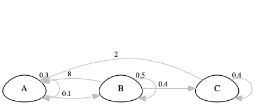

# Matrix population modelling

## Background 

Matrix population models are powerful and widely used tools in population ecology for studying the dynamics of structured populations. Unlike simple growth models that assume every individual is the same, they take into account variation in vital rates (survival, growth and reproduction) across different life stages or age classes. They are particularly well suited to species with distinct life stages, such as plants with seedlings, juveniles and adults, or animals with different age classes.

A matrix population model uses a transition matrix to describe how individuals move between stages, and how many new individuals each stage contributes, over a fixed time step. By incorporating demographic data and life-history traits, these models give a more realistic picture of population dynamics. They are widely used to *project* the future trajectory of a population under stated assumptions, and to assess how vulnerable it is to environmental change and management actions. In this practical, we will assume that one matrix projection corresponds to one year. Each matrix element therefore represents survival, growth, or reproduction over a one-year interval.

This practical aims to give you a good understanding of the basics of their construction and use.

::: {.do-something}
Learning outcomes: 

- Competence in constructing life cycle diagrams to represent the life history of real (or theoretical) organisms.
- Understanding how to parameterise life-cycle diagrams and use them to produce a matrix population model.
- Competence in using R to calculate a population growth rate and project a population.
- Understanding how to connect these results to a management question.
- Understanding the logic of "*in silico* experiments" to investigate a biological question (mathematical modelling).
:::


## Your task

1) First, think of an organism you would like to model the dynamics of. It could be a mammal, a bird, a fish, insect or tree ... real or fantasy.  

2) Think about their life cycle, and draw it as a life cycle diagram with circles indicating the stages and arrows representing transitions between stages (e.g. growth) and reproduction. Keep it simple: aim for **2-3 stages** and no more than about **7 arrows**. Your diagram must include at least one reproduction arrow and at least one survival arrow. If your model is stage-based, consider whether individuals can stay in the same stage from one year to the next (an arrow that loops back to the same circle).

Things to think about:

* Is it age based or stage based?
* How many stages are there? Can you simplify (e.g. instead of age in years, you could use life stage)
* If using stages, how are stages defined? E.g. by size, by development, etc.
* Are the survival and fecundity higher in earlier or later life?
* Does the organism ever skip stages?
* Can the organism move "backwards" through the life cycle?

3) Next to the arrows, write values for survival probability and fecundity (number of babies) using your biological knowledge. It is fine to use "ballpark" estimates.

::: {.do-something}
**Sanity check your numbers**

* Survival and stage-transition probabilities must be between 0 and 1.
* Fecundity (offspring per individual per year) can be greater than 1.
* For individuals starting in a given stage, the survival and transition probabilities leaving that stage cannot add up to more than 1. For example, 0.8 staying in the same stage plus 0.7 moving to the next stage is impossible, because it adds up to 1.5. (Fecundity does not count towards this total, because newborns are *added* to the population rather than being a fate of the parent.)
:::


Here's an example for a fictional organism.


```{r showmatrix, echo = FALSE}
matA <- matrix(c(
  0.3, 8.00, 2.00,
  0.1, 0.50, 0.00,
  0.0, 0.40, 0.40
), nrow = 3, byrow = TRUE)
matA <- round(matA, 2)
stage_names <- c("Juvenile", "Adult", "Senescent")
colnames(matA) <- stage_names
rownames(matA) <- stage_names
```

```{r plotmatrix, eval = TRUE, echo = FALSE, fig.cap = "Life cycle diagram of the example organism."}
matA_plot <- Rage::plot_life_cycle(matA, stages = stage_names)

# 1. Make a play graph
tmp <- matA_plot

# 2. Convert to SVG, then save as png
tmp <- DiagrammeRsvg::export_svg(tmp)
tmp <- charToRaw(tmp) # flatten
rsvg::rsvg_png(tmp, "tempLifeCycleDiagram.png") # saved graph as png in current working directory
```




4) Now you can turn this diagram into a matrix population model by filling in a square of survival/fecundity values. 

The life cycle shown above looks like this (below). The matrix describes transitions from time $t$ to time $t + 1$, where one time step corresponds to one year.

Interpretation note: **columns are stages at time $t$ (from)** and **rows are stages at time $t+1$ (to)**.

To place each arrow in the matrix, ask two questions:

* **FROM which stage does the arrow start?** This gives the **column**.
* **TO which stage does the arrow point?** This gives the **row**.

Before you touch R, fill in the blank table below on paper (or in your notes) for your own organism. Name your stages along the top and down the side, then write each arrow's value in the correct cell. Leave a cell as 0 if there is no arrow.

| TO ↓ / FROM → | Stage 1 | Stage 2 | Stage 3 |
|:--------------|:-------:|:-------:|:-------:|
| **Stage 1**   |         |         |         |
| **Stage 2**   |         |         |         |
| **Stage 3**   |         |         |         |

::: {.do-something}
**Check your work: every arrow is one non-zero matrix element.**

Count the arrows in your life cycle diagram, then count the non-zero cells in your table. The two numbers must match. If they don't, you have either missed an arrow or put a value in the wrong cell. Also check the column totals against the sanity check above.
:::

For the example organism, the diagram has 7 arrows (including the loops), and the matrix below has 7 non-zero cells.

```{r showmatrix2, echo = FALSE}
# Function to write matrix as LaTeX
write_matex2 <- function(x) {
  begin <- "\\begin{bmatrix}"
  end <- "\\end{bmatrix}"
  X <-
    apply(x, 1, function(x) {
      paste(
        paste(x, collapse = "&"),
        "\\\\"
      )
    })
  paste(c(begin, X, end), collapse = "")
}
```


$$
A = `r write_matex2(matA)`
$$

## Using R for matrix modelling

Working with matrices is very tedious in Excel. However, in R you can use this information to predict the future dynamics of the population, and estimate population growth rate, and generation time etc.

Open up **RStudio**, and let's see if we can predict future dynamics. First you will need to install a package called `popdemo`.

### Package setup

If you are running this chapter in a fresh R session, you might need to install and/or load the `popdemo` package.


```{r matrix_package_setup, eval = FALSE, echo = TRUE}
install.packages("popdemo")
```

You only need to install packages once. After that you can load the package for use by using the `library` function.

```{r library, message = FALSE, echo = TRUE}
library(popdemo)
```

You can put your matrix into R like in the example below (change the numbers to match YOUR model). If your model has fewer, or more, stages then you will need to modify the code a bit. Ask for help if you get stuck.


```{r createMatrix, echo = TRUE}
A <- matrix(c(
  0.3, 8.00, 2.00,
  0.1, 0.50, 0.00,
  0.0, 0.40, 0.40
), ncol = 3, byrow = TRUE)

stage_names <- c("Juvenile", "Adult", "Senescent")
dimnames(A) <- list(stage_names, stage_names)
A
```


::: {.do-something}
**Important: interpret matrix elements over the chosen time step**

In matrix population models, all transitions occur over a fixed time interval. In this practical, we use a 1-year time step, so:

* survival probabilities are annual
* fecundity is offspring per individual per year
* λ is growth per year

:::


## Projecting the population

And now you can use the project function to project what happens to the population, then plot it. Look at what happens if you log or don’t log the y-axis. First you need to define an initial starting population structure. 

In my example, I have 3 stages, so I have 3 values for the initial population sizes.

### What the projection does

Let $\mathbf{n}_t$ be the vector of stage abundances at time $t$. The population at the next time step is found by multiplying the matrix by that vector:

$$
\mathbf{n}_{t+1} = \mathbf{A}\,\mathbf{n}_t
$$

Each row of $\mathbf{A}$ answers the question "where do the individuals in this stage next year come from?": multiply each entry in the row by the number of individuals in the matching *from* stage (column), then add them up. Using the example matrix and starting population of 10, 5 and 3 individuals in the juvenile, adult and senescent stages:

$$
\begin{bmatrix} n_J \\ n_A \\ n_S \end{bmatrix}_{t=1} =
\begin{bmatrix} 0.3 & 8.0 & 2.0 \\ 0.1 & 0.5 & 0.0 \\ 0.0 & 0.4 & 0.4 \end{bmatrix}
\begin{bmatrix} 10 \\ 5 \\ 3 \end{bmatrix} =
\begin{bmatrix}
(0.3 \times 10) + (8.0 \times 5) + (2.0 \times 3) \\
(0.1 \times 10) + (0.5 \times 5) + (0.0 \times 3) \\
(0.0 \times 10) + (0.4 \times 5) + (0.4 \times 3)
\end{bmatrix} =
\begin{bmatrix} 49 \\ 3.5 \\ 3.2 \end{bmatrix}
$$

So after one year there are 49 juveniles (mostly newborns produced by adults), 3.5 adults and 3.2 senescent individuals. To project two years ahead, we simply repeat the multiplication using the new vector. R does this for us with the `%*%` operator for matrix multiplication:

```{r handprojection, echo = TRUE}
initial <- c(10, 5, 3)
A %*% initial
```

The `popdemo` function `project` repeats this step as many times as we ask. Here I use it to do a population projection for 10 years (10 time steps). Each step represents one annual cycle of survival, growth, and reproduction.

::: {.do-something}
**Predict first.** Before you run the projection for your own organism, write down your answers to these questions:

* Do you expect your population to increase, decrease or stay roughly stable? Why?
* Which stage do you expect to become the most abundant?

Then run the projection and compare the result with your prediction. If it surprises you, work out why: look at which matrix elements are large and which are small.
:::

```{r projectpopulation, echo = TRUE}
pr <- popdemo::project(A, vector = initial, time = 10)
```

Take a look at `pr`, the projected population. This gives you the total population size, and below that the population sizes in each stage. 

```{r showprojection, echo = TRUE}
pr
```

You can access the population sizes of the different stages using `vec(pr)`.

```{r showprojection2, echo = TRUE}
vec(pr)
```

Let's plot this... 

```{r plotprojectiongraph, echo = TRUE}
pop <- vec(pr)
matplot(pop, type = "l", log = "y")
legend("topleft", legend = colnames(pop), 
       col = 1:ncol(pop), lty = 1:ncol(pop))
```

For the example matrix, the population increases exponentially. Does your own population behave as you predicted? The population growth rate is the so-called "*dominant eigenvalue*" of the matrix **A**.

### Does the starting population matter?

Now try the projection again, but with a very different starting population, for example nearly all individuals in the youngest stage, or nearly all in the oldest stage. Keep the matrix the same and change only `initial`:

```{r projectdifferentstart, echo = TRUE, eval = FALSE}
initial_2 <- c(100, 0, 0) # change to suit your own life cycle
pr_2 <- popdemo::project(A, vector = initial_2, time = 10)
pop_2 <- vec(pr_2)
matplot(pop_2, type = "l", log = "y")
```

::: {.do-something}
**Predict, then compare.**

* Before you run it: will the *early* part of the trajectory look the same as before? Will the *late* part?
* After you run it: what changes? What eventually becomes the same?

Hint: look at the slopes of the lines on the log scale, and at the vertical gaps between them, once the first few years have passed.
:::


### Growth rate and stable stage distribution

We can ask R for the *eigenvalues* and *eigenvectors* of the matrix. The dominant eigenvalue is the population growth rate ($\lambda$). The corresponding eigenvector gives the stable stage distribution (*SSD*): the expected *proportion* of individuals in each stage class once the population has settled into its long-term pattern. This is exactly what your projections with different starting populations were converging towards.

::: {.do-something}
**Predict first.** Look at your projection plot. Is $\lambda$ above 1, below 1, or about 1? Roughly how steep is the line on the log scale? Which stage do you think will have the highest *SSD*?
:::

Because our projection interval is one year, λ represents the annual population growth rate. You can see that in this case, using my example values the population is growing `r round(100 * (eigs(A, what = "lambda") - 1), 1)`% per year.

```{r eigenproperties, echo = TRUE}
eigs(A, what = c("lambda", "ss"))
```


## Elasticity

Elasticity analysis asks how responsive the population growth rate ($\lambda$) is to a small *proportional* change in each transition of the matrix. A transition with a high elasticity is one where a given percentage change produces a relatively large percentage change in $\lambda$. The elasticities of all the matrix elements sum to one, so each can be read as that transition's share of the total influence on $\lambda$. This is useful in management and conservation when we ask questions like, "which parts of the lifecycle should we focus on to preserve the population?". The mathematics are beyond this course, and R can calculate the elasticities for us.

::: {.do-something}
**Predict first.** Looking at your own matrix, which single element do you think λ is most sensitive to? Write it down before running the code.
:::

```{r elasticity, echo = TRUE}
popdemo::elas(A)
```

Which transition has the highest elasticity, and what does that tell you about your organism's life cycle? Was your prediction correct? If not, why do you think the biology of your organism led you to the wrong guess? Note that a high elasticity means $\lambda$ is *sensitive* to that transition, which is not the same as saying it is easy or practical to change in the real world.


## In silico experiments: changing the life cycle

Now that we have a model, we can use it as an experimental system. The idea is very simple: you run "experiments" on your matrix model (*in silico*, i.e. on the computer) by asking "what if" questions. For example, what would happen if we could increase survival of the juveniles by 20%? what would happen if adults are hunted more, and thus have a decreased survival by 60%? what would happen if we provided supplemental food to reproducing females, and increase fecundity by 50%? etc. Use your imagination!

For each "what if" question, follow the same pattern: **predict** what will happen to λ, **change** the matrix, **observe** the new λ, and **explain** the difference in biological terms.

In practice, we do that simply by modifying the matrix model. In the following, I am looking at the effect of increasing fecundity in adult and senescent individuals by 50%:

```{r whatif, echo = TRUE}
A_mod <- matrix(c(
  0.3, 8.00*1.5, 2.00*1.5,
  0.1, 0.50, 0.00,
  0.0, 0.40, 0.40
),
byrow = TRUE, nrow = 3,
dimnames = list(stage_names, stage_names)
)

popdemo::eigs(A, what = "lambda")     # original
popdemo::eigs(A_mod, what = "lambda") # modified
popdemo::elas(A_mod)
```


## Your investigation

Now it is time to work with your own organism. Rather than just running every function once, you will carry out a small investigation of a biological question.

1. **Project and describe.** Do a projection for your organism, and calculate and interpret $\lambda$, the stable stage distribution and the elasticities (remember to write down your predictions first).
2. **Choose a question.** Pick a "what if" question about your organism. For example:
    * What happens if juvenile survival improves?
    * What happens if adults reproduce more?
    * What happens in a bad year (e.g. lower survival in all stages)?
    * What if reproduction increases at the cost of adult survival?
3. **Predict.** Before changing the model, write down your prediction for what will happen to $\lambda$, and why.
4. **Change the model.** Modify the appropriate matrix element(s) in a copy of your matrix (e.g. `A_mod`), so that you keep the original for comparison.
5. **Compare.** Calculate $\lambda$ for both matrices. Was your prediction right?
6. **Explain.** Explain the result in biological terms. Use your elasticity results to help: does the change you made involve a transition with high or low elasticity?

### An evolutionary experiment

You can think of lambda (population growth rate) as being a measure of fitness. Imagine that some of your population had a mutation that caused them to have, say, 1 extra baby, but at the expense of reduced survival in one of the younger stages. Would this mutation persist in the population?

First, predict: increasing fecundity is beneficial and decreasing survival is costly. Which effect do you think will win? Then modify the matrix, calculate λ for the mutant life history, and compare it with λ for the original. Does the mutant have a higher or lower λ? What does that suggest about selection on this trade-off? (Comparing $\lambda$ like this treats it as fitness, which works when growth is density-independent, as it is in this model. With density dependence, as in the logistic growth chapters, things are more complicated.)


### Questions

1. In the graph showing log-transformed population size through time, what is the significance of the lines being straight after the transient phase?

2. Explain how an elasticity analysis of a matrix model can be used to inform the management of a threatened species.

3. What are some of the assumptions of a matrix population model? (Hint: some are similar to the assumptions of exponential/geometric growth models. Think about the environment, vital rates, migration and population density.)

## Takeaways

- Matrix models link life history to population growth through structured vital rates.
- The dominant eigenvalue $\lambda$ summarizes long-term growth, while its eigenvector gives the stable stage distribution.
- Elasticity analysis and *in silico* experiments turn models into management and evolutionary experiments.
