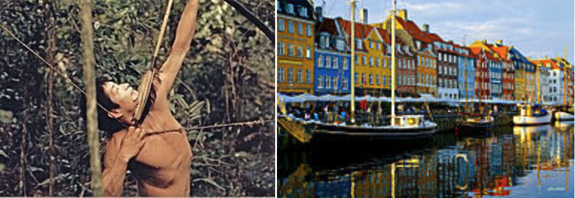

# Neutral or Adaptive Evolution in Humans: What Drives Evolution of Our Traits?

## Background

Understanding the role of natural selection and genetic drift in human traits requires a look at several key aspects:

* Importance of Variation: Traits require variation to be responsive to either natural selection or genetic drift.
* Selection vs Drift: Traits under strong selection will tend to optimise, while those under weak or no selection may change via random genetic drift.
* Role of Environment: Environmental factors can significantly impact the strength of selection on various traits.

Traits that are under moderate or strong selection will tend to be restricted to some optimal value, or change directionally -- natural selection leading to adaptive evolution.  Traits that are under weak or no selection will not be restricted so much so will tend to change via a random process -- random genetic drift leading to neutral evolution.  Both of these changes require the existence of variation in the trait to begin with: if there is no, or very little, variation the trait will not respond much even if there is strong selection. 

Finally, the strength of selection will largely depend on the environment. Traits may be important in some environments but not others. There may also be traits that would be selected for in some environments, but against in others. E.g., production of the skin pigment, melanin, would be selected for in areas with high UV-radiation since it protects against skin cancer, but selected against in cool temperate zones with low UV radiation since it inhibits the ability to make vitamin D (deficiency is a health risk). 

The objective of this exercise is to develop an intuitive understanding of the effect of selection and genetic drift on traits. 


```{r huntergatherer, out.width = "50%", fig.align = 'center', echo = FALSE, fig.cap = "How will selection differ between these environments?"}

```


```{block, type="do-something"}
Learning outcomes: 

- Interpret the Influence of Selection Pressure: By the end of this exercise, participants will be able to categorise traits based on the level of natural selection acting upon them and articulate reasons for their categorisation.
- Distinguish between Adaptive and Neutral Evolution: Participants will be equipped to differentiate traits evolving due to adaptive evolution from those likely evolving through genetic drift.
- Apply Terminology Accurately: Participants will utilise correct scientific terminology to articulate viewpoints about trait evolution in different populations.
- Evaluate Environmental Factors: Participants will demonstrate the ability to assess how different environments (hunter-gatherer-type societies vs modern industrialised countries) impact the strength of natural selection on various traits.
- Engage in Collaborative Argumentation: Participants will collaboratively argue and defend their categorisation of traits, providing evidence or logical reasoning for their views.
- Engage in Critical Thinking: Develop analytical skills in evaluating the role of selection and drift in trait evolution.

```

## Your task (30 minutes)

You are given a list of traits for humans (below). In small groups:

1. Write the traits on PostIt notes (5 minutes).
2. Discuss and categorise these traits based on the strength of natural selection in hunter-gatherer societies (10 minutes).
3. Repeat the exercise for modern industrialised societies like Denmark (15 minutes).


Order the traits from those likely influenced by **GENETIC DRIFT** to those evolving through **ADAPTIVE EVOLUTION** via **NATURAL SELECTION**.

### The traits

```{r echo = FALSE, message = FALSE, eval = knitr::is_html_output()}
# Traits and their descriptions
traits <- c(
  "Metabolic efficiency: How effectively your body converts food into energy.",
  "Amount of body hair: The density and length of hair covering your body.",
  "Singing ability: Skill and aptitude for musical vocalization.",
  "Intelligence: Cognitive abilities including problem solving and learning.",
  "Iris structure: The unique patterns in the iris of the eye.",
  "Sperm motility: The movement and swimming of sperm.",
  "Muscle strength: Physical power and force exerted by muscles.",
  "Face symmetry: The balance and proportionality of facial features.",
  "Running speed: How fast an individual can run.",
  "Height: Physical stature, from base to top.",
  "Resistance to bubonic plague: Immunity or resilience against the bubonic plague.",
  "Sense of smell: The ability to detect and identify odours.",
  "Resistance to common cold: Immunity or resilience against the common cold.",
  "Eyesight acuity: Sharpness of vision."
)

# Convert the traits into a matrix and then a data frame
traits_mat <- matrix(traits, ncol = 2, nrow = 7)
traits_mat <- as.data.frame(traits_mat)

# Create a flextable
traits_ft <- flextable::flextable(traits_mat) %>%
  flextable::delete_part(part = "header") %>%
  flextable::width(width = c(6, 6)) %>%
  flextable::fontsize(size = 14) %>%
  flextable::border_remove()

# Print or render the flextable
traits_ft

```

## Discussion (Timing: 15 minutes)

After the exercise, discuss as a class:

* Were there any traits that were categorised differently between the two types of societies? Why?
* Did the exercise challenge any preconceived notions you had about trait evolution?
* Can you think of any other traits that would be interesting to add to this exercise?