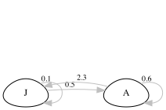

--- 
title: "BB512 - Population Biology and Evolution"
author: "Owen R. Jones (Course Coordinator)"
date: "`r Sys.Date()`"
site: bookdown::bookdown_site
pandoc_args: --listings
output:
  bookdown::gitbook:
    config:
      toc:
        collapse: section
    includes:
      in_header: extras.css
  bookdown::pdf_book:
    includes:
      in_header: preamble.tex
    papersize: a4
  pdf_document:
    includes:
      in_header: preamble.tex
classoption: a4paper
documentclass: book
bibliography: [book.bib, packages.bib]
biblio-style: apalike
link-citations: yes
description: "Course book for BB512 at the Biology Department, University of Southern Denmark"

---
```{r include=FALSE, cache=FALSE}
#packages for the main content
library(dplyr)
library(tidyr)
library(ggplot2)
library(magrittr)
library(patchwork)

#Packages for the web pages
library(xfun)
library(htmltools)
library(mime)

library(officer)
library(flextable)
```

```{r setOptions, include=FALSE}
knitr::opts_chunk$set(
  warning = FALSE, message = FALSE
)
library(officer)
```

# Welcome to BB512


Welcome to the Population and Evolution course. 
The course, and this website, is divided into five parts:

1. Evolution by Natural Selection
2. Population Growth Models
3. Population Genetics and Evolution
4. Interactions Between Species and Community Structure
5. Animal Behaviour, Altruism and Sexual Selection

The recommended textbook is Neal (2018). Other useful textbooks, that are NOT mandatory, but could be useful are Gotelli (2008) and Stearns & Hoekstra (2005).


* Neal, D. (2018). *Introduction to Population Biology* (2nd ed.). Cambridge: Cambridge University Press. doi:10.1017/9781139107976
* Gotelli, NJ (2008) *A Primer of Ecology*. Fourth Edition, Sinauer Associates. ISBN: 978-0878933181
* Stearns, SC & Hoekstra, RF (2005) *Evolution: An Introduction*. 2nd Edition, Oxford University Press. ISBN: 978-0199255634

In addition to this, I will provide a reading list of journal articles that are relevant to the material. These are optional, but highly recommended because they give extra context and background to the course and show you how the theory is used in recent research.

## This website and other course materials

This website holds most of the materials you need for the practical exercises you will do during the course. You will also find the [Schedule](https://jonesor.github.io/BB512_Book/schedule.html) here.

**We may not do ALL of these exercises, but you are welcome to do ones we miss in your own time.**

You will find other materials via itsLearning. 

For most classes you will need your personal laptops: Please bring them to class (and remember a power supply!).

## Expectations

There are lectures and practical exercise sessions on the course. The practical sessions are designed to help you understand the subject better and I expect students to attend and actively participate in both. There will also be some multiple choice quizzes (e-tests) during the semester. These are intended to help you figure out whether you know the material, and whether there are areas you need to revisit. They do not contribute to your final grade, but I hope you will attempt them. They will definitely increase your understanding of the material. Note that the final assessment will be a similar format!

I expect students to make every effort to keep up with the core reading (mainly the textbook chapters), and to ask questions where they don’t understand.

## Assessment

The assessment for the course will be an electronic exam held in January with multiple choice and short answer questions. It is worth noting that exam format will be similar to the quizzes mentioned above. The date for the exam will be finalised in December.

## Instructors

The instructors of the course are:

*	[Owen Jones](https://portal.findresearcher.sdu.dk/en/persons/jones), Associate Professor, jones@biology.sdu.dk 
*	[Thomas Bjørneboe Berg](https://portal.findresearcher.sdu.dk/en/persons/thomasbb), Associate Prof./Senior Scientist at Naturama, thomas@naturama.dk  

If you have any problems accessing materials, or have any questions regarding the course feel free to send me (Owen) an email, or make a comment in the form I mentioned above. You can also make an appointment to see me via Zoom or in my office if necessary*. PLEASE REMEMBER to tell me which course you are referring to if you send an email!

Owen Jones, course coordinator - [jones@biology.sdu.dk](mailto:jones@biology.sdu.dk ) 

Office location: [V12-410b-2](https://clients.mapsindoors.com/sdu/573f26e4bc1f571b08094312/details/563cb94f423b7d0540c9a605)

## Software

We will use Excel and R/RStudio during this course.

### Excel

I expect you will already have Excel installed, so there is not much to say here.

Be aware that Excel differs depending on the language it is localised in. For example, Danish vs. English. This means that some of the commands might differ between version. 
See [here](https://easy-excel.com/excel-in-other-languages/excel-formulas-in-danish/) for examples.

### R and RStudio

R and RStudio are two separate pieces of software. RStudio is a user-friendly interface to talk to R, it cannot work if you have not got R installed. So, when you install these two programs, install R first, then RStudio.

Already have them installed?  I strongly recommend to update to the latest versions of R, which you can download [here](https://cran.r-project.org) and RStudio Desktop, which you can find [here](https://www.rstudio.com/products/rstudio/). 


If you are unsure whether you should update your R or RStudio try the following code. If it produces a nice graph, then your R is sufficiently up-to-date. If there are error messages, then you probably need to update R.

```
install.packages("popdemo")
library(popdemo)

A <- matrix(c(0,1,2,0.5,0.1,0,0,0.6,0.6), byrow=TRUE, ncol=3)

pr <- project(A, vector="n", time=10)
plot(pr)
```


```{block, type="do-something"}
**This website includes equations. **

Equations sometimes do not render correctly on some web browsers. 

From experience, Chrome tends to be the most reliable, Safari (Mac only) also works well.

Can you see the following equation?

$N_{t+1}=N_{t}+r_{m} N_{t}\left(1-\frac{N_{t}}{K}\right)$

It should like this:


If it doesn't look right, then you should try another browser (maybe even your phone browser) or investigate a solution.
```

# Schedule

```{r echo = FALSE}
# Get current year and use it to build the link to the official time table.
current_year <- format(Sys.Date(), "%Y")
link_to_schedule <- paste0("https://mitsdu.sdu.dk/skema/activity/N100007101/e",substr(current_year,3,4))
```


This is the schedule for the course. You can check itsLearning for the dates, times and locations.
Also check itsLearning for details of other tasks/assignments/reading etc.

```{r, echo = FALSE, message=FALSE, warning=FALSE}
schedule <- readxl::read_excel("BB512_Schedule.xlsx")
```


```{r, echo = FALSE, message=FALSE,eval=knitr::is_html_output(), warning=FALSE}
schedule2 <- schedule %>%
  select(Part, Session, Type, Topic, Instructor)

big_b <- fp_border(color = "gray70", width = 3)
std_b <- fp_border(color = "gray70", style = "dashed")
big_b_end <- fp_border(color = "white", width = 3)

ft <- flextable(schedule2, cwidth = c(2, .5, 1, 4, .75, .75)) %>%
  bold(part = "header") %>%
  bold(j = 1) %>%
  color(
    i = ~ Type == "Lecture",
    j = ~ Session + Type + Topic,
    color = "red"
  ) %>%
  fontsize(part = "all", size = 14) %>%
  vline(border = std_b, j = 1:4) %>%
  rotate(j = ~Part, align = "top", rotation = "tblr") %>%
  hline(border = std_b, i = seq(2, nrow(schedule2), 2)) %>%
  hline(border = big_b_end, i = nrow(schedule2))

ft
```


```{r, echo =FALSE,message=FALSE,warning=FALSE}
#source("personalCalendar.R")
```

<!--chapter:end:index.Rmd-->

```{r include=FALSE, cache=FALSE}
#packages for the main content
library(dplyr)
library(tidyr)
library(ggplot2)
library(magrittr)
library(patchwork)

#Packages for the web pages
library(xfun)
library(htmltools)
library(mime)

library(officer)
library(flextable)
```
# (PART) Evolution by Natural Selection {-}

<!--chapter:end:1_00.Rmd-->

```{r include=FALSE, cache=FALSE}
#packages for the main content
library(dplyr)
library(tidyr)
library(ggplot2)
library(magrittr)
library(patchwork)

#Packages for the web pages
library(xfun)
library(htmltools)
library(mime)

library(officer)
library(flextable)
```
# The Blind Watchmaker

*If a pocket watch is found on a heath, it is most reasonable to assume that someone dropped it and that it was made by at least one watchmaker, not by natural forces*


In the early days of evolutionary theory, Charles Darwin's concept of natural selection faced criticism from those who struggled to reconcile the idea of unguided evolution with the apparent complexity of life. One prominent criticism was an analogy often referred to as the "watchmaker analogy," which argued that finding a pocket watch on a heath would naturally lead one to infer the existence of a skilled watchmaker, rather than attributing it to chance or natural forces. This analogy was frequently employed to challenge the notion that natural selection could account for the intricate structures and adaptations observed in living organisms.

However, in response to the watchmaker analogy, the evolutionary biologist Richard Dawkins introduced the concept of "The Blind Watchmaker". In his 1986 book of the same name, Dawkins presented a compelling counterargument, highlighting that evolution by natural selection is a blind and unguided process, similar to a watchmaker who lacks foresight or intent. According to this idea, the remarkable complexity and diversity of life can emerge through the cumulative effects of small, incremental changes driven by natural selection over vast periods of time, without the need for an external intelligent designer.

In this exercise, we will use a program written in R to explore the interplay between random change and strong selection, inspired by the watchmaker analogy and the Blind Watchmaker concept. We will examine how seemingly improbable results, such as generating a specific sentence through random typing, can be achieved through the power of selection without the need for supernatural intervention. By simulating the process of randomly typing a particular sentence and applying selection mechanisms, we will witness firsthand how unguided processes, over time, can lead to meaningful and purposeful outcomes. 

Let's start...

Imagine if you randomly typed letters into a type writer. How long would it take to come up with a sensible sentence?

Let's think about a particular sentence "`I LOVE SCIENCE`", which has 14 characters (including the spaces).

In English there are 26 letters in the alphabet, plus the space. So if we hit a random key, probability of getting the first letter correct is 1/27 (= 0.037).
The chances of getting the first two letters correct is (1/27) * (1/27), or (1/27)^2, which is 0.0014. Our sentence has 14 characters, so the probability of getting it right with random key presses is (1/27)^14 = 9.139181e-21. This is a vanishingly small probability.

You will explore how SELECTION, can turn the impossible into a possible.


```{block, type="do-something"}
Learning outcomes: 

- Greater understanding of adaptive evolution via natural selection.
- Understanding that random change does NOT result in disorder, if paired with selection.
- Use of R for exploring biological phenomenon.
```


## Getting started

0. Make sure you have both R and RStudio installed.
1. Open RStudio.
2. Open a new script (File > New File > New Script)
3. Cut and paste the R code (below) into your script.
4. Save your script with a memorable file name.

Note, only edit the top part of the file (above the marked comment)

## The code

```
phrase <- "With your feet on the air and your head on the ground"
nGenerations <- 100
selection <- TRUE

###################################################
#Do not edit between the ##
phraseSplit <- unlist(strsplit(toupper(phrase), ""))
output <- data.frame(generation = 1:nGenerations, 
                     phrase = rep(NA, nGenerations))
fixed <- NULL
for (i in 1:nGenerations){
  randomPhrase <- sample(c(LETTERS," ","'","Å","Æ","Ø","!"), length(phraseSplit), replace = TRUE)
  if(selection == TRUE) {
    randomPhrase[fixed] <- phraseSplit[fixed]
    fixed <- append(fixed,which(randomPhrase == phraseSplit))
    fixed <- sort(unique(fixed))
  }
  output$phrase[i] <- paste(randomPhrase,collapse = "")
}
###################################################

output

```

## How the simulation works.

An instructor will walk you through the code, and what it means. They will also demonstrate its use. 

You provide the small program with a target phrase (`phrase`). This phrase can include Danish characters, spaces and an exclamation point! 
The program then generates a random "phrase" with the same number of characters as your target phrase. This certainly be complete nonsense - literally random letters -- but some of the letters might match with your target phrase.

If selection is operating (`selection <- TRUE`), then these matching letters are held in place, and in the next iteration only the unmatched letters are randomised. This process continues for many generations (`nGenerations`).

The `output` of the code (at the bottom) will print out a sequence of the phrases. You should see that, when selection is turned on, the target phrase is reached after some generations.

Try editing the code: 
1) Change the phrase - make it shorter/longer (remember that not all characters are allowed).
2) Change the number of generations.

## Questions

Answer the following questions, then make sure you confirm your understanding and have the right answers with an instructor.

*	What happens if selection is turned OFF? 
* Does the number of generations affect whether the target phrase is reached?
* Does the speed of reaching the target phrase depend on the length of the phrase?
* How does this simulation differ from real natural selection?


<!--chapter:end:1_01_BlindWatchmaker.Rmd-->

```{r include=FALSE, cache=FALSE}
#packages for the main content
library(dplyr)
library(tidyr)
library(ggplot2)
library(magrittr)
library(patchwork)

#Packages for the web pages
library(xfun)
library(htmltools)
library(mime)

library(officer)
library(flextable)
```
# Bug hunt camouflage (Netlogo)

## Background

Adaptive evolution via natural selection is a fundamental concept in evolutionary biology and is one of the central mechanisms driving the diversity of life on Earth. This process is shaped by the interplay between variation in heritable traits within a population, differential survival and reproduction rates, and the environmental challenges faced by organisms. One illustrative example of natural selection is the phenomenon of camouflage in predator-prey systems. 

In an environment where predators rely on visual cues to locate their prey, individuals with better camouflage that matches their surroundings are more likely to avoid detection and capture, leading to higher survival rates. Over generations, the frequency of camouflage traits increases in the prey population due to higher survival and increased reproduction of well-camouflaged individuals. 

On the other hand, predators with better detection skills, like keen eyesight, are more successful at capturing prey, leading to increased survival and reproduction of these individuals. Consequently, traits associated with effective predation also become more prevalent in the predator population. This dynamic interplay between camouflage in prey and predator detection abilities exemplifies the power of natural selection in driving the adaptation and evolution of species to their ecological niches.

```{block, type="do-something"}
Learning outcomes: 

- Understanding adaptive evolution via natural selection.
- Understanding how fitness depends on the environment.
- Understanding the terms adaptation, selection, selection pressure, heritability.

```

## Your task

In this exercise, you will use an individual-based simulation to examine adaptive evolution and natural selection, exploring how living organisms can undergo transformations to better survive and thrive in their environments. You step into the role of a predatory bird and hunt bugs living in a virtual landscape. You will see how the colours of the bugs ("traits") influence their survival. The bugs that blend into their surroundings have a higher chance of avoiding detection, leading to greater survival and more opportunities to pass on their advantageous traits to future generations.

The exercise is done using one of the built-in models in a computer program called NetLogo (https://ccl.northwestern.edu/netlogo/).

There are two ways to use NetLogo: (1) You can log in to our SDU Ucloud computing system at https://cloud.sdu.dk/, and use it there; (2) You can download and install NetLogo from the site above.

I recommend the UCloud option: Please follow these steps: (i) search for NetLogo in the search bar at the top of the screen; (ii) click on Applications and then on the NetLogo icon; (iii) click on "Run Application"; (iv) Give your job a name (e.g., "BB512") and under "Hours" enter 1 hour; (v) under Machine Type, select "u1-standard-1"; (vi) click on Submit. After a few moments while Ucloud is preparing your job, an new screen appears. Click on Open Interface to open a virtual desktop. There, you can open NetLogo and use it as if it was on your own computer by clicking on its icon.

Open NetLogo and click File > Models Library. You can then use the search box at the bottom of the screen to find the model called “Bug Hunt Camouflage”.

This is a model of natural/artificial selection that shows how a population hunted by a predator can develop camouflaging. For example, in a forest with green leaves, green bugs may emerge as the predominant bug color.

In the simulation you assume the role of a predatory bird that feeds on insects, which can be different colours.  You will see what effect your hunting has on the colour traits/genetics of these simulated insects, and also how this evolution affects your hunting efficiency.


### Getting started

1. When you open the model, you will see a screen with various purple and green “sliders”, buttons and menus that control parts of the model.
2. Start with 30 bugs, by moving the “carrying-capacity” slider until it reads 30.
3. Now click “setup”. You should see the environment appear on the right hand side, and you should see a few “bugs” on the environment. Start the simulaton by clicking “go”. 
4. After you click go, you need to click on bugs as fast as you can using your mouse/track pad. You can also keep the mouse button depressed, and move the cursor around the world to catch the bugs. Try to consume bugs as fast as possible to remove any “deliberation” on your part as a predator. The camouflaging effect will emerge more clearly if you aren’t taking your time trying to find bugs that typically would be more difficult to find.

You can track your progress by looking at the graphs on the left. The most important of these are the two at the top, which show (1) the number of bugs caught through time and (2) the average colour values of the bugs.

In the “Bugs Caught vs. Time” plot the slope of the curve gives a good idea of your hunting efficiency – the faster you can catch bugs, the steeper the slope. If you didn’t catch any bugs for a while, the slope would be horizontal.

You should notice that bugs with contrasting colours (e.g. black on white) are easier to catch.  Keep hunting for 2 mins or until you can’t find any more bugs then pause the simulation by clicking “go” again. Now take a look at the graphs and see what effect your hunting has had on the phenotype distribution in the population.

To understand what’s going on, you need to understand how the simulation works.

 
#### How the simulation works.

*Simple version:* 
The simulation starts with bugs with random colours.

Each time you kill a bug, one of the remaining bugs produces an offspring so that the population size stays constant. The colour of the offspring is inherited from its parent, though it can change slightly due to mutation (determined by the “max-mutation-step” slider). Therefore, the offspring of a red parent will be reddish, the offspring of a blue parent will be blueish and so on. Therefore, if you consistently kill off (e.g.) non-reddish bugs, the reddish bugs that remain will have offspring that are also red and the average colour of the population will then shift towards being redder. 

Colour here is indicated by “hue”, “saturation” and “brightness” which range from 0 to 255. Basically, hue describes colour value (red/green/blue), saturation describes how “washed out” or vivid the colour is (a low value for saturation would look white), and brightness describes how bright the colour is (a low value for brightness would look black). See below for more details.

Evolution can be defined as: “*change in the heritable characteristics [colour traits] of biological populations [bugs] over successive generations [time].*” 

## Questions

Answer the following questions, then make sure you confirm your understanding and have the right answers with an instructor.

*	What happens to the average colour of the bug population with time as you hunt? 
*	What happens to your hunting efficiency?
*	Would you say that the bug population becomes worse or better adapted to their environment?
*	Can you explain how this happens?
*	After simulating in one environment (e.g. poppy field) for a few minutes, pause then switch to another environment. Are the bugs now well- or poorly-adapted to their environment?
*	Do the genotypes of individuals change (e.g. with individual age)?
*	Increasing the “max-mutation-step” makes bug offspring less like their parents. How do you think this will influence the speed of adaptation of the bugs?

Some useful keywords:

*	Selection
*	Adaptation
*	Selection pressure
*	Heritability


## Details about colours (optional) 

The primary colours red, green and blue (RGB) can be mixed to produce any colour (this is how the pixels of TVs and computer monitors work if you look closely). Mixtures of these colours are also used to control the colour of the bugs. Each bug has three pigment “genes”  (R, G and B) that determine their colour phenotype. The more frequently the gene for a pigment is coded for, the stronger that presence of color is in the overall blend of pigments that results in a single phenotype for coloration. For example, a bug that had lots of R, but little G or B would appear as red. In this simulation RGB can vary from 0 to 100.  The mixture of these primary colours results in a colour which has a particular **hue**, **brightness** and **saturation** (Fig  \@ref(fig:colours)).

**Hue** ranges from 0 to 255 with both ends of that spectrum being red, and as you move from 0 to 255 you pass through all the colours of the rainbow.

The other two elements of colour are **brightness** and **saturation**. If a colour is bright it is very vibrant, if it is not bright, it is dark: a brightness value of 0, would be black, no matter what the hue was. Similarly, a low saturation values give “washed out” colours and a valeue of 0 would be  white. 


```{r colours, out.width="50%",fig.align='center',echo = FALSE, fig.cap="Hue, brightness and saturation"}
knitr::include_graphics('images/colours.png')
```

Read more about the model here: http://ccl.northwestern.edu/netlogo/models/BugHuntCamouflage

<!--chapter:end:1_02_BugHuntCamouflage.Rmd-->

```{r include=FALSE, cache=FALSE}
#packages for the main content
library(dplyr)
library(tidyr)
library(ggplot2)
library(magrittr)
library(patchwork)

#Packages for the web pages
library(xfun)
library(htmltools)
library(mime)

library(officer)
library(flextable)
```
# (PART) Population Growth Models {-}

<!--chapter:end:2_00.Rmd-->

```{r include=FALSE, cache=FALSE}
#packages for the main content
library(dplyr)
library(tidyr)
library(ggplot2)
library(magrittr)
library(patchwork)

#Packages for the web pages
library(xfun)
library(htmltools)
library(mime)

library(officer)
library(flextable)
```
# Geometric growth

## Background 

The geometric growth model is a simple model of unconstrained population growth. In other words, the population can grow to infinite size and is not affected by competition (population density). In the model, the rate at which a population grows is described by the population growth rate, often represented by the symbol lambda ($\lambda$ ). Higher values of $\lambda$  indicate rapid population growth, while smaller values suggest slow growth. If $\lambda < 1$, the population shrinks in size. 

Geometric growth is often used interchangeably with exponential growth, but there is an important distinction. Exponential growth pertains to "continuous time" scenarios, whereas geometric growth involves models where the population changes in discrete time steps, such as yearly intervals.

The key quantities involved in this model are as follows, although it's important to note that different books or sources may use varying symbols:


- $N_t$ = population size at time $t$; and $N_0$, $N_1$ is population size at time 0, time 1 etc.
- $\lambda$ = population growth (multiplication) rate over a single time step, $\Delta t$. THis is sometimes called the *finite rate of increase*.
- $R_m$ = population rate of increase over a single time step, $\Delta t$. This is sometimes called the *discrete growth factor*. 
- $r_m$ = individual rate of increase over an infinitesimally small time step. This is sometimes called the *instantaneous rate of increase* or *intrinsic rate of increase*

$R_m$ is  is related to $\lambda$ such that $R_m = \lambda - 1$ (and $\lambda = R_m + 1$).

The relevant equations can be seen in Box 4.1 of the Neal textbook but here we will use the following:

$N_{t+1} = N_t + (R_m N_t)$, 

which leads to,

$N_{t+1} = N_t (1 + R_m)$ and, equivalently, $N_{t+1} = N_t \lambda$. 


```{block, type="do-something"}
Learning outcomes: 

- Competence in using Excel formulae for mathematical modeling.
- Understanding the the parameters of exponential/geometric growth.
- Competence in using mathematical models in Excel to strengthen own understanding of biological processes.
- Awareness of rearranging of mathematical formulae to produce different forms of models.
- Knowing that the slope of the $ln(N_t)$ vs. $t$ relationship can tell you about population growth rate (it is $ln(\lambda)$).
```

## Your task

Download and open the Excel file [`GeometricGrowth.xlsx`](https://www.dropbox.com/s/xxx05sckvop5i52/GeometricGrowth.xlsx?dl=1).

1.	Starting with an initial population size (`N`) of 10 [at time (`t`) =0], and with a $\lambda$ of `1.1`, use Excel’s equation functions to work out the population size from `t=1` through to `t=20`. E.g. The formula might look something like this “`=B8*$F$8`”.
2.	Use charts to plot the results. On the horizontal axis (x-axis) you should have time, and on the vertical axis (y-axis) you should have population size (`N`). A scatterplot would be best for this.
3.	Make another plot of the same data, but this time use a natural logarithmic axis for the population size. The formula in Excel for natural log is `LN()`.
4.	What do you notice about the curves in these different versions of plotting the same data?
5.	Try altering the population growth rate. Try values of 0.8, 1 and 1.2 for example. What happens to the curves? What is special about the value of 1?
6. Add an trendline with an equation to the log transformed graph. Identify the slope. The slope is $ln(\lambda)$), so you can work out $\lambda$ by "reversing" the $ln$ by taking its exponential. e.g. `=EXP(0.0953)` in Excel.


Now reset the population growth rate to 1.1. Now lets see if the mathematical rules of so-called “geometric series” work...

1.	If the population starts at t=0, $N_t = N_0 \lambda^t$ . In words, the population at time $t$ is the initial population size multiplied by the finite population growth rate raised to the power of $t$.
2.	Your instructor will explain how this works on the blackboard.
3.	Following these rules, the population size at time $t=5$ ($N_5$), is $10 * 1.1^5$, or $10* 1.61051$, which is $16.1051$. Check that this matches what you got earlier.
4.	This approach can be really useful because it can save lots of time. For example, what is the population after 900 generations? It would be tedious to work this out using the first, "simple" approach, but very easy if you use the geometric series rules and have access to a calculator/computer.

## Questions

- In geometric growth, what does a constant growth rate imply for the population's future growth? Explain with an example.
- What makes the geometric growth model "unrealistic" for real-world scenarios? Explain your reasoning.
- Give an example of real-world populations where geometric growth might be a suitable model. Explain your reasoning.
- Suppose a population's size decreases by 25% every year due to environmental factors. If there are initially 800 individuals, determine the population size after 4 years.


<!--chapter:end:2_02_GeometricGrowth.Rmd-->

```{r include=FALSE, cache=FALSE}
#packages for the main content
library(dplyr)
library(tidyr)
library(ggplot2)
library(magrittr)
library(patchwork)

#Packages for the web pages
library(xfun)
library(htmltools)
library(mime)

library(officer)
library(flextable)
```
# Estimating Population Growth Rate

## Background
In population biology, one important measure of population dynamics is the population growth rate (\(\lambda\)). This rate tells us how fast a population is growing or shrinking over time. When \(\lambda > 1\), the population grows exponentially; when \(\lambda = 1\), it stays constant, and when \(\lambda < 1\), the population declines.

In this exercise, you will estimate the population growth rate (\(\lambda\)) from real population data. The method involves plotting the population size over time, applying a log transformation to linearise the data, and fitting a linear regression model to estimate \(\lambda\). This method is widely used in ecology to analyse growth trends and make predictions.

```{r generateDataPopGrowth,eval = FALSE,echo=FALSE}
#Simulate data for this exercise
# Set parameters for the simulation
set.seed(9)  # For reproducibility

lambda <- 1.09  # Base growth rate (lambda)
N0 <- 16       # Initial population size
years <- 25     # Number of years to simulate
noise_level <- 0.1  # Noise level (as a fraction of lambda)
measurement_error_level <- 0.15  # Noise level for measurement error (as a fraction of population size)

# Initialize a vector to store true population sizes
population <- numeric(years)
population[1] <- N0

# Simulate population growth with noise added to the growth rate (lambda)
for (t in 2:years) {
  # Add random noise to lambda
  noisy_lambda <- rnorm(1, mean = lambda, sd = noise_level * lambda)
  
  # Ensure that noisy lambda is positive to avoid negative growth
  noisy_lambda <- max(noisy_lambda, 0)
  
  # Calculate new population size with the noisy growth rate and ensure it's an integer
  new_population <- population[t-1] * noisy_lambda
  
  # Round to the nearest integer and ensure it's non-negative
  population[t] <- max(round(new_population), 0)
}

# Create a vector for measured population sizes with measurement error
measured_population <- population  # Copy true population data
for (t in 1:years) {
  # Add random measurement error proportional to the population size
  measurement_noise <- rnorm(1, mean = 0, sd = measurement_error_level * population[t])
  
  # Ensure the measured population size is an integer and non-negative
  measured_population[t] <- max(round(population[t] + measurement_noise), 0)
}

# Create a data frame for easier plotting or further analysis
data <- data.frame(Year = seq(1, years), True_Population = population, Measured_Population = measured_population)

# # Plot the true vs. measured population growth over time
# plot(data$Year, data$True_Population, type = "o", col = "blue", pch = 16,
#      xlab = "Year", ylab = "Population Size",
#      main = "True vs. Measured Population with Measurement Error", ylim = c(0, max(data$True_Population, data$Measured_Population)))
# lines(data$Year, data$Measured_Population, type = "o", col = "red", pch = 1)
# legend("topleft", legend = c("True Population", "Measured Population"), col = c("blue", "red"), pch = c(16, 1))

# Write the data to a CSV file
write.csv(data, file = "data/population_growth_with_measurement_error.csv", row.names = FALSE)

```


```{block, type="do-something"}
Learning outcomes: 

- Competence in using Excel formulae for data transformation and regression analysis.
- Understanding the role of $\lambda$ in population growth and its estimation through log-transformed data.
- Competence in applying mathematical models in Excel to analyse real biological data.
- Awareness of how log transformations can linearise exponential growth data for easier interpretation.
- Knowing that the slope of the $ln(N)$ vs. time relationship represents $ln(\lambda)$ and can be used to estimate population growth rate.
```

## Your task

### Step 1: Download and Open the Data
- Download the provided Excel file: [`EstimatingGrowth.xlsx`](https://www.dropbox.com/scl/fi/k9z32wndllofihsyhj728/EstimatingGrowth.xlsx?rlkey=7gukyzvdm4pv1wsbnljfymvx1&dl=1).
- Open the file in Excel to view the population data for a species recorded annually over a 25-year period.

### Step 2: Plot the Population Size Over Time
- In Excel, create an x-y scatter plot of the **population size** (\(N_t\)) on the y-axis and **time** (Year) on the x-axis.

### Step 3: Log-Transform the Population Size
- Add a new column in Excel for the natural logarithm of the population size using the formula `=LN(cell)`. This transformation helps linearise the exponential growth data.
- Create a new scatter plot with **log-transformed population size** (\(\log_e(N_t)\)) on the y-axis and **time** (Year) on the x-axis.

### Step 4: Fit a Linear Regression Model
- In the log-transformed scatter plot, add a trendline by right-clicking on the data points and selecting "Add Trendline."
- Choose "Linear" and ensure you check the box to "Display Equation on Chart."
- The slope of the trendline represents \(\log(\lambda)\).

### Step 5: Calculate \(\lambda\)
- Use the slope from the regression equation to calculate \(\lambda\) with the formula: \(\lambda = e^{\text{slope}}\). In Excel, you can do this with the equation `=EXP(cell)`

## Questions
1. **Interpret the Plot**: What does the log-transformed plot of population size over time tell you about the population's growth trend? Does the population appear to grow exponentially?
2. **Estimate Growth Rate**: What is the estimated population growth rate (\(\lambda\)) based on your linear regression analysis?
3. **Model Assumptions**: What assumptions does this model make about population growth? Discuss any potential real-world factors that might affect the accuracy of your estimate for \(\lambda\).


### Key Quantities
- **\(N_t\)**: population size at time \(t\).
- **\(\lambda\)**: population growth (multiplication) rate per time step. 
- **\(\log_e(N_t)\)**: natural logarithm of the population size at time \(t\), used to linearise the data for regression analysis.

<!--chapter:end:2_03_EstimatingLambda.Rmd-->

```{r include=FALSE, cache=FALSE}
#packages for the main content
library(dplyr)
library(tidyr)
library(ggplot2)
library(magrittr)
library(patchwork)

#Packages for the web pages
library(xfun)
library(htmltools)
library(mime)

library(officer)
library(flextable)
```
# Stochastic population growth

```{r echo = FALSE}
set.seed(134)
```

## Background

In contrast to the deterministic nature of the geometric growth model, a stochastic version of the model introduces an element of randomness, making it more reflective of real-world scenarios.  Instead of assuming fixed and predictable growth rates, the stochastic model incorporates uncertainties and fluctuations that occur due to various factors, such as environmental variability, chance events, and individual-level variations in reproductive success. By embracing this stochastic approach, the population dynamics become more realistic, allowing us to better understand and predict the inherent variability and uncertainties associated with natural populations. This stochastic framework provides a valuable tool for ecologists and researchers to explore the dynamics of real populations under more complex and dynamic conditions.

Remember – this model still allows for unbounded population growth – the populations are not influenced by population density.


We'll focus on the discrete (Geometric) growth) model:  $N_{t+1}=\lambda N_t$.

Because $\lambda = \mathrm{e}^{r_m}$ (and $r_m = ln(\lambda)$), we can rearrange the equation to express it as $N_{t+1}=\mathrm{e}^{r_m} N_t$.

Therefore, we can predict next year's population size from this year's population if we know either $r_m$ or $\lambda$.

We will create some models in Excel, and then in R, to explore the effect of stochastic variation in the population growth rate.

We can simulate variation in $r_m$ by drawing a random number from a normal distribution with a particular mean ($\bar{r_m}$) and variance ($\sigma_{r_m}^2$) (Fig. \@ref(fig:stochGrowthRate)). The $\bar{r_m}$ value determines the long-term average while the $\sigma_{r_m}^2$ estimates how much "spread" there is in the data from year to year.

In the figure you can see that the peak of the $r_m$ distribution is $>0$ (approximately 0.1), so on average, the population will tend to grow.  However, in poor years $r_m$ is $<$ 0, so the population will decline in those cases. Both the mean value and the spread of the distribution (i.e. variance) determine the fate of the population. 

Remember that we can convert $r_m$ to $\lambda$ by taking the exponential, because $r_m = ln(\lambda)$.


```{r stochGrowthRate, echo=FALSE,fig.width=6,fig.height=4,fig.align='center',fig.cap="A normal distribution of potential r values"}
set.seed(123)
pgr <- data.frame(r = rnorm(1000,0,0.25))
ggplot(pgr,aes(x=r))+geom_histogram(bins =30) +
  theme_minimal()
```

When using the equation above to calculate population at time $t+1$ ($N_{t+1}$) from the population at time $t$ ($N_t$), one would draw a random $r_m$ value from this distribution. Sometimes $r_m$ will be high, other times it will be low, most of the time it will be from around the middle of the distribution.

```{block, type="do-something"}
Learning outcomes: 

- Increased competence in using Excel formulae for mathematical modeling.
- Understanding the concept of stochasticity in simple population models.
- Competence in using mathematical models in Excel to strengthen own understanding of biological processes.
- Understanding how stochasticity relates to (i) uncertainty in the prediction of population trajectories and (ii) probability of (local) extinction.
```

## Your task

```{block, type="do-something"}
Use the Excel worksheet,  `[StochasticPopulationGrowth.xslx](https://www.dropbox.com/s/1wpixbpgwlh54f0/StochasticPopulationGrowth.xlsx?dl=1)`,  to study how stochastic population growth works with this simple model.
```


1)	Use Excel formulae to calculate deterministic population size through time (20 generations, with starting population of 100), linking to the mean finite population growth rate.
2)	Use charts to plot the results. (you already did this last time!)
3)	Use a formula to generate a column of stochastic $r_m$ values, based on a particlar mean and variance. [English Excel: `=NORMINV(RAND(),$F$10,SQRT($F$11))`/ Danish Excel: `=NORMINV(SLUMP();$F$10;KVROD($F$11))`. If you get errors, check whether Excel is expecting commas or semi-colons]
4)	Use the same procedure as before, to create a stochastic population size vector (stochastic N). Remember to convert $r_m$ to $\lambda$ by taking the exponential.
5)	Compare the two trajectories using a chart.
6)	Try altering initial population size, mean population growth, and the amount of stochasticity (Variance).
7)	Extinction occurs when N $\leq$ 0. What happens to extinction risk as stochasticity (variance) increases? What happens when initial N is small? Does the population ALWAYS survive if the population growth rate, $r_m$ is $>$ 0?

```{block, type="do-something"}
Note: Excel re-randomises the random numbers every time you change any cell in the sheet. This is OK, and allows you to explore a stochastic simulation many times.
```

## Simulations in R

Excel is of limited use to really get a feel for this. For the next part we'll use *R*.

If you already have R on your computers you can play along, otherwise take a look at my demonstration in class. I will show how you can use this simulation approach to estimate extinction risk and how this is related to starting population size, mean lambda, and the amount of stochasticity.

You can copy/paste the code below into *R*.

The output of the modelling is shown in  Fig. \@ref(fig:stochProjection)

```{block, type="do-something"}
Copy-and-paste the code below into a text file (or directly into *R*).

The final line of the code (`nExtinct/nTrials`) gives you an estimate of extinction probability - the proportion of trials that lead to a population size of 1 (or less).

Modify the simulation settings to explore what happens to (i) the plot of population growth and (ii) extinction risk, when you vary  `mean.r` ($\bar{r_m}$), the amount of stochasticity ($\sigma_{r_m}^2$) (`var.r`), and the number of generations (`nGen`).
```

```{r eval = TRUE, echo = FALSE}
set.seed(1234)
```


```{r stochProjection, echo=TRUE,fig.width=6,fig.height=4,fig.align='center',fig.cap="An example of stochastic population projection (100 simulations for 50 generations)"}
#Simulating stochastic geometric population growth rate

#Simulation settings (try changing these)
mean.r = 0.05 # the mean value of r
var.r = 0.1 # the variance in r (stochasticity)
startPop = 10 # pop size at start
nGen = 50 # number of generations
nTrials = 100 # number of repeated simulations

####################################################################
#If you are unfamiliar with R, do not edit anything below this line!
####################################################################

pseudoExtinction = 1

# First randomly generate some lambda values
rValues <- matrix(rnorm(nTrials*nGen, mean = mean.r, sd = sqrt(var.r)),
                  ncol=nTrials,nrow=nGen)

# Use a histogram to see what they look like (uncomment the line below)
# hist(lambdas,col="grey",main="")

# Now run the simulations to see what the resulting population growth looks like
trials = matrix(data = NA, nrow = nGen, ncol = nTrials)
for (j in 1:nTrials){
  popSize = startPop  
  for (i in 2: nGen){
  stoch.r = rValues[i,j]
  popSize = append(popSize, popSize[i-1]*exp(stoch.r))
}
trials[,j] = popSize
rm(popSize)
}

#Calculate probability of (pseudo)extinction
minvals <- apply(trials,2,min)
nExtinct <- length(minvals[minvals<=pseudoExtinction])
nExtinct/nTrials

#Make a plot of the population trajectories
plot(1:nGen,log(seq(0.1,max(trials),length.out=nGen)),type = "n",axes=F,xlab ="Time", ylab = "N",ylim=log(c(0.1,100000)))
matlines(log(trials),col = "#FF234520",lty=1,lwd=3)
axis(1)
axis(2,at = log(c(0.1,1,10,100,1000,10000,100000)),
     label = c(0.1,1,10,100,1000,10000,100000))
abline(h=log(pseudoExtinction),lty=2)
```

## Questions

- What is the main difference between deterministic and stochastic population growth models?
- Describe how incorporating randomness into the stochastic model makes it more realistic for understanding real-world populations.
- Simulate a scenario where two populations with identical growth rates experience different outcomes due to stochastic factors. Explain the implications of these findings.
- What can this stochastic model tell us about extinction risk and population size?
- What can this stochastic model tell us about extinction risk and environmental variation?

<!--chapter:end:2_04_StochasticGrowth.Rmd-->

```{r include=FALSE, cache=FALSE}
#packages for the main content
library(dplyr)
library(tidyr)
library(ggplot2)
library(magrittr)
library(patchwork)

#Packages for the web pages
library(xfun)
library(htmltools)
library(mime)

library(officer)
library(flextable)
```
# Basic logistic population growth

## Background

Population sizes usually have upper limits - they can only get so large before leveling off due to environmental constraints. The logistic growth model is a powerful tool in population ecology that takes this limitation into account, providing a more realistic depiction of population dynamics. Unlike the simplistic geometric growth model, which assumes unlimited resources and unrestricted growth, the logistic model recognizes that natural populations face a finite carrying capacity (K). This carrying capacity represents the maximum population size an environment can sustain over the long term, considering factors such as available resources, competition for food and space, predation, and disease. As a population approaches its carrying capacity, its growth rate gradually slows down, eventually reaching a point of equilibrium where birth rates equal death rates, leading to a stable population size. This concept of limited growth and self-regulation enables the logistic growth model to offer deeper insights into the delicate balance between a population's reproductive potential and the constraints imposed by its habitat, making it an invaluable tool for understanding ecological dynamics and conservation efforts.

The logistic growth model can be expressed like this, which is derived from Eqn. 5.2 in Neal: 

$N_{t+1}=N_{t}+r_{m} N_{t}\left(1-\frac{N_{t}}{K}\right)$

This equation models population at time $t+1$ ($N_{t+1}$) as a function of the population at time $t$ ($N_t$), the *intrinsic rate of increase* ($r_m$), and carrying capacity of the environment ($K$). 

The idea is that the growth rate of the population (the difference between $N_{t+1}$ and $N_t$) decreases as the population increases in size. When the population size at $N_t$ is equal to the *carrying capacity* of the environment ($K$), the population growth rate is zero. For example, if the carrying capacity of the population is *200*, and there are already *200* individuals in the population, then the size of the population will remain unchanged through time ($N_{t+1} = N_t = 200$).

The aim of this Excel-based exercise is to explore this model and help you get an intuitive understanding of it by looking at it from different perspectives. Even though it is a fairly simple model, it leads us to some useful biological insights.

```{block, type="do-something"}
Learning outcomes: 

- Increased competence in using Excel formulae for mathematical modeling.
- Understanding the parameters of the logistic population growth model.
- Understanding how strikingly different types of population dynamics can result from the same (logistic) model simply by varying the population growth rate parameter.
- Understanding the concept of *deterministic chaos* and how it is different from randomness.
- Competence in using mathematical models in Excel to strengthen own understanding of biological processes.

```

## Your task


Download and open the Excel file: [`Basic Logistic Growth.xslx`](https://www.dropbox.com/s/oxxyyn4zf4wsvkg/Basic%20Logistic%20Growth.xlsx?dl=1).

You will see that there are three blocks of numbers, and three graphs.
During the exercise you only need to edit the pink block.

The pink block gives the important parameters of the logistic model:

*	`Initial N` = the starting population size at time 1.
*	`r_m` =  the maximum per capita population growth rate ($r_m$). When $r_m$ is 0, the population does not grow. When $r_m$ is $>$ 0 the population grows, and when it is $<$ 0 it declines. The population cannot fall below 0.
*	`K` = the carrying capacity of the population.

The initial values for these are *10*, *0.8* and *200* respectively.

In this exercises you will be altering these parameters and observing the outcome in the 3 graphs which show:

1.	The population size through time.
2.	The per capita growth rate of the population in relation to population size
3.	The relationship between population size at time t and at time t+1

## Graph 1: Population size through time

First – take a look at **Graph 1**. 

*	What is the maximum population size? 
* How does this compare to carrying capacity (`K`)? 
* What do you predict to happen if you increase `K` to *300*? (try it)

<!--You should notice that when `r_m` is around 1 or lower, the maximum population size is the same as the carrying capacity (`K`). As you change `K`, this maximum population size will change accordingly. 
If `r_m` is markedly greater than 1, then the population size can exceed the carrying capacity. This is because the population grows so fast that it “overshoots” carrying capacity and then fluctuates around `K`.-->

* At what time do you reach the maximum population size? 
* If you halved the growth rate (`r_m`) to *0.4*, what do you think will happen to the dynamics this time? (try it)

<!-- You should notice that the time taken to reach the maximum population size is related to the growth rate (`r_m`). As you increase `r_m`, the time taken to hit the maximum population size decreases. If you halve the `r_m`, the time taken to reach maximum population size is doubled.
-->

* What do you think will happen if you `r_m` to *1.8*? (try it)
* What do you notice about the population size through time? 
* How does the maximum population size compare with the carrying capacity? How would you describe the ‘*dynamics*’ of this population?

<!--You should notice that the population overshoots carrying capacity (`K`), then oscillates around `K` with damped oscilllations that gradually move towards `K`. Therefore if a population has even a moderate population growth rate, and if it has density-dependence, then it can fluctuate in numbers without any extrinsic factor (like weather) acting. 
-->

* What happens if you increase the `r_m` even more, to *2* or *2.1*? 
* And even more to *2.8*, *2.9* or *3*? 
* How would you describe these dynamics? 
* Is there a limit to how high `r_m` can be? (hint: populations go extinct if N $<$ 0).

<!--
You should notice that as you increase `r_m` the nature of the oscillations changes. In fact, this is predictable:  If `r_m` $<$ 1.0, then population will approach `K` smoothly.

If 1.0 $<$ `r_m` $<$ 2.0, then oscillations of decreasing amplitude around `K`.

If 2.0 $<$ `r_m` $<$ 2.57, then stable, cyclic oscillations around `K` . They can be 1 or 2+ point stable limit cycles.

If `r_m` $>$ 2.57, then population will fluctuate chaotically.

If `r_m` is too high, the population will fluctuate and crash to extinction.
-->

Finally, compare the population trajectory in **Graph 1** for populations with `r_m`= *2.8* and *2.81*. Then compare the trajectories where you fix `r_m` at *2.8* but vary initial population size by a small amount (e.g. *1*). Imagine you were a population manager – would these populations be easy or hard to predict? What kinds of species have high population growth rates like these?

<!--
When `r_m` is high ($>$ 2.57) the population dynamics become extremely hard (impossible) to predict because they are chaotic. This means that even a very small change in `r_m` (which could simply be measurement error) will mean that predicted population size next year is suddenly very different. This would cause big problems to a population manager.

Many pest species and diseases have very high population growth rates. For example, locusts, or measles. This is one reason why it is hard to predict when the next pest/disease outbreak will happen
-->


## Graph 2: Per capita growth rate vs. N

Now let’s turn to **Graphs 2**  which shows the relationship between per capita population growth rate ($r$) and $N$.

In **Graph 2**, notice that the per capita growth rate ($r$) always declines linearly with population size (`N`). Where does it cross the x-axis line? Modify the carrying capacity (`K`) – what do you notice about the intercepts on the y and x axes?

<!--
The line describing per capita growth rate crosses the x-axis (population size) at $K$. i.e. if $K$ = 100, the line crosses at 100. If you change $K$, the intercept on the axis also changes accordingly. The line intercepts the axis at this point no matter what the population growth rate is.
-->


```{block, type="do-something"}
These two graphs are simply different ways to visualize the same model. 

It is important that you can make the connections between these graphs.

How would the same plots look for regular exponential growth?
```

Some useful keywords:

* Oscillation
* Damped oscillation
* Cycle/cyclic dynamics
* Stable-limit cycle (2-point, 3-point limit cycle)
* Chaos/Chaotic dynamics
* Unpredictable/predictable


## Additional questions

- In the logistic growth model, what happens to the population growth rate as the population size approaches the carrying capacity (K)? How does this lead to population stability?
- In the logistic growth model, what factors can cause a population to overshoot its carrying capacity temporarily? How does the population respond to such overshooting?
- How can a ballpark knowledge of maximum per capita population growth rate be useful to a population manager?
- Consider the relevance of the logistic growth model in ecological conservation. How can an understanding of logistic growth help in managing and conserving endangered species?


<!--chapter:end:2_05_BasicLogisticGrowth.Rmd-->

```{r include=FALSE, cache=FALSE}
#packages for the main content
library(dplyr)
library(tidyr)
library(ggplot2)
library(magrittr)
library(patchwork)

#Packages for the web pages
library(xfun)
library(htmltools)
library(mime)

library(officer)
library(flextable)
```
# Deeper into logistic growth

## Background

The purpose of this exercise is (i) to look at the relationships between the exponential (or geometric) growth model and the logistic growth model and (ii) to emphasise different ways of looking at the models.

```{block, type="do-something"}
Learning outcomes: 

- Increased competence in using Excel formulae for mathematical modeling.
- Understanding the relationship between exponential and logistic growth models.
- Understanding how models can be modified to explore different phenomena.
- Understanding how and why model outputs can be explored (visualised) from different perspectives.
- Competence in using mathematical models in Excel to strengthen own understanding of biological processes.

```

## Your task

### Relationship between Geometric and Logistic models

Consider the logistic growth model (Eqn. 5.2 in Neal):

$\frac{\delta N}{\delta t}=r_m N\left(1-\frac{N}{K}\right)$

This model includes carrying capacity (K) to account for the fact that, in most situations, the environment imposes a limit on the number of individuals that can be supported. What happens if we remove that limit? We can do that mathematically by setting K to be infinity.

$\frac{\delta N}{\delta t}=r_m N\left(1-\frac{N}{\infty}\right)$

What do we get if we divide a number by infinity? ... zero.

So we get: 

$\frac{\delta N}{\delta t}=r_m N\left(1-0\right)$, or, 

$\frac{\delta N}{\delta t}=r_m N$, which is the ordinary geometric growth equation (Eqn. 4.6 in Neal)!


The take-home message here is that these key equations are closely related, and you can go from one to the other with some simple, logical steps.


### Different views of the basic logistic growth model

Download the Excel file [`Deeper Into Logistic Growth.xlsx`](https://www.dropbox.com/s/4xq399z7skl1akv/Deeper%20into%20Logistic%20Growth.xlsx?dl=1).


Take a look at the `BasicLogistic` Excel worksheet/ark, and answer the questions below.

Focus first on **Figure 1**.

Enter different values for $r_m$, e.g. 0.8, 1.2, 1.8, 2.4, 2.7…

Can you describe the dynamics of the population time series in Figure 1 using some of the following vocabulary: Oscillation, damped oscillation, stable cycle, 2-point cycle, chaotic, unpredictable, predictable?

Now focus on **Figure 2**.

This figure shows the per capita population growth rate as a function of population size at time $t$. Note where the line intercepts the x- and y-axes. 

What do you notice about these values? Hint: what are the values you have set for $r_m$ and $K$? Try varying those values.

On paper, make a sketch of a graph for per capita population growth rate as a function of population size at time t for a logistic model with $r_m$ = 1.5 and $K$ = 250, indicating the values of the intercepts. Check your sketch by entering those values into the Excel model.

This relates to Eqn. 5.1 in Neal: $r = r_m(1-N/K)$. 

Based on what you know about what happens to the population dynamics for different values of $r_m$ and what you have just seen in Figure 2, you should now be able to sketch fairly accurate cartoon graphs if you are given values for $r_m$ and $K$! 

*Without using Excel*, draw a population time series, and a graph of per capita growth rate vs. N for when initial population size is 10, $r_m$ is 1.9 and $K$ is 500. Check your graph using Excel.  

Focus now on **Figure 3**.

Population growth rate is $dN/dt$ - the rate of change in $N$ ($dN$, change in population size) per unit time ($dt$). You should now explore how *Figure 3* relates to the values used in the equation by changing the $r_m$ and $K$ values and looking at *Figure 3*. 

Can you see how *Figures 1*, *2* and *3* are connected?

At what population sizes is the population growth rate 0 ($dN/dt$)?
What is the population size at which the population growth is rate maximized? 

Now lets look back on **Exponential growth**.

How do the relationships in Figures 1, 2 and 3, differ from the equivalent figures for logistic growth. Try to draw graphs of Figures 1, 2 and 3 for the exponential growth model.

*	Fig 1. Population size ($N$) through time ($t$).
*	Fig 2. Per capita growth rate ($\frac{1}{N} \frac{dN}{dt}$) vs. population size ($N$)
*	Fig 3. Population growth rate ($\frac{dN}{dt}$) vs. population size ($N$) (see figure 2.4 in Gotelli)


### Adding a time lag

This relates to *Equation 2.3* in Gotelli (and pages 32-35).

$\frac{d N}{d t}=r N\left(1-\frac{N_{t-\tau}}{K}\right)$

Look at the Excel Worksheet/Ark called `TimeLag`.

Adding a time lag to logistic model can complicate the dynamics (by introducing cycling). The 3rd Excel tab has an exercise showing that if you add in a time lag to the logistic function it modifies the dynamics. The purpose of this Excel sheet is to allow you to prove this to yourself!

You will need to carefully modify the Excel formula so that instead of referring back to the population size at $N_{t-1}$, it refers back to $N_{t-1}$ etc. Remember to drag the formula down to all the other years (or use the shortcut I will show you).

Start with a small $r_m$ that gives a smooth convergence to K with an ordinary logistic model. Add in a 1-year time lag and show that this generates cyclic dynamics. This shows that this simple “quirk of life history” (a time lag) can generate cycling, even if the population growth rate is low.
 


<!--chapter:end:2_06_DeeperIntoLogistic.Rmd-->

```{r include=FALSE, cache=FALSE}
#packages for the main content
library(dplyr)
library(tidyr)
library(ggplot2)
library(magrittr)
library(patchwork)

#Packages for the web pages
library(xfun)
library(htmltools)
library(mime)

library(officer)
library(flextable)
```
# Life tables and survivorship types

## Background 

Life tables are powerful analytical tools used in various fields to understand and quantify mortality patterns and life expectancy within populations. Originating in population biology and demography, life tables have found extensive applications in epidemiology, human mortality studies, and even product life-cycle management. By systematically tracking and analyzing the survival and mortality rates of individuals within specific cohorts, life tables reveal essential information about population dynamics, age-specific risks, and the factors that influence longevity. As a result, life tables play a vital role in shaping policies, making informed decisions, and gaining a deeper understanding of the complex interplay between age, health, and mortality.

The basic algebra used in life tables is explained in Neal Chapter 6 and in Gotelli Chapter 3.

In addition to providing valuable insights into mortality patterns and life expectancy, life tables also allow us to consider mortality patterns in the context of distinct survivorship types that result from the distribution of mortality risk through a life course. Survivorship types are crucial in understanding the overall survival patterns and demographic characteristics of different populations.

Three primary survivorship types are commonly identified, based on survivorship curves on a log scale:

- Type I (Convex Curve): This survivorship type is characterized by a low mortality rate during early life, with an increase in mortality rates at older ages. It indicates that individuals in the population have a high probability of surviving to advanced ages, and the majority of deaths occur in older age groups. Type I survivorship is observed in humans and other long-lived species with strong parental care and relatively low early-life mortality.
- Type II (Straight Line): In this survivorship type, the mortality rate remains relatively constant across all age groups. It suggests that individuals have an approximately equal chance of dying at any age throughout their life. Type II survivorship is commonly observed in species where mortality rates are consistent, regardless of age. Some small mammals and birds exhibit this survivorship pattern.
- Type III (Concave Curve): Type III survivorship is characterized by high early-life mortality rates, followed by a decline in mortality at older ages. This pattern indicates that survival rates are low in the early stages of life, but those who survive the initial vulnerable period have a greater likelihood of reaching older ages. Type III survivorship is often seen in species that produce numerous offspring but provide limited parental care, where only a fraction of the offspring survive to adulthood.

By identifying and understanding these survivorship types, researchers gain critical insights into the demographic structure of populations and the selective pressures that influence survival and longevity. Survivorship patterns play a significant role in shaping the dynamics of populations and help scientists make informed decisions regarding conservation efforts, healthcare planning, and population management strategies.


```{block, type="do-something"}
Learning outcomes: 

- Increased competence in using Excel formulae for mathematical modeling.
- Competence in using mathematical models in Excel to strengthen own understanding of biological processes.
- Understanding how life tables are calculated.
- Understanding the three types of survivorship curve and how they relate to mortality and survival probabilities (and their trajectories with age).
- Understanding the decline in the "force of selection".

```

## Your task

Download and open the Excel file [`Life tables exercises.xlsx`](https://www.dropbox.com/s/ox0rk05zdwzrmwy/Life%20tables%20exercises.xlsx?dl=1).

The file has three worksheets (“*Life table*”, “*Survivorship Curves*” and “*Gotelli
Table 3.1 example*” (don't worry if you don't have the text book).


### Life table

Let’s start with “**Life table**”.

The aim now is to use Excel as a modeling tool to produce a life table. 

I have provided some initial data collected from a cohort of animals. I know how many individuals start each year (i.e. how many “**enter** an interval”) and therefore I can see how many survive each year (i.e. how many “enter the **next** interval). I also know how many (female) babies (on average) are produced by each female.

Start by calculating survivorship ($l_x$). Survivorship is the **probability of survival to a particular age**. Therefore, at time 0, $l_0 = 1$, since everyone is alive at this point. The next value ($l_1$) must be calculated based on the number alive at that point. In this case it is $352/500 = 0.704$. You must generalize this calculation into a formula that can be dragged to fill column `D` in the worksheet. In algebraic form, the equation is $l_x = S_x/S_0$. 

Next, you can calculate age-specific **survival probability**. Note that this is different from $l_x$. Survival probability is simply the probability that an individual will survive its current age class. i.e., what is the probability that an individual currently aged 2 will survive to become age 3. In this case, the $254/298 = 0.852$. The calculation is $g_x = l_{x+1}/l_x$, or $S_{x+1}/S_x$.

From there you can calculate the age-specific **probability of death**. This is simply $1 - g_x$: the probilities of survival and death **must** sum to 1.

Now complete the remaining columns $l_x m_x$ and $l_x m_x x$, and use them to calculate (a) $R_0$; (b) **Generation time**; and an approximation of $r$.

**Tip** You need to understand the use of the `$` symbol in Excel, and how to drag the selected area to place the formula in the column.

Refer to the sheet “*Gotelli Table 3.1 example*” if you get stuck (click on the cells to see the formulae used there).

#### Declining force of selection

The force of selection describes the relative importance of events that happen during the life course on population growth (e.g. $R0$ or $r$). 

To investigate this you can do a computer "experiment" by altering reproduction at different ages. You can think of these as "what if?" experiments. e.g. "What if there was a mutation that added 1 to reproduction at age 0-1, or 1-2 etc.?" 

Specifically, we can look at the effect of this experiment on $R0$ or $r$, which are measures of **fitness**? 

Try graphing your results as age vs. change in $R0$. 

What you should see is that changes early in life matter more than changes later in life.


### Survivorship curves

In the second part of this class we focus on the **Survivorship Curves** worksheet.

The aim here is to start to explore how different types of organisms with different ways of life (“**life history strategies**”) can have qualitatively different kinds of life tables. The most important thing to observe is the difference in **survivorship curves** ($l_x$). These changes become very obvious when you plot the log-transformed survivorship against age.

In the Excel worksheet, I have placed tables showing the fate of cohorts of three populations of different species. Your job now is to calculate the survivorship curve ($l_x$) for these species, take the natural log (using formula `=LN(C3)`, for the first population, `=LN(J3)` for the second population etc.

You should see that the graphs automatically fill up with lines. These show Type I, II and III survivorship.

Next, calculate the age-specific probability of survival ($g_x$) and of death ($q_x$). This is the proportion of individuals that **enter** the age interval that **do** survive and **do not** survive to the end of the interval, respectively. You can calculate it as `=B4/B3` and `=1-(B4/B3)` for the first row of the first population. 

Plot graphs of these.

Make sure that you are (1) able to "diagnose" survivorship type from looking at a graph of $ln(l_x)$ vs $x$ (2) able to sketch a cartoon of mortality trajectory if shown one of these survivorship curve.


<!--chapter:end:2_07_LifeTables.Rmd-->

```{r include=FALSE, cache=FALSE}
#packages for the main content
library(dplyr)
library(tidyr)
library(ggplot2)
library(magrittr)
library(patchwork)

#Packages for the web pages
library(xfun)
library(htmltools)
library(mime)

library(officer)
library(flextable)
```
# Matrix population modelling

```{r,echo=FALSE,warning=FALSE,message=FALSE}
library(tidyverse)
library(Rage)
library(Rcompadre)
library(rsvg)
library(DiagrammeRsvg)
```

## Background 

Matrix population models are powerful and widely used tools in population ecology that offer a comprehensive framework for studying the dynamics of structured populations. Unlike simple growth models that assume homogeneous populations, matrix population models take into account the variation in vital rates, such as birth, death, and growth rates, across different life stages or age classes. These models are particularly well-suited for species with distinct life stages, such as plants with seedlings, juveniles, and adults, or animals with different age classes. Matrix population models use transition matrices to represent the relationships between different age classes and how individuals move from one stage to another over time. By incorporating demographic data and life-history traits, matrix population models provide a more realistic and detailed understanding of population dynamics, making them invaluable for predicting the future trends of populations and assessing their vulnerability to environmental changes and management actions.

This practical aims to give you a good understanding of the basics of their construction and use.

```{block, type="do-something"}
Learning outcomes: 

- Competence in constructing life cycle diagrams to represent the life history of real (or theoretical) organisms.
- Understanding how to parameterise life-cycle diagrams and use them to produce a matrix population model.
- Competence in using R to calculate a population growth rate and project a population.
- Understanding how to connect these results to a management question.
- Understanding the logic of "*in silico* experiments" to investigate a biological question (mathematical modelling).
```


## Your task

1) First, think of an organism you would like to model the dynamics of. It could be a mammal, a bird, a fish, insect or tree ... real or fantasy.  

2) Think about their life cycle, and draw it as a life cycle diagram with circles indicating the stages and arrows representing transitions between stages (e.g. growth) and reproduction. Keep it simple if you can (max. 3 stages).

Things to think about:

* Is it age based or stage based?
* How many stages are there? Can you simplify (e.g. instead of age in years, you could use life stage)
* If using stages, how are stages defined? E.g. by size, by development, etc.
* Are the survival and fecundity higher in earlier or later life?
* Does the organism ever skip stages?
* Can the organism move "backwards" through the life cycle?

3) Next to the arrows, write values for survival probability and fecundity (number of babies) using your biological knowledge. It is fine to use "ballpark" estimates.


Here's an example for a fictional organism.

```{r setup, include = FALSE}
set.seed(123)
matA_elas <- matrix(c(4, 4))

while (length(which(matA_elas == max(matA_elas))) != 1) {
  matA <- matrix(c(
    sample(seq(0.05, .3, .05), 1), sample(seq(8, 10, .5), 1), sample(seq(0, 4, .5), 1),
    sample(seq(0, .7, .05), 1), sample(seq(0, .7, .05), 1), 0.0,
    0.0, sample(seq(0, .7, .05), 1), sample(seq(0, .9, .05), 1)
  ), nrow = 3, ncol = 3, byrow = TRUE)
  matA <- round(matA, 2)
  (matA_elas <- round(popdemo::elas(matA), 2))
}

matA
```


```{r showmatrix, echo=FALSE}
matA <- matrix(c(
  0.3, 8.00, 2.00,
  0.1, 0.50, 0.00,
  0.0, 0.40, 0.40
), nrow = 3, byrow = TRUE)
matA <- round(matA, 2)
```
```{r plotmatrix, echo = FALSE, fig.cap="."}
matA_plot <- Rage::plot_life_cycle(matA, stages = c("A", "B", "C"))

# 1. Make a play graph
tmp <- matA_plot

# 2. Convert to SVG, then save as png
tmp <- DiagrammeRsvg::export_svg(tmp)
tmp <- charToRaw(tmp) # flatten
rsvg::rsvg_png(tmp, "tempLifeCycleDiagram.png") # saved graph as png in current working directory
```


4) Now you can turn this diagram into a matrix population model by filling in a square of survival/fecundity values. 

The life cycle shown above looks like this:

```{r showmatrix2, echo = FALSE}
# Function to write matrix as LaTeX
write_matex2 <- function(x) {
  begin <- "\\begin{bmatrix}"
  end <- "\\end{bmatrix}"
  X <-
    apply(x, 1, function(x) {
      paste(
        paste(x, collapse = "&"),
        "\\\\"
      )
    })
  paste(c(begin, X, end), collapse = "")
}
```
$$
A = `r write_matex2(matA)`
$$

## Using R for matrix modelling

Working with matrices is very tedious in Excel. However, in R you can use this information to predict the future dynamics of the population, and estimate population growth rate, and generation time etc.

Open up **RStudio**, and lets see if we can predict future dynamics. First you will need to install a package called `popdemo`.

```{r install,eval=FALSE}
install.packages("popdemo")
```
 
You only need to install packages once. After that you can load the package for use by using the `library` function.

```{r library, message=FALSE}
library(popdemo)
```

You can put your matrix into R like in the example below (change the numbers to match YOUR model). If your model has fewer, or more, stages then you will need to modify the code a bit. Ask for help if you get stuck.


```{r createMatrix}
A <- matrix(c(
  0.3, 8.00, 2.00,
  0.1, 0.50, 0.00,
  0.0, 0.40, 0.40
), ncol = 3, byrow = TRUE)
```

## Projecting the population

And now you can use the project function to project what happens to the population, then plot it. Look at what happens if you log or don’t log the y-axis. First you need to define an initial starting population structure. 

In my example, I have 3 stages, so I have 3 values for the initial population sizes. Then I use the `popdemo` function `project` to do a population projection for 10 time steps.

```{r projectpopulation}
initial <- c(10, 5, 3)
pr <- popdemo::project(A, vector = initial, time = 10)
```

Take a look at `pr`, the projected population. This gives you the total population size, and below that the population sizes in each stage. 

```{r showprojection}
pr
```

You can access the population sizes of the different stages using `vec(pr)`.

```{r showprojection2}
vec(pr)
```

Let's plot this... 

```{r plotprojectiongraph}
pop <- vec(pr)
matplot(pop, type = "l", log = "y")
legend("topleft", legend = colnames(pop), col = 1:ncol(pop), lty = 1:ncol(pop))
```

You should see that the population increases exponentially. The population growth rate is the so-called "*dominant eigenvalue*" of the matrix **A**.

We can ask R for the  *eigen values* and *eigen vectors*. These are the population growth rate ($\lambda$) and the stable stage distribution (*SSD*) and the reproductive values (*RV*) of the different stages. *SSD* is the expected *proportion* of individuals in the different stage classes at equilibrium (i.e. the long-term timeframe) and *RV* is the expected number of future offspring by individuals in each stage.

You can see that in this case, using my example values the population is growing `r format(100*(eigs(A)$lambda-1),2,4)`% per year.

```{r eigenproperties}
eigs(A)
```

## Elasticity

Elasticity analysis is a way of analysing a matrix model to identify the most important transitions to population growth. This is very important in management and conservation when we ask questions like, "which parts of the lifecycle should we focus on to preserve the population?". The mathematics of this are beyond this course, but in a nutshell, we are adding a small value to the elements of the matrix one-at-a-time and asking what difference this makes to population growth rate (lambda). We then express that as a *proportion*, so that the elasticities sum up to one and are easier to interpret. They can be calculated easily in R.

```{r elasticity}
popdemo::elas(A)
```

What transition is most important to population growth, according to the above?


## Life table response experiment (LTRE)

These don't have much to do with life tables (sorry, thats confusing!). The idea is very simple: you run "experiments" on your matrix model by asking "what if" questions. For example, what would happen if we could increase survival of the juveniles by 20%? what would happen if adults are hunted more, and thus have a decreased survival by 60%? what would happen if we provided supplemental food to reproducing females, and increase fecundity by 50%? etc. Use your imagination!

In practice, we do that simply by modifying the matrix model. In the following, I am looking at the effect of increasing fertility in adult and senescent individuals by 50%:

```{r ltre}
A <- matrix(c(
  0.3, 8.00*1.5, 2.00*1.5,
  0.1, 0.50, 0.00,
  0.0, 0.40, 0.40
),
byrow = TRUE, nrow = 3
)

popdemo::eigs(A, what = "lambda")
elas(A)
```


## Your turn...

Work through the above process for your own species. 

(1) Do a projection, 
(2) calculate (and interpret) lambda and elasticity, 
(3) do an LTRE

### An evolutionary experiment

You can think of lambda (population growth rate) as being a measure of fitness. Imagine that some of your population had a mutation that caused them to have, say, 1 extra baby, but at the expense of reduced survival in one of the younger stages. Would this mutation persist in the population? Do an LTRE to find out!

<!--chapter:end:2_07.5_matrixModels.Rmd-->

```{r include=FALSE, cache=FALSE}
#packages for the main content
library(dplyr)
library(tidyr)
library(ggplot2)
library(magrittr)
library(patchwork)

#Packages for the web pages
library(xfun)
library(htmltools)
library(mime)

library(officer)
library(flextable)
```
# Pre- and Post-reproduction census

```{r prepostbreeding}
p0 <- 0.2
p1 <- 0.9
p2 <- 0.6
m2 <- 3.0
m3 <- 6.0

A1 <- matrix(c(0.0, m2 * p1, m3 * p2,
               p0, 0.0, 0.0,
               0.0,p1,0), byrow = TRUE, nrow = 3)

```


Convert to pre-breeding

```{r postpreconversion}
A2 <- matrix(c(0.0, m2 * p0, m3 * p0,
               p1, 0.0, 0.0,
               0.0,p2,0), byrow = TRUE, nrow = 3)
```

Compare population growth rates

```{r comparepgr}
(popdemo::eigs(A1, what = "lambda"))
(popdemo::eigs(A2, what = "lambda"))
```


<!--chapter:end:2_07.55_prePostBreeding.Rmd-->

```{r include=FALSE, cache=FALSE}
#packages for the main content
library(dplyr)
library(tidyr)
library(ggplot2)
library(magrittr)
library(patchwork)

#Packages for the web pages
library(xfun)
library(htmltools)
library(mime)

library(officer)
library(flextable)
```
# Life Table Response Experiments

## Introduction

A Life Table Response Experiment (LTRE), in matrix population modelling, is a technique used to analyse how differences in demographic parameters between two or more populations or "treatments" contribute to differences in their overall growth rate. It's particularly useful for understanding how specific factors like survival rates, fecundity, or other stage-to-stage transitions influence the growth or decline of a population under different conditions. 

The method involves comparing matrix models of the populations in question and decomposing the differences in growth rates different models into contributions from individual matrix elements. This approach provides insights into which life cycle stages or transitions are most important for population growth and can inform conservation or management strategies.

## Set up

First we need to ensure that we have the R packages we need loaded. If you get an error doing this, remember to install them first (`install.packages("PACKAGE_NAME")`)

```{r LTRE1}
library(popbio)
library(popdemo)
library(Rcompadre)
```


## A worked example

In this example, we consider a two-stage matrix model to analyze, say, squirrel populations in two different geographic locations. The first, a reference population from Location A, represents an area with favorable environmental conditions. The matrix model for this population distinguishes between juveniles (J) and adults (A), incorporating probabilities for juveniles maturing into adults (0.5) and adults surviving and staying adult (0.6), as well as the fecundity rate (2.3), which is the number of juveniles produced by an adult. 


```{r LTRE2, echo=FALSE}
matA <- matrix(c(0.1,2.3,
                 0.5,0.6), nrow = 2, ncol = 2, byrow = TRUE)

matA <- round(matA, 2)
```

```{r LTRE3, echo = FALSE, fig.cap="."}
matA_plot <- Rage::plot_life_cycle(matA, stages = c("J", "A"))

# 1. Make a play graph
tmp <- matA_plot

# 2. Convert to SVG, then save as png
tmp <- DiagrammeRsvg::export_svg(tmp)
tmp <- charToRaw(tmp) # flatten
rsvg::rsvg_png(tmp, "tempLifeCycleDiagramLTRE.png") # saved graph as png in current working directory
```


The treatment population, from Location B, experiences generally worse environmental conditions during the spring which particularly impacts the juvenile stages, and includes an effect on fecundity (e.g. via neonatal maternal energy allocation). The two matrices can be created in R as follows. Compare the values in the matrix, to the values in the life cycle diagram.

```{r LTRE4}
A_ref <- matrix(c(0.1,2.3,
                  0.5,0.6), nrow = 2, ncol = 2, byrow = TRUE)

A_treat <- matrix(c(0.1,1.3,
                    0.2,0.7), nrow = 2, ncol = 2, byrow = TRUE)

```


### Comparing matrices

Before we dig into the formal LTRE, it is useful to compare the two matrices, `A_ref` and `A_treat`, to see how they are different from eachother.

We can check what overall difference there is between the matrix in a couple of ways.

Firstly, we can examine the differences in the individual transition rates between the matrices by subtracting one from the other. 

```{r LTRE5}
A_ref - A_treat
```

Next, we can ask what impact these differences have on the population growth rate (lambda).
Note that putting the command in parentheses tells R to both create the new object (e.g. `lambdaA1`) **and** print the result to the screen.

```{r LTRE6}
(lambda_A_ref <- eigs(A_ref, what = "lambda"))
(lambda_A_treat <-eigs(A_treat, what = "lambda"))
```

We could express this as a difference, or as a proportional difference.

The difference in growth rates between the matrices is `r round(lambda_A_ref - lambda_A_treat,3)`.

```{r LTRE7}
(lambdaDiff <- lambda_A_ref - lambda_A_treat)
```

This is a `r round((lambdaDiff/lambda_A_ref) * 100)`% reduction, compared to the reference matrix.

```{r LTRE8}
(lambdaDiff/lambda_A_ref) * 100
```

So far, so good. We can see that treatment reduces the population growth rate, but we don't know exactly how. There are 3 changes in the matrix. Which of these changes is most instrumental in driving change in the population growth rate?


### Contributions from individual matrix elements 

The objective of the LTRE (Life Table Response Experiment) analysis in this context is to understand the impact of these environmental differences on the difference in population growth rate between the two populations. This is important because identifying the specific life history traits (i.e. the individual transitions, represented by individual elements of the matrix, such as survival or fecundity) that are most sensitive to environmental changes allows us to pinpoint the key drivers of population dynamics. 

By understanding where differences in growth rate originate, we can make more informed decisions about conservation and management strategies. For instance, if the analysis shows that adult survival has a larger impact on growth rate than fecundity, conservation efforts can be more effectively focused on improving adult survival rates rather than fecundity. Conversely, if juvenile survival or fecundity is more influential, efforts might be better directed towards enhancing these aspects. This targeted approach ensures that resources are allocated efficiently, and interventions are tailored to address the most critical factors affecting the population's viability under varying environmental conditions.

By comparing the two models, we can decompose the differences in the overall growth rate ($\lambda$) between the baseline (Location A) and the modified model (Location B). This analysis will specifically highlight how changes in adult survival and fecundity in the less favorable environment of Location B contribute to any differences in population growth rates compared to the more favorable conditions in Location A. Such insights are crucial for developing effective management and conservation strategies, particularly in understanding the relative importance of different life stages and demographic parameters under varying environmental conditions.


```{r LTRE9}
popbio::LTRE(A_treat,A_ref)
```


This summary quantifies the relative importance (and direction) of the effect of the differences between the two matrices on the difference in population growth rate.
One of the changes actually has a positive impact on growth rate, but this is opposed by the other two changes. The most important of these two is the lower left element, which represents the ontogenetic development from juvenile to adult stage.


## Relationship with elasticity analysis

There are similarities between LTRE analysis and elasticity analysis. Comparing LTRE with elasticity analysis reveals some distinct advantages of LTRE in certain contexts. 

LTRE can handle comparisons where changes occur in multiple life history parameters simultaneously, providing a more comprehensive view of the potential impacts of various factors on population dynamics. This is in contrast to elasticity analysis, which examines the sensitivity of the population growth rate to small changes in individual demographic rates and assumes other parameters remain constant.

Therefore, LTRE is more directly applicable for evaluating and comparing the impacts of different management strategies or environmental changes that simultaneously affect several demographic traits. It allows for a more nuanced understanding of how specific interventions (like changes in fecundity or survival rates) will influence the population. This is crucial for making informed decisions in conservation and wildlife management.

In summary, while elasticity analysis is valuable for understanding the inherent sensitivity of a population's growth rate to changes in its life cycle processes, LTRE can be a more useful tool for analyzing the more complex effects of environmental variations or different management strategies on population dynamics.

<!--chapter:end:2_07.6_LTRE.Rmd-->

```{r include=FALSE, cache=FALSE}
#packages for the main content
library(dplyr)
library(tidyr)
library(ggplot2)
library(magrittr)
library(patchwork)

#Packages for the web pages
library(xfun)
library(htmltools)
library(mime)

library(officer)
library(flextable)
```
# How many eggs should a bird lay?

## Background

Trade-offs are inherent compromises in biology, where allocating limited resources to one trait may come at the expense of another. Organisms face these trade-offs when making crucial life-history decisions. One classic example is the British ornithologist David Lack's clutch size trade-off, where bird species must balance between producing more eggs with reduced individual investment or fewer eggs with higher individual investment. In other words, although may be beneficial  to have many offspring, the survival of those offspring will decline if they cannot be cared for.

Understanding such trade-offs sheds light on the fascinating strategies that organisms employ to optimize their fitness and evolutionary success.


```{block, type="do-something"}
Learning outcomes: 

- Understanding the concept of a life history trade off.
- Understanding how balancing the benefits and drawbacks of trade offs tends to lead to intermediate trait values.

```


## Your task

The big bird (*Bigus canarius*) (Fig  \@ref(fig:bigbird)) can lay up to 10 eggs per breeding season. If there is only 1 egg, the probability that the parents can adequately feed the chick and ensure it survives is very high (0.9). However, as the number of siblings increases, the amount of energy and food that the parents can dedicate to caring for *each* chick decreases, and the probability of survival therefore declines . With a clutch size of 10 eggs, there is so little food *per chick* that the survival rates are close to zero.

```{r bigbird, out.width="50%",fig.align='center',echo = FALSE, fig.cap="Big bird, *Bigus canarius*"}
knitr::include_graphics('images/bigbird.jpg')
```

A recent study gathered data on chick survival probability as a function of number of eggs in the nest. These are given in the table below. 

```{r echo = FALSE, message=FALSE, eval=knitr::is_html_output()}
bbeggs <- data.frame(eggs = 1:10,survival = c(0.9,0.85,0.82,0.7,0.5,0.3,0.22,0.15,0.1,0.05))

bbeggs_ft <- flextable(bbeggs)
bbeggs_ft 

```

Use these data to plot a graph in Excel with number of eggs on the x-axis and survival probability on the y-axis axis.

Now, in another column in Excel, calculate, given the chick survival probability, what the expected number of surviving chicks will be for a big bird laying between 1 and 10 eggs^[This may require some thought!].

Plot your result on another graph with number of eggs on the x-axis and number of surviving offspring on the y-axis.

What do you notice? What is the optimum number of eggs to lay? 

Advanced: What happens to the optimum as you change the relationship between clutch size and survival?


## Questions

- What is Lack's clutch size trade-off, and why is it considered a fundamental concept in evolutionary ecology?
- How does the trade-off between clutch size and offspring quality manifest in different bird species, and what factors influence their clutch size decisions?
- What are the potential advantages and disadvantages of producing larger clutches with smaller-sized eggs compared to smaller clutches with larger-sized eggs?


<!--chapter:end:2_08_HowManyEggs.Rmd-->

```{r include=FALSE, cache=FALSE}
#packages for the main content
library(dplyr)
library(tidyr)
library(ggplot2)
library(magrittr)
library(patchwork)

#Packages for the web pages
library(xfun)
library(htmltools)
library(mime)

library(officer)
library(flextable)
```
# Trade-offs and the declining force of selection


*Why does evolution ‘care’ less and less about you as you age? Because there are trade-offs between early and late life events. *

## Background 


An important kind of trade off are those which occur between processes in early and late life. For example, it may be beneficial to increase reproduction at younger ages, but this might lead to increased risk of death at older ages. A mechanism for this could be that limited resources are allocated to producing offspring rather than maintaining/repairing the body. 

The balance of the trade off between these early and late life processes is shaped by the force of selection: The extent to which natural selection influences the prevalence of specific traits in a population. Crucially, the force of selection tends to decline with age meaning that late-life processes are not as important as early-life processes. This means that a mutation giving a modest reproductive advantage at an early age, alongside a harmful or even deadly effect late in life can be "seen" by natural selection as advantageous.

This highlights the significance of early-late life trade-offs and their role in shaping aging patterns in various organisms. Understanding this concept is essential for comprehending life history evolution, aging, and longevity across species.

The aim of this exercise is to gain an understanding of early-life late-life trade offs and to understand why events early in life tend to be much more important to evolution than those that happen later in life.

```{block, type="do-something"}
Learning outcomes: 

- Understanding the concept of a life history trade off.
- Understanding what the force of selection is, why it declines with age, and the consequences for late-life deleterious genes.

```


## Your task

Open the Excel file [TradeOffsAndForceOfSelection.xlsx](https://www.dropbox.com/s/7eyoencvqc3hwv7/TradeOffsAndForceOfSelection.xlsx?dl=1).

This file shows a simplified life table, following a cohort of 1000 individuals for a fictional creature. 

Survival rates from year to year are set to be 0.8 (i.e. 80% make it through to the next year). This fixed, constant survival rate leads to an exponentially declining survival curve, illustrated with a chart in the Excel file. Fertility (i.e. the number of babies produced per year) is set to be 10 per year.

The product of survival ($l_x$) and fertility ($m_x$), lxmx is a measure of the expected number of offspring in an age class. For a stable population the sum of these values ($\sum l_x m_x$) is a measure of net population growth rate (also known as $R_0$). $R_0$ is an excellent measure of fitness of a life history strategy.

Note that the initial $R_0$ is 49.811

## Exploring different life history strategies

**We will now use this data to explore how alternative life history strategies affect fitness.**

Consider a trade-off between early reproduction and late life survival (i.e. via resources allocated to body maintenance). In this scenario the species could increase reproduction early in life by allocating more energy to making babies. However, resources are limited and this will come at the expense of survival at a later date. A mechanism for this could be that the body no longer fixes cancers so effectively. 

* Simulate this by adding 1 to fertility ($m_x$) in year 1 (the benefit) but reducing survival to 0 (all die) at age 25 (the cost). *What is the fitness of this strategy?*
* By setting survival to 0 at other ages, determine how many years of life could be lost before this cost is no longer worth bearing. Is this surprising?
* Now reset everything ($m_x$ =10; survival = 0.8). Recall what fitness was when you added 1 to $m_x$ at age 1 (50.811). 

* If, instead of adding to $m_x$ at age 1 you were to increase $m_x$ at age 25, how much would you need to increase $m_x$ to to reach this figure?

* What about at age 20?   Age 15?  Age 10?  Age 5? 
Plot the increase required vs. age (make a new worksheet/ark in Excel) What do you notice?

* Reset everything again ($m_x$ =10; survival = 0.8). Set $m_x$ from age 15 onwards to be 0. Now alter survival rate after this point (at ages 15-25). What happens to fitness?

## Questions

- Explain the concept of the declining force of selection in the context of life history evolution and aging. How does this phenomenon contribute to the evolution of life history strategies in different organisms?
- Use concepts of life history evolution, including the force of selection, to explain why age-related diseases are common in humans.
- How would predation risk influence the early-late life trade off in resource allocation to reproduction vs. body maintenance?


<!--chapter:end:2_09_TradeOffsForceOfSelection.Rmd-->

```{r include=FALSE, cache=FALSE}
#packages for the main content
library(dplyr)
library(tidyr)
library(ggplot2)
library(magrittr)
library(patchwork)

#Packages for the web pages
library(xfun)
library(htmltools)
library(mime)

library(officer)
library(flextable)
```
# (PART) Population Genetics and Evolution {-}

<!--chapter:end:3_00.Rmd-->

```{r include=FALSE, cache=FALSE}
#packages for the main content
library(dplyr)
library(tidyr)
library(ggplot2)
library(magrittr)
library(patchwork)

#Packages for the web pages
library(xfun)
library(htmltools)
library(mime)

library(officer)
library(flextable)
```
# Hardy-Weinberg equilibrium

## Background

Hardy-Weinberg equilibrium is a fundamental concept in population genetics that serves as a cornerstone for understanding the genetic dynamics of populations. Named after British mathematician G.H. Hardy and German physician Wilhelm Weinberg, this principle describes the stable genetic proportions in a population under specific conditions of no evolution. In an idealized population, where mating is random, genetic mutations are absent, natural selection is not acting, and there is no gene flow or genetic drift, the frequencies of alleles and genotypes remain constant across generations. The Hardy-Weinberg equilibrium provides a baseline against which real populations can be compared, allowing researchers to detect factors that may cause deviations from this equilibrium and, in turn, understand the forces driving evolution and genetic changes within populations. It is a valuable tool in studying genetic diversity, inheritance patterns, and the mechanisms that shape the genetic structure of populations. In this practical we will learn more about HWE and practice solving some HWE-related problems.


The key formulae of the Hardy-Weinberg Equilibrium are:

Equation 1: $p + q = 1$

and

Equation 2: $p^2 + 2pq + q^2 = 1$. 

Let's first consider where these equations come from. First, Equation 1.

In a diploid organism, each individual carries two alleles for a particular gene. Let's consider a gene with two alleles, A and a. In a given population:

$p$ is the frequency of the dominant allele (A)
$q$ is the frequency of the recessive allele (a)

The sum of the frequencies of these two alleles in the population must equal 1, as they are the only two possibilities for this gene, so $p+q=1$.

Equation 1 serves as the foundational stepping stone for Equation 2. In Equation 1, we establish the sum of allele frequencies, $p$ and $q$, in the gene pool. This equation sets the stage for the more complex Equation 2, where we translate these allele frequencies into genotype frequencies for the population.

We can derive Equation 2 based on the gene pool and random mating. Let's consider a mating event between two random alleles. The possible combinations of alleles are:

$p \times p = p^2$ (AA)
$q \times q = q^2$ (aa)
$p \times q = pq$ (Aa)
$q \times p = pq$ (aA)

Notice that we have two $pq$ terms (Aa and aA). The order of alleles doesn't matter, so they are summed together: $2pq$.

So, the total probability for all possible combinations is:

$p^2 + 2pq + q^2$. 

This must equal 1 (100% probability), which gives us Equation 2:

$p^2 + 2pq + q^2 = 1$. 

In these formulae, $p$ is the allele frequency of the dominant allele and $q$ is the frequency of the recessive allele. Thus, $p^2$ is the frequency of the homozygous dominant genotype (e.g., AA), $q^2$ is the frequency of the homozygous recessive genotype (e.g., aa) and $2pq$ is the frequency of the heterozygous genotype (e.g., Aa). From these equations we can produce the following plot that shows the possible genotype frequencies at HWE for any given pair of allele frequencies. HWE can be reached for any genotype frequency (it is a common misconception that ratios between the three genotypes should be 1:2:1, or that allele frequencies should tend towards being 50% $p$ and 50% $q$).

Given a small amount of information it is possible to figure out what the allele and genotype frequencies should be *if the population is at HWE*.

If the population is NOT at HWE, then it must be that one of the assumptions is violated.

```{r hardyweinberg, echo = FALSE, fig.cap="The Hardy-Weinberg Equilibrium. The lines represent the genotype frequencies at HWE, given particular allele frequencies."}
#Hardy Weinberg Principle

p = seq(0,1,0.01)
q = 1-p

homo.p <- p^2 
hetero <- 2*p*q
homo.q <- q^2

#data.frame(p,q,homo.p,hetero,homo.q)

plot(p,homo.p,type="n",axes=FALSE,xlab="",ylab="")

abline(v=seq(0,1,0.1),col="#C0D9D9",lty=2)
abline(h=seq(0,1,0.1),col="#C0D9D9",lty=2)

points(p,homo.p,type="l",lwd=2,col="#3182bd")
points(p,homo.q,type="l",lwd=2,col="#e34a33")
points(p,hetero,type="l",lwd=2,col="#c994c7")

axlab = seq(0,1,0.2)
axis(1,line=1,col.axis="#3182bd",col="#3182bd",at=axlab,label=axlab)
axis(1,line=3,col.axis="#e34a33",col="#e34a33",at=axlab,label=rev(axlab))
axis(2)
title(ylab="Genotype frequency")
text(x=0.05,y=1,"aa",col="#e34a33")
text(x=0.95,y=1,"AA",col="#3182bd")
text(x=0.5,y=0.55,"Aa",col="#c994c7")
mtext("Allele\nfrequencies", side=1, line=3, at=-0.16, adj=0)

```

## Assumptions of Hardy-Weinberg Equilibrium

For a population to be in Hardy-Weinberg Equilibrium, certain assumptions must be met:

- Random mating: There is no preference in mate selection based on genotype.
- No mutations: The gene pool is stable with no new alleles being added.
- Large population size: To negate the effects of genetic drift.
- No gene flow: No new individuals enter or leave the population.
- No natural selection: All genotypes in the population have an equal chance of reproductive success.

Any deviation from these assumptions could result in a population that is not in Hardy-Weinberg Equilibrium.


```{block, type="do-something"}
Learning outcomes: 

- Understanding the difference between alleles and genotypes.
- The ability to solve Hardy-Weinberg problems by understanding and applying the two key formulae of HW.
- Knowing the assumptions of HWE.
- Understanding what "being at Hardy-Weinberg Equilibrium" means in terms of evolutionary processes (which is related to the assumptions of HWE).

```

## Your task

Tackle the following problems, using the HWE theory outlined above ...

### Problem #1.

You have sampled a population in which you know that the percentage of the homozygous recessive genotype (aa) is 36%. Using that 36%, calculate the following: 

*	The frequency of the "aa" genotype. 
*	The frequency of the "a" allele. 
*	The frequency of the "A" allele. 
*	The frequencies of the genotypes "AA" and "Aa." 
*	The frequencies of the two possible phenotypes if "A" is completely dominant over "a." 

### Problem #2. 

Sickle-cell anemia is an interesting genetic disease. Normal homozygous individials (SS) have normal blood cells that are easily infected with the malarial parasite. Thus, many of these individuals become very ill from the parasite and many die. Individuals homozygous for the sickle-cell trait (ss) have red blood cells that readily collapse when deoxygenated. Although malaria cannot grow in these red blood cells, individuals often die because of the genetic defect. However, individuals with the heterozygous condition (Ss) have some sickling of red blood cells, but generally not enough to cause mortality. In addition, malaria cannot survive well within these "partially defective" red blood cells. Thus, heterozygotes tend to survive better than either of the homozygous conditions. 

*	If 9% of an African population is born with a severe form of sickle-cell anemia (ss), what percentage of the population will be more resistant to malaria because they are heterozygous for the sickle-cell gene? 

### Problem #3. 

There are 100 students in a class. Ninety-six did well in the course whereas four blew it totally and received a grade of F.  In the highly unlikely event that these traits are genetic rather than environmental, if these traits involve dominant and recessive alleles, and if the four (4%) represent the frequency of the homozygous recessive condition, please calculate the following: 

*	The frequency of the recessive allele. 
*	The frequency of the dominant allele. 
*	The frequency of heterozygous individuals. 

**Note**: This scenario is hypothetical and simplifies the complex factors that contribute to academic performance for the sake of this exercise. Academic performance is influenced by a myriad of factors, not solely genetics!


### Problem #4. 

Within a population of butterflies, the color brown (B) is dominant over the color white (b). And, 40% of all butterflies are white. Given this simple information calculate the following: 

*	The percentage of butterflies in the population that are heterozygous. 
*	The frequency of homozygous dominant individuals. 


<!--chapter:end:3_01_HardyWeinberg.Rmd-->

```{r include=FALSE, cache=FALSE}
#packages for the main content
library(dplyr)
library(tidyr)
library(ggplot2)
library(magrittr)
library(patchwork)

#Packages for the web pages
library(xfun)
library(htmltools)
library(mime)

library(officer)
library(flextable)
```
# The Gene Pool Model

```{r echo = FALSE}
set.seed(123)
```

## Background

A central goal in evolutionary biology is to understand variation -- including genetic variation -- and how it changes through time. One important idea is the "gene pool," which contains all the different versions of genes within a group of organisms. These genes/alleles determine pheotypic traits and other characteristics. To grasp how populations evolve, we need to understand how allele frequencies change in a population. Over time, genetic diversity changes as the relative numbers of alleles changes. Some alleles may be lost from the population while others may become "fixed" -- where the allele is present in every individual in the population. 

The primary factor that influences genetic drift in the gene pool model is population size. In small populations, "sampling error" means that, just by chance, large changes often occur in the allele frequencies. In large populations, dramatic changes are much less likely.

Two related concepts are critical in understanding genetic drift: bottlenecks and founding effects. A genetic bottleneck occurrs when a population dramatically reduces in size due to events like environmental catastrophes. During a bottleneck, allele frequency (and genetic diversity) can change dramatically due to sampling effects during the bottleneck. The founding effect is a similar scenario where a small group (a sample from the population) establishes a new population. The fact that the new population is a small sample of the ancestral population means that the new population can have rather different a genetic composition to the ancestral population.


```{block, type="do-something"}
Learning outcomes: 

- Greater understanding of evolution via genetic drift (neutral).
- Understanding of genetic bottlenecks and founder effect.
- Understanding the relationship between stochasticity and genetic variation.
- Use of R for exploring biological phenomenon.
```


## Your task

In this practical, we'll use the R programming language to simulate how allele frequencies change in a population over generations. By changing some factors, you'll see how allele frequencies change in different situations. This exercise will deepen your understanding of evolution and give you practical skills to explore real genetic questions. 

The exercise is divided into two parts: 

(1) understanding the gene pool, and how the gene pool in the next generation is a *sample* of the ancestral gene pool.
(2) projecting the allele frequency of the gene pool through time to investigate the importance of population size 
(3) modifying the code to understand genetic bottlenecks.

## A simple model

We will first aim to get an understanding of what a gene pool is, using a simple model. We will use R to make a gene pool, then look at how allele frequency in the gene pool changes over a single generation.

### The gene pool

To establish the gene pool we first set the initial population size. I set this to be reasonably large, at 500 individuals.

```{r setpopsize}
pop_size <- 500
```

There are two alleles (gene variants) per individual: one allele came from the father, and one from the mother.

Therefore, the gene pool contains 2 x N alleles (in this case, `r pop_size * 2` alleles).

```{r setalleles}
pool_size <- pop_size * 2
```

I now set the initial allele frequency to be 0.5. You can use other values, but 0.5 is best to start with.

```{r setinitialfreq}
initial_frequency_A <- 0.5
initial_frequency_a <- 1 - initial_frequency_A
```

We can now calculate the **number** of *A* and *a* alleles, by multiplying the frequency by the pool size and rounding the result to the closest whole number.

```{r calcnumbers}
number_A <- round(initial_frequency_A * pool_size)
number_a <- round(initial_frequency_a * pool_size)
```


Following this, the gene pool can be filled like this. 
What we are saying here is "repeat `A`, `number_A` times, then repeat `a` `number_a` times"

```{r creategenepool}
gene_pool <- c(rep("A", number_A), rep("a", number_a))
table(gene_pool)
```

We can express these numbers as allele frequencies (i.e. as proportions of the total) by wrapping the `table` command with `prop.table` like this:

```{r genepooldisplay}
prop.table(table(gene_pool))
```


### Projecting allele frequency over one time step.

Lets assume the population size remains constant at N = `r pop_size`.

During the next time step (i.e. 1 generation), the individuals in the population mate with each other randomly. We can use the `sample` function to simulate this.

This code is saying "**sample, from the gene pool, `r 2*pop_size` alleles**". We need to sample $2 \times$ the population size because each individual contains two alleles.

```{r projectgenepool}
new_gene_pool <- sample(gene_pool, 2 * pop_size, replace = TRUE)
```

Let's look at the allele frequency in the new gene pool. It should be similar, but probably not exactly the same as the initial gene pool.

```{r showtable}
prop.table(table(new_gene_pool))
```

There are a total of `r pop_size` individuals, but the numbers are (probably) not exactly the same as in the initial gene pool. The reason the gene pool is (probably) not identical, is that it is a random sample, not simply a carbon copy.

**Try to vary the population size and do this several times at small and large population sizes.** You should notice that the frequencies/numbers are more similar when you repeat them for large population sizes than for small population sizes.

## Simulation of allele frequency through time

To simulate the passage of time, we need to do this sampling procedure many times.

We can do this using a loop in R. Loops are used to repeatedly simulate the gene pool sampling process across multiple generations. This allows us to observe how allele frequencies change over time, mimicking the natural progression of generations in a population.

In our loop, we will repeat this gene pool sampling process many times (one time per generation). Each time we go through the loop, we sample alleles from the *old* gene pool from time $n$ to create a *new* gene pool for time $n+1$. And each time through the loop we calculate the allele frequency for A so we can track how it changes through time.

Let's set up a simulation that runs for 100 generations.
You can cut-paste this code, which is a complete gene-pool model.

```{r simulationsetup}
# Set number of generations
n_gen <- 100
pop_size <- 100

# Set up an empty vector of length n_gen to contain results
allele_freq_A <- rep(NA, n_gen)

# Put in an initial value for frequency of A
allele_freq_A[1] <- 0.5

# Establish the initial gene pool and name it gene_pool_time_n
# This part looks complicated, but I am just condensing the code from above into 1 line.
gene_pool_time_n <- c(
  rep("A", round(2 * allele_freq_A[1] * pop_size)),
  rep("a", round(2 * (1 - allele_freq_A[1]) * pop_size))
)

for (i in 2:n_gen) {
  gene_pool_time_n_plus_1 <- sample(gene_pool_time_n,
    pop_size * 2,
    replace = TRUE
  )
  gene_pool_table <- table(gene_pool_time_n_plus_1)
  allele_freq_A[i] <- gene_pool_table[2] / sum(gene_pool_table)

  # Replace the old gene pool with the new one.
  gene_pool_time_n <- gene_pool_time_n_plus_1
}
```


Now we can plot this result (Figure \@ref(fig:simulationplot))

```{r simulationplot,fig.cap = "Simulation of allele frequency through time"}
plot(1:n_gen, allele_freq_A, type = "l", xlab = "time", ylim = c(0, 1))
```

Use the code to investigate the following questions:


* How does population size affect the variation through time in allele frequencies? Why do you see these patterns?
* How does the probability of *fixation* change with population size?
* When the population size is large (say 1000), is it still possible for alleles to become fixed?
* Are rare alleles (defined with allele frequency) more or less likely to be lost than common ones? What implications does this have for new alleles (mutations)?

```{block, type="do-something"}
Tip: make a new script and paste the code loop along with with the plot command so that you can run both together easily.
```

## Bottlenecks

Well done for making it this far. R programming is not for the fainthearted.

Next up, I want you to take the code, and modify the code within the loop to simulate a genetic bottleneck. A genetic bottleneck occurs when the population goes through a period of small population size. 

```{r bottlenecksimulation, eval=FALSE}
if (i %in% 30:50) {
  pop_size <- 10
} else {
  pop_size <- 1000
}
```

This code means, "*...if the generation time is between `30` and `50`, make the population size 10, otherwise make the population size 1000*". In other words, the population goes through a bottleneck period of 20 generations. You could modify this line of code to change the characteristics of the bottleneck.

Figure \@ref(fig:bottlenecksimulationplot) shows an example of what your plot of a genetic bottleneck simulation may look like. I have added some lines to show where the bottleneck starts/ends.

```{r bottlenecksimulationplot,fig.cap = "Simulation of a genetic bottleneck", echo = FALSE}
# Set number of generations
n_gen <- 100

# Set up an empty vector of length n_gen to contain results
allele_freq_A <- rep(NA, n_gen)

# Put in an initial value for frequency of A
allele_freq_A[1] <- 0.5

# Establish the initial gene pool and name it gene_pool_time_n
# This part looks complicated, but I am just condensing the code from above into 1 line.
gene_pool_time_n <- c(
  rep("A", round(2 * allele_freq_A[1] * pop_size)),
  rep("a", round(2 * (1 - allele_freq_A[1]) * pop_size))
)

for (i in 2:n_gen) {
  if (i %in% 30:50) {
  pop_size <- 15
} else {
  pop_size <- 1000
}
  gene_pool_time_n_plus_1 <- sample(gene_pool_time_n,
    pop_size * 2,
    replace = TRUE
  )
  gene_pool_table <- table(gene_pool_time_n_plus_1)
  allele_freq_A[i] <- gene_pool_table[2] / sum(gene_pool_table)

  # Replace the old gene pool with the new one.
  gene_pool_time_n <- gene_pool_time_n_plus_1
}
plot(1:n_gen, allele_freq_A, type = "l", xlab = "time", ylim = c(0, 1))
abline(v = 30,col= "red", lty = 3)
abline(v = 50,col= "red", lty = 3)
text(40,0.95,"bottleneck", col = "red")

```

Now use your new bottleneck code to answer the following questions:

* How does a genetic bottle neck influence the genetic composition of the population?
* How might a genetic bottleneck impact the probability of genetic fixation?
* Does the severity of the bottleneck (i.e. length and population size) matter?


## Conclusions

You should now have a good idea of what a gene pool model is, the importance of population size, the concept of sampling from a population and genetic bottlenecks.

Let's finish with some more general questions:

*  What are the limitations of this simulation. What other real-world factors and complexities are not considered in this simplified model?

<!----
No selection
Mating is random
There is no mutation
--->

* Why is genetic diversity important to a population, for example in a conservation context?

<!---
Genetic diversity allows populations to explore paramter space
--->

* Can you think of real-life scenarios where understanding gene pool dynamics would be valuable, such as in conservation biology or medical genetics?

* Can you think of a way to simulate the genetics of a population that is steadily shrinking through time?

<!--chapter:end:3_01.5_GenePool.Rmd-->

```{r include=FALSE, cache=FALSE}
#packages for the main content
library(dplyr)
library(tidyr)
library(ggplot2)
library(magrittr)
library(patchwork)

#Packages for the web pages
library(xfun)
library(htmltools)
library(mime)

library(officer)
library(flextable)
```
# Neutral or Adaptive Evolution in Humans: What Drives Evolution of Our Traits?

## Background

Understanding the role of natural selection and genetic drift in human traits requires a look at several key aspects:

* Importance of Variation: Traits require variation to be responsive to either natural selection or genetic drift.
* Selection vs Drift: Traits under strong selection will tend to optimise, while those under weak or no selection may change via random genetic drift.
* Role of Environment: Environmental factors can significantly impact the strength of selection on various traits.

Traits that are under moderate or strong selection will tend to be restricted to some optimal value, or change directionally -- natural selection leading to adaptive evolution.  Traits that are under weak or no selection will not be restricted so much so will tend to change via a random process -- random genetic drift leading to neutral evolution.  Both of these changes require the existence of variation in the trait to begin with: if there is no, or very little, variation the trait will not respond much even if there is strong selection. 

Finally, the strength of selection will largely depend on the environment. Traits may be important in some environments but not others. There may also be traits that would be selected for in some environments, but against in others. E.g., production of the skin pigment, melanin, would be selected for in areas with high UV-radiation since it protects against skin cancer, but selected against in cool temperate zones with low UV radiation since it inhibits the ability to make vitamin D (deficiency is a health risk). 

The objective of this exercise is to develop an intuitive understanding of the effect of selection and genetic drift on traits. 


```{r huntergatherer, out.width="50%",fig.align='center',echo = FALSE, fig.cap="How will selection differ between these environments?"}
knitr::include_graphics("images/huntergathererDK.png")
```


```{block, type="do-something"}
Learning outcomes: 

- Interpret the Influence of Selection Pressure: By the end of this exercise, participants will be able to categorise traits based on the level of natural selection acting upon them and articulate reasons for their categorisation.
- Distinguish between Adaptive and Neutral Evolution: Participants will be equipped to differentiate traits evolving due to adaptive evolution from those likely evolving through genetic drift.
- Apply Terminology Accurately: Participants will utilise correct scientific terminology to articulate viewpoints about trait evolution in different populations.
- Evaluate Environmental Factors: Participants will demonstrate the ability to assess how different environments (hunter-gatherer-type societies vs modern industrialised countries) impact the strength of natural selection on various traits.
- Engage in Collaborative Argumentation: Participants will collaboratively argue and defend their categorisation of traits, providing evidence or logical reasoning for their views.
- Engage in Critical Thinking: Develop analytical skills in evaluating the role of selection and drift in trait evolution.

```

## Your task (30 minutes)

You are given a list of traits for humans (below). In small groups:

1. Write the traits on PostIt notes (5 minutes).
2. Discuss and categorise these traits based on the strength of natural selection in hunter-gatherer societies (10 minutes).
3. Repeat the exercise for modern industrialised societies like Denmark (15 minutes).


Order the traits from those likely influenced by **GENETIC DRIFT** to those evolving through **ADAPTIVE EVOLUTION** via **NATURAL SELECTION**.

### The traits

```{r echo = FALSE, message=FALSE, eval=knitr::is_html_output()}
# Traits and their descriptions
traits <- c(
  "Metabolic efficiency: How effectively your body converts food into energy.",
  "Amount of body hair: The density and length of hair covering your body.",
  "Singing ability: Skill and aptitude for musical vocalization.",
  "Intelligence: Cognitive abilities including problem solving and learning.",
  "Iris structure: The unique patterns in the iris of the eye.",
  "Sperm motility: The movement and swimming of sperm.",
  "Muscle strength: Physical power and force exerted by muscles.",
  "Face symmetry: The balance and proportionality of facial features.",
  "Running speed: How fast an individual can run.",
  "Height: Physical stature, from base to top.",
  "Resistance to bubonic plague: Immunity or resilience against the bubonic plague.",
  "Sense of smell: The ability to detect and identify odours.",
  "Resistance to common cold: Immunity or resilience against the common cold.",
  "Eyesight acuity: Sharpness of vision."
)

# Convert the traits into a matrix and then a data frame
traits_mat <- matrix(traits, ncol = 2, nrow = 7)
traits_mat <- as.data.frame(traits_mat)

# Create a flextable
traits_ft <- flextable::flextable(traits_mat) %>%
  flextable::delete_part(part = "header") %>%
  flextable::width(width = c(6, 6)) %>%
  flextable::fontsize(size = 14) %>%
  flextable::border_remove()

# Print or render the flextable
traits_ft

```

## Discussion (Timing: 15 minutes)

After the exercise, discuss as a class:

* Were there any traits that were categorised differently between the two types of societies? Why?
* Did the exercise challenge any preconceived notions you had about trait evolution?
* Can you think of any other traits that would be interesting to add to this exercise?

<!--chapter:end:3_02_NeutralOrAdaptiveEvolution.Rmd-->

```{r include=FALSE, cache=FALSE}
#packages for the main content
library(dplyr)
library(tidyr)
library(ggplot2)
library(magrittr)
library(patchwork)

#Packages for the web pages
library(xfun)
library(htmltools)
library(mime)

library(officer)
library(flextable)
```
# Heritability from a linear regression

```{r set up, echo = FALSE}

# Function to simulate data
simulate_data <- function(n, m, min_x, max_x, r_squared, precision) {
  # Generate random x values
  x <- runif(n, min_x, max_x)
  
  # Calculate standard deviation of y based on the desired R-squared value
  y_mean <- mean(x) * m
  y_sd <- sqrt((1 - r_squared) * var(x * m) / r_squared)
  
  # Generate y values based on x, slope (m), and standard deviation
  y <- m * x + rnorm(n, 0, y_sd)
  
  # Return the simulated data as a data frame
  return(data.frame(x = round(x,precision), y = round(y,precision)))
}

#set seed
set.seed(123)

# Create two data sets
population_1 <- simulate_data(n = 33, m = 0.7, r_squared = 0.5, min_x = 80, max_x = 110, precision = 1)
population_2 <- simulate_data(n = 37, m = 0.1, r_squared = 0.5, min_x = 80, max_x = 110, precision = 1)

#Rename columns of data
names(population_1) <- c("Parent_value", "Offspring_value")
names(population_2) <- c("Parent_value", "Offspring_value")

pathToDirectory <- "/Users/jones/Dropbox/_SDU_Teaching/BB512/Practicals/Heritability"


write.csv(x = population_1,file = file.path(pathToDirectory,"heritability_pop1.csv"), row.names = FALSE)
write.csv(x = population_2,file = file.path(pathToDirectory,"heritability_pop2.csv"), row.names = FALSE)
```


## Background

Heritability is a measure of how much of the variation in a particular trait within a population can be attributed to genetic factors, as opposed to environmental factors or random chance. It is expressed as a ratio ranging from 0 to 1, and quantifies the degree to which offspring resemble their parents for a trait. Understanding heritability is crucial in many fields, including medicine, agriculture, and conservation biology. For example, in population dynamics, heritability can give us insights into how quickly a population could adapt to changing environmental conditions.

In statistical terms, heritability is a ratio of variances, specifically, the variance due to additive genetic factors divided by the total phenotypic variance:

$h^2 = \frac{V_A}{V_P}$


A heritability value close to 1 suggests that genetic factors strongly influence the trait, making it likely that offspring will inherit similar trait values from their parents. On the other hand, a heritability value close to 0 indicates that environmental factors or random events play a larger role in determining the trait's expression. 

Across different traits and species heritablity will vary. For example, due to differences in **genetic architecture**  where different species may have different numbers of genes affecting the trait, or the same genes may have different effects. In some places **environmental variation** might be greater causing a bigger influence on the trait than genetic factors, reducing heritability. Across populations and traits there may also be variation in **developmental plasticity** whereby a trait might be more plastic and thus less heritable. Furthermore, past **selection pressure** could have altered the amount of genetic variation in traits making them highly heritable in some species, while still being more plastic in others. 

Focusing on the impact of selection is particularly revealing. A trait with a lot of genetic variance contributing to its expression may initially have high heritability. However, the influence of strong selection on heritability can be complex. Over time, strong selection can reduce genetic variance as the population becomes more homogenous for the selected trait. Consequently, heritability can decrease due to the reduction in total genetic variance. When the total genetic variation approaches zero, calculating heritability can lead to estimates that are statistically unstable. Because heritability is the ratio of genetic variance to total variance, a near-zero denominator can make this ratio extremely sensitive to minor variations in either the numerator or the denominator. As a result, even tiny fluctuations in measured variances could dramatically alter the estimate, reducing its reliability and interpretability.

So, the relationship between the strength of selection and heritability isn't straightforward and can be influenced by various factors such as environmental conditions, mutation rates, and genetic architecture.

Nevertheless, heritablity can be useful, and it is possible to estimate heritability by examining the relationship between parent and offspring trait values using linear regression. The slope of the regression line gives an estimate of heritability.

**Reference**

[Wray, N. & Visscher, P. (2008) Estimating trait heritability. Nature Education 1(1):29](https://www.nature.com/scitable/topicpage/estimating-trait-heritability-46889/)

```{block, type="do-something"}
Learning Outcomes:

- Learn to import and manipulate data in R or Excel for the purpose of heritability estimation.
- Develop a conceptual understanding of heritability and its importance in trait evolution.
- Gain practical skills in performing linear regression analysis to estimate heritability.
```

## Your Task

### Estimating heritability (15 minutes)

You are provided with two datasets containing parent and offspring trait values for a given bird species (wing length). 

[Data set 1](https://www.dropbox.com/scl/fi/8oe1can46pshxojw1p29m/heritability_pop1.csv?rlkey=ssg6ymzr85gkrzw9e1y63ghzu&dl=0)

[Data set 2](https://www.dropbox.com/scl/fi/yoy0x7kczvlr1eku5057m/heritability_pop2.csv?rlkey=30hta1di8v6w93ghbhq09dlbm&dl=0)

1) Import the first data set into R (RStudio).
2) Plot the data to make a graph of parent value on the x-axis and offspring value on the y-axis.
3) Fit a linear regression model of the form `y ~ x`. 
4) Summarise the model and take note of the slope of the relationship between the parent and offspring trait values: this is the heritability.

**Questions**

* What does the heritability tell us about the amount of variation explained by genetic factors?
* What other factors might explain the remaining variation?
* How would the heritability estimate change if you used a different trait (e.g., beak length instead of wing length)?
* What does the heritability tell us about how fast a trait might change due to selection?

<!-- If the heritability is high, significant changes in the trait could occur in fewer generations through natural selection. The rate would also depend on other factors like generation time and strength of selection.
Low heritability of a critical trait like disease resistance would be concerning for conservation efforts. It suggests that natural selection would have limited scope to act upon the trait, making rapid adaptation unlikely.
-->


### Comparative Analysis (10 minutes)

After you have completed the linear regression analysis for the first dataset, analyse the second data set. This dataset features the same trait, for the same species but from a different population with potentially different environmental factors. The analysis steps are the same:

1) Import the second data set into R (RStudio).
2) Plot the data to make a graph of parent value on the x-axis and offspring value on the y-axis.
3) Fit a linear regression model of the form `y ~ x`. 
4) Summarise the model and take note of the slope of the relationship between the parent and offspring trait values.

**Questions**

* What does the heritability tell us this time?
* Can you identify any environmental factors that might explain the difference?
* Can you think of any real-world applications where understanding heritability would be important?


### Assumptions (10 mins)

These methods assume the following.

* Additive Genetic Effects: Assumes that the trait is influenced by additive effects of multiple genes and does not account for gene-gene or gene-environment interactions.
No Shared Environment: Assumes that the shared environment between parent and offspring does not significantly contribute to the trait similarity. Otherwise, the heritability may be overestimated.
* Linearity: Assumes that the relationship between the parent and offspring trait values can be adequately captured by a linear model. A non-linear relationship would make the linear model inappropriate, skewing the heritability estimate.
* Measurement Accuracy: Assumes that trait values are measured without error. Measurement errors can introduce noise and affect the regression slope, thus affecting the heritability estimate.
* Random Mating: Assumes that mating occurs randomly with respect to the trait being measured. Non-random mating can skew the estimates.
* No Selection Bias: Assumes that the sample used in the estimation is representative of the population. If only a subset of the population is available or selected for study (e.g., only the largest individuals), estimates can be biased.
* Statistical Independence: Assumes that each parent-offspring pair is statistically independent from each other. This may not hold true in case of repeated measures or closely related individuals in the sample.
* No Genetic Drift or Migration: Assumes the genetic composition of the population is stable over the time period being considered. Introduction of new genetic variants or loss of existing variants can affect heritability.

**Question**

* How might some of these assumptions be violated?

<!--chapter:end:3_03_Heritability.Rmd-->

```{r include=FALSE, cache=FALSE}
#packages for the main content
library(dplyr)
library(tidyr)
library(ggplot2)
library(magrittr)
library(patchwork)

#Packages for the web pages
library(xfun)
library(htmltools)
library(mime)

library(officer)
library(flextable)
```
# (PART) Interactions Between Species and Community Structure {-}

<!--chapter:end:4_00.Rmd-->

```{r include=FALSE, cache=FALSE}
#packages for the main content
library(dplyr)
library(tidyr)
library(ggplot2)
library(magrittr)
library(patchwork)

#Packages for the web pages
library(xfun)
library(htmltools)
library(mime)

library(officer)
library(flextable)
```
# Lotka-Volterra competition

The Lotka-Volterra competition model is a foundational tool in ecology for understanding interspecific competition, or competition between different species for shared resources such as food, space, and nesting sites. It examines how population sizes evolve in a shared environment by considering factors like interaction strength and environmental carrying capacities.

A key principle derived from this model is "competitive exclusion", which posits that two species with identical ecological roles can't coexist indefinitely. Eventually, one species will outcompete and exclude the other from the ecosystem.

The model also explores the role of both inter- and intra-specific competition. It identifies conditions for species coexistence, influenced by parameters like competition coefficients and carrying capacities. These insights are vital for understanding community structure, species interactions, and ecological stability.

In a two-species system there are four possible outcomes:

1. *Predictable Exclusion of Species 1 by Species 2:* Species 2 outcompetes and excludes species 1 from the environment.
2. *Predictable Exclusion of Species 2 by Species 1:* Species 1 outcompetes and excludes species 2 from the environment.
3. *Exclusion Dependent on Initial Densities:* Depending on the starting numbers of each species, either one could exclude the other.
4. *Stable Coexistence:* Both species may reach a stable equilibrium where they coexist without one excluding the other.

The model suggests that stable coexistence is possible if each species limits its own population growth more than it affects the other species. Overlapping niches could lead to competitive exclusion, influenced by their competition coefficients and carrying capacities.

```{block, type="do-something"}
Learning outcomes: 

- Competence in constructing an Excel-based population model.
- Understanding how the Lotka-Volterra competition model works.
- Understanding the competition coefficients. These are called $\alpha$ and $\beta$ in the Neal textbook, and $\alpha_{12}$ and $\alpha_{21}$ in the PDF here.

```

## Your task

In this class (over TWO sessions) you will be working from a PDF available [here](https://www.dropbox.com/s/oukr39oq0rsn8il/9.%20Interspecific%20Competition%20and%20Competitive%20Exclusion.pdf?dl=1) to make a model exploring this idea.

This PDF walks you through the creation of an Excel spreadsheet exploring interspecific competition and competitive exclusion using the Lotka-Volterra model. 


* Create the Excel spreadsheet by following the instructions in the PDF
* Use the Lotka-Volterra model you have created to answer the questions at the end of the PDF.


### The questions

1. What parameter values will cause species 1 to exclude species 2 from the habitat? What do these values mean in ecological terms?
2. What parameter values will reverse this outcome? What do these values mean in ecological terms?
3. What parameter values will allow the two species to coexist indefinitely and stably? What do these values mean in ecological terms?
4. Are there parameter values under which the outcome depends on initial population sizes or rates of population growth? What do these values mean in ecological terms?


<!--chapter:end:4_01_LotkaVolterraCompetition.Rmd-->

```{r include=FALSE, cache=FALSE}
#packages for the main content
library(dplyr)
library(tidyr)
library(ggplot2)
library(magrittr)
library(patchwork)

#Packages for the web pages
library(xfun)
library(htmltools)
library(mime)

library(officer)
library(flextable)
```
# Lotka-Volterra predator-prey dynamics

## Background 

The Lotka-Volterra predator-prey model (Rosenzweig and MacArthur 1963) is a fundamental concept in ecological dynamics, widely used to study the dynamics between predator and prey populations in a shared ecosystem. The model assumes that the predator's population growth is directly influenced by the availability of its prey, while the prey's population growth is affected by predation pressure. As predator numbers increase, the prey population declines, which, in turn, leads to a decrease in predator numbers due to reduced food availability. This cyclical pattern continues as predator and prey populations oscillate over time. 

The Lotka-Volterra predator-prey model offers a foundational framework for understanding the complex dynamics between species interactions and the delicate balance that shapes the stability and persistence of predator-prey relationships in diverse ecological communities. In the classic Lotka-Volterra predator-prey model, the predator and prey populations grow exponentially. Modifications to the model include the availability of refuges (places where the prey are safe from predators) and carrying capacity (i.e. using logistic growth).

In this class you will build and explore a Lotka-Volterra predator-prey model in Excel to gain insight into the ecology of interacting predators and prey.


```{block, type="do-something"}
Learning outcomes: 

- Competence in constructing an Excel-based population model.
- Understanding how the Lotka-Volterra predator-prey model works, and how it is visualised.

```


## Your task 

Follow the PDF worksheet ([here](https://www.dropbox.com/s/bhwoe161wp9p6hp/10.%20Predator-prey%20dynamics.pdf?dl=1)), which guides you to build and explore a Lotka-Volterra predator-prey model in Excel. The model has parameters for the prey and for the predator, and you will explore how these parameters influence the dynamics of the populations.


The worksheet is divided into three parts. We will mainly **focus on Part 1** - the basic model - in the class. 

After completing the Excel sheet, try to answer the following questions:

1. Does a larger prey population growth rate (R) increase or decrease the stability of the predator-prey interaction?
2. What happens if the predators starve more quickly? Less quickly?
3. What happens if the predator is more efficient at converting prey into offspring? Less efficient?
4. What happens if the predator is better at finding prey? Worse?
5. Is the behavior of the model sensitive to starting populations? Begin with populations near the point where the isoclines cross, and move slowly farther out.
6. What is the ultimate outcome of the predator-prey interaction, regardless of parameter values? How does this compare to real predator and prey populations? What factors not included in the model may explain the differences between model predictions and reality?

## Optional extras

Part 2 modifies the basic model to include a refuge, and part 3 modifies the model to include carrying capacity. Feel free to continue to work on these if there is time, and if you are interested.


### Reference 
Rosenzweig, M. L. and R. H. MacArthur. 1963. Graphical representation and stability conditions of predator-prey interactions. *American Naturalist* 97: 209–223.

<!--chapter:end:4_02_LotkaVolterraPredatorPrey.Rmd-->

```{r include=FALSE, cache=FALSE}
#packages for the main content
library(dplyr)
library(tidyr)
library(ggplot2)
library(magrittr)
library(patchwork)

#Packages for the web pages
library(xfun)
library(htmltools)
library(mime)

library(officer)
library(flextable)
```
# (PART) Animal behaviour, altruism and sexual selection {-}

<!--chapter:end:5_00.Rmd-->

```{r include=FALSE, cache=FALSE}
#packages for the main content
library(dplyr)
library(tidyr)
library(ggplot2)
library(magrittr)
library(patchwork)

#Packages for the web pages
library(xfun)
library(htmltools)
library(mime)

library(officer)
library(flextable)
```
# Game theory: Hawks and doves

## Background

Game theory is a mathematical discipline that examines decision-making in competitive environments. It provides a framework to analyze strategic interactions between rational actors and understand their choices. One particularly fascinating concept in game theory is the Hawk and Dove idea. Representing two distinct strategies, the Hawk embodies aggression and assertiveness, always seeking to escalate conflicts and dominate opponents. On the other hand, the Dove adopts a more peaceful and conciliatory approach, aiming to avoid confrontations and achieve cooperative outcomes. 

By studying the Hawk and Dove strategies we can gain insights into understanding the delicate balance between competition and cooperation, shedding light on the dynamics of conflicts and the evolution of cooperative behavior in both the natural world and human societies. 

The simple model unravels the intricacies of strategic decision-making, with profound implications across various fields, from biology and social sciences to economics and politics.

In this activity, you will play the hawk and dove game with a single partner and then with multiple partners to observe the hypothetical costs and benefits of the antagonist or cooperative behavior, respectively.

```{block, type="do-something"}
Learning outcomes: 

- Understanding of the fundamental concepts of game theory and its application in analyzing strategic interactions in competitive environments.
- Ability to apply game theory concepts to real-world contexts in biology, or politics.
- Appreciation of how simple models can be used to address complex biological or political decision making.

```


## Your task

Before the activity starts, review the cost-benefit payoff table below to understand how to score the game.

## The payoff table

The general payoff table looks like this:

|   |   |  Player 2 |   |
|---|---|---|---|
|   |   | Hawk  | Dove  |
| **Player1**  | Hawk | (B-C)/2  | B  |
|   | Dove  | 0  | B/2  |


You can determine the benefit by looking at the left column and choosing the row corresponding to the card you played. The box that corresponds to your partner's choice is in the top row. For this game, B equals four (4), and C equals three (3). So depending on the cards played, player one (i.e., you) would gain a score of two (2), four (4), zero (0), or one-half (0.5). Like this:

|   |   |  Player 2 |   |
|---|---|---|---|
|   |   | Hawk  | Dove  |
| **Player1**  | Hawk | 0.5  | 4  |
|   | Dove  | 0  | 2  |


### Hypotheses

The experimental hypothesis for this exercise could be that the dove strategy will become more frequent between repeated partners, and the hawk strategy will become more frequent when interacting with a variety of partners. Conversely, the null hypothesis could be that there will be no change in strategy over time with repeat or different partner combinations. 

### GAME ONE

0. On a piece of paper, or in Excel (you could use this file [here](https://www.dropbox.com/s/48lypfd6o0hi46e/Table_2_Group_behavior.xlsx?dl=1)), use a form to collect your results. It should have enough rows for 15 rounds of the game and look like this (where I include an example in the first row):

| Round  |player 1 card   | player 2 card  | P1 benefit  | P2 benefit |
|---|---|---|---|---|
| 1  | hawk   | hawk  | 0.5   | 0.5   |
| 2  |...   |...   |...   | ...  |
| ...  |...   |  ... |...   |...   |
| 15  |...   |...   | ...  |...   |

1. Collect a set of two game cards.

2. Take out the cards labeled hawk and dove and place them face down on the table or conceal them in your hands.

3. When the instructor gives the signal, show either of the two cards to the student sitting across from you. Try to strategise how to receive the highest benefit from every interaction, but do not communicate with your partner.

4. In each round, note the cards played and the benefit recieved by each player. Also do it here on [this Google Form](https://forms.gle/3fjBGF7xVAYRQ5hXA).

5. Repeat the interaction by showing cards to the same partner and determining the benefit,  on your instructor's signal, for a total of 15 rounds.

6. At the end of those 15 rounds, the student with the highest total benefit value is determined to be the "winner", or the most fit.

7. As a class, I will determine the percentages of hawks and doves played as well as the average benefit received for each round, using this formula: *Class average benefit = (sum total benefit)/(number of players)*

### GAME TWO

1. For the second game, you should find a new partner for EACH of the 15 rounds (if possible).

2. Continue playing for 15 rounds or until students end up back in their starting positions, recording the data as before in  [Excel](https://www.dropbox.com/s/3tjkck3kmpek6xc/Table_3_Group_behavior.xlsx?dl=1)) or on paper. Also record the results on a Google Form [here](https://forms.gle/F9YhYcTWRvoF4djt7).

3. For each round, I will determine the percentages of hawks and doves played that round and the average benefit received, again using the formula: *Class average benefit = (sum total benefit)/(number of players)*


## SUMMARISE RESULTS

For both the single partner hawk-dove game and the multiple partners hawk-dove game, I will use the whole class data to plot the percentages as two separate lines - one for the percentage of hawks, and one for the percentage of doves, for each of the 15 rounds.

We will take note of whether the cards played changed as more rounds were played.

We will consider which type of strategy would most likely evolve in a setting where partners interact repeatedly.

Think about which tactic might be beneficial for a species that relies on cooperation.

Discuss as a class what would likely happen if you increased or decreased the relative value of the benefits you receive.


## Acknowldgement

This exercises is taken from https://www.jove.com/science-education/10611/group-behavior

<!--chapter:end:5_01_HawkDoveCardGame.Rmd-->

```{r include=FALSE, cache=FALSE}
#packages for the main content
library(dplyr)
library(tidyr)
library(ggplot2)
library(magrittr)
library(patchwork)

#Packages for the web pages
library(xfun)
library(htmltools)
library(mime)

library(officer)
library(flextable)
```
# (PART) Solutions/answers {-}

<!--chapter:end:6_00.Rmd-->

```{r include=FALSE, cache=FALSE}
#packages for the main content
library(dplyr)
library(tidyr)
library(ggplot2)
library(magrittr)
library(patchwork)

#Packages for the web pages
library(xfun)
library(htmltools)
library(mime)

library(officer)
library(flextable)
```
# Solutions and "take-home" messages

In this section you will find the solutions and/or main take home messages of the practical exercises used in this course.

## Solutions: The blind watchmaker

*	_What happens if selection is turned OFF?_

If there is no selection, then there is no adaptation. Selection is required to retain the changes and pass to the next generation. With no selection the result is purely random.

* _Does the number of generations affect whether the target phrase is reached?_

Yes, if the phrase is complex, it may take many generations to reach. Increasing the number of generations will improve the chance that the target is reached.

* _Does the speed of reaching the target phrase depend on the length of the phrase?_

Yes. Shorter target phrases are achieved quicker than longer ones.

* _How does this simulation differ from real natural selection?_

Two ways. Firstly, natural selection does not have a specific long-term goal (i.e. target). It is simply that the better survivors are more represented in the next generation. Secondly, in natural selection each intermediate step needs to be advantageous compared to the previous step, which is not necessarily the case here.


## Solutions: Bug hunt camouflage

*	_What happens to the average colour of the bug population with time as you hunt?_

The colour evolves to become more similar to the background colour because you (the hunter) find it harder to find these better-camouflaged individuals.

*	_What happens to your hunting efficiency?_

Your hunting efficiency tends to decrease with time because the bugs are evolving to be harder to see. They are evolving camouflaged colours.

*	_Would you say that the bug population becomes worse or better adapted to their environment?_

The population becomes better-adapted to their environment with time.

*	_Can you explain how this happens?_

You (the hunter) kill the most obvious bugs first (i.e. those with contrasting colours to the background). These are the individuals that are not well-adapted to the environment. The survivors have offspring that are similar to them, while the ones you kill leave no offspring. So as time goes on, the population becomes dominated by individuals that are well-camouflaged.

*	_After simulating in one environment (e.g. poppy field) for a few minutes, pause then switch to another environment. Are the bugs now well- or poorly-adapted to their environment?_

Changing the environment means that the individuals are now poorly-adapted to their environment. This is because the individuals now find themselves in an environment that they did not evolve in. Their evolved camouflage does not work so well in a new environment.

*	_Do the genotypes of individuals change (e.g. with individual age)?_

No, individuals' genotypes are fixed. The change in the population occurs because of selection of individuals to reproduce. Better-adapted individuals are more likely to reproduce.

*	_Increasing the “max-mutation-step” makes bug offspring less like their parents. How do you think this will influence the speed of adaptation of the bugs?_

Increasing the amount of variation in offspring will tend to speed up adaptation. However, there are limits: too much variation can cause maladaptation of offspring. For example, if a parent is well-adapted (perfectly camouflaged), too much variation in offspring could lead to some offspring being poorly-camouflaged and therefore vulnerable to predation. 


## Solutions: Geometric growth

You can find the completed Excel file [here](https://www.dropbox.com/s/sfxu1lbrxyqt462/GeometricGrowth%20-%20complete.xlsx?dl=1). 

Take home messages:

* The rate of exponential/geometric growth depends on the population growth rate.
* Lambda ($\lambda$) values $<1$ lead to a exponential *decrease*, while values $>1$ lead to exponential growth. A $\lambda$ of 1 indicates no change.
* Exponential growth is unlimited. This is unrealistic because very soon competition (what Darwin called "The struggle for existence") will soon take effect as the population runs out of space or resources. Nevertheless, the model is useful and realistic for some limited situations (e.g. early population growth for new invaders)
* Growth trajectories can be plotted on the *natural scale* or on a *log scale*. Exponential growth (or decline) plotted on a log scale is a straight line. This could be useful to infer biological processes (or the lack of them). For example, exponential growth in population size indicates that there are no forces currently limiting the population (e.g. predators/competition/management actions).
* The slope of the population growth on the natural log scale can tell you what $\lambda$ is. The "opposite" of *ln* is *exp*, so you can ask Excel to `=EXP(slope).


## Solutions: Stochastic population growth

You can find the completed Excel file [here](https://www.dropbox.com/s/baao06vi0c0quns/StochasticPopulationGrowth-complete.xlsx?dl=1).

Take home messages:

* Population growth rates are unlikely to be constant through time.
* Environmental stochasticity will cause changes through time in vital rates (birth/death) which will influence $\lambda$ (and $r_m$).
* We can model environmental stochasticity using a distribution of population growth rates instead of a single deterministic value.
* We then can randomly draw growth rate values from this distribution for each time-step in a population projection.
* The "spread" or uncertainty in the population size at a future time point depends on (i) the spread (variance) of the distribution and (ii) the amount of time elapsed. 
* We can repeatedly simulate a population projection (e.g. in R, or more laboriously in Excel) to get a feel for the likely fate of a population. E.g. "what percent of the projections show extinction within 50 years?".
* We can use this relatively simple and "unrealistic" model to nevertheless get an intuition about general trends in population dynamics and extinction risk.
* Extinction probability increases as (i) initial population size decreases; (ii) variance increases; (iii) growth rates decrease; (iv) the time frame increases.


## Solutions: Basic logistic population growth

You were asked to use the Excel sheet to answer some questions about logistic growth by examining the graphs.

**First – take a look at Graph 1**. 

*	*What is the maximum population size?* 
*	*How does this compare to carrying capacity (K)?*
*	*What do you predict to happen if you increase K to 300?*
*	*Try doing that. Were you correct?*

You should notice that when the population growth rate ($r_m$) is around 1 or lower, the maximum population size is the same as the carrying capacity ($K$). As you change $K$, this maximum population size will change accordingly. 

If $r_m$ is markedly greater than 1, then the population size can exceed the carrying capacity. This is because the population grows so fast that it “*overshoots*” carrying capacity and then fluctuates around K.

*	*At what time do you reach the maximum population size?* 
*	*If you halved growth rate (r_m) to 0.4, what do you think will happen to this time? *
*	*Try doing that. Were you correct?*

You should notice that the time taken to reach the maximum population size is related to the growth rate ($r_m$). As you increase $r_m$, the time taken to hit the maximum population size decreases. If you halve the growth rate, the time taken to reach maximum population size is doubled.

*	*What do you think will happen if you increase growth rate to 1.8?* 
*	*Try that… were you correct?*
*	*What do you notice about the population size through time?* 
*	*How does the maximum population size compare with the carrying capacity?* 
* *How would you describe the ‘dynamics’ of this population?*

You should notice that the population overshoots carrying capacity ($K$), then oscillates around $K$ with damped oscillations that gradually move towards $K$. Therefore if a population has even a moderate population growth rate, and if it has density-dependence, then it can fluctuate in numbers without any extrinsic factor (like weather) acting.

*	*What happens if you increase the growth rate even more, to 2 or 2.1?* 
*	*And even more to 2.8, 2.9 or 3?* 
*	*How would you describe these dynamics?* 
*	*Is there a limit to how high $r_m$ can be? (hint: populations go extinct if N < 0).*

You should notice that as you increase $r_m$ the nature of the oscillations changes. In fact, this is predictable:  If $r_m < 1.0$, then population will approach $K$ smoothly.

If $1.0 < r_m < 2.0$, then oscillations of decreasing amplitude around K.

If $2.0< r_m < 2.57$, then stable, cyclic oscillations around K . They can be 1 or 2+ point stable limit cycles.

If $r_m > 2.57$, then population will fluctuate chaotically.

If $r_m$ is too high, the population will fluctuate and crash to extinction.

*Compare the population trajectory in Graph 1 for populations with $r_m$= 2.8 and 2.81. Then compare the trajectories where you fix $r_m$ at 2.8 but vary initial population size by a small amount (e.g. 1). Imagine you were a population manager – would these populations be easy or hard to predict? What kinds of species have high population growth rates like these?*

When $r_m$ is high ($>2.57$) the population dynamics become extremely hard (impossible) to predict because they are chaotic. This means that even a very small change in $r_m$ (which could simply be measurement error) will mean that predicted population size next year is suddenly very different. This would cause big problems to a population manager.

Many pest species and diseases have very high population growth rates. For example, locusts, or measles. This is one reason why it is hard to predict when the next pest/disease outbreak will happen

**Now let’s turn to Graph 2**

*In graph 2, notice that the per capita growth rate always declines linearly with population size ($N$). Where does it cross the x-axis line? Modify the carrying capacity ($K$) – what do you notice?*

The line describing per capita growth rate crosses the x-axis (population size) at $K$. i.e. if $K = 100$, the line crosses at 100. If you change $K$, the intercept on the axis also changes accordingly. The line intercepts the x-axis at this point no matter what the population growth rate is. It intercepts the y-axis at $r_m$.

*How would the same plots look for regular exponential growth?*

The equivalent plot (for Graph 2) for exponential growth would be a horizontal line - because population growth rate does NOT depend on population size.


## Solutions: Deeper into logistic growth

### Relationship between Logistic and Exponential growth equations

The logistic growth equation simplifies to become the exponential growth equation if you set $K$ to be infinite ($\infty$). The simplification goes like this:

1. $\frac{d N}{d t}=r N\left(1-\frac{N}{K}\right)$
2. $\frac{d N}{d t}=r N\left(1-\frac{N}{\infty}\right)$
3. $\frac{d N}{d t}=r N\left(1-0\right)$
4. $\frac{d N}{d t}=r N \times 1$
5. $\frac{d N}{d t}=r N$

This simplification also works with the discrete version of the equation, $N_{t+1}=N_{t}+r_{d} N_{t}\left(1-\frac{N_{t}}{K}\right)$.


### Type of dynamics depends on $r_m$.

As you increase $r_m$, the dynamics of the population changes. At low $r_m$ population size ($N$) simply converges on the carrying capacity, $K$. As $r_m$ you will see damped oscillations whereby $N$ overshoots $K$ and then oscillates and converges to $K$. Then you will see cycles where the population size oscillates *around* $K$. The cycles can be simple two-point cycles (where $N$ bounces between two points), or more complex with $N$ bouncing between four-points (or more). In fact, the critical values of $r_m$ that define the type of dynamics are fixed: if we know $r_m$ we can predict the type of dynamics.

The behaviour of the population dynamics depends only on $r_m$, not on $K$ or starting population size ($N_0$) (as long as $N_0 > K$).

### You can obtain parameters from graphs

You should notice that having some information about what the parameters are will allow you to sketch the dynamics. Conversely, if you have a graph showing aspects of the population dynamics, you could figure out what the parameters of the logistic equation are.

For Exponential growth, population size is unlimited and will grow exponentially if $r$ is $>0$ (or $\lambda > 1$). Logistic growth will show some kind of limit (damped oscillation, or whatever), as the population size is attracted to $K$ in some way.

In logistic growth, the per capita growth rate declines as population size increases, and reaches $0$ when $N = K$. In exponential growth, the per capita growth rate remains constant and unaffected by $N$. Therefore the graphs of growth rate vs. N will be very different: Logistic = a negative slope, exponential = a horizontal line.

### Time lag

Time lagged density dependence results in oscillations. Therefore if we see oscillations in dynamics it could be due to a particular $r_m$ value or lagged density dependence.

### Chaotic dynamics

Chaotic dynamics are deterministic in the sense that if you have the same initial conditions you will get the same results (dynamics). However, small changes in any parameters ($N_0$, $K$, or $r_m$) will lead to very different dynamics - so in that sense, because of measurement error, the population dynamics would be very hard to predict in practice.

## Solutions: Life tables and survivorship types

The take home messages for this exercise are that life tables are a rich source of information on the life history of a population or species. From a simple accounting of ages at death and fertility we can obtain information about the "shape" of the survivorship trajectory: do most deaths happen early or late? Is mortality risk constant with age? We can also calculate measures including **generation time**, $R_0$ and population growth rate. You should know what these measures mean.


You should understand the relationship between mortality risk and survivorship curve. In other words, you should be able to describe, or do a rough sketch of mortality risk with age, if you have a survivorship curve (or vice versa). 

The completed Excel spreadsheet is [here](https://www.dropbox.com/s/j8uv2wf7nz0ygmp/Life%20tables%20exercise%20-%20complete.xlsx?dl=1). 


## Solutions: Matrix population modeling

The main take home messages for this class are that you should: 
(1) understand, and be able to draw or interpret life cycle diagram;
(2) be able to (roughly) parameterise a model shown in the life cycle diagram;
(3) be able to write out a matrix model (the square of numbers) for a given life cycle diagram (and *vice versa*).
(4) understand how population projection works, and to therefore interpret a figure or description showing a population projection.
(5) understand what an elasticity matrix tells us (it tells us the relative importance of the transitions for population growth)
(6) understand the concept of doing an LTRE to investigate management options.


## Solutions: How many eggs should a bird lay?

You can find a completed Excel spreadsheet [here](https://www.dropbox.com/s/tcpxmdfvm35jzgr/How%20many%20eggs%20-%20answers.xlsx?dl=1).

The take-home message is that the trade-off between number of eggs and juvenile survival leads to an optimum number of eggs required to maximise reproductive success (i.e. number of surviving chicks).

You can move this optimum if the trade-off is changed. For example, if you increase survival of the chicks from larger clutches, then the optimum number of eggs will increase.

This fact reminds us that the environment (e.g. predation risk and resource abundance) will be an important factor in determining the evolution of life history parameters (like average number of babies). 


## Solutions: Trade-offs and the force of selection

*Simulate this by adding 1 to fertility (mx) in year 1 (the benefit) but reducing survival to 0 (all die) at age 25 (the cost). What is the fitness of this strategy?*
  
Fitness (R0) would be 50.76 (compared to 49.81).

*By setting survival to 0 at other ages, determine how many years of life could be lost before this cost is no longer worth bearing. Is this surprising?*
  
You could “kill” the species at 18, losing 8 years of life, before the new strategy of a small increase in fertility at the expense of years of life at the end of life becomes unfavourable. In other words, a cost of losing 8 yrs of life is worth bearing if the benefit is an extra baby in year 1.


*Now reset everything (mx =10; survival = 0.8). Recall what fitness was when you added 1 to mx at age 1 (R0=50.811). 
If, instead of adding to mx at age 1 you were to increase mx at age 25, how much would you need to increase it to to reach this figure?* 

At age 25 you would need to increase Fertility from 10 to 222 to reach the same level of improvement in fitness as increasing Fertility from 10 to 11 at age 1.

*What about at age 20?*   10 to 80
*Age 15?* 10 to 33
*Age 10?*  10 to 18
*Age 5?* 10 to 13

*What do you notice?*

You should notice that changes made at younger ages have a bigger effect than those at older ages. I have plotted this to the right. The plot shows the amount of increase in fertility that would be required to raise fitness (R0) from 49.81 to >50.81 at ages 1 through to 25 (i.e. the figures you estimated above). You can see that you only need to change fertility a little bit at young ages, but you would need to make BIG changes at older ages. 

*Reset everything again (mx =10; survival = 0.8). Set mx from age 15 onwards to be 0. Now alter survival rate after this point (at ages 15-25). What happens to fitness?*
  
You should notice that any changes you make to survival AFTER reproduction has been completed will have no effect on fitness. In other words evolution “doesn’t care about you” after you have finished with reproduction.

## Solutions: Hardy-Weinberg equilibrium

Answers to the Hardy-Weinberg questions.

Remember the basic formulas: 
$p^2 + 2pq + q^2 = 1$ and $p + q = 1$
  
$p$ = frequency of the dominant allele in the population 

$q$ = frequency of the recessive allele in the population

$p^2$ = percentage of homozygous dominant individuals 

$q^2$ = percentage of homozygous recessive individuals 

$2pq$ = percentage of heterozygous individuals 

### Problem 1

The frequency of the *aa* genotype: 36%, as given in the problem itself. 

The frequency of the *a* allele:  The frequency of aa is 36%, which means that $q^2 = 0.36$, by definition. If $q^2 = 0.36$, then $q = 0.6$. Since $q$ equals the frequency of the "a" allele, the frequency is 60%. 

The frequency of the *A* allele: Since $q = 0.6$, and $p + q = 1$, then $p = 0.4$; the frequency of *A* is equal to $p$ (see the basic H-W equations), so the answer is 40%. 

The frequencies of the genotypes *AA* and *Aa*: The frequency of *AA* is equal to $p^2$, and the frequency of *Aa* is equal to $2pq$. So, using the information above, the frequency of *AA* is 16% (i.e. $p^2 = 0.4 x 0.4 = 0.16$ and Aa is 48% ($2pq = 2 \times 0.4 \times 0.6 = 0.48$). 

The frequencies of the two possible phenotypes if *A* is completely dominant over *a*: Because *A* is totally dominate over *a*, the dominant phenotype will show if either the homozygous *AA* or heterozygous *Aa* genotypes occur. The recessive phenotype is controlled by the homozygous *aa* genotype. Therefore, the frequency of the dominant phenotype equals the sum of the frequencies of *AA* and *Aa*, and the recessive phenotype is simply the frequency of *aa*. Therefore, the dominant frequency is 64% and, in the first part of this question above, you have already shown that the recessive frequency is 36%. 

 
### Problem 2

9% = 0.09 = ss = $q^2$. To find $q$, simply take the square root of 0.09 to get 0.3. Since $p = 1 - 0.3$, then $p$ must equal 0.7. $2pq = 2 \times 0.7 \times 0.3 = 0.42$, so 42% of the population are heterozygotes (carriers). 

### Problem 3

The frequency of the recessive allele. Since we believe that the homozygous recessive for this gene ($q^2$) represents 4% (i.e. = 0.04), the square root ($q$) is therefore 0.2 (20%). 

The frequency of the dominant allele.  Since $q = 0.2$, and $p + q = 1$, then $p = 0.8$ (80%). 

The frequency of heterozygous individuals. The frequency of heterozygous individuals is equal to $2pq$. In this case, $2pq = 0.32$, which means that the frequency of individuals heterozygous for this gene is equal to 32% (i.e. $2 \times 0.8 \times 0.2) = 0.32$. 

### Problem 4

The first thing you'll need to do is obtain $p$ and $q$. So, since white is recessive (i.e. *bb*), and 40% of the butterflies are white, then *bb* = $q^2$ = 0.4. 
To determine $q$, which is the frequency of the recessive allele in the population,  take the square root of $q^2$ which is 0.632. So, $q = 0.63$. Since $p + q = 1$, then $p$ must be $1 - 0.63 = 0.37$. 

Now then, to answer our questions. First, what is the percentage of butterflies in the population that are heterozygous? Well, that would be $2pq$ so the answer is $2 \times 0.37\times 0.63 = 0.47$. Second, what is the frequency of homozygous dominant individuals? That would be $p^2$ or $0.37^2 = 0.14$.

## Solutions: Gene pool model

### Discussion questions
1. **How does population size affect the variation through time in allele frequencies? Why do you see these patterns?**
   - Population size plays a crucial role in determining the variation in allele frequencies over time. In small populations, random genetic drift has a more pronounced effect, leading to larger fluctuations in allele frequencies. This is because in smaller populations, the random sampling of alleles during reproduction can result in significant changes in allele frequencies. In contrast, in larger populations, these random fluctuations are dampened due to the "averaging" effect of having more individuals. Hence, allele frequencies in larger populations tend to be more stable over time.

2. **How does the probability of *fixation* change with population size?**
   - The probability of fixation of a new mutation is equal to its initial frequency. For a new mutation appearing in a population, its initial frequency is 1/2N, where N is the population size. Thus, in smaller populations, a new allele has a slightly higher chance of becoming fixed compared to in larger populations. However, it's essential to note that while the probability of fixation is higher in smaller populations, the overall genetic drift's effect is also more pronounced, which means alleles might be lost or fixed more rapidly.

3. **When the population size is large (say 1000), is it still possible for alleles to become fixed?**
   - Yes, it is still possible for alleles to become fixed in a large population, but it typically takes a longer time compared to smaller populations. The larger the population, the more generations it usually takes for an allele to become fixed purely by chance (genetic drift). However, other factors like selection can expedite this process.

4. **Are rare alleles (defined with allele frequency) more or less likely to be lost than common ones? What implications does this have for new alleles (mutations)?**
   - Rare alleles are more likely to be lost from a population than common ones due to genetic drift. This is especially true in small populations where random events can have a more pronounced impact on allele frequencies. For new alleles (which start as rare alleles when they first appear), this means they have a higher likelihood of being lost from the population before they can increase in frequency. However, if a new mutation provides a selective advantage, it can increase in frequency and become common, reducing its chance of being lost.

### Bottlenecks

Of course, let's dive into the answers for the discussion questions related to genetic bottlenecks:

1. **How does a genetic bottleneck influence the genetic composition of the population?**
   - **Answer:** A genetic bottleneck results in a sudden and drastic reduction in the size of a population. This means that only a subset of the genetic variation present before the bottleneck remains in the population that survives. As a consequence, the genetic composition of the population post-bottleneck is often less diverse. Certain alleles may be lost entirely, while others might become more prevalent or even fixed. This change in allele frequencies due to the bottleneck can lead to reduced genetic diversity and can make the population more vulnerable to diseases, environmental changes, and other threats because of the lack of genetic variability.

2. **How might a genetic bottleneck impact the probability of genetic fixation?**
   - **Answer:** A genetic bottleneck can significantly increase the probability of genetic fixation, especially if the bottleneck is severe and the population size is drastically reduced. When the population size is small, random genetic drift has a more pronounced effect, leading to rapid changes in allele frequencies. In such scenarios, certain alleles might quickly become fixed in the population purely by chance, even if they don't confer any selective advantage. Conversely, beneficial alleles could also be lost entirely, a phenomenon known as "drift override."

3. **Does the severity of the bottleneck (i.e. length and population size) matter?**
   - **Answer:** Yes, the severity of the bottleneck, both in terms of its duration (length) and the remaining population size, plays a crucial role in determining its genetic consequences. A more extended bottleneck or one that drastically reduces the population size can lead to a more significant loss of genetic diversity. The longer a population remains small, the more time there is for genetic drift to affect allele frequencies, leading to the potential loss or fixation of alleles. Similarly, the smaller the surviving population, the greater the influence of random sampling effects on genetic composition. Thus, both the duration and the intensity of the bottleneck are critical factors in determining its genetic impact.

### Broader questions

1. **What are the limitations of this simulation? What other real-world factors and complexities are not considered in this simplified model?**
   - **Answer:** The simulation is a simplified representation of real-world gene pool dynamics. Some of the limitations include:
     - **Selection Pressure:** The model does not account for natural selection, where certain alleles may confer a survival or reproductive advantage.
     - **Migration:** In the real world, populations are not always isolated. Gene flow between populations due to migration can significantly influence allele frequencies.
     - **Mutations:** Over time, new alleles can arise in a population due to mutations, introducing additional genetic variability.
     - **Non-Random Mating:** The model assumes random mating, but in nature, there might be preferences or restrictions that influence mating choices.
     - **Environmental Factors:** In real-world scenarios, changing environments can influence which alleles are beneficial or detrimental.

2. **Why is genetic diversity important to a population, for example in a conservation context?**
   - **Answer:** Genetic diversity is crucial for the adaptability and survival of a population. In a conservation context:
     - **Resilience to Diseases:** A genetically diverse population is less likely to be wiped out by a single disease, as some individuals might have resistance.
     - **Adaptation to Changing Environments:** Diverse genes mean a higher chance that some individuals in the population have traits beneficial for surviving in changing conditions.
     - **Reduced Inbreeding:** High genetic diversity reduces the chances of inbreeding, which can lead to the expression of deleterious recessive alleles and overall reduced fitness of the population.
     - **Long-Term Survival:** Over many generations, genetic diversity ensures that populations can evolve and adapt to long-term changes in their environment.

3. **Can you think of real-life scenarios where understanding gene pool dynamics would be valuable, such as in conservation biology or medical genetics?**
   - **Answer:** Absolutely! 
     - **Conservation Biology:** When trying to revive endangered species, understanding gene pool dynamics can help conservationists make informed decisions about breeding programs to maintain or increase genetic diversity.
     - **Medical Genetics:** Understanding the gene pool is crucial when studying the prevalence of genetic disorders within specific populations or tracing the origin and spread of certain genetic traits.
     - **Agriculture:** Crop breeders often need to understand gene pool dynamics to develop strains that are resistant to diseases, pests, or changing climate conditions.
     - **Pharmacogenomics:** In medicine, understanding how different populations metabolise or react to drugs based on their genetic makeup can be invaluable.

4. **Can you think of a way to simulate the genetics of a population that is steadily shrinking through time?**
   - **Answer:** To simulate a steadily shrinking population, one could adjust the model to reduce the population size in each subsequent generation. This could be achieved by setting a percentage reduction or a fixed number by which the population decreases in each time step. During each iteration of the simulation, the model would then sample from an increasingly smaller gene pool, reflecting the reduction in population size. Over time, this would likely lead to more pronounced effects of genetic drift, with alleles potentially being lost or becoming fixed at a faster rate.


## Solutions: Neutral or adaptive evolution in humans

The take home message here is that whether traits are adaptive or neutral depends on the environment. 

Consider genes that confer antibiotic resistance on bacteria. In the absence of antibiotics, these genes are not important and are not selected for. They still evolve (if they vary among individuals and are inherited), but this evolution is neutral with no selection. On the other hand, when antibiotics are introduced to the system, those same genes are strongly selected for and evolution of the genes for antibiotic resistance is now strongly adaptive. Context matters.

The same is the case for traits in humans. Assuming the the traits vary among individuals and are inherited, their neutrality or adaptiveness depends on their effect on fitness. If the traits have strong effects on fitness then they will be under strong selection but if they have weak or no effects on fitness they will evolve via neutral evolution.

Example traits that evolve via neutral evolution include fingerprint structure and iris structure. The detailed structures are not important to fitness, but are still genetically determined, and inherited.

Traits like muscle strength, running speed may have been important for fitness when they helped our ancestors obtain food. In those environments, they would have been under selection and therefore evolve via adaptive evolution. In more modern times, these selection pressures are weaker.


## Solutions: Heritability

You can read in data like this:

```{r, eval = FALSE}
population_1 <- read.csv("heritability_pop1.csv")
```

Though you can also use the "Wizard" in RStudio.

```{r echo = FALSE, eval = TRUE}
pathToDirectory <- "/Users/jones/Dropbox/_SDU_Teaching/BB512/Practicals/Heritability"
pop_1 <- read.csv(file.path(pathToDirectory,"heritability_pop1.csv"))
```

Plot the data as follows.

```{r plotheritability}
# Plot the relationship
plot(pop_1$Parent_value, pop_1$Offspring_value,
     xlab ="Parent value",
     ylab ="Offsping value")

# fit the linear regression model
mod1 <- lm(Offspring_value~ Parent_value, data = pop_1)

# summarise the model
summary(mod1)

# add the regression line to the model
abline(mod1)
```


The heritability is the slope of the relationship, so is `r round(as.vector(coef(mod1)[2]),3)` in this case. This is fairly high heritability.

*What does the heritability tell us about the amount of variation explained by genetic factors?*

A heritability of `r round(as.vector(coef(mod1)[2]),3)` for wing length indicates that `r round(as.vector(coef(mod1)[2]),3)*100`% of the observed variation in this trait within the population can be attributed to genetic factors. In other words, a significant portion of the variation in wing length is genetically determined.

*What other factors might explain the remaining variation?*

There are many other factors at play. The remaining 30% of variation could be due to environmental factors such as diet, climate, or social interactions. It might also include measurement error or other stochastic events.

*How would the heritability estimate change if you used a different trait (e.g., beak length instead of wing length)?*

Heritability is trait-specific. The heritability estimate for beak length could be higher, lower, or the same as that for wing length, depending on the genetic and environmental variances contributing to this particular trait.

*What does the heritability tell us about how fast a trait might change due to selection?*

A higher heritability (like `r round(as.vector(coef(mod1)[2]),3)`) suggests that the trait would respond more quickly to selection because a large proportion of the variation is genetic. Traits with lower heritability would be slower to respond to selection as they have a larger environmental component.

The graph for the second population looks like this:


```{r echo = FALSE, eval = TRUE}
pathToDirectory <- "/Users/jones/Dropbox/_SDU_Teaching/BB512/Practicals/Heritability"
pop_2 <- read.csv(file.path(pathToDirectory,"heritability_pop2.csv"))
```
Plot the data as follows.

```{r plotparentoffspring}
plot(pop_2$Parent_value, pop_2$Offspring_value,
     xlab ="Parent value",
     ylab ="Offsping value")

# fit the model.
mod2 <- lm(Offspring_value~ Parent_value, data = pop_1)
abline(mod2)
summary(mod1)
```

For this population, the heritability (slope of the relationship) is `r round(as.vector(coef(mod2)[2]),3)` in this case. This is fairly low heritability.

*What does the heritability tell us this time?*

A heritability of `r round(as.vector(coef(mod2)[2]),3)` in the second population indicates that only `r round(as.vector(coef(mod2)[2]),3)*100`% of the variation in wing length is attributable to genetic factors. This is substantially lower compared to the first population, suggesting that environmental factors have a greater influence on the trait in this particular population.

*Can you identify any environmental factors that might explain the difference?*

Various environmental factors could explain the lower heritability in the second population. These might include (but are not limited to):
Nutrition: Inadequate nutrition can lead to stunted growth or development, which could introduce a significant environmental variable into wing length. Poor nutrition might limit the expression of genes related to wing growth, thereby reducing the observed heritability as the environment (nutrition) plays a more substantial role.

Predation Pressure: In a population under higher predation pressure, there could be strong selection for specific wing lengths that allow for more agile flight. However, if this selection pressure varies frequently (e.g., due to fluctuations in predator populations), it could introduce more environmental variance in wing length. The heritability would then appear lower because of this inconsistency in selection pressure.
Climate: Variable climates, especially those that are more extreme, could influence the development of wing length. Cold climates may lead to smaller wings due to the need for a more rounded body shape to conserve heat (Bergmann's rule). In contrast, hot and arid climates may lead to longer wings for more efficient soaring. If the second population is exposed to a more variable or extreme climate, this could contribute to lower heritability.
Social Structure: Different mating systems could impact heritability. For instance, if the second population has a polygamous system where a few males sire most of the offspring, genetic variance could be skewed and less representative, thus affecting heritability calculations.
e.

*Can you think of any real-world applications where understanding heritability would be important?*

- Agriculture: Plant and animal breeding programs often rely on heritability estimates to improve desirable traits like yield, disease resistance, or growth rate.
- Medicine: In personalized medicine, understanding the heritability of certain conditions or responses to treatments can lead to more effective, tailored interventions.
- Conservation Biology: For endangered species, understanding the heritability of traits related to survival and reproduction can guide conservation efforts.
- Public Health: Understanding the heritability of traits like BMI or cholesterol levels can inform public health policies and preventative measures.
- Psychology and Education: Knowing the heritability of cognitive traits or educational attainment can help in developing targeted educational programs.


*Violation of assumptions*

- Additive Genetic Effects: Epistasis or gene-gene interactions could violate this assumption, affecting the predicted heritability.
- No Shared Environment: If parent and offspring share significant environmental influences, like diet or habitat, this assumption is compromised.
- Linearity: Non-linear relationships between parent and offspring traits would violate this assumption.
- Measurement Accuracy: Instrumental errors or observer bias could invalidate this assumption.
- Random Mating: If there is assortative mating based on the trait of interest, this assumption is violated.
- No Selection Bias: If the sample is not representative of the population, perhaps due to selective pressures, this assumption is compromised.
- Statistical Independence: If data from sibling or repeated measures are included, this assumption is broken.
- No Genetic Drift or Migration: A sudden influx of new individuals or loss of existing ones due to various factors can violate this assumption.


## Solutions: Lotka-Volterra competition

You can find a completed Excel spreadsheet [here](https://www.dropbox.com/s/q1qoqxhnm82uugw/9.%20LV%20Competition.xlsx?dl=1).

The answers to the questions are [here](https://www.dropbox.com/s/oz2c10bmyf8t7s6/9.%20Answers%20to%20questions.pdf?dl=1).


To add to this document, you can see the conditions for coexistence in the Neal textbook (p. 278). Note that in this textbook, $\alpha_{12}$ is written as $\alpha$ and $\alpha_{21}$ is written as $\beta$

Let's break down the implications of the conditions $\alpha_{12} < \frac{K_1}{K_2}$ and $\alpha_{21} < \frac{K_2}{K_1}$ for stable coexistence in a more intuitive way:

1. **Carrying Capacities $K_1$ and $K_2$**: Think of the carrying capacity as the maximum number of guests each species can have at their own "party" (their environment) before it becomes too crowded.

2. **Competition Coefficients ($\alpha_{12}$ and $\alpha_{21}$)**: The competition coefficients are like how much each uninvited guest from the other species "eats" if they crash the party. If they eat too much (high $\alpha$), they could ruin the party by leaving not enough food for the intended guests.

3. **Condition $\alpha_{12} < \frac{K_1}{K_2}$**: This means that the uninvited guests from species 2 don't eat too much at species 1's party. Even if they eat some food, there's still enough for all of species 1's intended guests — so species 1 can still have a successful party.

4. **Condition $\alpha_{21} < \frac{K_2}{K_1}$**: Similarly, this means that the uninvited guests from species 1 are polite enough not to eat too much at species 2's party, leaving enough for species 2's intended guests.

When both conditions are met, it's like both species can have their parties without ruining each other's. They both manage to have enough resources (food) to sustain a good number of guests (population) without the other species taking so much that it causes a problem.

In ecological terms, these conditions mean that while there is some competition for resources between the two species, it's not so severe that one species would prevent the other from surviving. They can both maintain healthy populations without outcompeting each other to the point of extinction. Each species manages to "live and let live," with neither being too greedy for the shared environment to handle.


## Solutions: Lotka-Volterra predator-prey dynamics


You can find a completed Excel spreadsheet [here](https://www.dropbox.com/s/wet7brtgxywdqi5/10.%20Pred-PreyDynamics.xlsx?dl=1).

The answers to the questions are [here](https://www.dropbox.com/s/mt43nvqu7cjif69/10.%20Answers%20to%20Pred-Prey%20exercise.pdf?dl=1).


## Solutions: The legend of Ambalapuzha

You can find the completed Excel file [here](https://www.dropbox.com/s/ybe5qhmfltuhoyv/RiceOnAChessboard_completed.xlsx?dl=1).

Take home messages:

* Exponential/geometric growth is extremely powerful and can very quickly lead to very large numbers.


## Solutions: From population biology to fitness

The matrix model with a trade off (increased juvenile survival, but reduced old adult survival) looks like this.

    A3 <- matrix(c(0.00, 5.00, 1.00, 
                   0.11, 0.80, 0.00, 
                   0.00, 0.10, 0.20), 
                byrow = TRUE, nrow = 3)
    
    eigs(A3)$lambda

We can compare the $\lambda$ value from this model to the original one to ask ourselves whether the large cost is worth paying for the small benefit. It turns out that it is. You can then ask how MUCH cost would be worth bearing, by repeating the exercise and slowly reducing old-adult survival until you reach the original $\lambda$ value.

You should find that the cost can be huge, and still worth bearing. In fact, you could reduce old adult survival to 0 and it is still worth doing! You can even reduce old-age adult reproduction without much effect on fitness.

HOWEVER, changes to prime age adults are much more important. You can only reduce survival to about 0.76 (from 0.8) before the cost is not worth bearing (population growth rate falls below that of the first baseline model). 

Thus, old-age costs are "worth it" while prime age costs are much more important. This finding is central to the evolution of senescence and life span, which we will cover later in the course.


Cobweb diagrams and bifurcation plots offer another way of visualising dynamics of populations (see the article about Chaos, by Mathiopoulos).


<!--chapter:end:6_01.Solutions.Rmd-->

```{r include=FALSE, cache=FALSE}
#packages for the main content
library(dplyr)
library(tidyr)
library(ggplot2)
library(magrittr)
library(patchwork)

#Packages for the web pages
library(xfun)
library(htmltools)
library(mime)

library(officer)
library(flextable)
```
## Results of the hawk-dove games

I have crunched the numbers for 2023 and will summarise the results of the hawk-dove game.


In the game, you were asked to compete with the same person 15 times in a row.


```{r hawkdoveresults1, echo=FALSE, message=FALSE}
library(tidyverse)
library(readxl)
library(janitor)
require(googledrive)

downloadNewData <- FALSE

if(downloadNewData == TRUE){
# Download from Google Drive
file <- googledrive::drive_find(pattern = "Game theory part 1", type = "spreadsheet")
file
googledrive::drive_download(
  file = googledrive::as_id(file$id),
  path = paste("data/", file$name, ".xlsx", sep = ""),
  type = "xlsx", overwrite = TRUE
)
}

hdg <- readxl::read_xlsx("data/Game theory part 1 (Responses).xlsx", sheet = 1) %>%
  clean_names() 

names(hdg) <- c("timestamp","teamID","round","player_1_card","player_2_card","player_1_benefit", "player_2_benefit")

hdg <- hdg %>% 
  select(teamID, round, player_1_card, player_2_card, player_1_benefit, player_2_benefit)

#Filter name errors
fewRecordsTeams <- names(which(table(hdg$teamID)<10))

hdg <- hdg %>% 
  filter(!teamID %in% fewRecordsTeams)

# Does hawkishness change during the game?
hawkishness1 <- hdg %>%
  mutate(hawkNumeric_player1 = ifelse(player_1_card == "Hawk", 1, 0)) %>%
  group_by(round) %>%
  summarise(meanHawk = mean(hawkNumeric_player1))

hawkishness2 <- hdg %>%
  mutate(hawkNumeric_player2 = ifelse(player_2_card == "Hawk", 1, 0)) %>%
  group_by(round) %>%
  summarise(meanHawk = mean(hawkNumeric_player2))

hawkishness <- bind_rows(hawkishness1,hawkishness2)

# How does the average hawkishness of individuals relate to the benefits received?
perIndiv_player1 <- hdg %>%
  mutate(hawkNumeric_player1 = ifelse(player_1_card == "Hawk", 1, 0)) %>%
  group_by(teamID) %>%
  summarise(mean_Hawkishness = mean(hawkNumeric_player1), mean_benefit = sum(player_1_benefit, na.rm = TRUE))

perIndiv_player2 <- hdg %>%
  mutate(hawkNumeric_player2 = ifelse(player_2_card == "Hawk", 1, 0)) %>%
  group_by(teamID) %>%
  summarise(mean_Hawkishness = mean(hawkNumeric_player2), mean_benefit = sum(player_2_benefit, na.rm = TRUE))

perIndiv_bothPlayers <- bind_rows(perIndiv_player2,perIndiv_player1)
```


```{r hawkdoveresults2, echo=FALSE,results='hide'}
mod1 <- lm(meanHawk ~ round, data = hawkishness)
summary(mod1)
round(summary(mod1)$coefficients[2,4],3)
```

The average hawkishness overall is `r round(mean(hawkishness$meanHawk),3)`, but there is some variation among individuals.

```{r hawkdoveresults3, echo = FALSE, message = FALSE}
ggplot(perIndiv_bothPlayers,aes(x = mean_Hawkishness)) + 
  geom_histogram(bins = 13) + 
  xlim(0,1) + 
  ggtitle("There is variation strategy among individuals") +
  xlab("Mean hawkishness")
```


We can now ask whether the level of hawkishness changed during the game on average across all the participants.

We can see from this graph that as the game proceeds round-by-round, there is no significant change in the level of hawkishness (p=`r round(summary(mod1)$coefficients[2,4],3)`). 

In other cases, it has been found the the average level of hawkishness tends to decline with the amount time playing together, as opponents build trust and begin to see the value in cooperation.

```{r hawkdoveresults5, echo = FALSE, message = FALSE}
ggplot(hawkishness,aes(x = round,y = meanHawk)) + 
  geom_point() + 
  geom_smooth(method = "lm") +
  ylim(0,1) + 
  ylab("Mean hawkishness") + 
  xlab("Round")
```
Next, we can ask whether the amount of benefits received (fitness) is associated with the degree of hawkishness. This, in evolutionary terms, is a way of seeing what the Evolutionary Stable Strategy (ESS) is. Is it 

What we see is that the maximum benefits I received when hawkishness is it an intermediate level of around 0.5-0.6, though we clearly suffered from a lack of dove-like individuals in the study group!


```{r hawkdoveresults6, echo = FALSE, message = FALSE}
ggplot(perIndiv_bothPlayers,aes(x = mean_Hawkishness,y = mean_benefit)) + 
  geom_point() + 
  stat_smooth(method="lm",formula=y~poly(x, 2),fullrange=TRUE)+
  ggtitle("The best strategy in Game 1\nis an intermediate level of hawkishness") + 
  xlim(0,1) +
    ylab("Mean hawkishness") + 
  xlab("Mean benefit")
```

### Game 2 - different opponents

We didn't do this one in class this year, so here is what we found last year.

The students were asked to compete against a new opponent every round. The idea was that this would make it much harder to learn your opponents strategy and may be harder to come to a agreement that reduces aggression.


```{r hawkdoveresults7, echo = FALSE,warning=FALSE}
hdg2 <- readxl::read_xlsx("/Users/jones/Dropbox/_SDU_Teaching/BB512/Practicals/HawkAndDoveGame/gametheoryResults2022.xlsx", sheet = 4) %>%
  clean_names() %>%
  select(individual, round, player_1, player_2, benefit)
```


```{r hawkdoveresults8, echo = FALSE, results='hide'}
# Does hawkishness change during the game?
hawkishness <- hdg2 %>%
  mutate(hawkNumeric_player1 = ifelse(player_1 == "H", 1, 0)) %>%
  group_by(round) %>%
  summarise(meanHawk = mean(hawkNumeric_player1))

mod1 <- lm(meanHawk ~ round, data = hawkishness)
summary(mod1)
round(summary(mod1)$coefficients[2,4],3)


```

Firstly I have calculated the average hawkishness as  `r round(mean(hawkishness$meanHawk),3)`, which is not so different from the previous game.

Again, we can ask whether hawkishness changed during the game.

In this case, it DOES look like hawkishness declines more during the game. However, this trend is not significantly different from horizontal (p = `r round(summary(mod1)$coefficients[2,4],3)`).

```{r hawkdoveresults9, echo = FALSE}
ggplot(hawkishness,aes(x = round,y = meanHawk)) + 
  geom_point() + 
  geom_smooth(method = "lm")
```


Finally we can look at what the best strategy is in Game 2.


```{r hawkdoveresults10, echo = FALSE}
# How does the hawkishness of individuals relate to the benefits recieved?
perIndiv <- hdg2 %>%
  mutate(hawkNumeric_player1 = ifelse(player_1 == "H", 1, 0)) %>%
  group_by(individual) %>%
  summarise(meanHawkishness = mean(hawkNumeric_player1), benefit = sum(benefit, na.rm = TRUE))

ggplot(perIndiv,aes(x = meanHawkishness,y = benefit)) + 
  geom_point() + 
  geom_smooth(method="lm", formula=y~poly(x, 2))

```

It looks like the best strategy has changed a lot! Now the best strategy is to be a hawk.

In this setting we might expect  natural selection to drive towards the evolution of more aggressive individuals.

Think about what this means in terms of human cooperation and conflict avoidance. 

Can you see the value of understanding your opponent/competitor?


<!--chapter:end:6_02.HawkDoveResults.Rmd-->

```{r include=FALSE, cache=FALSE}
#packages for the main content
library(dplyr)
library(tidyr)
library(ggplot2)
library(magrittr)
library(patchwork)

#Packages for the web pages
library(xfun)
library(htmltools)
library(mime)

library(officer)
library(flextable)
```
# (PART) Appendix - extras {-}

<!--chapter:end:7_00.Rmd-->

```{r include=FALSE, cache=FALSE}
#packages for the main content
library(dplyr)
library(tidyr)
library(ggplot2)
library(magrittr)
library(patchwork)

#Packages for the web pages
library(xfun)
library(htmltools)
library(mime)

library(officer)
library(flextable)
```
# Exponential growth in detail


One of the foundational concepts in population dynamics is the exponential growth model. This model is a simplified representation of how populations grow when resources are not limiting. While it's rare for populations to experience uninhibited growth for extended periods, understanding this basic model is crucial for understanding more complex dynamics that include factors like resource limitations, predation, and disease.

In this chapter, we will explore the mathematical framework that describes exponential growth in both discrete and continuous time settings. We will introduce key parameters such as the per-capita birth rate, death rate, and intrinsic rate of increase. We will also demonstrate how to apply these models using R programming, offering a practical dimension to these theoretical concepts.


```{block, type="do-something"}
Learning outcomes: 

- Understand the fundamental equations that underpin exponential growth in populations.
- Differentiate between discrete and continuous time models.
- Interpret the role and significance of various parameters in exponential growth models.
- Use R programming to analyse exponential growth scenarios with real data.
```


### Nomenclature

| Symbol  | Meaning  | Alternatives   |
|---------|----------|----------------|
| $R$     | Per capita rate of increase, per capita population growth rate   | $R_m$ (Neal), $r$ (Gotelli), $r_c$ is used as the  $R$ *estimated* from a life table in Neal    |
| $r$     | Intrinsic rate of increase      | $r_m$  |
|  $\lambda$    | Population growth rate, population multiplication rate      |   |
|  $R0$   |       |   |


## Discrete time model

We'll first look at *discrete* population growth, which is the population growth that is considered to grow over distinct time steps (e.g., 1 year intervals). This is also called **Geometric Population Growth**.

A population at time $t$ has size $N$: $N_t$.

After one time interval, there will be some births ($B$), and some deaths ($D$). Births will have the effect of increasing the population size at time $t+1$ while deaths will decrease population size. The population at the next time step ($N_{t+1}$) is thus:

**eqn. 1.** $N_{t+1} = N_t + B - D$

We can think about the birth/death processes on a per-individual basis, and use per-capita birth rate ($b$) and per-capita death rate ($d$). We can think of $b$ as the average number of offspring produced by an individual during the time interval starting at $N_t$ and ending at $N_{t+1}$. Similarly, $d$ is the probability that an individual alive at $N_t$ will die at some point during the interval. 

The **total** number of births within a time interval depends on the number of individuals there are at the start of the interval ($N_t$), and the total number of births in the population during the time interval is $bN_t$. Similarly, the total number of deaths is $dN_t$. Thus:

**eqn. 2.** $N_{t+1} = N_t + bN_t - dN_t$.

This equation can be simplified to: 

**eqn. 3.** $N_{t+1} = N_t + (b-d)N_t$.

Furthermore, because the expression $(b-d)$ is important, we can give it its own symbol, $R$. $R$ is called the *per capita rate of increase* or the *intrinsic rate of increase*. (Note that the nomenclature varies depending on the book/paper! In other places this is called $r_d$, or $R_m$).

So we now have:

**eqn. 4.** $N_{t+1} = N_t + RN_t$.

Or, if we are only interested in the **change** in population size:

**eqn. 5.** $\frac{\Delta N}{\Delta t} = RN_t$.

Equation 4 can be simplified again, by factoring out the $N_t$ on the right hand side:

**eqn. 6.** $N_{t+1} = (R + 1)N_t$.

The quantity $(R+1)$ is given its own symbol: $\lambda$, the **population multiplication rate** (also known as the "finite rate of increase").


**eqn. 7.**  $N_{t+1} = \lambda N_t$.

By rearranging this equation (eqn. 7) we can see that $\lambda$ is simply the ratio of population size at time $t+1$ and $t$: 


**eqn. 8.** $\lambda = N_{t+1}/N_t$.

It follows, therefore, that when the population is neither growing nor declining (when $N_{t+1}=N_t$), $\lambda = 1$ (and when $R$ = 0).


### Calculating N for any future time point

Assuming the population growth rate remains constant, we can calculate the population at any time in the future.

As a starting point, consider equation 7: $N_{t+1} = \lambda N_t$.

If we want to calculate $N_{t+2}$, we would need to plug in $N_{t+1}$ instead of $N_t$: $N_{t+2} = \lambda N_{t+1}$, 

and, since we know that $N_{t+1} = \lambda N_t$,: $N_{t+2} = \lambda   \lambda N_t$.

Similarly, if we wanted to calculate $N_{t+2}$, we'd end up with:  $N_{t+3} = \lambda \lambda \lambda N_t$.

This can be simplified by raising $\lambda$ to a suitable power, and using the starting population at time = 0, $N_0$:

**eqn. 9.**  $N_{t} = \lambda ^tN_0$.

This should be familiar to those of you that did (or remember!) the concept of geometric series which was covered in MM554 Mathematics for Biology.

### Applying the model

If we plot exponential growth on a log scale we can see that it is straight line. For example, in the plot below I show the sequence for a population with a starting population of 1 and a $\lambda$  (population multiplication rate) of 1.2 (i.e., the population increases by 20% each year). In (A) the time series is plotted on the natural scale while in (B) it is plotted on the log scale.

```{r plotprojections, echo = FALSE, message=FALSE}
# Load required libraries
require(tidyverse)

# Set initial population and lambda
startPop <- 1
lambda <- 1.2

# Create a data frame with time and corresponding population
df1 <- data.frame(time = 0:20) %>% 
  mutate(N = lambda^time * startPop)
```

```{r echo = FALSE}
# Plotting the data
par(mfrow=c(1,2))

# Plot on natural scale
plot(df1$time, df1$N, type = "b", xlab = "time", ylab = "N")
title("A")

# Plot on log scale
plot(df1$time, log(df1$N), type = "b", xlab = "time", ylab = "log(N)")
title("B")
```

In fact, we can linearise the relationship by log transforming both sides of equation 9:

$\ln{N_t} = \ln(\lambda ^tN_0)$,

which can be re-written as:

$\ln{N_t} =  \ln(\lambda )t + \ln(N_0)$.

This looks familiar. Indeed, the equation of a straight line ($y = ax + b$) maps onto this. In this equation, the slope $a$ is equivalent to $\ln(\lambda )$ and the intercept ($b$) is equivalent to $\ln(N_0)$.

This is very convenient because now we can use simple regression methods to estimate $\ln(\lambda)$ (the slope) of the relationship, and therefore the value of $\lambda$ (or $R$, which is  $\lambda -1$).

## Real-World Application: Breeding Pairs of Merlin (Falco columbarius)

To bring these mathematical concepts to life, let's consider an example from the Neal textbook that focuses on the population of breeding pairs of Merlin, a species of small falcon. The data spans from 1970 to 1982 and shows the following population sizes (breeding pairs): `1,1,2,4,2,3,5,6,7,10,12,14,16`

This is not much data, so we can simply put it into R manually, and plot it, like this:

```{r plotnewproj, message = FALSE}
df1 <- data.frame(year = 1970:1982, N = c(1,1,2,4,2,3,5,6,7,10,12,14,16))
plot(df1$year,df1$N, type = "b")
```

### Observations and Context

It is clear from the graph that the number of breeding pairs is increasing over the years, albeit with some fluctuations. These fluctuations could be due to various factors such as changes in food availability, predation, or human activity. However, the general trend suggests growth.

### Applying the Exponential Growth Model

To analyse this data, we'll use the exponential growth model. We'll plot the data on a log scale and fit a regression model:

```{r plotproj2, message = FALSE}
df1$logN <- log(df1$N)
plot(df1$year,df1$logN)

mod1 <- lm(logN~year,data = df1)
summary(mod1)


abline(mod1)

```

Interpretation

The summary of the model indicates that the slope of the relationship between year and logN is `r as.vector(mod1$coefficients[2])`. Therefore, the per capita growth rate ($R$) is `r round(as.vector(coef(mod1)[2]),3)` and the population multiplication rate ($\lambda$) is `r 1+round(as.vector(coef(mod1)[2]),3)`.

This suggests that the number of breeding pairs is indeed growing exponentially over the time period studied, with a specific rate of increase. Understanding this rate is crucial for conservation efforts, because it provides insights into the population's resilience, its demands on the ecosystem, and how it might respond to future changes in environmental conditions or conservation policies.


## Continuous time model

In contrast to the discrete time model, the continuous time model allows us to understand population growth without the constraint of clear time intervals. This is particularly useful for studying populations that don't have breeding seasons or for those that experience continuous births and deaths (e.g. bacteria, humans).

The starting point for the continuous time model is the intrinsic rate of increase, $r$. This is defined as: $r = ln(\lambda)$ which is the same as saying $r = ln(N_{t+1}/N_t)$

We say that $r = ln(\lambda)$ "r is the natural log of lambda".

Here, $\lambda$ is the population multiplication rate, as discussed in the discrete time model section. The natural logarithm of $\lambda$ gives us $r$, which can be interpreted as the rate of population growth per unit time when resources are unlimited.

To back-transform from a natural log, we use the exponential. Therefore, $\lambda = e^r$: "lambda is the exponential of r".

This allows us to relate $\lambda$ and $r$ directly. From the discrete model (above), we know that $\lambda = 1 + R$, so: 

$1+R = e^r$

$R = e^r - 1$

### Zero population growth

When the population is steady with zero growth, $r = 0$ and $\lambda  = 1$. It's important to note that the relationship \( \lambda = r + 1 \) only holds true when the population is not growing or shrinking. This is a special case and should not be generalised. Do not make the common mistake to think that $\lambda$ is simply $r + 1$!


<!--chapter:end:7_01_LambdaAndR.Rmd-->

```{r include=FALSE, cache=FALSE}
#packages for the main content
library(dplyr)
library(tidyr)
library(ggplot2)
library(magrittr)
library(patchwork)

#Packages for the web pages
library(xfun)
library(htmltools)
library(mime)

library(officer)
library(flextable)
```
# The legend of Ambalapuzha

Exponential growth is a powerful concept. To help us grasp it better lets use an ancient Indian chess legend as an example.

```{block, type="do-something"}
Learning outcomes: 

- Use of Excel formulae for mathematical modeling.
- Understanding the multiplicative process of exponential/geometric growth.

```


```{r,out.width="50%",fig.align='center',echo = FALSE}
knitr::include_graphics('images/Radha-Krishna_chess.jpg')
```


According to legend, Lord Krishna once appeared in the form of a wise man in the court of the king and challenged him to a game of chess. The king was a chess enthusiast and naturally accepted the invitation.

The king asked the wise man to choose a prize in case he won. The old man told the king that he had few material needs and that all he wished was a few grains of rice.

He added that the amount of rice itself should be determined using the chess- board in the following manner: one grain of rice would be placed in the first square, two grains in the second square, four in the third square, and so on. Every square would have double the number of grains of its predecessor.

Upon hearing this, the king was unhappy, since the man requested only a few grains of rice instead of any of the other riches of the kingdom, which the king would have been happy to donate (he was a generous guy). He requested the old man to add other items to his prize, but the man declined.

So the game of chess started and, needless to say, the king lost the game so it was soon time to pay the old man his prize. As he started adding grains of rice to the chessboard, the king soon realised the true nature of the wise man's demand. The royal granary soon ran out of rice and the king realised that even if he provided all the rice in his kingdom and even the whole of India, he would never be able to fulfill the promised reward. He was distraught that he could not fulfill his promise!

Seeing the king upset, the wise man appeared to the king in his true form, that of Lord Krishna. He told the king that he did not have to pay the debt immediately but could pay him over time. The king would serve rice in the temple freely to the pilgrims every day until the debt was paid off. And that is why the Ambalappuzha Temple in India still serves rice to pilgrims – the debt is still being paid off.


```{block, type="do-something"}
Use the Excel sheet (`[RiceOnAChessboard.xlsx](https://www.dropbox.com/s/nf81t0hzz34vyzk/RiceOnAChessboard.xlsx?dl=1)`) to calculate the quantity of rice that the king owed.

A grain of rice weighs 25mg, what weight of rice did the king owe in total, in kg?
```

## Animals/plants, not grains of rice.

Imagine that instead of rice, we were talking about the population growth of bacteria, or rabbits, reproducing every time step.

<!--
```{block, type="do-something"}
We have about 100 breeding pairs of great tits (musvit) in the woodland around SDU. A female lays an average of 6 eggs per year with a 50:50 sex ratio.
Assuming 100% survival, how many females would we have after 5 years?
```
-->

* Would the model be realistic?
* Why/why not?
* What other factors should be taken into account?


## Optional: Try these calculations in R

You can do this kind of calculation easily in *R*. Try this.

```{r}
myData <- data.frame(Squares = 1:64,nRice = NA)
myData$nRice[1] <- 1 

for (i in 2:64){
  myData$nRice[i] <- myData$nRice[i-1]*2
}
```

Now we can look at the top and bottom of the 64 row data frame like this:

```{r}
head(myData)
tail(myData)
```

And we can sum up the total number of grains of rice on the 64 squares of the board like this:

```{r}
sum(myData$nRice)
```

To put that *HUGE* number in context, if a grain of rice ways 25mg (0.0000025kg), then we'd have `r format(0.0000025*sum(myData$nRice),big.mark = ",", scientific=FALSE)` kg.


<!--chapter:end:7_02_Ambalapuzha.Rmd-->

```{r include=FALSE, cache=FALSE}
#packages for the main content
library(dplyr)
library(tidyr)
library(ggplot2)
library(magrittr)
library(patchwork)

#Packages for the web pages
library(xfun)
library(htmltools)
library(mime)

library(officer)
library(flextable)
```
# From population biology to fitness

The purpose of this practical is to draw clear links between the first part of the course (population biology) and the second part of the course (evolution).

```{block, type="do-something"}
Learning outcomes: 

- Understanding the relationship between population growth and the concept of fitness.
- Understanding the concept of an evolutionary trade-off.

```


We will focus on the concept of **fitness**.

Fitness is a slippery concept, but it is widely accepted that it is closely related to population growth rate. In this class you will explore this concept using some mathematical modelling (aagh!).

```{block, type="do-something"}
This practical uses RStudio (R). It is similar to the previous exercise on matrix population models, but ask for help if you get stuck!
```

## An *in silico* experiment

As you learned in the classes on age and stage structured population dynamics differences in survival and reproduction can be modelled using matrix population models (MPMs). These models can be simple or complex, and can be thought of as mathematical descriptions of the life history of the species (or population) in a particular environment.  

In an earlier you will have played with construction and analyses of these models by creating MPMs for species with different life histories such as high juvenile survival, or low juvenile survival etc.

We will first need to load the `popdemo` package like this. Note that if you have not installed this package you should first install it with the command `install.packages("popdemo")`.

```{r,message=FALSE}
library(popdemo)
```


Let's set up our baseline model. This model describes a population of some mammal species which we have divided into 3 stages: juvenile, adult and senescent (old). 

```{r}
A1 <- matrix(c(0.00, 4.00, 2.00, 
               0.10, 0.80, 0.00, 
               0.00, 0.10, 0.40), 
            byrow = TRUE, nrow = 3)
```

You can "read" the matrix by looking at the columns and rows: a value in the column **3** and row **1** tells you the "transition" **from** stage 3 **to** stage 1. In this case, it is saying that an individual in the adult age class produces an average of `r A1[1,2]` babies, and one from the senescent age class produces `r A1[1,3]` babies. Juveniles have a probability of `r A1[2,1]` (10% chance) to survive to adulthood (and they reach maturity in 1 year, so there is no "stasis" where they can remain being juveniles). Adults can survive in 2 ways, they can survive and remain as adults (probability = `r A1[2,2]`) or they can survive and transition to being in the senescent age class (probability = `r A1[3,2]`). Therefore, the total survival probability is `r sum(A1[2:3,2])`. Senescent adults survive less well (probability = `r A1[3,3]`).


We can project a population like this:

```{r}
initial <- c(10,5,3) # just some random numbers
pr <- popdemo::project(A1, vector = initial, time=8)
```

Take a look at `pr`, the projected population. This gives you the total population size, and below that the population sizes in each stage. 

```{r}
pr
```

You can access the population sizes of the different stages using `vec(pr)`.

```{r}
vec(pr)
```

Let's plot this... Check out how, after a "transient" period, there is exponential growth in all stages of the population. The population is growing steadily with a fixed population growth rate ($\lambda$).

```{r}
pop <- vec(pr)
matplot(pop,type="l",log="y")
legend("topleft",legend = colnames(pop),col=1:ncol(pop),lty=1:ncol(pop))
```

You can see that the population is increasing and we can calculate the precise population growth rate ($\lambda$) like this:

```{r}
eigs(A1,what = "lambda")
```

Thus, the population is growing at `r format(100*(eigs(A1,what = "lambda")-1),2,4)`% per year.

So where does evolution come in?

## The link to fitness

In this population consider that suddenly a mutation arises in an individual parent that causes it to give more care to their offspring. For example, maybe they provide milk with a higher fat content, or build a safer nest. Whatever the mechanism, let's assume that it results in a small increase in juvenile survival. 

We can simulate this by increasing the juvenile survival in the matrix model from 0.10 to 0.11.

```{r}
A2 <- matrix(c(0.00, 4.00, 2.00, 
               0.11, 0.80, 0.00, 
               0.00, 0.10, 0.40), 
            byrow = TRUE, nrow = 3)
```

What effect does that have on population growth rate?

```{r}
eigs(A2,what = "lambda")
```

The small increase in juvenile survival has resulted in a small increase in population growth rate, from `r format(100*(eigs(A1)$lambda-1),2,4)`% to `r format(100*(eigs(A2)$lambda-1),2,4)`% per year.

If you consider that the original population now consists of two genotypes -- "ordinary" and "caring" -- what do you think will happen to the percentage of the two genotypes through time?

You can be sure that the proportion of the caring genotype will grow faster than the ordinary genotype. It is the FITTER genotype.

## Introducing a trade-off

It is common that apparently beneficial behaviours or innovations come at a cost. In evolutionary biology these are called **trade-offs**. 

Let's explore such a trade-off now and see how it might affect fitness.

We'll stick with the same example above, but we'll introduce a new genotype that has a trade-off between juvenile survival and old-adult survival. 

The benefit is clear: a change in adult behaviour or physiology increases juvenile survival a little bit. 
But such changes often come with a cost: The new genotype allocates extra resources to babies but this exhausts the adults causing older adults to have very small survival probability. 

Is this new genotype viable? In other words, is the fitness of the genotype greater than that of the original genotype? If so, the new genotype will come to dominate the population.


```{block, type="do-something"}
Modify the matrix to reduce old adult survival to, say 0.05 (5% survival) and re-calculate the population growth rate.

Is this "trade-off genotype" fitter than the original one? i.e. is the small benefit worth the large cost?

Try doing the same thing for the prime-age adults. How much can you reduce survival before the cost is not worth bearing?
```
<!---
```{r}
A3 <- matrix(c(0.00, 4.00, 2.00, 
               0.11, 0.80, 0.00, 
               0.00, 0.10, 0.20), 
            byrow = TRUE, nrow = 3)

eigs(A3)$lambda
eigs(A1)$lambda
```
-->

<!--chapter:end:7_03_FromPopulationToEvolution.Rmd-->

