# 1 Welcome to BB512

Welcome to the Population and Evolution course. The course, and this
website, is divided into five parts:

1.  Evolution by Natural Selection
2.  Population Growth Models
3.  Population Genetics and Evolution
4.  Interactions Between Species and Community Structure
5.  Animal Behaviour, Altruism and Sexual Selection

The recommended textbook is Neal (2018). Other useful textbooks, that
are NOT mandatory, but could be useful are Gotelli (2008) and Stearns &
Hoekstra (2005).

- Neal, D. (2018). *Introduction to Population Biology* (2nd edition).
  Cambridge: Cambridge University Press. <doi:10.1017/9781139107976>
- Gotelli, NJ (2008) *A Primer of Ecology*. Fourth Edition, Sinauer
  Associates. ISBN: 978-0878933181
- Stearns, SC & Hoekstra, RF (2005) *Evolution: An Introduction*. 2nd
  Edition, Oxford University Press. ISBN: 978-0199255634

In addition to this, I will provide a reading list of journal articles
that are relevant to the material. These are optional, but highly
recommended because they give extra context and background to the course
and show you how the theory is used in recent research.

## 1.1 How to use this book

Each chapter follows a consistent template so you can move quickly
between concepts and tasks.

- Learning outcomes: what you should be able to do by the end.
- Background: the core concepts and equations.
- Worked example: a short walk-through that shows the method.
- Your task: the practical exercise or analysis.
- Takeaways: a short summary of the main ideas.

If you are short on time, read the Learning outcomes and Takeaways
first, then do the Your task section. Use the worked example only if you
need a refresher.

## 1.2 Parts overview

The table below shows how each part maps onto the major skills you will
build through the course.

<table>
<colgroup>
<col style="width: 33%" />
<col style="width: 33%" />
<col style="width: 33%" />
</colgroup>
<thead>
<tr>
<th>Part</th>
<th>Focus</th>
<th>Skills you build</th>
</tr>
</thead>
<tbody>
<tr>
<td>1. Evolution by Natural Selection</td>
<td>Selection, adaptation, variation</td>
<td>Explain selection in natural contexts; identify selective pressures
and outcomes</td>
</tr>
<tr>
<td>2. Population Growth Models</td>
<td>Exponential and logistic growth, stochasticity</td>
<td>Build and interpret population growth models; reason about parameter
effects</td>
</tr>
<tr>
<td>3. Population Genetics and Evolution</td>
<td>Allele frequencies, drift, heritability</td>
<td>Analyze genetic change over time; estimate heritability from
data</td>
</tr>
<tr>
<td>4. Interactions Between Species and Community Structure</td>
<td>Competition and predator-prey models</td>
<td>Evaluate stability and dynamics of interacting species</td>
</tr>
<tr>
<td>5. Animal Behaviour, Altruism and Sexual Selection</td>
<td>Game theory and behavior</td>
<td>Interpret behavior through evolutionary payoffs and strategies</td>
</tr>
<tr>
<td>6. Solutions/answers</td>
<td>Answer keys and model results</td>
<td>Check work and compare interpretations</td>
</tr>
<tr>
<td>7. Appendix - extras</td>
<td>Extensions and advanced examples</td>
<td>Apply methods to additional contexts</td>
</tr>
</tbody>
</table>

## 1.3 This website and other course materials

This website holds most of the materials you need for the practical
exercises you will do during the course. You will also find the
[Schedule here](https://jonesor.github.io/BB512_Book/schedule.html) (on
the web-version only).

**We may not do ALL of these exercises, but you are welcome to do ones
we miss in your own time.**

You will find other materials via itsLearning.

For most classes you will need your personal laptops: Please bring them
to class (and remember a power supply!).

## 1.4 Expectations

There are lectures and practical exercise sessions on the course. The
practical sessions are designed to help you understand the subject
better and I expect students to attend and actively participate in both.
There will also be some multiple-choice quizzes (e-tests) during the
semester. These are intended to help you figure out whether you know the
material, and whether there are areas you need to revisit. They do not
contribute to your final grade, but I hope you will attempt them. They
will definitely increase your understanding of the material. Note that
the final assessment will be a similar format!

I expect students to make every effort to keep up with the core reading
(mainly the textbook chapters), and to ask questions where they don’t
understand.

## 1.5 Assessment

The assessment for the course will be an electronic exam held in January
with multiple-choice and short answer questions. It is worth noting that
exam format will be similar to the quizzes mentioned above. The date for
the exam will be finalised in December.

## 1.6 Instructors

The instructors of the course are:

- [Owen Jones](https://portal.findresearcher.sdu.dk/en/persons/jones),
  Associate Professor, <jones@biology.sdu.dk>
- [Thomas Bjørneboe
  Berg](https://portal.findresearcher.sdu.dk/en/persons/thomasbb),
  Associate Prof./Senior Scientist at Naturama, <thomas@naturama.dk>
  NULL

If you have any problems accessing materials, or have any questions
regarding the course feel free to send me (Owen) an email, or make a
comment in the form I mentioned above. You can also make an appointment
to see me via Zoom or in my office if necessary\*. PLEASE REMEMBER to
tell me which course you are referring to if you send an email!

Owen Jones, course coordinator - <jones@biology.sdu.dk>

Office location:
[V12-410b-2](https://clients.mapsindoors.com/sdu/573f26e4bc1f571b08094312/details/563cb94f423b7d0540c9a605)

## 1.7 Software

We will use Excel and R/RStudio during this course.

### 1.7.1 Excel

I expect you will already have Excel installed, so there is not much to
say here.

Be aware that Excel differs depending on the language it is localised
in. For example, Danish vs. English. This means that some of the
commands might differ between versions. See
[here](https://easy-excel.com/excel-in-other-languages/excel-formulas-in-danish/)
for examples.

### 1.7.2 R and RStudio

R and RStudio are two separate pieces of software. RStudio is a
user-friendly interface to talk to R, it cannot work if you have not got
R installed. So, when you install these two programs, install R first,
then RStudio.

Already have them installed? I strongly recommend updating to the latest
versions of R and RStudio, which you can download at the following
sites:

- R: <https://cran.r-project.org>
- RStudio: <https://www.rstudio.com/products/rstudio/>.

If you are unsure whether you should update your R or RStudio try the
following code. If it produces a nice graph, then your R is sufficiently
up-to-date. If there are error messages, then you probably need to
update R.

    install.packages("popdemo")
    library(popdemo)

    A <- matrix(c(0,1,2,0.5,0.1,0,0,0.6,0.6), byrow=TRUE, ncol=3)

    pr <- project(A, vector="n", time=10)
    plot(pr)

**This book includes equations.**

Equations sometimes do not render correctly on some web browsers.

From experience, Chrome tends to be the most reliable, Safari (Mac only)
also works well.

Can you see the following equation?

$N\_{t+1}=N\_{t}+r\_{m} N\_{t}\left(1-\frac{N\_{t}}{K}\right)$

It should look like this:


If it doesn’t look right, then you should try another browser (maybe
even your phone browser) or investigate a solution.

## 1.8 Schedule

This is the schedule for the course. You can check itsLearning for the
dates, times and locations. Also check itsLearning for details of other
tasks/assignments/reading etc.

<div class="tabwid"><style>.cl-609cd670{}.cl-60951df4{font-family:'DejaVu Sans';font-size:14pt;font-weight:bold;font-style:normal;text-decoration:none;color:rgba(0, 0, 0, 1.00);background-color:transparent;}.cl-60951dfe{font-family:'DejaVu Sans';font-size:14pt;font-weight:normal;font-style:normal;text-decoration:none;color:rgba(255, 0, 0, 1.00);background-color:transparent;}.cl-60951e08{font-family:'DejaVu Sans';font-size:14pt;font-weight:normal;font-style:normal;text-decoration:none;color:rgba(0, 0, 0, 1.00);background-color:transparent;}.cl-60980c6c{margin:0;text-align:left;border-bottom: 0 solid rgba(0, 0, 0, 1.00);border-top: 0 solid rgba(0, 0, 0, 1.00);border-left: 0 solid rgba(0, 0, 0, 1.00);border-right: 0 solid rgba(0, 0, 0, 1.00);padding-bottom:5pt;padding-top:5pt;padding-left:5pt;padding-right:5pt;line-height: 1;background-color:transparent;}.cl-60980c80{margin:0;text-align:right;border-bottom: 0 solid rgba(0, 0, 0, 1.00);border-top: 0 solid rgba(0, 0, 0, 1.00);border-left: 0 solid rgba(0, 0, 0, 1.00);border-right: 0 solid rgba(0, 0, 0, 1.00);padding-bottom:5pt;padding-top:5pt;padding-left:5pt;padding-right:5pt;line-height: 1;background-color:transparent;}.cl-60980c81{margin:0;text-align:left;border-bottom: 0 solid rgba(0, 0, 0, 1.00);border-top: 0 solid rgba(0, 0, 0, 1.00);border-left: 0 solid rgba(0, 0, 0, 1.00);border-right: 0 solid rgba(0, 0, 0, 1.00);padding-bottom:5pt;padding-top:5pt;padding-left:5pt;padding-right:5pt;line-height: 1;background-color:transparent;}.cl-609836ce{width:2in;background-color:transparent;vertical-align: middle;border-bottom: 1.5pt solid rgba(102, 102, 102, 1.00);border-top: 1.5pt solid rgba(102, 102, 102, 1.00);border-left: 0 solid rgba(0, 0, 0, 1.00);border-right: 1pt dashed rgba(179, 179, 179, 1.00);margin-bottom:0;margin-top:0;margin-left:0;margin-right:0;}.cl-609836d8{width:0.5in;background-color:transparent;vertical-align: middle;border-bottom: 1.5pt solid rgba(102, 102, 102, 1.00);border-top: 1.5pt solid rgba(102, 102, 102, 1.00);border-left: 1pt dashed rgba(179, 179, 179, 1.00);border-right: 1pt dashed rgba(179, 179, 179, 1.00);margin-bottom:0;margin-top:0;margin-left:0;margin-right:0;}.cl-609836e2{width:1in;background-color:transparent;vertical-align: middle;border-bottom: 1.5pt solid rgba(102, 102, 102, 1.00);border-top: 1.5pt solid rgba(102, 102, 102, 1.00);border-left: 1pt dashed rgba(179, 179, 179, 1.00);border-right: 1pt dashed rgba(179, 179, 179, 1.00);margin-bottom:0;margin-top:0;margin-left:0;margin-right:0;}.cl-609836e3{width:4in;background-color:transparent;vertical-align: middle;border-bottom: 1.5pt solid rgba(102, 102, 102, 1.00);border-top: 1.5pt solid rgba(102, 102, 102, 1.00);border-left: 1pt dashed rgba(179, 179, 179, 1.00);border-right: 1pt dashed rgba(179, 179, 179, 1.00);margin-bottom:0;margin-top:0;margin-left:0;margin-right:0;}.cl-609836ec{width:0.75in;background-color:transparent;vertical-align: middle;border-bottom: 1.5pt solid rgba(102, 102, 102, 1.00);border-top: 1.5pt solid rgba(102, 102, 102, 1.00);border-left: 1pt dashed rgba(179, 179, 179, 1.00);border-right: 0 solid rgba(0, 0, 0, 1.00);margin-bottom:0;margin-top:0;margin-left:0;margin-right:0;}.cl-609836f6{width:2in;background-color:transparent;vertical-align: top;border-bottom: 0 solid rgba(0, 0, 0, 1.00);border-top: 0 solid rgba(0, 0, 0, 1.00);border-left: 0 solid rgba(0, 0, 0, 1.00);border-right: 1pt dashed rgba(179, 179, 179, 1.00);margin-bottom:0;margin-top:0;margin-left:0;margin-right:0;}.cl-609836f7{width:0.5in;background-color:transparent;vertical-align: middle;border-bottom: 0 solid rgba(0, 0, 0, 1.00);border-top: 0 solid rgba(0, 0, 0, 1.00);border-left: 1pt dashed rgba(179, 179, 179, 1.00);border-right: 1pt dashed rgba(179, 179, 179, 1.00);margin-bottom:0;margin-top:0;margin-left:0;margin-right:0;}.cl-609836f8{width:1in;background-color:transparent;vertical-align: middle;border-bottom: 0 solid rgba(0, 0, 0, 1.00);border-top: 0 solid rgba(0, 0, 0, 1.00);border-left: 1pt dashed rgba(179, 179, 179, 1.00);border-right: 1pt dashed rgba(179, 179, 179, 1.00);margin-bottom:0;margin-top:0;margin-left:0;margin-right:0;}.cl-60983700{width:4in;background-color:transparent;vertical-align: middle;border-bottom: 0 solid rgba(0, 0, 0, 1.00);border-top: 0 solid rgba(0, 0, 0, 1.00);border-left: 1pt dashed rgba(179, 179, 179, 1.00);border-right: 1pt dashed rgba(179, 179, 179, 1.00);margin-bottom:0;margin-top:0;margin-left:0;margin-right:0;}.cl-6098370a{width:0.75in;background-color:transparent;vertical-align: middle;border-bottom: 0 solid rgba(0, 0, 0, 1.00);border-top: 0 solid rgba(0, 0, 0, 1.00);border-left: 1pt dashed rgba(179, 179, 179, 1.00);border-right: 0 solid rgba(0, 0, 0, 1.00);margin-bottom:0;margin-top:0;margin-left:0;margin-right:0;}.cl-6098370b{width:2in;background-color:transparent;vertical-align: top;border-bottom: 1pt dashed rgba(179, 179, 179, 1.00);border-top: 0 solid rgba(0, 0, 0, 1.00);border-left: 0 solid rgba(0, 0, 0, 1.00);border-right: 1pt dashed rgba(179, 179, 179, 1.00);margin-bottom:0;margin-top:0;margin-left:0;margin-right:0;}.cl-6098370c{width:0.5in;background-color:transparent;vertical-align: middle;border-bottom: 1pt dashed rgba(179, 179, 179, 1.00);border-top: 0 solid rgba(0, 0, 0, 1.00);border-left: 1pt dashed rgba(179, 179, 179, 1.00);border-right: 1pt dashed rgba(179, 179, 179, 1.00);margin-bottom:0;margin-top:0;margin-left:0;margin-right:0;}.cl-60983714{width:1in;background-color:transparent;vertical-align: middle;border-bottom: 1pt dashed rgba(179, 179, 179, 1.00);border-top: 0 solid rgba(0, 0, 0, 1.00);border-left: 1pt dashed rgba(179, 179, 179, 1.00);border-right: 1pt dashed rgba(179, 179, 179, 1.00);margin-bottom:0;margin-top:0;margin-left:0;margin-right:0;}.cl-60983715{width:4in;background-color:transparent;vertical-align: middle;border-bottom: 1pt dashed rgba(179, 179, 179, 1.00);border-top: 0 solid rgba(0, 0, 0, 1.00);border-left: 1pt dashed rgba(179, 179, 179, 1.00);border-right: 1pt dashed rgba(179, 179, 179, 1.00);margin-bottom:0;margin-top:0;margin-left:0;margin-right:0;}.cl-60983716{width:0.75in;background-color:transparent;vertical-align: middle;border-bottom: 1pt dashed rgba(179, 179, 179, 1.00);border-top: 0 solid rgba(0, 0, 0, 1.00);border-left: 1pt dashed rgba(179, 179, 179, 1.00);border-right: 0 solid rgba(0, 0, 0, 1.00);margin-bottom:0;margin-top:0;margin-left:0;margin-right:0;}.cl-60983717{width:2in;background-color:transparent;vertical-align: top;border-bottom: 0 solid rgba(0, 0, 0, 1.00);border-top: 1pt dashed rgba(179, 179, 179, 1.00);border-left: 0 solid rgba(0, 0, 0, 1.00);border-right: 1pt dashed rgba(179, 179, 179, 1.00);margin-bottom:0;margin-top:0;margin-left:0;margin-right:0;}.cl-6098371e{width:0.5in;background-color:transparent;vertical-align: middle;border-bottom: 0 solid rgba(0, 0, 0, 1.00);border-top: 1pt dashed rgba(179, 179, 179, 1.00);border-left: 1pt dashed rgba(179, 179, 179, 1.00);border-right: 1pt dashed rgba(179, 179, 179, 1.00);margin-bottom:0;margin-top:0;margin-left:0;margin-right:0;}.cl-6098371f{width:1in;background-color:transparent;vertical-align: middle;border-bottom: 0 solid rgba(0, 0, 0, 1.00);border-top: 1pt dashed rgba(179, 179, 179, 1.00);border-left: 1pt dashed rgba(179, 179, 179, 1.00);border-right: 1pt dashed rgba(179, 179, 179, 1.00);margin-bottom:0;margin-top:0;margin-left:0;margin-right:0;}.cl-60983720{width:4in;background-color:transparent;vertical-align: middle;border-bottom: 0 solid rgba(0, 0, 0, 1.00);border-top: 1pt dashed rgba(179, 179, 179, 1.00);border-left: 1pt dashed rgba(179, 179, 179, 1.00);border-right: 1pt dashed rgba(179, 179, 179, 1.00);margin-bottom:0;margin-top:0;margin-left:0;margin-right:0;}.cl-60983728{width:0.75in;background-color:transparent;vertical-align: middle;border-bottom: 0 solid rgba(0, 0, 0, 1.00);border-top: 1pt dashed rgba(179, 179, 179, 1.00);border-left: 1pt dashed rgba(179, 179, 179, 1.00);border-right: 0 solid rgba(0, 0, 0, 1.00);margin-bottom:0;margin-top:0;margin-left:0;margin-right:0;}.cl-60983729{width:2in;background-color:transparent;vertical-align: top;border-bottom: 3pt solid rgba(255, 255, 255, 1.00);border-top: 0 solid rgba(0, 0, 0, 1.00);border-left: 0 solid rgba(0, 0, 0, 1.00);border-right: 1pt dashed rgba(179, 179, 179, 1.00);margin-bottom:0;margin-top:0;margin-left:0;margin-right:0;}.cl-6098372a{width:0.5in;background-color:transparent;vertical-align: middle;border-bottom: 3pt solid rgba(255, 255, 255, 1.00);border-top: 0 solid rgba(0, 0, 0, 1.00);border-left: 1pt dashed rgba(179, 179, 179, 1.00);border-right: 1pt dashed rgba(179, 179, 179, 1.00);margin-bottom:0;margin-top:0;margin-left:0;margin-right:0;}.cl-60983732{width:1in;background-color:transparent;vertical-align: middle;border-bottom: 3pt solid rgba(255, 255, 255, 1.00);border-top: 0 solid rgba(0, 0, 0, 1.00);border-left: 1pt dashed rgba(179, 179, 179, 1.00);border-right: 1pt dashed rgba(179, 179, 179, 1.00);margin-bottom:0;margin-top:0;margin-left:0;margin-right:0;}.cl-60983733{width:4in;background-color:transparent;vertical-align: middle;border-bottom: 3pt solid rgba(255, 255, 255, 1.00);border-top: 0 solid rgba(0, 0, 0, 1.00);border-left: 1pt dashed rgba(179, 179, 179, 1.00);border-right: 1pt dashed rgba(179, 179, 179, 1.00);margin-bottom:0;margin-top:0;margin-left:0;margin-right:0;}.cl-60983734{width:0.75in;background-color:transparent;vertical-align: middle;border-bottom: 3pt solid rgba(255, 255, 255, 1.00);border-top: 0 solid rgba(0, 0, 0, 1.00);border-left: 1pt dashed rgba(179, 179, 179, 1.00);border-right: 0 solid rgba(0, 0, 0, 1.00);margin-bottom:0;margin-top:0;margin-left:0;margin-right:0;}</style><table data-quarto-disable-processing='true' class='cl-609cd670'><thead><tr style="overflow-wrap:break-word;"><th class="cl-609836ce"><p class="cl-60980c6c"><span class="cl-60951df4">Part</span></p></th><th class="cl-609836d8"><p class="cl-60980c80"><span class="cl-60951df4">Session</span></p></th><th class="cl-609836e2"><p class="cl-60980c6c"><span class="cl-60951df4">Type</span></p></th><th class="cl-609836e3"><p class="cl-60980c6c"><span class="cl-60951df4">Topic</span></p></th><th class="cl-609836ec"><p class="cl-60980c6c"><span class="cl-60951df4">Instructor</span></p></th></tr></thead><tbody><tr style="overflow-wrap:break-word;"><td class="cl-609836f6"><p class="cl-60980c81"><span class="cl-60951df4">Evolution by Natural Selection</span></p></td><td class="cl-609836f7"><p class="cl-60980c80"><span class="cl-60951dfe">1</span></p></td><td class="cl-609836f8"><p class="cl-60980c6c"><span class="cl-60951dfe">Lecture</span></p></td><td class="cl-60983700"><p class="cl-60980c6c"><span class="cl-60951dfe">Darwin and his theories (what is evolution)</span></p></td><td class="cl-6098370a"><p class="cl-60980c6c"><span class="cl-60951e08">ORJ</span></p></td></tr><tr style="overflow-wrap:break-word;"><td class="cl-6098370b"><p class="cl-60980c81"><span class="cl-60951df4"></span></p></td><td class="cl-6098370c"><p class="cl-60980c80"><span class="cl-60951e08">2</span></p></td><td class="cl-60983714"><p class="cl-60980c6c"><span class="cl-60951e08">Practical</span></p></td><td class="cl-60983715"><p class="cl-60980c6c"><span class="cl-60951e08">Exercise - The Blind Watchmaker</span></p></td><td class="cl-60983716"><p class="cl-60980c6c"><span class="cl-60951e08">ORJ</span></p></td></tr><tr style="overflow-wrap:break-word;"><td class="cl-60983717"><p class="cl-60980c81"><span class="cl-60951df4"></span></p></td><td class="cl-6098371e"><p class="cl-60980c80"><span class="cl-60951dfe">3</span></p></td><td class="cl-6098371f"><p class="cl-60980c6c"><span class="cl-60951dfe">Lecture</span></p></td><td class="cl-60983720"><p class="cl-60980c6c"><span class="cl-60951dfe">Understanding Natural Selection</span></p></td><td class="cl-60983728"><p class="cl-60980c6c"><span class="cl-60951e08">ORJ</span></p></td></tr><tr style="overflow-wrap:break-word;"><td class="cl-6098370b"><p class="cl-60980c81"><span class="cl-60951df4"></span></p></td><td class="cl-6098370c"><p class="cl-60980c80"><span class="cl-60951e08">4</span></p></td><td class="cl-60983714"><p class="cl-60980c6c"><span class="cl-60951e08">Practical</span></p></td><td class="cl-60983715"><p class="cl-60980c6c"><span class="cl-60951e08">Exercise - Bug hunt camouflage (NetLogo)</span></p></td><td class="cl-60983716"><p class="cl-60980c6c"><span class="cl-60951e08">ORJ</span></p></td></tr><tr style="overflow-wrap:break-word;"><td class="cl-60983717"><p class="cl-60980c81"><span class="cl-60951df4">Population Growth Models</span></p></td><td class="cl-6098371e"><p class="cl-60980c80"><span class="cl-60951dfe">5</span></p></td><td class="cl-6098371f"><p class="cl-60980c6c"><span class="cl-60951dfe">Lecture</span></p></td><td class="cl-60983720"><p class="cl-60980c6c"><span class="cl-60951dfe">Exponential growth</span></p></td><td class="cl-60983728"><p class="cl-60980c6c"><span class="cl-60951e08">TBB</span></p></td></tr><tr style="overflow-wrap:break-word;"><td class="cl-6098370b"><p class="cl-60980c81"><span class="cl-60951df4"></span></p></td><td class="cl-6098370c"><p class="cl-60980c80"><span class="cl-60951e08">6</span></p></td><td class="cl-60983714"><p class="cl-60980c6c"><span class="cl-60951e08">Practical</span></p></td><td class="cl-60983715"><p class="cl-60980c6c"><span class="cl-60951e08">Exercises - Geometric growth (in class); Stochastic growth (as homework)</span></p></td><td class="cl-60983716"><p class="cl-60980c6c"><span class="cl-60951e08">ORJ</span></p></td></tr><tr style="overflow-wrap:break-word;"><td class="cl-60983717"><p class="cl-60980c81"><span class="cl-60951df4"></span></p></td><td class="cl-6098371e"><p class="cl-60980c80"><span class="cl-60951dfe">7</span></p></td><td class="cl-6098371f"><p class="cl-60980c6c"><span class="cl-60951dfe">Lecture</span></p></td><td class="cl-60983720"><p class="cl-60980c6c"><span class="cl-60951dfe">Logistic growth</span></p></td><td class="cl-60983728"><p class="cl-60980c6c"><span class="cl-60951e08">TBB</span></p></td></tr><tr style="overflow-wrap:break-word;"><td class="cl-6098370b"><p class="cl-60980c81"><span class="cl-60951df4"></span></p></td><td class="cl-6098370c"><p class="cl-60980c80"><span class="cl-60951e08">8</span></p></td><td class="cl-60983714"><p class="cl-60980c6c"><span class="cl-60951e08">Practical</span></p></td><td class="cl-60983715"><p class="cl-60980c6c"><span class="cl-60951e08">Exercises - Basic logistic population growth (in class); Deeper into logistic growth (as homework)</span></p></td><td class="cl-60983716"><p class="cl-60980c6c"><span class="cl-60951e08">ORJ</span></p></td></tr><tr style="overflow-wrap:break-word;"><td class="cl-60983717"><p class="cl-60980c81"><span class="cl-60951df4"></span></p></td><td class="cl-6098371e"><p class="cl-60980c80"><span class="cl-60951dfe">9</span></p></td><td class="cl-6098371f"><p class="cl-60980c6c"><span class="cl-60951dfe">Lecture</span></p></td><td class="cl-60983720"><p class="cl-60980c6c"><span class="cl-60951dfe">Life tables</span></p></td><td class="cl-60983728"><p class="cl-60980c6c"><span class="cl-60951e08">ORJ</span></p></td></tr><tr style="overflow-wrap:break-word;"><td class="cl-6098370b"><p class="cl-60980c81"><span class="cl-60951df4"></span></p></td><td class="cl-6098370c"><p class="cl-60980c80"><span class="cl-60951e08">10</span></p></td><td class="cl-60983714"><p class="cl-60980c6c"><span class="cl-60951e08">Practical</span></p></td><td class="cl-60983715"><p class="cl-60980c6c"><span class="cl-60951e08">Exercises - Life tables and survivorship types</span></p></td><td class="cl-60983716"><p class="cl-60980c6c"><span class="cl-60951e08">ORJ</span></p></td></tr><tr style="overflow-wrap:break-word;"><td class="cl-60983717"><p class="cl-60980c81"><span class="cl-60951df4"></span></p></td><td class="cl-6098371e"><p class="cl-60980c80"><span class="cl-60951dfe">11</span></p></td><td class="cl-6098371f"><p class="cl-60980c6c"><span class="cl-60951dfe">Lecture</span></p></td><td class="cl-60983720"><p class="cl-60980c6c"><span class="cl-60951dfe">Age and Stage Structured Models</span></p></td><td class="cl-60983728"><p class="cl-60980c6c"><span class="cl-60951e08">ORJ</span></p></td></tr><tr style="overflow-wrap:break-word;"><td class="cl-6098370b"><p class="cl-60980c81"><span class="cl-60951df4"></span></p></td><td class="cl-6098370c"><p class="cl-60980c80"><span class="cl-60951e08">12</span></p></td><td class="cl-60983714"><p class="cl-60980c6c"><span class="cl-60951e08">Practical</span></p></td><td class="cl-60983715"><p class="cl-60980c6c"><span class="cl-60951e08">Exercises - Matrix population modeling</span></p></td><td class="cl-60983716"><p class="cl-60980c6c"><span class="cl-60951e08">ORJ</span></p></td></tr><tr style="overflow-wrap:break-word;"><td class="cl-60983717"><p class="cl-60980c81"><span class="cl-60951df4"></span></p></td><td class="cl-6098371e"><p class="cl-60980c80"><span class="cl-60951dfe">13</span></p></td><td class="cl-6098371f"><p class="cl-60980c6c"><span class="cl-60951dfe">Lecture</span></p></td><td class="cl-60983720"><p class="cl-60980c6c"><span class="cl-60951dfe">Evolution of Life Histories</span></p></td><td class="cl-60983728"><p class="cl-60980c6c"><span class="cl-60951e08">ORJ</span></p></td></tr><tr style="overflow-wrap:break-word;"><td class="cl-6098370b"><p class="cl-60980c81"><span class="cl-60951df4"></span></p></td><td class="cl-6098370c"><p class="cl-60980c80"><span class="cl-60951e08">14</span></p></td><td class="cl-60983714"><p class="cl-60980c6c"><span class="cl-60951e08">Practical</span></p></td><td class="cl-60983715"><p class="cl-60980c6c"><span class="cl-60951e08">Exercises - How many eggs should a bird lay?; Trade-offs and the force of selection</span></p></td><td class="cl-60983716"><p class="cl-60980c6c"><span class="cl-60951e08">ORJ</span></p></td></tr><tr style="overflow-wrap:break-word;"><td class="cl-60983717"><p class="cl-60980c81"><span class="cl-60951df4">Population Genetics and Evolution</span></p></td><td class="cl-6098371e"><p class="cl-60980c80"><span class="cl-60951dfe">15</span></p></td><td class="cl-6098371f"><p class="cl-60980c6c"><span class="cl-60951dfe">Lecture</span></p></td><td class="cl-60983720"><p class="cl-60980c6c"><span class="cl-60951dfe">The Hardy-Weinberg Principle</span></p></td><td class="cl-60983728"><p class="cl-60980c6c"><span class="cl-60951e08">ORJ</span></p></td></tr><tr style="overflow-wrap:break-word;"><td class="cl-6098370b"><p class="cl-60980c81"><span class="cl-60951df4"></span></p></td><td class="cl-6098370c"><p class="cl-60980c80"><span class="cl-60951e08">16</span></p></td><td class="cl-60983714"><p class="cl-60980c6c"><span class="cl-60951e08">Practical</span></p></td><td class="cl-60983715"><p class="cl-60980c6c"><span class="cl-60951e08">Exercises - Hardy-Weinberg equilibrium</span></p></td><td class="cl-60983716"><p class="cl-60980c6c"><span class="cl-60951e08">ORJ</span></p></td></tr><tr style="overflow-wrap:break-word;"><td class="cl-60983717"><p class="cl-60980c81"><span class="cl-60951df4"></span></p></td><td class="cl-6098371e"><p class="cl-60980c80"><span class="cl-60951dfe">17</span></p></td><td class="cl-6098371f"><p class="cl-60980c6c"><span class="cl-60951dfe">Lecture</span></p></td><td class="cl-60983720"><p class="cl-60980c6c"><span class="cl-60951dfe">Mutation and Genetic Variance of Populations</span></p></td><td class="cl-60983728"><p class="cl-60980c6c"><span class="cl-60951e08">ORJ</span></p></td></tr><tr style="overflow-wrap:break-word;"><td class="cl-6098370b"><p class="cl-60980c81"><span class="cl-60951df4"></span></p></td><td class="cl-6098370c"><p class="cl-60980c80"><span class="cl-60951e08">18</span></p></td><td class="cl-60983714"><p class="cl-60980c6c"><span class="cl-60951e08">Practical</span></p></td><td class="cl-60983715"><p class="cl-60980c6c"><span class="cl-60951e08">Exercises - The gene pool model</span></p></td><td class="cl-60983716"><p class="cl-60980c6c"><span class="cl-60951e08">ORJ</span></p></td></tr><tr style="overflow-wrap:break-word;"><td class="cl-60983717"><p class="cl-60980c81"><span class="cl-60951df4"></span></p></td><td class="cl-6098371e"><p class="cl-60980c80"><span class="cl-60951dfe">19</span></p></td><td class="cl-6098371f"><p class="cl-60980c6c"><span class="cl-60951dfe">Lecture</span></p></td><td class="cl-60983720"><p class="cl-60980c6c"><span class="cl-60951dfe">Genetic Drift and Effective Population Size</span></p></td><td class="cl-60983728"><p class="cl-60980c6c"><span class="cl-60951e08">ORJ</span></p></td></tr><tr style="overflow-wrap:break-word;"><td class="cl-6098370b"><p class="cl-60980c81"><span class="cl-60951df4"></span></p></td><td class="cl-6098370c"><p class="cl-60980c80"><span class="cl-60951e08">20</span></p></td><td class="cl-60983714"><p class="cl-60980c6c"><span class="cl-60951e08">Practical</span></p></td><td class="cl-60983715"><p class="cl-60980c6c"><span class="cl-60951e08">Practice Exam 1 (covering material until now)</span></p></td><td class="cl-60983716"><p class="cl-60980c6c"><span class="cl-60951e08">ORJ</span></p></td></tr><tr style="overflow-wrap:break-word;"><td class="cl-60983717"><p class="cl-60980c81"><span class="cl-60951df4"></span></p></td><td class="cl-6098371e"><p class="cl-60980c80"><span class="cl-60951dfe">21</span></p></td><td class="cl-6098371f"><p class="cl-60980c6c"><span class="cl-60951dfe">Lecture</span></p></td><td class="cl-60983720"><p class="cl-60980c6c"><span class="cl-60951dfe">Inbreeding</span></p></td><td class="cl-60983728"><p class="cl-60980c6c"><span class="cl-60951e08">ORJ</span></p></td></tr><tr style="overflow-wrap:break-word;"><td class="cl-6098370b"><p class="cl-60980c81"><span class="cl-60951df4"></span></p></td><td class="cl-6098370c"><p class="cl-60980c80"><span class="cl-60951e08">22</span></p></td><td class="cl-60983714"><p class="cl-60980c6c"><span class="cl-60951e08">Practical</span></p></td><td class="cl-60983715"><p class="cl-60980c6c"><span class="cl-60951e08">Feedback on practice exam 1</span></p></td><td class="cl-60983716"><p class="cl-60980c6c"><span class="cl-60951e08">ORJ</span></p></td></tr><tr style="overflow-wrap:break-word;"><td class="cl-60983717"><p class="cl-60980c81"><span class="cl-60951df4"></span></p></td><td class="cl-6098371e"><p class="cl-60980c80"><span class="cl-60951dfe">23</span></p></td><td class="cl-6098371f"><p class="cl-60980c6c"><span class="cl-60951dfe">Lecture</span></p></td><td class="cl-60983720"><p class="cl-60980c6c"><span class="cl-60951dfe">Migration, Gene Flow and Differentiation of Populations</span></p></td><td class="cl-60983728"><p class="cl-60980c6c"><span class="cl-60951e08">ORJ</span></p></td></tr><tr style="overflow-wrap:break-word;"><td class="cl-6098370b"><p class="cl-60980c81"><span class="cl-60951df4"></span></p></td><td class="cl-6098370c"><p class="cl-60980c80"><span class="cl-60951e08">24</span></p></td><td class="cl-60983714"><p class="cl-60980c6c"><span class="cl-60951e08">Practical</span></p></td><td class="cl-60983715"><p class="cl-60980c6c"><span class="cl-60951e08">Exercises - Neutral/adaptive in humans</span></p></td><td class="cl-60983716"><p class="cl-60980c6c"><span class="cl-60951e08">ORJ</span></p></td></tr><tr style="overflow-wrap:break-word;"><td class="cl-60983717"><p class="cl-60980c81"><span class="cl-60951df4"></span></p></td><td class="cl-6098371e"><p class="cl-60980c80"><span class="cl-60951dfe">25</span></p></td><td class="cl-6098371f"><p class="cl-60980c6c"><span class="cl-60951dfe">Lecture</span></p></td><td class="cl-60983720"><p class="cl-60980c6c"><span class="cl-60951dfe">Haploid and Zygotic Selection</span></p></td><td class="cl-60983728"><p class="cl-60980c6c"><span class="cl-60951e08">ORJ</span></p></td></tr><tr style="overflow-wrap:break-word;"><td class="cl-6098370b"><p class="cl-60980c81"><span class="cl-60951df4"></span></p></td><td class="cl-6098370c"><p class="cl-60980c80"><span class="cl-60951e08">26</span></p></td><td class="cl-60983714"><p class="cl-60980c6c"><span class="cl-60951e08">Practical</span></p></td><td class="cl-60983715"><p class="cl-60980c6c"><span class="cl-60951e08">Practice written answer exam</span></p></td><td class="cl-60983716"><p class="cl-60980c6c"><span class="cl-60951e08">ORJ</span></p></td></tr><tr style="overflow-wrap:break-word;"><td class="cl-60983717"><p class="cl-60980c81"><span class="cl-60951df4"></span></p></td><td class="cl-6098371e"><p class="cl-60980c80"><span class="cl-60951dfe">27</span></p></td><td class="cl-6098371f"><p class="cl-60980c6c"><span class="cl-60951dfe">Lecture</span></p></td><td class="cl-60983720"><p class="cl-60980c6c"><span class="cl-60951dfe">Polygenic Inheritance and Quantitative Genetics</span></p></td><td class="cl-60983728"><p class="cl-60980c6c"><span class="cl-60951e08">ORJ</span></p></td></tr><tr style="overflow-wrap:break-word;"><td class="cl-6098370b"><p class="cl-60980c81"><span class="cl-60951df4"></span></p></td><td class="cl-6098370c"><p class="cl-60980c80"><span class="cl-60951e08">28</span></p></td><td class="cl-60983714"><p class="cl-60980c6c"><span class="cl-60951e08">Practical</span></p></td><td class="cl-60983715"><p class="cl-60980c6c"><span class="cl-60951e08">Exercises - Heritability from regression</span></p></td><td class="cl-60983716"><p class="cl-60980c6c"><span class="cl-60951e08">ORJ</span></p></td></tr><tr style="overflow-wrap:break-word;"><td class="cl-60983717"><p class="cl-60980c81"><span class="cl-60951df4">Interactions Between Species and Community Structure</span></p></td><td class="cl-6098371e"><p class="cl-60980c80"><span class="cl-60951dfe">29</span></p></td><td class="cl-6098371f"><p class="cl-60980c6c"><span class="cl-60951dfe">Lecture</span></p></td><td class="cl-60983720"><p class="cl-60980c6c"><span class="cl-60951dfe">Competition 1 (Interspecific Competition)</span></p></td><td class="cl-60983728"><p class="cl-60980c6c"><span class="cl-60951e08">TBB</span></p></td></tr><tr style="overflow-wrap:break-word;"><td class="cl-6098370b"><p class="cl-60980c81"><span class="cl-60951df4"></span></p></td><td class="cl-6098370c"><p class="cl-60980c80"><span class="cl-60951e08">30</span></p></td><td class="cl-60983714"><p class="cl-60980c6c"><span class="cl-60951e08">Practical</span></p></td><td class="cl-60983715"><p class="cl-60980c6c"><span class="cl-60951e08">Exercises on Lotka-Volterra competition</span></p></td><td class="cl-60983716"><p class="cl-60980c6c"><span class="cl-60951e08">ORJ</span></p></td></tr><tr style="overflow-wrap:break-word;"><td class="cl-60983717"><p class="cl-60980c81"><span class="cl-60951df4"></span></p></td><td class="cl-6098371e"><p class="cl-60980c80"><span class="cl-60951dfe">31</span></p></td><td class="cl-6098371f"><p class="cl-60980c6c"><span class="cl-60951dfe">Lecture</span></p></td><td class="cl-60983720"><p class="cl-60980c6c"><span class="cl-60951dfe">Competition 2 (Interspecific Competition)</span></p></td><td class="cl-60983728"><p class="cl-60980c6c"><span class="cl-60951e08">TBB</span></p></td></tr><tr style="overflow-wrap:break-word;"><td class="cl-6098370b"><p class="cl-60980c81"><span class="cl-60951df4"></span></p></td><td class="cl-6098370c"><p class="cl-60980c80"><span class="cl-60951e08">32</span></p></td><td class="cl-60983714"><p class="cl-60980c6c"><span class="cl-60951e08">Practical</span></p></td><td class="cl-60983715"><p class="cl-60980c6c"><span class="cl-60951e08">Exercises on Lotka-Volterra competition (continued)</span></p></td><td class="cl-60983716"><p class="cl-60980c6c"><span class="cl-60951e08">ORJ</span></p></td></tr><tr style="overflow-wrap:break-word;"><td class="cl-60983717"><p class="cl-60980c81"><span class="cl-60951df4"></span></p></td><td class="cl-6098371e"><p class="cl-60980c80"><span class="cl-60951dfe">33</span></p></td><td class="cl-6098371f"><p class="cl-60980c6c"><span class="cl-60951dfe">Lecture</span></p></td><td class="cl-60983720"><p class="cl-60980c6c"><span class="cl-60951dfe">Predation 1</span></p></td><td class="cl-60983728"><p class="cl-60980c6c"><span class="cl-60951e08">TBB</span></p></td></tr><tr style="overflow-wrap:break-word;"><td class="cl-6098370b"><p class="cl-60980c81"><span class="cl-60951df4"></span></p></td><td class="cl-6098370c"><p class="cl-60980c80"><span class="cl-60951e08">34</span></p></td><td class="cl-60983714"><p class="cl-60980c6c"><span class="cl-60951e08">Practical</span></p></td><td class="cl-60983715"><p class="cl-60980c6c"><span class="cl-60951e08">Exercises on Lotka-Volterra predator-prey dynamics (part 1)</span></p></td><td class="cl-60983716"><p class="cl-60980c6c"><span class="cl-60951e08">ORJ</span></p></td></tr><tr style="overflow-wrap:break-word;"><td class="cl-60983717"><p class="cl-60980c81"><span class="cl-60951df4"></span></p></td><td class="cl-6098371e"><p class="cl-60980c80"><span class="cl-60951dfe">35</span></p></td><td class="cl-6098371f"><p class="cl-60980c6c"><span class="cl-60951dfe">Lecture</span></p></td><td class="cl-60983720"><p class="cl-60980c6c"><span class="cl-60951dfe">Predation 2</span></p></td><td class="cl-60983728"><p class="cl-60980c6c"><span class="cl-60951e08">TBB</span></p></td></tr><tr style="overflow-wrap:break-word;"><td class="cl-6098370b"><p class="cl-60980c81"><span class="cl-60951df4"></span></p></td><td class="cl-6098370c"><p class="cl-60980c80"><span class="cl-60951e08">36</span></p></td><td class="cl-60983714"><p class="cl-60980c6c"><span class="cl-60951e08">Practical</span></p></td><td class="cl-60983715"><p class="cl-60980c6c"><span class="cl-60951e08">Exercises on Lotka-Volterra predator-prey dynamics (part 2)</span></p></td><td class="cl-60983716"><p class="cl-60980c6c"><span class="cl-60951e08">ORJ</span></p></td></tr><tr style="overflow-wrap:break-word;"><td class="cl-60983717"><p class="cl-60980c81"><span class="cl-60951df4"></span></p></td><td class="cl-6098371e"><p class="cl-60980c80"><span class="cl-60951dfe">37</span></p></td><td class="cl-6098371f"><p class="cl-60980c6c"><span class="cl-60951dfe">Lecture</span></p></td><td class="cl-60983720"><p class="cl-60980c6c"><span class="cl-60951dfe">Interactions and community structure</span></p></td><td class="cl-60983728"><p class="cl-60980c6c"><span class="cl-60951e08">TBB</span></p></td></tr><tr style="overflow-wrap:break-word;"><td class="cl-6098370b"><p class="cl-60980c81"><span class="cl-60951df4"></span></p></td><td class="cl-6098370c"><p class="cl-60980c80"><span class="cl-60951dfe">38</span></p></td><td class="cl-60983714"><p class="cl-60980c6c"><span class="cl-60951dfe">Lecture</span></p></td><td class="cl-60983715"><p class="cl-60980c6c"><span class="cl-60951dfe">Interactions and community structure</span></p></td><td class="cl-60983716"><p class="cl-60980c6c"><span class="cl-60951e08">TBB</span></p></td></tr><tr style="overflow-wrap:break-word;"><td class="cl-60983717"><p class="cl-60980c81"><span class="cl-60951df4"></span></p></td><td class="cl-6098371e"><p class="cl-60980c80"><span class="cl-60951dfe">39</span></p></td><td class="cl-6098371f"><p class="cl-60980c6c"><span class="cl-60951dfe">Lecture</span></p></td><td class="cl-60983720"><p class="cl-60980c6c"><span class="cl-60951dfe">Coevolution</span></p></td><td class="cl-60983728"><p class="cl-60980c6c"><span class="cl-60951e08">ORJ</span></p></td></tr><tr style="overflow-wrap:break-word;"><td class="cl-6098370b"><p class="cl-60980c81"><span class="cl-60951df4"></span></p></td><td class="cl-6098370c"><p class="cl-60980c80"><span class="cl-60951e08">40</span></p></td><td class="cl-60983714"><p class="cl-60980c6c"><span class="cl-60951e08">Practical</span></p></td><td class="cl-60983715"><p class="cl-60980c6c"><span class="cl-60951e08">Practice Exam 2 (covering material until now).</span></p></td><td class="cl-60983716"><p class="cl-60980c6c"><span class="cl-60951e08">ORJ</span></p></td></tr><tr style="overflow-wrap:break-word;"><td class="cl-60983717"><p class="cl-60980c81"><span class="cl-60951df4">Animal behaviour, altruism and sexual selection</span></p></td><td class="cl-6098371e"><p class="cl-60980c80"><span class="cl-60951dfe">41</span></p></td><td class="cl-6098371f"><p class="cl-60980c6c"><span class="cl-60951dfe">Lecture</span></p></td><td class="cl-60983720"><p class="cl-60980c6c"><span class="cl-60951dfe">Animal Behaviour, Altruism and Limiting Aggression</span></p></td><td class="cl-60983728"><p class="cl-60980c6c"><span class="cl-60951e08">ORJ</span></p></td></tr><tr style="overflow-wrap:break-word;"><td class="cl-6098370b"><p class="cl-60980c81"><span class="cl-60951df4"></span></p></td><td class="cl-6098370c"><p class="cl-60980c80"><span class="cl-60951e08">42</span></p></td><td class="cl-60983714"><p class="cl-60980c6c"><span class="cl-60951e08">Practical</span></p></td><td class="cl-60983715"><p class="cl-60980c6c"><span class="cl-60951e08">Exercises - Hawks and Doves</span></p></td><td class="cl-60983716"><p class="cl-60980c6c"><span class="cl-60951e08">ORJ</span></p></td></tr><tr style="overflow-wrap:break-word;"><td class="cl-60983717"><p class="cl-60980c81"><span class="cl-60951df4"></span></p></td><td class="cl-6098371e"><p class="cl-60980c80"><span class="cl-60951dfe">43</span></p></td><td class="cl-6098371f"><p class="cl-60980c6c"><span class="cl-60951dfe">Lecture</span></p></td><td class="cl-60983720"><p class="cl-60980c6c"><span class="cl-60951dfe">Sexual Selection and Mating Systems</span></p></td><td class="cl-60983728"><p class="cl-60980c6c"><span class="cl-60951e08">ORJ</span></p></td></tr><tr style="overflow-wrap:break-word;"><td class="cl-6098370b"><p class="cl-60980c81"><span class="cl-60951df4"></span></p></td><td class="cl-6098370c"><p class="cl-60980c80"><span class="cl-60951e08">44</span></p></td><td class="cl-60983714"><p class="cl-60980c6c"><span class="cl-60951e08">Practical</span></p></td><td class="cl-60983715"><p class="cl-60980c6c"><span class="cl-60951e08">Feedback on practice exam 2</span></p></td><td class="cl-60983716"><p class="cl-60980c6c"><span class="cl-60951e08">ORJ</span></p></td></tr><tr style="overflow-wrap:break-word;"><td class="cl-60983717"><p class="cl-60980c81"><span class="cl-60951df4"></span></p></td><td class="cl-6098371e"><p class="cl-60980c80"><span class="cl-60951dfe">45</span></p></td><td class="cl-6098371f"><p class="cl-60980c6c"><span class="cl-60951dfe">Lecture</span></p></td><td class="cl-60983720"><p class="cl-60980c6c"><span class="cl-60951dfe"></span></p></td><td class="cl-60983728"><p class="cl-60980c6c"><span class="cl-60951e08"></span></p></td></tr><tr style="overflow-wrap:break-word;"><td class="cl-60983729"><p class="cl-60980c81"><span class="cl-60951df4"></span></p></td><td class="cl-6098372a"><p class="cl-60980c80"><span class="cl-60951e08">46</span></p></td><td class="cl-60983732"><p class="cl-60980c6c"><span class="cl-60951e08">Practical</span></p></td><td class="cl-60983733"><p class="cl-60980c6c"><span class="cl-60951e08"></span></p></td><td class="cl-60983734"><p class="cl-60980c6c"><span class="cl-60951e08"></span></p></td></tr></tbody></table></div>
<!--chapter:end:index.Rmd-->

# Part 1: Evolution by Natural Selection

This part introduces the core logic of natural selection using simple,
concrete activities. You will move from a conceptual model of selection
to an interactive simulation of adaptation.

By the end of Part 1, you should be able to:

- Explain how selection can generate order from random variation.
- Identify the roles of variation, heritability, and environment in
  adaptation.
- Describe how selection pressures shape trait distributions over time.

<!--chapter:end:1_00_PartEvolutionByNaturalSelection.Rmd-->

# 2 The Blind Watchmaker

## 2.1 Background

*If a pocket watch is found on a heath, it is most reasonable to assume
that someone dropped it and that it was made by at least one watchmaker,
not by natural forces.*

In the early days of evolutionary theory, Charles Darwin’s concept of
natural selection faced criticism from those who found it difficult to
reconcile the idea of unguided evolution with the complexity of life.
One famous criticism was the “watchmaker analogy.” This analogy argues
that, just as finding a pocket watch would naturally lead one to infer a
skilled watchmaker, the intricate structures and adaptations of living
organisms must also imply the existence of an intelligent designer.

However, evolutionary biologist Richard Dawkins responded with a
different perspective in his 1986 book *The Blind Watchmaker*. Dawkins
argued that the complexity and diversity of life can arise through a
“blind” process — natural selection — which is unguided and without
foresight. Evolution, like a blind watchmaker, can achieve impressive
complexity through small, incremental changes selected over long periods
of time.

### 2.1.1 Randomness and Selection

In this exercise, we will explore how random variation, when paired with
selection, can lead to specific outcomes that might otherwise seem
impossible. We will use an R program to simulate the typing of a target
sentence through random letter generation. You’ll see firsthand how
selection can guide random variation toward a meaningful result, just as
natural selection drives biological complexity.

By simulating this process, you’ll discover how random changes alone
lead to nonsense, but with selection, the “blind” process can quickly
achieve a desired result.

## 2.2 Learning outcomes

Learning outcomes:

- Gain a deeper understanding of adaptive evolution via natural
  selection.
- Recognize how random change can lead to order if paired with
  selection.
- Learn to use R to explore biological phenomena.

## 2.3 Worked example

### 2.3.1 Inputs

Imagine you’re typing random letters into a typewriter. How long would
it take to come up with a sensible sentence by pure chance? Let’s say
the sentence is “`I LOVE SCIENCE`” (14 characters, including spaces).

### 2.3.2 Steps

The R code below doesn’t just sample from the 26 letters of the alphabet
plus a space: it also allows a few extra symbols (an apostrophe, an
exclamation mark, and the Danish letters Å, Æ and Ø), giving a pool of
32 possible characters at each position. The chance of randomly typing
the first letter correctly is 1 in 32. The probability of getting the
first two letters right is (1/32)<sup>2</sup>, and the chances of typing
the entire 14-character sentence correctly by random typing alone is
(1/32)<sup>14</sup> = 8.47 × 10<sup>−22</sup>, an astronomically small
number.

### 2.3.3 Output and interpretation

But what if selection was applied after each correct letter was typed?
How might selection drastically change the outcome? Let’s find out.

## 2.4 Your task

1.  Make sure you have both R and RStudio installed.
2.  Open RStudio.
3.  Open a new script (File &gt; New File &gt; New Script)
4.  Cut and paste the R code (below) into your script.
5.  Save your script with a memorable file name.

Note, only edit the top part of the file (above the marked comment)

### 2.4.1 The code

    phrase <- "With your feet on the air and your head on the ground"
    nGenerations <- 100
    selection <- TRUE
    set.seed(123)

    ###################################################
    #Do not edit between the ##
    phraseSplit <- unlist(strsplit(toupper(phrase), ""))
    output <- data.frame(generation = 1:nGenerations, 
                         phrase = rep(NA, nGenerations))
    fixed <- NULL
    for (i in 1:nGenerations){
      randomPhrase <- sample(c(LETTERS," ","'","Å","Æ","Ø","!"), 
      length(phraseSplit), replace = TRUE)
      if(selection == TRUE) {
        randomPhrase[fixed] <- phraseSplit[fixed]
        fixed <- append(fixed,which(randomPhrase == phraseSplit))
        fixed <- sort(unique(fixed))
      }
      output$phrase[i] <- paste(randomPhrase,collapse = "")
    }
    ###################################################

    output

## 2.5 How the simulation works.

An instructor will explain the code and demonstrate its use.

The program generates a random sequence of characters of the same length
as a target phrase (stored in `phrase`). If selection is turned on
(`selection <- TRUE`), correct letters are “fixed” in place as the
program iterates over generations. Incorrect letters continue to be
replaced randomly.

Over multiple generations, the process narrows down the random sequence
until it matches the target phrase. Without selection, no meaningful
sentence would be generated.

**Try it yourself**

1.  **Change the phrase** - make it shorter/longer.
2.  **Change the number of generations** - Experiment with different
    values for `nGenerations`.

## 2.6 Questions

- What happens if selection is turned OFF?

<!-- Without selection, the random sequence does not evolve toward the target phrase and remains random. -->

- Does the number of generations affect whether the target phrase is
  reached?

<!-- Yes, more generations provide more opportunities for selection to act, allowing the phrase to be reached. -->

- Does the speed of reaching the target phrase depend on the length of
  the phrase?

<!-- Yes, longer phrases take more generations to reach because there are more characters to randomize and fix in place. -->

- How does this simulation differ from real natural selection?

<!-- This simulation uses an explicit target phrase, whereas natural selection does not have a predefined goal. Real evolution selects for traits that confer a reproductive advantage in the current environment. -->

## 2.7 Takeaways

- Selection can rapidly amplify small, random improvements when there is
  a consistent criterion for success.
- Random variation alone is extremely unlikely to generate complex
  outcomes, but selection changes the odds.
- Real natural selection has no target; it favors traits that improve
  fitness in the current environment.

<!--chapter:end:1_01_BlindWatchmaker.Rmd-->

# 3 Bug hunt camouflage (NetLogo)

## 3.1 Background

Adaptive evolution via natural selection is a fundamental concept in
evolutionary biology and is one of the central mechanisms driving the
diversity of life on Earth. This process is shaped by the interplay
between variation in heritable traits within a population, differential
survival and reproduction rates, and the environmental challenges faced
by organisms. One illustrative example of natural selection is the
phenomenon of camouflage in predator-prey systems.

In an environment where predators rely on visual cues to locate their
prey, individuals with better camouflage that matches their surroundings
are more likely to avoid detection and capture, leading to higher
survival rates. Over generations, the frequency of camouflage traits
increases in the prey population due to higher survival and increased
reproduction of well-camouflaged individuals.

On the other hand, predators with better detection skills, like keen
eyesight, are more successful at capturing prey, leading to increased
survival and reproduction of these individuals. Consequently, traits
associated with effective predation also become more prevalent in the
predator population. This dynamic interplay between camouflage in prey
and predator detection abilities exemplifies the power of natural
selection in driving the adaptation and evolution of species to their
ecological niches.

## 3.2 Learning outcomes

Learning outcomes:

- Understand adaptive evolution via natural selection.
- Explain how fitness depends on the environment.
- Use the terms adaptation, selection, selection pressure, and
  heritability correctly.

## 3.3 Your task

In this exercise, you will use an individual-based simulation to examine
adaptive evolution and natural selection, exploring how living organisms
can undergo transformations to better survive and thrive in their
environments. You step into the role of a predatory bird and hunt bugs
living in a virtual landscape. You will see how the colours of the bugs
(“traits”) influence their survival. The bugs that blend into their
surroundings have a higher chance of avoiding detection, leading to
greater survival and more opportunities to pass on their advantageous
traits to future generations.

The exercise is done using one of the built-in models in a computer
program called NetLogo (<https://ccl.northwestern.edu/netlogo/>).

There are two ways to use NetLogo: (1) You can log in to our SDU UCloud
computing system at <https://cloud.sdu.dk/>, and use it there; (2) You
can download and install NetLogo from the site above.

I recommend the UCloud option: Please follow these steps: (i) search for
NetLogo in the search bar at the top of the screen; (ii) click on
Applications and then on the NetLogo icon; (iii) click on “Run
Application”; (iv) Give your job a name (e.g., “BB512”) and under
“Hours” enter 1 hour; (v) under Machine Type, select “u1-standard-1”;
(vi) click on Submit. After a few moments while UCloud is preparing your
job, a new screen appears. Click on Open Interface to open a virtual
desktop. There, you can open NetLogo and use it as if it was on your own
computer by clicking on its icon.

Open NetLogo and click File &gt; Models Library. You can then use the
search box at the bottom of the screen to find the model called “Bug
Hunt Camouflage”.

This is a model of natural/artificial selection that shows how a
population hunted by a predator can develop camouflaging. For example,
in a forest with green leaves, green bugs may emerge as the predominant
bug colour.

In the simulation you assume the role of a predatory bird that feeds on
insects, which can be different colours. You will see what effect your
hunting has on the colour traits/genetics of these simulated insects,
and also how this evolution affects your hunting efficiency.

### 3.3.1 Getting started

1.  When you open the model, you will see a screen with various purple
    and green “sliders”, buttons and menus that control parts of the
    model.
2.  Start with 30 bugs, by moving the “carrying-capacity” slider until
    it reads 30.
3.  Now click “setup”. You should see the environment appear on the
    right hand side, and you should see a few “bugs” on the environment.
    Start the simulation by clicking “go”.
4.  After you click go, you need to click on bugs as fast as you can
    using your mouse/track pad. You can also keep the mouse button
    depressed, and move the cursor around the world to catch the bugs.
    Try to consume bugs as fast as possible to remove any “deliberation”
    on your part as a predator. The camouflaging effect will emerge more
    clearly if you aren’t taking your time trying to find bugs that
    typically would be more difficult to find.

You can track your progress by looking at the graphs on the left. The
most important of these are the two at the top, which show (1) the
number of bugs caught through time and (2) the average colour values of
the bugs.

In the “Bugs Caught vs. Time” plot the slope of the curve gives a good
idea of your hunting efficiency – the faster you can catch bugs, the
steeper the slope. If you didn’t catch any bugs for a while, the slope
would be horizontal.

You should notice that bugs with contrasting colours (e.g. black on
white) are easier to catch. Keep hunting for 2 mins or until you can’t
find any more bugs then pause the simulation by clicking “go” again. Now
take a look at the graphs and see what effect your hunting has had on
the phenotype distribution in the population.

To understand what’s going on, you need to understand how the simulation
works.

#### 3.3.1.1 How the simulation works

*Simple version:* The simulation starts with bugs with random colours.

Each time you kill a bug, one of the remaining bugs produces an
offspring so that the population size stays constant. The colour of the
offspring is inherited from its parent, though it can change slightly
due to mutation (determined by the “max-mutation-step” slider).
Therefore, the offspring of a red parent will be reddish, the offspring
of a blue parent will be bluish and so on. Therefore, if you
consistently kill off (e.g.) non-reddish bugs, the reddish bugs that
remain will have offspring that are also red and the average colour of
the population will then shift towards being redder.

Colour here is indicated by “hue”, “saturation” and “brightness” which
range from 0 to 255. Basically, hue describes colour value
(red/green/blue), saturation describes how “washed out” or vivid the
colour is (a low value for saturation would look white), and brightness
describes how bright the colour is (a low value for brightness would
look black). See below for more details.

Evolution can be defined as: “*change in the heritable characteristics
\[colour traits\] of biological populations \[bugs\] over successive
generations \[time\].*”

## 3.4 Questions

Answer the following questions, then make sure you confirm your
understanding and have the right answers with an instructor.

- What happens to the average colour of the bug population with time as
  you hunt?
- What happens to your hunting efficiency?
- Would you say that the bug population becomes worse or better adapted
  to their environment?
- Can you explain how this happens?
- After simulating in one environment (e.g. poppy field) for a few
  minutes, pause then switch to another environment. Are the bugs now
  well- or poorly-adapted to their environment?
- Do the genotypes of individuals change (e.g. with individual age)?
- Increasing the “max-mutation-step” makes bug offspring less like their
  parents. How do you think this will influence the speed of adaptation
  of the bugs?

Some useful keywords:

- Selection
- Adaptation
- Selection pressure
- Heritability

## 3.5 Worked example

### 3.5.1 Inputs

- One starting background (e.g. poppy field)
- Active hunting by the player
- Runtime: 2 minutes before switching background

### 3.5.2 Steps

Run the model for 2 minutes in one environment (e.g. poppy field) while
actively hunting. You should see:

- The average bug colour shift toward the background colour.
- Your hunting efficiency drop over time as bugs become better
  camouflaged.

### 3.5.3 Output and interpretation

Now switch environments and keep hunting. You should see a temporary
jump in hunting efficiency, followed by a new shift in bug colour toward
the new background.

## 3.6 Details about colours (optional)

The primary colours red, green and blue (RGB) can be mixed to produce
any colour (this is how the pixels of TVs and computer monitors work if
you look closely). Mixtures of these colours are also used to control
the colour of the bugs. Each bug has three pigment “genes” (R, G and B)
that determine their colour phenotype. The more frequently the gene for
a pigment is coded for, the stronger that presence of colour is in the
overall blend of pigments that results in a single phenotype for
colouration. For example, a bug that had lots of R, but little G or B
would appear as red. In this simulation RGB can vary from 0 to 100. The
mixture of these primary colours results in a colour which has a
particular **hue**, **brightness** and **saturation** (Fig
<a href="#fig:colours">3.1</a>).

**Hue** ranges from 0 to 255 with both ends of that spectrum being red,
and as you move from 0 to 255 you pass through all the colours of the
rainbow.

The other two elements of colour are **brightness** and **saturation**.
If a colour is bright it is very vibrant, if it is not bright, it is
dark: a brightness value of 0, would be black, no matter what the hue
was. Similarly, a low saturation values give “washed out” colours and a
value of 0 would be white.


<p class="caption">
<span id="fig:colours"></span>Figure 3.1: Hue, brightness and saturation
</p>

If this figure does not display in your browser, open it directly here:
[Hue, brightness and saturation diagram](images/colours.png).

Read more about the model here:
<http://ccl.northwestern.edu/netlogo/models/BugHuntCamouflage>

## 3.7 Takeaways

- Selection changes trait distributions when survival depends on the
  environment.
- Adaptation is context-dependent: a well-adapted population can become
  poorly adapted when conditions change.
- Heritability and mutation govern how quickly populations can respond
  to selection pressure.

<!--chapter:end:1_02_BugHuntCamouflage.Rmd-->

# Part 2: Population Growth Models

This part builds the core toolkit for describing and predicting
population change. You will move from basic growth models to
stochasticity, life tables, and structured population models.

By the end of Part 2, you should be able to:

- Distinguish exponential, geometric, and logistic growth models.
- Interpret how parameters like growth rate and carrying capacity shape
  dynamics.
- Use life tables and matrix models to analyze structured populations.

<!--chapter:end:2_00_PartPopulationGrowthModels.Rmd-->

# 4 Geometric growth

## 4.1 Background

The geometric growth model is a simple model of unconstrained population
growth. In other words, the population can grow to infinite size and is
not affected by competition (population density). In the model, the rate
at which a population grows is described by the population growth rate,
often represented by the symbol lambda (*λ* ). Higher values of *λ*
indicate rapid population growth, while smaller values suggest slow
growth. If *λ* &lt; 1, the population shrinks in size.

Geometric growth is often used interchangeably with exponential growth,
but there is an important distinction. Exponential growth pertains to
“continuous time” scenarios, whereas geometric growth involves models
where the population changes in discrete time steps, such as yearly
intervals.

The key quantities involved in this model are as follows, although it’s
important to note that different books or sources may use varying
symbols:

- *N*<sub>*t*</sub> = population size at time *t*; and *N*<sub>0</sub>,
  *N*<sub>1</sub> is population size at time 0, time 1 etc.
- *λ* = population growth (multiplication) rate over a single time step,
  *Δ**t*. This is sometimes called the *finite rate of increase*.
- *R*<sub>*m*</sub> = population rate of increase over a single time
  step, *Δ**t*. This is sometimes called the *discrete growth factor*.
- *r*<sub>*m*</sub> = individual rate of increase over an
  infinitesimally small time step. This is sometimes called the
  *instantaneous rate of increase* or *intrinsic rate of increase*

*R*<sub>*m*</sub> is related to *λ* such that
*R*<sub>*m*</sub> = *λ* − 1 (and *λ* = *R*<sub>*m*</sub> + 1).

The relevant equations can be seen in Box 4.1 of the Neal textbook but
here we will use the following:

*N*<sub>*t* + 1</sub> = *N*<sub>*t*</sub> + (*R*<sub>*m*</sub>*N*<sub>*t*</sub>),

which leads to,

*N*<sub>*t* + 1</sub> = *N*<sub>*t*</sub>(1 + *R*<sub>*m*</sub>) and,
equivalently, *N*<sub>*t* + 1</sub> = *N*<sub>*t*</sub>*λ*.

Learning outcomes:

- Competence in using Excel formulae for mathematical modeling.
- Understanding the parameters of exponential/geometric growth.
- Competence in using mathematical models in Excel to strengthen own
  understanding of biological processes.
- Awareness of rearranging of mathematical formulae to produce different
  forms of models.
- Knowing that the slope of the *l**n*(*N*<sub>*t*</sub>) vs. *t*
  relationship can tell you about population growth rate (it is
  *l**n*(*λ*)).

## 4.2 Worked example

### 4.2.1 Inputs

- Initial population: *N*<sub>0</sub> = 10
- Population multiplication rate: *λ* = 1.1
- Time steps: *t* = 5

### 4.2.2 Steps

1.  Use the geometric growth equation:
    *N*<sub>*t*</sub> = *N*<sub>0</sub>*λ*<sup>*t*</sup>.
2.  Substitute values: *N*<sub>5</sub> = 10 × 1.1<sup>5</sup>.

### 4.2.3 Output and interpretation

*N*<sub>5</sub> = 16.1051

Plotting *N*<sub>*t*</sub> against *t* gives a curve, while plotting
*l**n*(*N*<sub>*t*</sub>) against *t* gives a straight line with slope
*l**n*(*λ*).

## 4.3 Your task

Download and open the Excel file
[`GeometricGrowth.xlsx`](https://www.dropbox.com/s/xxx05sckvop5i52/GeometricGrowth.xlsx?dl=1).

1.  Starting with an initial population size (`N`) of 10 \[at time (`t`)
    =0\], and with a *λ* of `1.1`, use Excel’s equation functions to
    work out the population size from `t=1` through to `t=20`. E.g. The
    formula might look something like this “`=B8*$F$8`”.
2.  Use charts to plot the results. On the horizontal axis (x-axis) you
    should have time, and on the vertical axis (y-axis) you should have
    population size (`N`). A scatterplot would be best for this.
3.  Make another plot of the same data, but this time use a natural
    logarithmic axis for the population size. The formula in Excel for
    natural log is `LN()`.
4.  What do you notice about the curves in these different versions of
    plotting the same data?
5.  Try altering the population growth rate. Try values of 0.8, 1 and
    1.2 for example. What happens to the curves? What is special about
    the value of 1?
6.  Add a trendline with an equation to the log transformed graph.
    Identify the slope. The slope is *l**n*(*λ*)), so you can work out
    *λ* by “reversing” the *l**n* by taking its exponential.
    e.g. `=EXP(0.0953)` in Excel.

Now reset the population growth rate to 1.1. Now let’s see if the
mathematical rules of so-called “geometric series” work…

1.  If the population starts at t=0,
    *N*<sub>*t*</sub> = *N*<sub>0</sub>*λ*<sup>*t*</sup> . In words, the
    population at time *t* is the initial population size multiplied by
    the finite population growth rate raised to the power of *t*.
2.  Your instructor will explain how this works on the blackboard.
3.  Following these rules, the population size at time *t* = 5
    (*N*<sub>5</sub>), is 10 \* 1.1<sup>5</sup>, or 10 \* 1.61051, which
    is 16.1051. Check that this matches what you got earlier.
4.  This approach can be really useful because it can save lots of time.
    For example, what is the population after 900 generations? It would
    be tedious to work this out using the first, “simple” approach, but
    very easy if you use the geometric series rules and have access to a
    calculator/computer.

## 4.4 Questions

- In geometric growth, what does a constant growth rate imply for the
  population’s future growth? Explain with an example.
- What makes the geometric growth model “unrealistic” for real-world
  scenarios? Explain your reasoning.
- Give an example of real-world populations where geometric growth might
  be a suitable model. Explain your reasoning.
- Suppose a population’s size decreases by 25% every year due to
  environmental factors. If there are initially 800 individuals,
  determine the population size after 4 years.

## 4.5 Takeaways

- Geometric growth assumes discrete time steps and a constant growth
  multiplier *λ*.
- Log-transforming *N*<sub>*t*</sub> linearizes the growth pattern and
  reveals *l**n*(*λ*) as the slope.
- The model is useful for short-term or early-phase growth but ignores
  density dependence.

<!--chapter:end:2_01_GeometricGrowth.Rmd-->

# 5 Estimating Population Growth Rate

## 5.1 Background

In population biology, one important measure of population dynamics is
the population growth rate (*λ*), also known as the finite rate of
increase.

The finite rate of increase (*λ*) is defined as the ratio of population
size at time t + 1 to that at time t
(*N*<sub>*t* + 1</sub>/*N*<sub>*t*</sub>), and it is related to the
intrinsic rate of increase r by the expression (*r* = ln *λ*).

This rate tells us how fast a population is growing or shrinking over
time. When *λ* &gt; 1, the population grows exponentially; when *λ* = 1,
it stays constant, and when *λ* &lt; 1, the population declines.

In this exercise, you will estimate the population growth rate (*λ*)
from real population data. The method involves plotting the population
size over time, applying a log transformation to linearise the data, and
fitting a linear regression model to estimate *λ*. This method is widely
used in ecology to analyse growth trends and make predictions.

Learning outcomes:

- Competence in using Excel formulae for data transformation and
  regression analysis.
- Understanding the role of *λ* in population growth and its estimation
  through log-transformed data.
- Competence in applying mathematical models in Excel to analyse real
  biological data.
- Awareness of how log transformations can linearise exponential growth
  data for easier interpretation.
- Knowing that the slope of the *l**n*(*N*) vs. time relationship
  represents *l**n*(*λ*) and can be used to estimate population growth
  rate.

## 5.2 Worked example

### 5.2.1 Inputs

- Regression slope from *l**n*(*N*<sub>*t*</sub>) vs time: 0.08

### 5.2.2 Steps

1.  Use *λ* = *e*<sup>slope</sup>.
2.  Substitute the slope: *λ* = *e*<sup>0.08</sup>.

### 5.2.3 Output and interpretation

*λ* = 1.083

This indicates a population growing by about 8.3% per time step.

## 5.3 Your task

**Step 1: Download and Open the Data**

- Download the provided Excel file:
  [`EstimatingGrowth.xlsx`](https://www.dropbox.com/scl/fi/k9z32wndllofihsyhj728/EstimatingGrowth.xlsx?rlkey=7gukyzvdm4pv1wsbnljfymvx1&dl=1).
- Open the file in Excel to view the population data for a species
  recorded annually over a 25-year period.

**Step 2: Plot the Population Size Over Time**

- In Excel, create an x-y scatter plot of the **population size**
  (*N*<sub>*t*</sub>) on the y-axis and **time** (Year) on the x-axis.

**Step 3: Log-Transform the Population Size**

- Add a new column in Excel for the natural logarithm of the population
  size using the formula `=LN(cell)`. This transformation helps
  linearise the exponential growth data.
- Create a new scatter plot with **log-transformed population size**
  (log<sub>*e*</sub>(*N*<sub>*t*</sub>)) on the y-axis and **time**
  (Year) on the x-axis.

**Step 4: Fit a Linear Regression Model**

- In the log-transformed scatter plot, add a trendline by right-clicking
  on the data points and selecting “Add Trendline.”
- Choose “Linear” and ensure you check the box to “Display Equation on
  Chart.”
- The slope of the trendline represents log (*λ*).

**Step 5: Calculate *λ***

- Use the slope from the regression equation to calculate *λ* with the
  formula: *λ* = *e*<sup>slope</sup>. In Excel, you can do this with the
  equation `=EXP(cell)`

## 5.4 Questions

- What does the log-transformed plot of population size over time tell
  you about the population’s growth trend? Does the population appear to
  grow exponentially?
- What is the estimated population growth rate (*λ*) based on your
  linear regression analysis?
- What assumptions does this model make about population growth? Discuss
  any potential real-world factors that might affect the accuracy of
  your estimate for *λ*.

## 5.5 Takeaways

- Estimating *λ* from data relies on a log-transform and a linear trend
  over time.
- The slope of *l**n*(*N*<sub>*t*</sub>) vs. time is *l**n*(*λ*), so *λ*
  is the exponential of the slope.
- Measurement error and changing environments can bias simple growth
  estimates.

<!--chapter:end:2_02_EstimatingLambda.Rmd-->

# 6 Stochastic population growth

## 6.1 Background

In contrast to the deterministic nature of the geometric growth model, a
stochastic version of the model introduces an element of randomness,
making it more reflective of real-world scenarios. Instead of assuming
fixed and predictable growth rates, the stochastic model incorporates
uncertainties and fluctuations that occur due to various factors, such
as environmental variability, chance events, and individual-level
variations in reproductive success. By embracing this stochastic
approach, the population dynamics become more realistic, allowing us to
better understand and predict the inherent variability and uncertainties
associated with natural populations. This stochastic framework provides
a valuable tool for ecologists and researchers to explore the dynamics
of real populations under more complex and dynamic conditions.

Remember – this model still allows for unbounded population growth – the
populations are not influenced by population density.

We’ll focus on the discrete (Geometric) growth model:
*N*<sub>*t* + 1</sub> = *λ**N*<sub>*t*</sub>.

Because *λ* = e<sup>*r*<sub>*m*</sub></sup> (and
*r*<sub>*m*</sub> = *l**n*(*λ*)), we can rearrange the equation to
express it as
*N*<sub>*t* + 1</sub> = e<sup>*r*<sub>*m*</sub></sup>*N*<sub>*t*</sub>.

Therefore, we can predict next year’s population size from this year’s
population if we know either *r*<sub>*m*</sub> or *λ*.

We will create some models in Excel, and then in R, to explore the
effect of stochastic variation in the population growth rate.

We can simulate variation in *r*<sub>*m*</sub> by drawing a random
number from a normal distribution with a particular mean ($\bar{r\_m}$)
and variance (*σ*<sub>*r*<sub>*m*</sub></sub><sup>2</sup>) (Fig.
<a href="#fig:stochGrowthRate">6.1</a>). The $\bar{r\_m}$ value
determines the long-term average while the
*σ*<sub>*r*<sub>*m*</sub></sub><sup>2</sup> estimates how much “spread”
there is in the data from year to year.

In the figure you can see that the peak of the *r*<sub>*m*</sub>
distribution is  &gt; 0 (approximately 0.1), so on average, the
population will tend to grow. However, in poor years *r*<sub>*m*</sub>
is &lt; 0, so the population will decline in those cases. Both the mean
value and the spread of the distribution (i.e. variance) determine the
fate of the population.

Remember that we can convert *r*<sub>*m*</sub> to *λ* by taking the
exponential, because *r*<sub>*m*</sub> = *l**n*(*λ*).

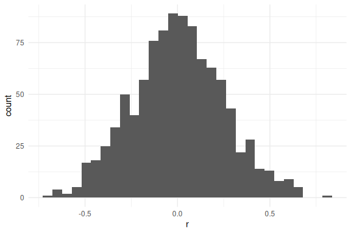
<p class="caption">
<span id="fig:stochGrowthRate"></span>Figure 6.1: A normal distribution
of potential r values
</p>

When using the equation above to calculate population at time *t* + 1
(*N*<sub>*t* + 1</sub>) from the population at time *t*
(*N*<sub>*t*</sub>), one would draw a random *r*<sub>*m*</sub> value
from this distribution. Sometimes *r*<sub>*m*</sub> will be high, other
times it will be low, most of the time it will be from around the middle
of the distribution.

Learning outcomes:

- Increased competence in using Excel formulae for mathematical
  modeling.
- Understanding the concept of stochasticity in simple population
  models.
- Competence in using mathematical models in Excel to strengthen own
  understanding of biological processes.
- Understanding how stochasticity relates to (i) uncertainty in the
  prediction of population trajectories and (ii) probability of (local)
  extinction.

## 6.2 Your task

Use the Excel worksheet,
[StochasticPopulationGrowth.xlsx](https://www.dropbox.com/s/1wpixbpgwlh54f0/StochasticPopulationGrowth.xlsx?dl=1),
to study how stochastic population growth works with this simple model.

If *r*<sub>*m*</sub> is drawn from a distribution with mean 0.05 and
variance 0.1, then most years are positive but some are negative. This
means a population can grow on average yet still crash by chance,
especially when starting size is small.

1.  Use Excel formulae to calculate deterministic population size
    through time (20 generations, with starting population of 100),
    linking to the mean finite population growth rate.
2.  Use charts to plot the results. (you already did this last time!)
3.  Use a formula to generate a column of stochastic *r*<sub>*m*</sub>
    values, based on a chosen mean and variance. In English versions of
    Excel the function may be written either as
    `=NORM.INV(RAND(), $F$10, SQRT($F$11))` (newer versions) or
    `=NORMINV(RAND(), $F$10, SQRT($F$11))` (older versions), while in
    Danish Excel it appears as `=NORMINV(SLUMP(); $F$10; KVROD($F$11))`.
    If you encounter errors, check whether your copy of Excel expects
    commas or semi-colons as argument separators and adjust the formula
    accordingly.
4.  Use the same procedure as before, to create a stochastic population
    size vector (stochastic N). Remember to convert *r*<sub>*m*</sub> to
    *λ* by taking the exponential.
5.  Compare the two trajectories using a chart.
6.  Try altering initial population size, mean population growth, and
    the amount of stochasticity (Variance).
7.  Extinction occurs when N ≤ 0. What happens to extinction risk as
    stochasticity (variance) increases? What happens when initial N is
    small? Does the population ALWAYS survive if the population growth
    rate, *r*<sub>*m*</sub> is &gt; 0?

Note: Excel re-randomises the random numbers every time you change any
cell in the sheet. This is OK, and allows you to explore a stochastic
simulation many times.

## 6.3 Simulations in R

Excel is of limited use to really get a feel for this. For the next part
we’ll use *R*.

If you already have R on your computers you can play along, otherwise
take a look at my demonstration in class. I will show how you can use
this simulation approach to estimate extinction risk and how this is
related to starting population size, mean lambda, and the amount of
stochasticity.

You can copy/paste the code below into *R*.

The output of the modelling is shown in Fig.
<a href="#fig:stochProjection">6.2</a>

Copy-and-paste the code below into a text file (or directly into *R*).

The final line of the code (`nExtinct/nTrials`) gives you an estimate of
extinction probability - the proportion of trials that lead to a
population size of 1 (or less).

Modify the simulation settings to explore what happens to (i) the plot
of population growth and (ii) extinction risk, when you vary `mean.r`
($\bar{r\_m}$), the amount of stochasticity
(*σ*<sub>*r*<sub>*m*</sub></sub><sup>2</sup>) (`var.r`), and the number
of generations (`nGen`).

    #Simulating stochastic geometric population growth rate

    #Simulation settings (try changing these)
    mean.r = 0.05 # the mean value of r
    var.r = 0.1 # the variance in r (stochasticity)
    startPop = 10 # pop size at start
    nGen = 50 # number of generations
    nTrials = 100 # number of repeated simulations

    ##########################################################
    #If you are unfamiliar with R, don't edit below this line!
    ##########################################################

    pseudoExtinction = 1

    # First randomly generate some r values
    rValues <- matrix(rnorm(nTrials * nGen, 
                            mean = mean.r, 
                            sd = sqrt(var.r)),
                      ncol = nTrials,
                      nrow = nGen)

    # Use a histogram to see what they look like 
    # (uncomment the line below)
    # hist(rValues,col="grey",main="")

    # Now run the simulations to see what the resulting 
    #population growth looks like
    trials = matrix(data = NA, nrow = nGen, ncol = nTrials)
    for (j in 1:nTrials) {
      popSize = startPop
      for (i in 2:nGen) {
        stoch.r = rValues[i, j]
        popSize = append(popSize, popSize[i - 1] * exp(stoch.r))
      }
      trials[, j] = popSize
      rm(popSize)
    }

    #Calculate probability of (pseudo)extinction
    minvals <- apply(trials, 2, min)
    nExtinct <- length(minvals[minvals <= pseudoExtinction])
    probExtinct <- nExtinct / nTrials
    cat("Pseudo-extinction probability:", round(probExtinct, 3), "\n")

    ## Pseudo-extinction probability: 0.08

### 6.3.1 Example stochastic trajectories

    #Make a plot of the population trajectories
    plot(
      1:nGen,
      log(seq(0.1, max(trials), length.out = nGen)),
      type = "n",
      axes = F,
      xlab = "Time",
      ylab = "log(N)",
      ylim = log(c(0.1, 100000))
    )
    matlines(log(trials),
             col = "#FF234520",
             lty = 1,
             lwd = 3)
    axis(1)
    axis(2,
         at = log(c(0.1, 1, 10, 100, 1000, 10000, 100000)),
         labels = c(0.1, 1, 10, 100, 1000, 10000, 100000))
    abline(h = log(pseudoExtinction), lty = 2)

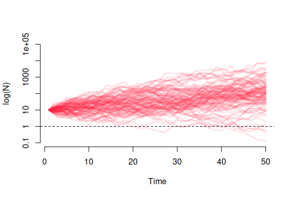
<p class="caption">
<span id="fig:stochProjection"></span>Figure 6.2: An example of
stochastic population projection (100 simulations for 50 generations)
</p>

## 6.4 Things to try

Work through these experiments and note what happens to (a) the plot and
(b) the extinction probability each time.

1.  Run the code as-is. Note the extinction probability and the spread
    of trajectories.
2.  Keep `mean.r = 0.05` but increase `var.r` to **0.5**. How does
    extinction risk change?
3.  Reset `var.r = 0.1`, then reduce `startPop` from 10 to **3**. Does
    starting population size matter?
4.  Set `mean.r = 0.0` (population neither growing nor shrinking on
    average). Is extinction certain, unlikely, or somewhere in between?
5.  **Challenge:** find a combination of `mean.r` and `var.r` where
    `mean.r > 0` but extinction probability exceeds 0.5. What does this
    tell you?

## 6.5 Questions

- What is the main difference between deterministic and stochastic
  population growth models?
- Describe how incorporating randomness into the stochastic model makes
  it more realistic for understanding real-world populations.
- Simulate a scenario where two populations with identical growth rates
  experience different outcomes due to stochastic factors. Explain the
  implications of these findings.
- What can this stochastic model tell us about extinction risk and
  population size?
- What can this stochastic model tell us about extinction risk and
  environmental variation?

## 6.6 Takeaways

- Stochasticity introduces variability in trajectories.
- Even when the average growth rate is positive, stochastic variation
  can create a real risk of extinction.
- Small populations are more vulnerable to random declines and
  extinction.
- The variance of *r* can be as important as its mean for long-term
  population persistence. This is why conservationists worry about
  increasing environmental variability, not just declining average
  conditions.
- Running a model many times (as in the R simulation) reveals the
  *distribution* of possible outcomes — a much richer picture than any
  single trajectory provides.

<!--chapter:end:2_03_StochasticGrowth.Rmd-->

# 7 Basic logistic population growth

## 7.1 Background

In nature, populations can’t grow indefinitely. They eventually reach an
upper limit, known as the *carrying capacity* (*K*), which represents
the maximum number of individuals an environment can support. Factors
like available resources, competition, predation, and disease set this
limit.

The **logistic growth model** accounts for this limitation and provides
a more realistic picture of population growth. Unlike simpler models,
such as exponential growth, that assume unlimited resources, the
logistic model reflects how populations slow their growth as they
approach the carrying capacity. When the population is small, it can
grow quickly, but as it gets closer to the limit, the growth rate slows
down. When the population is at carrying capacity the population will
not grow (birth rates = death rates).

The model is described by the following equation:

$N\_{t+1} = N\_{t} + r\_{m} N\_{t} \left(1 - \frac{N\_{t}}{K}\right)$

Where:

- *N*<sub>*t* + 1</sub> is the population size at the next time step.
- *N*<sub>*t*</sub> is the current population size.
- *r*<sub>*m*</sub> is the intrinsic growth rate, or the maximum
  possible per capita population growth rate.
- *K* is the carrying capacity.

In this equation, the term $\left(1 - \frac{N\_t}{K}\right)$ slows
population growth as the population size *N*<sub>*t*</sub> approaches
*K*. If *N*<sub>*t*</sub> = *K*, the population stops growing.

As growth rates increase beyond a certain point, the population can
exhibit more complex behaviours. At higher growth rates, populations may
overshoot the carrying capacity, leading to oscillations as they
fluctuate around it. In some cases, the population may show what’s
called deterministic chaos. This means that while the population
fluctuates unpredictably, the system itself is not random — small
changes in initial conditions or growth rates can lead to vastly
different outcomes.

This Excel-based exercise will help you explore how changes in the
growth rate and carrying capacity affect population dynamics. Though
simple, the logistic model provides valuable insights into how
populations stabilize, fluctuate, and respond to environmental limits.

Learning outcomes:

- Increased competence in using Excel formulae for mathematical
  modeling.
- Understanding the parameters of the logistic population growth model.
- Understanding how strikingly different types of population dynamics
  can result from the same (logistic) model simply by varying the
  population growth rate parameter.
- Understanding the concept of *deterministic chaos* and how it is
  different from randomness.
- Competence in using mathematical models in Excel to strengthen own
  understanding of biological processes.

## 7.2 Worked example

### 7.2.1 Inputs

- `Initial N = 10`
- `r_m = 0.8`
- `K = 200`

### 7.2.2 Steps

1.  Enter these values in the parameter cells.
2.  Recalculate the model through time.
3.  Inspect both graphs: population size through time and per-capita
    growth vs population size.

### 7.2.3 Output and interpretation

The population grows quickly at first, then slows as it approaches `K`.
This produces a sigmoidal curve and a per-capita growth rate that
declines linearly with `N`.

## 7.3 Your Task

In this exercise, you will explore how changes in key parameters affect
population dynamics using the logistic growth model. Follow the steps
below to guide your analysis.

1.  **Download the Excel File**  
    Download and open the Excel file:
    [`Basic Logistic Growth.xlsx`](https://www.dropbox.com/s/oxxyyn4zf4wsvkg/Basic%20Logistic%20Growth.xlsx?dl=1).

2.  **Familiarise Yourself with the Spreadsheet**  
    In the file, you’ll see three sections:

    - **Pink Block**: This is where you will input and adjust the model
      parameters.
    - **Graphs**: These display how the population behaves over time and
      in relation to the parameters you adjust.

3.  **Understand the Parameters**  
    In the *pink block*, you will find the key parameters of the
    logistic growth model:

    - `Initial N`: The starting population size at time 1 (default =
      10).
    - `r_m`: The maximum per capita population growth rate (default =
      0.8).
      - If *r*<sub>*m*</sub> &gt; 0, the population grows.
      - If *r*<sub>*m*</sub> &lt; 0, the population shrinks.
      - The population size cannot fall below zero.
    - `K`: The carrying capacity of the population (default = 200).

4.  **Explore the Model**  
    Use the following steps to guide your exploration of population
    dynamics:

### 7.3.1 Graph 1: Population Size Through Time

- **Step 1**: Examine the default settings in Graph 1, where `Initial N`
  = 10, `r_m` = 0.8, and `K` = 200.

  - What is the maximum population size in relation to the carrying
    capacity?

    <!-- For low values of $r_m$ The maximum population size should be equal to the carrying capacity, so around 200. -->

  - At what time does the population reach its maximum size?

    <!-- The population reaches its maximum size relatively quickly, around 17 time steps. -->

- **Step 2**: Increase the carrying capacity (`K`) to 300.  
  **Prediction**: What do you expect to happen to the population size
  over time?

  <!-- The maximum population size should increase to around 300. -->

  **Test**: How does increasing `K` affect the maximum population size
  and the time taken to reach it?

  <!-- Increasing `K` results in a higher maximum population size, but the time to reach it remains roughly the same. -->

- **Step 3**: Halve the growth rate (`r_m`) to 0.4.  
  **Prediction**: How will this change affect the population’s growth
  and the time it takes to reach the maximum population size?  
  <!-- The population will grow more slowly, so it will take longer to reach the carrying capacity. -->

  **Test**: What do you observe in the graph?

  <!-- The population takes about twice as long to reach the carrying capacity (roughly 40 time steps). -->

- **Step 4**: Increase `r_m` to 1.8.

  - How does the population size change over time?

    <!-- The population overshoots the carrying capacity, reaching a size larger than `K`, then starts fluctuating around `K`. -->

  - How does the maximum population size compare to the carrying
    capacity?

    <!-- The population temporarily exceeds the carrying capacity, showing oscillations above and below `K`. A common misconception is that `K` is the maximum population size, but this is not true.-->

  - How would you describe the dynamics of this population (e.g.,
    overshoot, oscillations)?

    <!-- The dynamics show damped oscillations, where the population overshoots and then oscillates before eventually settling close to `K`. -->

- **Step 5**: Experiment with higher values for `r_m` (e.g., 2.0, 2.8,
  2.9, 3.0).

  - How do the population dynamics change as `r_m` increases?

    <!-- As `r_m` increases, the oscillations become larger and more pronounced, leading to chaotic behaviour at higher values. -->

  - What happens when `r_m` is 2.8 or 3.0[1]? Are the dynamics
    predictable or chaotic?

    <!-- For `r_m` around 2.8, the population enters chaotic oscillations. The population fluctuates unpredictably around `K` with no clear pattern. -->

- **Step 6**: Compare the population trajectory for populations with
  `r_m` = 2.8 and `r_m` = 2.81, and then fix `r_m` at 2.8 but vary the
  initial population size by a small amount.

  - How sensitive are these populations to small changes in `r_m` or the
    initial population size?

    <!-- Very sensitive. Small changes in `r_m` or the initial population size result in dramatically different trajectories due to the chaotic nature of the system at high `r_m`. -->

  - Would these populations be easy or hard to predict?

    <!-- They would be very difficult to predict because of the chaotic dynamics. Even tiny changes lead to unpredictable outcomes. -->

  - What kinds of species have high population growth rates like this?
    How might this relate to managing pest species or diseases?

    <!-- Species with high growth rates, like locusts or certain pathogens, can display chaotic or rapid fluctuations, making them difficult to manage. This unpredictability is a challenge for population managers or those controlling pests and diseases. -->

### 7.3.2 Graph 2: Per Capita Growth Rate vs. Population Size

- **Step 1**: Examine Graph 2 with the default settings (`Initial N` =
  10, `r_m` = 0.8, `K` = 200).
  - How does the per capita growth rate change as the population size
    increases?

    <!-- The per capita growth rate decreases linearly as the population size increases. -->

  - Where does the per capita growth rate cross the x-axis (population
    size)?

    <!-- The per capita growth rate crosses the x-axis when the population size reaches the carrying capacity (`K`), which in this case is 200. -->
- **Step 2**: Modify the carrying capacity (`K`) to 300 and observe the
  changes in Graph 2.
  - How does increasing the carrying capacity affect where the per
    capita growth rate crosses the x-axis?

    <!-- Increasing the carrying capacity shifts the point where the per capita growth rate crosses the x-axis to 300. -->

  - Does the slope of the per capita growth rate change when you alter
    `K`?

    <!-- No, the slope remains the same, but the intercept on the x-axis moves to the new carrying capacity. -->
- **Step 3**: Change `r_m` to 1.8 and observe how the graph is affected.
  - How does increasing `r_m` affect the shape of the curve?

    <!-- The slope of the line becomes steeper, indicating that the per capita growth rate decreases more rapidly as the population increases. -->

  - Does the intercept on the x-axis change when you increase `r_m`?

    <!-- No, the intercept on the x-axis (carrying capacity) remains at `K`, which is still 200, but the y-intercept increases due to the higher growth rate. -->
- **Step 4**: Experiment with different values for `K` and `r_m`.
  - How do changes in `K` and `r_m` together affect the graph?

    <!-- Increasing `K` shifts the x-axis intercept further to the right, while increasing `r_m` makes the slope steeper and increases the y-intercept. -->

### 7.3.3 Reflection on Graph 2

- **Step 5**: Compare the per capita growth rate in **Graph 2** to the
  population size over time in **Graph 1**. **Questions**:
  - How are the two graphs connected?

## 7.4 Takeaways

- Logistic growth captures density dependence through the carrying
  capacity *K*.

- High growth rates can cause overshoot, oscillations, or chaos in
  discrete-time models.

- Per-capita growth declines linearly with population size in the
  logistic model.

  <!-- The decline in the per capita growth rate in Graph 2 reflects the slowing population growth shown in Graph 1. As the population size approaches `K` in Graph 1, the per capita growth rate approaches zero in Graph 2. -->

  - What would the per capita growth rate look like for a population
    experiencing exponential growth instead of logistic growth?

    <!-- In exponential growth, the per capita growth rate would remain constant, so the line would be horizontal, not declining with population size. -->

These steps help you visualise how population size and per capita growth
rate are interrelated, reinforcing the concepts behind logistic
population growth.

These two graphs are different ways to visualize the same model.

It is important that you can make the connections between these graphs.

How would the same plots look for regular exponential growth?

Some useful keywords:

- Oscillation
- Damped oscillation
- Cycle/cyclic dynamics
- Stable-limit cycle (2-point, 3-point limit cycle)
- Chaos/Chaotic dynamics
- Unpredictable/predictable

## 7.5 Questions

- In the logistic growth model, what happens to the population growth
  rate as the population size approaches the carrying capacity (*K*)?
  How does this lead to population stability?

  <!-- As the population approaches $K$, the growth rate decreases due to the term $\left(1 - \frac{N_t}{K}\right)$ in the model. This slowing of growth continues until the growth rate reaches zero at $K$. The rate at which the population approaches $K$ depends on the intrinsic growth rate ($r_m$). Higher $r_m$ values result in faster growth and potentially more oscillations or overshoots around $K$, while lower $r_m$ values lead to a smoother approach to stability. -->

- In the logistic growth model, what factors can cause a population to
  overshoot its carrying capacity temporarily? How does the population
  respond to such overshooting?

  <!-- Factors such as a high intrinsic growth rate ($r_m$) or a delay in density-dependent effects can cause overshooting. After overshooting, the population may oscillate around the carrying capacity before stabilizing, or in extreme cases, exhibit chaotic behaviour. -->

- How can a ballpark knowledge of maximum per capita population growth
  rate (*r*<sub>*m*</sub>) be useful to a population manager?

  <!-- Knowing $r_m$ helps a manager anticipate the growth rate of the population under optimal conditions, which informs decisions about the timing of interventions (e.g., pest control, species reintroduction). It also helps predict whether the population will exhibit stable dynamics, oscillations, or chaotic behaviour, which is critical for planning and managing populations effectively. -->

- What are the key assumptions of the logistic growth model, and how
  might these assumptions limit its real-world application?

  <!-- The logistic model assumes that the carrying capacity ($K$) is constant, resources are evenly distributed, and environmental conditions do not change. In reality, carrying capacity can fluctuate due to factors like climate change, resource availability, or human impact, which may limit the model’s predictive accuracy in dynamic ecosystems. -->

## 7.6 Optional: Do this in R.

You can implement this model in R as follows. In this code, I have added
a line which ensures that population size cannot be negative.

    # Parameters
    r_m <- 2.9  # intrinsic growth rate
    K <- 1000   # carrying capacity
    N0 <- 10    # initial population size
    timesteps <- 50  # number of time steps

    # Initialize population vector
    population <- numeric(timesteps)
    population[1] <- N0

    # Initialize per capita growth rate vector
    # Length of one less than population, as it's based on changes
    per_capita_growth <- numeric(timesteps - 1)  

    # Loop to calculate population at each time step
    for (t in 2:timesteps) {
      # Logistic growth model equation
      population[t] <- population[t-1] + 
        (r_m * population[t-1]) * (1 - (population[t-1] / K))
      
      # Ensure population doesn't go negative
      if (population[t] < 0) {
        population[t] <- 0
      }
      
      # Calculate per capita growth rate for the previous time step
      # (undefined if the previous population was zero)
      if (population[t-1] > 0) {
        per_capita_growth[t-1] <- (population[t] -
                                     population[t-1]) / population[t-1]
      } else {
        per_capita_growth[t-1] <- NA
      }
    }

    par(mfrow=c(1,2))
    # Plot 1: Population size through time
    plot(1:timesteps, population, type = "o", col = "blue", 
         xlab = "Time", ylab = "Population size",
         main = "Population Size through Time (Logistic Growth Model)")

    # Plot 2: Per capita growth rate vs population size
    plot(population[1:(timesteps-1)], per_capita_growth, 
         type = "o", col = "red", 
         xlab = "Population Size", 
         ylab = "Per Capita Growth Rate",
         main = "Per Capita Growth Rate vs Population Size")

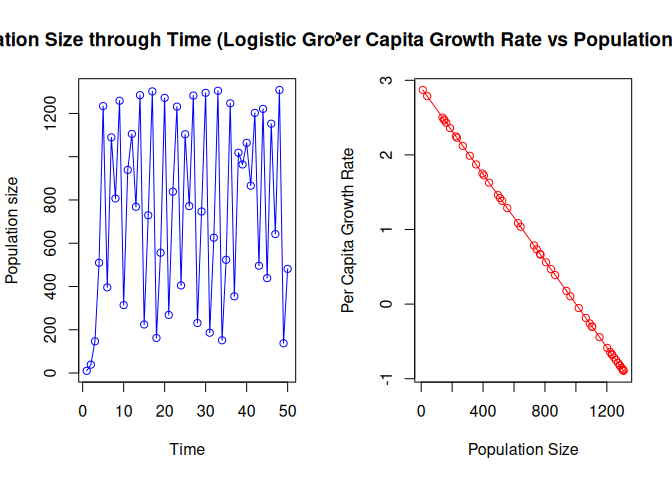

<!--chapter:end:2_04_BasicLogisticGrowth.Rmd-->

# 8 Deeper into Logistic Growth

## 8.1 Background

The logistic and exponential growth models are closely related and serve
as fundamental tools in understanding population dynamics.

- The **exponential (geometric)** growth model assumes that populations
  grow without any environmental constraints, leading to unlimited
  growth.
- The **logistic** growth model, on the other hand, incorporates
  environmental limits, specifically the **carrying capacity** (*K*),
  which represents the maximum number of individuals the environment can
  support.

### 8.1.1 Linking Logistic and Exponential Growth Models

The logistic growth model is represented by the following equation (Eqn.
5.2 in Neal):

$\frac{\delta N}{\delta t}=r\_m N\left(1-\frac{N}{K}\right)$

In this model, as the population size *N* approaches the carrying
capacity *K*, the term $\left(1 - \frac{N}{K}\right)$ decreases, slowing
the population growth rate until it reaches zero when *N* = *K*.

However, if we remove the constraint of a carrying capacity (i.e., set
*K* = ∞), the model simplifies to the exponential growth equation:

$\frac{\delta N}{\delta t}=r\_m N\left(1-\frac{N}{\infty}\right)$

which simplifies to

$\frac{\delta N}{\delta t}=r\_m N\left(1-0\right)$

which simplifies to

$\frac{\delta N}{\delta t}= r\_m N$

This is the familiar **geometric (exponential) growth equation** (Eqn.
4.6 in Neal), which assumes unlimited resources and continuous
population growth.

**Take-home Message: The logistic and exponential growth models are
closely related. By setting *K* = ∞, we transition from the logistic
model to the exponential model.**

Learning outcomes:

- Increase competence in using Excel for mathematical modeling.
- Understand the relationship between exponential and logistic growth
  models.
- Learn how models can be adjusted to explore different biological
  phenomena.
- Develop skills in visualising and interpreting model outputs from
  different perspectives.
- Strengthen understanding of biological processes by applying
  mathematical models.

## 8.2 Worked example

### 8.2.1 Inputs

- `r_m = 1.2`
- `K = 200`
- Worksheet: `BasicLogistic`

### 8.2.2 Steps

1.  Set `r_m` and `K` in the parameter block.
2.  Observe Figure 1 (population through time).
3.  Observe Figure 2 (per-capita growth vs `N`).
4.  Observe Figure 3 (total growth vs `N`).

### 8.2.3 Output and interpretation

You should see a smooth approach to *K* in Figure 1, a straight
decreasing line in Figure 2 that crosses zero at *K*, and a single
peaked curve in Figure 3 with a maximum near *N* = *K*/2.

## 8.3 Your Task

Download the Excel file
[`Deeper Into Logistic Growth.xlsx`](https://www.dropbox.com/s/4xq399z7skl1akv/Deeper%20into%20Logistic%20Growth.xlsx?dl=1).

Look at the `BasicLogistic` worksheet and work through the following
tasks:

**Task 1: Population Dynamics (Figure 1)**

1.  Experiment with different values of *r*<sub>*m*</sub> (e.g., 0.8,
    1.2, 1.8, 2.4, 2.7) and observe how the population dynamics change
    over time in **Figure 1**.

2.  Use the following terms to describe the dynamics you see:

    - **Oscillation**, **damped oscillation**, **stable cycle**,
      **2-point cycle**, **chaotic**, **unpredictable**,
      **predictable**.

**Task 2: Per Capita Growth Rate vs. Population Size (Figure 2)**

1.  Examine **Figure 2**, which shows the per capita growth rate as a
    function of population size at time *t*.

2.  Notice where the line intercepts the x- and y-axes.

    - What are these intercepts?
    - How do these intercepts relate to the values of *r*<sub>*m*</sub>
      and *K* that you have set?

3.  Try varying the values for *r*<sub>*m*</sub> and *K*, and note how
    the graph changes.

4.  On paper, sketch a graph of the per capita growth rate
    vs. population size for a logistic model with
    *r*<sub>*m*</sub> = 1.5 and *K* = 250. Then, verify your sketch by
    entering these values into the Excel model.

**Task 3: Population Growth Rate vs. Population Size (Figure 3)**

1.  **Figure 3** shows the overall population growth rate
    (*d**N*/*d**t*) — the change in population size per unit time.
    Adjust the values for *r*<sub>*m*</sub> and *K* and observe how
    **Figure 3** changes.

2.  Answer the following questions:

    - At what population sizes is the population growth rate 0
      (*d**N*/*d**t* = 0)?
    - At what population size is the growth rate maximized?

**Task 4: Comparison with Exponential Growth**

1.  Now, consider the differences between **logistic growth** and
    **exponential growth**. How would Figures 1, 2, and 3 change when
    considering exponential growth?

Sketch equivalent graphs for the exponential (geometric) growth model,
including:

- **Fig 1**: Population size (*N*) over time (*t*).
- **Fig 2**: Per capita growth rate ($\frac{1}{N} \frac{dN}{dt}$)
  vs. population size (*N*).
- **Fig 3**: Population growth rate ($\frac{dN}{dt}$) vs. population
  size (*N*)

1.  Look at the **`Exponential` worksheet** to see how close you were.

**Task 5: Adding a Time Lag**

1.  In the **`TimeLag` worksheet**, explore how adding a time lag to the
    logistic model affects population dynamics. This is the equation we
    are using: $\frac{d N}{d t}=r N\left(1-\frac{N\_{t-\tau}}{K}\right)$

2.  Adjust the formula in the Excel sheet to incorporate a time lag in
    the population size (*N*<sub>*t* − *τ*</sub>). Start with a small
    *r*<sub>*m*</sub> value that results in smooth convergence to *K* in
    the ordinary logistic model.

3.  Add a 1-year time lag and observe how this introduces cycling in the
    population dynamics. This exercise demonstrates how a simple life
    history trait (such as a time lag) can introduce complex dynamics,
    even when population growth rates are low.

## 8.4 Questions

- How does increasing or decreasing *r*<sub>*m*</sub> affect the shape
  and behaviour of the population time series in Figure 1? How does it
  change the per capita growth rate curve in Figure 2 and the population
  growth rate in Figure 3?

<!-- In Figure 1, as $r_m$ increases, the population grows more rapidly. For small values of $r_m$ (e.g., 0.8), the population slowly approaches the carrying capacity $K$. For higher values of $r_m$ (e.g., 1.8, 2.7), the population may overshoot $K$ and oscillate before stabilising, or it may exhibit chaotic behaviour if $r_m$ is large enough (e.g., above 2.5).
In Figure 2, increasing $r_m$ makes the slope of the line steeper. Higher $r_m$ values result in a higher per capita growth rate when the population size is small. However, the line still intercepts the x-axis at $K$, meaning that the carrying capacity doesn't change, but the rate at which the population reaches $K$ does.
In Figure 3, as $r_m$ increases, the overall population growth rate increases, with the peak growth rate shifting to a higher value. However, as the population approaches $K$, the growth rate still decreases to zero. -->

- What happens to the population dynamics when a time lag is introduced?
  A time lag could be caused by a long gestation period, or by the need
  to take a year out before breeding again.

<!--     Introducing a time lag in the feedback system (i.e., where the population size at a given time depends on the population size at a previous time step) typically leads to more complex and sometimes oscillatory dynamics:
     A time lag may cause the population to overshoot the carrying capacity and then oscillate around $K$. This happens because the time lag delays the response of the population to changes in resource availability, leading to a cycle of growth and decline.
  
-->

## 8.5 Takeaways

- Logistic and exponential growth are linked by the carrying capacity
  term.
- The shape of *d**N*/*d**t* and per-capita growth curves explains why
  oscillations occur.
- Time lags can destabilize otherwise stable dynamics.

<!--chapter:end:2_05_DeeperIntoLogistic.Rmd-->

# 9 Life tables and survivorship types

## 9.1 Background

Life tables are powerful analytical tools used in various fields to
understand and quantify mortality patterns and life expectancy within
populations. Originating in population biology and demography, life
tables have found extensive applications in epidemiology, human
mortality studies, and even product life-cycle management. By
systematically tracking and analysing the survival and mortality rates
of individuals within specific cohorts, life tables reveal essential
information about population dynamics, age-specific risks, and the
factors that influence longevity. As a result, life tables play a vital
role in shaping policies, making informed decisions, and gaining a
deeper understanding of the complex interplay between age, health, and
mortality.

The basic algebra used in life tables is explained in Neal Chapter 6 and
in Gotelli Chapter 3.

In addition to providing valuable insights into mortality patterns and
life expectancy, life tables also allow us to consider mortality
patterns in the context of distinct survivorship types that result from
the distribution of mortality risk through a life course. Survivorship
types are crucial in understanding the overall survival patterns and
demographic characteristics of different populations.

Three primary survivorship types are commonly identified, based on
survivorship curves on a log scale:

- Type I (Convex Curve): This survivorship type is characterized by a
  low mortality rate during early life, with an increase in mortality
  rates at older ages. It indicates that individuals in the population
  have a high probability of surviving to advanced ages, and the
  majority of deaths occur in older age groups. Type I survivorship is
  observed in humans and other long-lived species with strong parental
  care and relatively low early-life mortality.
- Type II (Straight Line): In this survivorship type, the mortality rate
  remains relatively constant across all age groups. It suggests that
  individuals have an approximately equal chance of dying at any age
  throughout their life. Type II survivorship is commonly observed in
  species where mortality rates are consistent, regardless of age. Some
  small mammals and birds exhibit this survivorship pattern.
- Type III (Concave Curve): Type III survivorship is characterized by
  high early-life mortality rates, followed by a decline in mortality at
  older ages. This pattern indicates that survival rates are low in the
  early stages of life, but those who survive the initial vulnerable
  period have a greater likelihood of reaching older ages. Type III
  survivorship is often seen in species that produce numerous offspring
  but provide limited parental care, where only a fraction of the
  offspring survive to adulthood.

By identifying and understanding these survivorship types, researchers
gain critical insights into the demographic structure of populations and
the selective pressures that influence survival and longevity.
Survivorship patterns play a significant role in shaping the dynamics of
populations and help scientists make informed decisions regarding
conservation efforts, healthcare planning, and population management
strategies.

Learning outcomes:

- Increased competence in using Excel formulae for mathematical
  modelling.
- Competence in using mathematical models in Excel to strengthen own
  understanding of biological processes.
- Understanding how life tables are calculated.
- Understanding the three types of survivorship curve and how they
  relate to mortality and survival probabilities (and their trajectories
  with age).
- Understanding the decline in the “force of selection”.

## 9.2 Worked example

### 9.2.1 Inputs

- Cohort at age 0: `500`
- Survivors to age 1: `352`

### 9.2.2 Steps

1.  Calculate survivorship at age 1: *l*<sub>1</sub> = 352/500.
2.  Calculate survival probability from age 0 to 1:
    *g*<sub>0</sub> = 352/500.
3.  Calculate death probability in that interval:
    *q*<sub>0</sub> = 1 − *g*<sub>0</sub>.

### 9.2.3 Output and interpretation

- Survivorship at age 1: *l*<sub>1</sub> = 352/500 = 0.704
- Survival probability from age 0 to 1:
  *g*<sub>0</sub> = 352/500 = 0.704
- Death probability for that interval:
  *q*<sub>0</sub> = 1 − *g*<sub>0</sub> = 0.296

## 9.3 Your task

Download and open the Excel file
[`Life tables exercises.xlsx`](https://www.dropbox.com/s/ox0rk05zdwzrmwy/Life%20tables%20exercises.xlsx?dl=1).

The file has three worksheets (“*Life table*”, “*Survivorship Curves*”
and “*Gotelli Table 3.1 example*” (don’t worry if you don’t have the
text book).

### 9.3.1 Life table

Let’s start with “**Life table**”.

The aim now is to use Excel as a modelling tool to produce a life table.

I have provided some initial data collected from a cohort of animals. I
know how many individuals start each year (i.e. how many “**enter** an
interval”) and therefore I can see how many survive each year (i.e. how
many “enter the **next** interval). I also know how many (female) babies
(on average) are produced by each female.

Start by calculating survivorship (*l*<sub>*x*</sub>). Survivorship is
the **probability of survival to a particular age**. Therefore, at time
0, *l*<sub>0</sub> = 1, since everyone is alive at this point. The next
value (*l*<sub>1</sub>) must be calculated based on the number alive at
that point. In this case it is 352/500 = 0.704. You must generalize this
calculation into a formula that can be dragged to fill column `D` in the
worksheet. In algebraic form, the equation is
*l*<sub>*x*</sub> = *S*<sub>*x*</sub>/*S*<sub>0</sub>.

**Tip** You need to understand the use of the `$` symbol in Excel, and
how to drag the selected area to place the formula in the column.

Next, you can calculate age-specific **survival probability**. Note that
this is different from *l*<sub>*x*</sub>. Survival probability is simply
the probability that an individual will survive its current age class.
i.e., what is the probability that an individual currently aged 2 will
survive to become age 3. In this case, the 254/298 = 0.852. The
calculation is
*g*<sub>*x*</sub> = *l*<sub>*x* + 1</sub>/*l*<sub>*x*</sub>, or
*S*<sub>*x* + 1</sub>/*S*<sub>*x*</sub>.

From there you can calculate the age-specific **probability of death**.
This is simply 1 − *g*<sub>*x*</sub>: the probabilities of survival and
death **must** sum to 1.

Now complete the remaining columns *l*<sub>*x*</sub>*m*<sub>*x*</sub>
and *l*<sub>*x*</sub>*m*<sub>*x*</sub>*x*, and use them to calculate (a)
*R*<sub>0</sub>; (b) **Generation time**; and an approximation of *r*.

Refer to the sheet “*Gotelli Table 3.1 example*” if you get stuck (click
on the cells to see the formulae used there).

#### 9.3.1.1 Declining force of selection

The force of selection describes the relative importance of events that
happen during the life course on population growth (e.g. *R*0 or *r*).

To investigate this you can do a computer “experiment” by altering
reproduction at different ages. You can think of these as “what if?”
experiments. e.g. “What if there was a mutation that added 1 to
reproduction at age 0-1, or 1-2 etc.?”

Specifically, we can look at the effect of this experiment on *R*0 or
*r*, which are measures of **fitness**?

Try graphing your results as age vs. change in *R*0.

What you should see is that changes early in life matter more than
changes later in life.

### 9.3.2 Survivorship curves

In the second part of this class we focus on the **Survivorship Curves**
worksheet.

The aim here is to start to explore how different types of organisms
with different ways of life (“**life history strategies**”) can have
qualitatively different kinds of life tables. The most important thing
to observe is the difference in **survivorship curves**
(*l*<sub>*x*</sub>). These changes become very obvious when you plot the
log-transformed survivorship against age.

In the Excel worksheet, I have placed tables showing the fate of cohorts
of three populations of different species. Your job now is to calculate
the survivorship curve (*l*<sub>*x*</sub>) for these species, take the
natural log (using formula `=LN(C3)`, for the first population,
`=LN(J3)` for the second population etc.

You should see that the graphs automatically fill up with lines. These
show Type I, II and III survivorship.

Next, calculate the age-specific probability of survival
(*g*<sub>*x*</sub>) and of death (*q*<sub>*x*</sub>). This is the
proportion of individuals that **enter** the age interval that **do**
survive and **do not** survive to the end of the interval, respectively.
You can calculate it as `=B4/B3` and `=1-(B4/B3)` for the first row of
the first population.

Plot graphs of these.

Make sure that you are (1) able to “diagnose” survivorship type from
looking at a graph of *l**n*(*l*<sub>*x*</sub>) vs *x* (2) able to
sketch a cartoon of mortality trajectory if shown one of these
survivorship curve.

## 9.4 Questions

1.  What are the three main types of survivorship curves, and which
    organisms typically exhibit each type?

<!-- 
Type I curves indicate high survival in early life and high mortality at older ages (e.g., humans). Type II curves show constant mortality throughout life (e.g., birds). Type III curves represent high juvenile mortality with survivors living long lives (e.g., fish, plants).
-->

1.  What does a net reproductive rate (R0) of less than 1 signify for a
    population?

<!-- An R0 of less than 1 indicates that, on average, each individual in the population is replaced by fewer than one offspring, suggesting that the population is declining over time. -->

1.  How does the shape of a survivorship curve reflect trade-offs in
    life history strategies, typically?

<!-- Type I curves suggest investment in offspring with low juvenile mortality, typical in species with fewer offspring and greater parental care. Type III curves reflect species that produce many offspring but provide little care, leading to high early mortality. -->

1.  How is survivorship (*l*<sub>*x*</sub>) different from survival
    probability (*g*<sub>*x*</sub>)?

<!-- Survivorship (\(l_x\)) and survival probability (\(g_x\)) are related concepts in life tables, but they measure different aspects of survival in a population.

- **Survivorship (\(l_x\))**: This is the proportion of individuals that survive from birth (or the start of an age class) to a specific age class \(x\). It provides a cumulative measure of survival across multiple age classes. For example, if \(l_0 = 1\) (all individuals alive at birth), then \(l_1\) might be 0.8 (indicating that 80% of individuals survive to the first age class). \(l_x\) declines with increasing age as more individuals die.

- **Survival Probability (\(g_x\))**: This is the probability that an individual who is alive at age class \(x\) will survive to age class \(x+1\). It measures survival over a single time step, unlike survivorship, which is cumulative. For example, if 80% of individuals survive from age 1 to age 2, then \(g_1 = 0.8\).

In short, **survivorship** tracks the cumulative proportion of individuals surviving to a given age class, while **survival probability** reflects the likelihood of surviving just one more time step. \(l_x\) is cumulative across age classes, whereas \(g_x\) is specific to the transition from one age class to the next. -->

1.  How does altering reproduction or survival/mortality at different
    ages affect *R*<sub>0</sub> and population growth rate?

<!-- 
   - Changes early in life have a larger impact on $R_0$ and population growth rate than changes later in life, due to the declining force of selection.-->

## 9.5 Takeaways

- Life tables summarize age-specific survival and reproduction in a
  compact, comparable way.
- Survivorship type reflects different life history strategies and
  mortality schedules.
- Early-life changes usually have the greatest impact on *R*<sub>0</sub>
  and population growth.

<!--chapter:end:2_06_LifeTables.Rmd-->

# 10 Matrix population modelling

## 10.1 Background

Matrix population models are powerful and widely used tools in
population ecology that offer a comprehensive framework for studying the
dynamics of structured populations. Unlike simple growth models that
assume homogeneous populations, matrix population models take into
account the variation in vital rates, such as birth, death, and growth
rates, across different life stages or age classes. These models are
particularly well-suited for species with distinct life stages, such as
plants with seedlings, juveniles, and adults, or animals with different
age classes. Matrix population models use transition matrices to
represent the relationships between different age classes and how
individuals move from one stage to another over time. By incorporating
demographic data and life-history traits, matrix population models
provide a more realistic and detailed understanding of population
dynamics, making them invaluable for predicting the future trends of
populations and assessing their vulnerability to environmental changes
and management actions. In this practical, we will assume that one
matrix projection corresponds to one year. Each matrix element therefore
represents survival, growth, or reproduction over a one-year interval.

This practical aims to give you a good understanding of the basics of
their construction and use.

Learning outcomes:

- Competence in constructing life cycle diagrams to represent the life
  history of real (or theoretical) organisms.
- Understanding how to parameterise life-cycle diagrams and use them to
  produce a matrix population model.
- Competence in using R to calculate a population growth rate and
  project a population.
- Understanding how to connect these results to a management question.
- Understanding the logic of “*in silico* experiments” to investigate a
  biological question (mathematical modelling).

## 10.2 Your task

1.  First, think of an organism you would like to model the dynamics of.
    It could be a mammal, a bird, a fish, insect or tree … real or
    fantasy.

2.  Think about their life cycle, and draw it as a life cycle diagram
    with circles indicating the stages and arrows representing
    transitions between stages (e.g. growth) and reproduction. Keep it
    simple if you can (max. 3 stages).

Things to think about:

- Is it age based or stage based?
- How many stages are there? Can you simplify (e.g. instead of age in
  years, you could use life stage)
- If using stages, how are stages defined? E.g. by size, by development,
  etc.
- Are the survival and fecundity higher in earlier or later life?
- Does the organism ever skip stages?
- Can the organism move “backwards” through the life cycle?

1.  Next to the arrows, write values for survival probability and
    fecundity (number of babies) using your biological knowledge. It is
    fine to use “ballpark” estimates.

Here’s an example for a fictional organism.


1.  Now you can turn this diagram into a matrix population model by
    filling in a square of survival/fecundity values.

The life cycle shown above looks like this (below). The matrix describes
transitions from time *t* to time *t* + 1, where one time step
corresponds to one year.

Interpretation note: **columns are stages at time *t* (from)** and
**rows are stages at time *t* + 1 (to)**.

$$
A = \begin{bmatrix}0.3&8&2 \\0.1&0.5&0 \\0&0.4&0.4 \\\end{bmatrix}
$$

## 10.3 Using R for matrix modelling

Working with matrices is very tedious in Excel. However, in R you can
use this information to predict the future dynamics of the population,
and estimate population growth rate, and generation time etc.

Open up **RStudio**, and let’s see if we can predict future dynamics.
First you will need to install a package called `popdemo`.

### 10.3.1 Package setup

If you are running this chapter in a fresh R session, you might need to
install and/or load the `popdemo` package.

    install.packages("popdemo")

You only need to install packages once. After that you can load the
package for use by using the `library` function.

    library(popdemo)

You can put your matrix into R like in the example below (change the
numbers to match YOUR model). If your model has fewer, or more, stages
then you will need to modify the code a bit. Ask for help if you get
stuck.

    A <- matrix(c(
      0.3, 8.00, 2.00,
      0.1, 0.50, 0.00,
      0.0, 0.40, 0.40
    ), ncol = 3, byrow = TRUE)

**Important: interpret matrix elements over the chosen time step**

In matrix population models, all transitions occur over a fixed time
interval. In this practical, we use a 1-year time step, so:

- survival probabilities are annual
- fecundity is offspring per individual per year
- λ is growth per year

## 10.4 Projecting the population

And now you can use the project function to project what happens to the
population, then plot it. Look at what happens if you log or don’t log
the y-axis. First you need to define an initial starting population
structure.

In my example, I have 3 stages, so I have 3 values for the initial
population sizes. Then I use the `popdemo` function `project` to do a
population projection for 10 years (10 time steps). Each step represents
one annual cycle of survival, growth, and reproduction.

    initial <- c(10, 5, 3)
    pr <- popdemo::project(A, vector = initial, time = 10)

Take a look at `pr`, the projected population. This gives you the total
population size, and below that the population sizes in each stage.

    pr

    ## 1 deterministic population projection over 10 time intervals.
    ## 
    ##  [1]  18.0000  55.7000  58.4300  85.2570 111.5643 151.4946 203.2634 273.8278
    ##  [9] 368.4012 495.8572 667.3121

You can access the population sizes of the different stages using
`vec(pr)`.

    vec(pr)

    ##             S1       S2        S3
    ##  [1,]  10.0000  5.00000  3.000000
    ##  [2,]  49.0000  3.50000  3.200000
    ##  [3,]  49.1000  6.65000  2.680000
    ##  [4,]  73.2900  8.23500  3.732000
    ##  [5,]  95.3310 11.44650  4.786800
    ##  [6,] 129.7449 15.25635  6.493320
    ##  [7,] 173.9609 20.60267  8.699868
    ##  [8,] 234.4093 27.69742 11.721013
    ##  [9,] 315.3442 37.28964 15.767375
    ## [10,] 424.4552 50.17924 21.222808
    ## [11,] 571.2161 67.53514 28.560821

Let’s plot this…

    pop <- vec(pr)
    matplot(pop, type = "l", log = "y")
    legend("topleft", legend = colnames(pop), 
           col = 1:ncol(pop), lty = 1:ncol(pop))

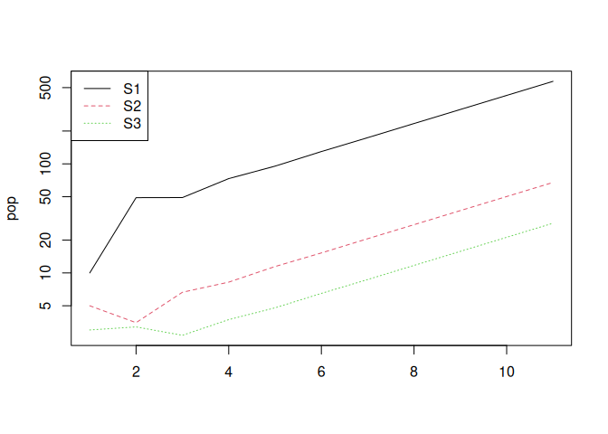

You should see that the population increases exponentially. The
population growth rate is the so-called “*dominant eigenvalue*” of the
matrix **A**.

We can ask R for the *eigen values* and *eigen vectors*. These are the
population growth rate (*λ*) and the stable stage distribution (*SSD*)
and the reproductive values (*RV*) of the different stages. *SSD* is the
expected *proportion* of individuals in the different stage classes at
equilibrium (i.e. the long-term time frame) and *RV* is the expected
number of future offspring by individuals in each stage.

Because our projection interval is one year, λ represents the annual
population growth rate. You can see that in this case, using my example
values the population is growing 34.58% per year.

    eigs(A)

    ## $lambda
    ## [1] 1.345824
    ## 
    ## $ss
    ## [1] 0.85599732 0.10120281 0.04279987
    ## 
    ## $rv
    ## [1] 0.4987772 5.2163301 1.0546939

## 10.5 Elasticity

Elasticity analysis is a way of analysing a matrix model to identify the
most important transitions to population growth. This is very important
in management and conservation when we ask questions like, “which parts
of the lifecycle should we focus on to preserve the population?”. The
mathematics of this are beyond this course, but in a nutshell, we are
adding a small value to the elements of the matrix one-at-a-time and
asking what difference this makes to population growth rate (lambda). We
then express that as a *proportion*, so that the elasticities sum up to
one and are easier to interpret. They can be calculated easily in R.

    popdemo::elas(A)

    ##            [,1]       [,2]       [,3]
    ## [1,] 0.09517264 0.30005511 0.03172421
    ## [2,] 0.33177932 0.19612796 0.00000000
    ## [3,] 0.00000000 0.03172421 0.01341654

What transition is most important to population growth, according to the
above?

## 10.6 Life table response experiment (LTRE)

These don’t have much to do with life tables (sorry, that’s confusing!).
The idea is very simple: you run “experiments” on your matrix model by
asking “what if” questions. For example, what would happen if we could
increase survival of the juveniles by 20%? what would happen if adults
are hunted more, and thus have a decreased survival by 60%? what would
happen if we provided supplemental food to reproducing females, and
increase fecundity by 50%? etc. Use your imagination!

In practice, we do that simply by modifying the matrix model. In the
following, I am looking at the effect of increasing fertility in adult
and senescent individuals by 50%:

    A <- matrix(c(
      0.3, 8.00*1.5, 2.00*1.5,
      0.1, 0.50, 0.00,
      0.0, 0.40, 0.40
    ),
    byrow = TRUE, nrow = 3
    )

    popdemo::eigs(A, what = "lambda")

    ## [1] 1.546586

    elas(A)

    ##            [,1]       [,2]        [,3]
    ## [1,] 0.08514005 0.32540118 0.028380016
    ## [2,] 0.35378119 0.16901684 0.000000000
    ## [3,] 0.00000000 0.02838002 0.009900705

## 10.7 Your turn…

Work through the above process for your own species.

1.  Do a projection,
2.  calculate (and interpret) lambda and elasticity,
3.  do an LTRE

### 10.7.1 An evolutionary experiment

You can think of lambda (population growth rate) as being a measure of
fitness. Imagine that some of your population had a mutation that caused
them to have, say, 1 extra baby, but at the expense of reduced survival
in one of the younger stages. Would this mutation persist in the
population? Do an LTRE to find out!

### 10.7.2 Questions

1.  In the graph showing log-transformed population size through time,
    what is the significance of the lines being straight after the
    transient phase?

<!-- When the population size is plotted on a logarithmic scale against time, and the lines become straight after the transient phase, it signifies exponential growth or decline in the population. A straight line on a log-transformed graph implies that the population is growing (or shrinking) at a constant rate, meaning the population growth rate has stabilized. --->

1.  Explain how an elasticity analysis of a matrix model can be used to
    inform the management of a threatened species.

<!-- 
Elasticity analysis measures the proportional sensitivity of the population growth rate to small changes in vital rates such as survival, growth, and reproduction. It identifies which transitions (demographic rates) have the greatest impact on the population's growth rate.

For the management of a threatened species, elasticity analysis can reveal the most critical life stages or vital rates to target for conservation efforts. For example:

If elasticity analysis shows that adult survival has the largest impact on population growth, conservation measures might focus on protecting adult individuals (e.g., through habitat protection or reducing human-induced mortality).
If juvenile survival has a high elasticity, efforts may be directed at improving the survival of juveniles, perhaps through habitat restoration or predator control.

By identifying the most influential life stages, managers can allocate resources more effectively, focusing on interventions that will have the greatest positive impact on population recovery.
-->

1.  What are some of the assumptions of a matrix population model?
    (Hint: some are similar to the assumptions of exponential/geometric
    growth models)

<!-- 
Matrix population models share some assumptions with simpler models like exponential or geometric growth models. Key assumptions include:

- Constant vital rates: The model assumes that survival, fecundity, and growth rates are constant over time. This is similar to the assumption of a constant growth rate in exponential models.
- Stable environment: The model assumes the environment does not change over time, affecting demographic rates in a predictable, constant way.
- Closed population: Like exponential and geometric models, matrix models often assume no immigration or emigration, meaning population changes are solely due to births and deaths.
No density dependence: Matrix models generally assume that vital rates are not affected by population size. This is akin to the assumption in exponential models where growth occurs without limits.

-->

## 10.8 Takeaways

- Matrix models link life history to population growth through
  structured vital rates.
- The dominant eigenvalue *λ* summarizes long-term growth, while
  eigenvectors capture stable structure and reproductive value.
- Elasticity and LTREs turn models into management and evolutionary
  experiments.

<!--chapter:end:2_07_matrixModels.Rmd-->

# 11 Pre- and Post-reproduction census

## 11.1 Background

Population growth estimates depend on when the census is taken relative
to reproduction. A pre-breeding census counts individuals before
reproduction; a post-breeding census counts them after reproduction.
This changes how survival and fecundity are represented in the
projection matrix, even if the underlying biology is the same.

Provided the conversion between the two census types is done correctly,
the population growth rate (*λ*) they produce is identical — census
timing is just a bookkeeping convention, not a biological difference.
However, it is easy to get the conversion wrong, and doing so *does*
change your estimate of *λ*. This chapter shows both: a correct
conversion (same *λ*), and a common mistake (different *λ*).

## 11.2 Learning outcomes

Learning outcomes:

- Explain the difference between pre-breeding and post-breeding census
  models.
- Convert a post-breeding matrix to a pre-breeding matrix.
- Recognise that a correct conversion leaves *λ* unchanged, and explain
  why.
- Identify how a mis-specified survival or fecundity term changes the
  resulting *λ* estimate.

## 11.3 Worked example

### 11.3.1 Inputs

We start with a **post-breeding census** matrix. In a post-breeding
census, individuals are counted right after breeding, so the fecundity
term for a stage is simply its fecundity scaled by *that stage’s own*
survival through the year (it has to survive the year in order to be
alive, and to breed, at the moment of census).

    p0 <- 0.2
    p1 <- 0.9
    p2 <- 0.6
    m2 <- 3.0
    m3 <- 6.0

    A1 <- matrix(c(0.0, m2 * p1, m3 * p2,
                   p0, 0.0, 0.0,
                   0.0,p1,0), byrow = TRUE, nrow = 3)

### 11.3.2 Steps

1.  Define survival and fecundity values.
2.  Build the projection matrix for one annual time step.
3.  Use the matrix for projection and comparison tasks below.

### 11.3.3 Output and interpretation

The resulting matrix encodes the post-breeding census assumptions for
transitions and fecundity over one year.

Now let’s correctly convert this to a **pre-breeding census** matrix. In
a pre-breeding census, individuals are counted just *before* breeding,
so two things change:

- Survival transitions shift by one stage, because an individual now has
  to survive through the year *before* being counted in the next stage
  at the census.
- Crucially, the fecundity term is no longer scaled by the *parent’s*
  survival (the parent doesn’t need to survive to be counted — the
  census happens before it would breed again). Instead, it is scaled by
  *p*<sub>0</sub>, the survival of the *newborn offspring* through to
  the pre-breeding census.

<!-- -->

    A2 <- matrix(c(0.0, m2 * p0, m3 * p0,
                   p1, 0.0, 0.0,
                   0.0,p2,0), byrow = TRUE, nrow = 3)

Compare population growth rates. This uses the `eigs` function from the
`popdemo` R package.

    (popdemo::eigs(A1, what = "lambda"))

    ## [1] 1.070261

    (popdemo::eigs(A2, what = "lambda"))

    ## [1] 1.070261

Notice that *λ* is (to rounding error) identical for `A1` and `A2`. This
is not a coincidence: when the conversion between census types is done
consistently, it only changes *how* the same underlying survival and
reproduction are represented in the matrix — it does not change the
biology, so it cannot change the population’s actual growth rate.

## 11.4 A common mistake

It is easy to get the pre-breeding conversion partly right and partly
wrong. A very common error is to correctly shift the *survival*
transitions to the next stage, but forget to also change the fecundity
term — i.e. to keep scaling fecundity by the parent’s own survival
(*p*<sub>1</sub>, *p*<sub>2</sub>) instead of switching to the offspring
survival (*p*<sub>0</sub>):

    A3 <- matrix(c(0.0, m2 * p1, m3 * p2,
                   p1, 0.0, 0.0,
                   0.0,p2,0), byrow = TRUE, nrow = 3)

    (popdemo::eigs(A3, what = "lambda"))

    ## [1] 1.863632

This looks like a small, easy-to-miss slip — only the fecundity row is
“wrong”, and the matrix still looks like a sensible pre-breeding matrix.
But it produces a substantially different (and incorrect) estimate of
*λ*, compared to the correctly-converted `A2`.

## 11.5 Your task

- Confirm that `A1` and `A2` give (to rounding error) the same *λ*.
  Explain, in your own words, why a *correct* change of census timing
  should not change the underlying population growth rate.
- Compare `A2` (correct pre-breeding matrix) and `A3` (the common
  mistake). Which specific matrix entries differ, and why does that
  particular mistake push *λ* so far from the correct value?
- Modify one survival probability (e.g., `p1`) and re-build `A1`, `A2`,
  and `A3`. Does the correct conversion (`A1` vs `A2`) still agree? Does
  the size of the error from the mistake (`A2` vs `A3`) grow, shrink, or
  stay about the same?

## 11.6 Takeaways

- Census timing (pre- vs. post-breeding) changes how fecundity and
  survival are encoded in the matrix, but a *correctly done* conversion
  between the two gives the same *λ* — timing alone is a bookkeeping
  choice, not a biological difference.
- However, small errors in how survival or fecundity terms are
  calculated for a given census type are easy to make and can
  substantially bias your *λ* estimate.
- The general lesson extends beyond census timing: the specific method
  used to calculate stage-specific survival and reproduction values for
  a matrix model matters. Applying the wrong calculation will bias your
  estimates, even if the matrix “looks” reasonable.

<!--chapter:end:2_08_prePostBreeding.Rmd-->

# 12 Life Table Response Experiments

## 12.1 Introduction

A Life Table Response Experiment (LTRE), in matrix population modelling,
is a technique used to analyse how differences in demographic parameters
between two or more populations or “treatments” contribute to
differences in their overall growth rate. It’s particularly useful for
understanding how specific factors like survival rates, fecundity, or
other stage-to-stage transitions influence the growth or decline of a
population under different conditions.

The method involves comparing matrix models of the populations in
question and decomposing the differences in growth rates different
models into contributions from individual matrix elements. This approach
provides insights into which life cycle stages or transitions are most
important for population growth and can inform conservation or
management strategies.

## 12.2 Learning outcomes

Learning outcomes:

- Explain the purpose of an LTRE and when it is useful.
- Quantify how matrix element changes contribute to *λ* differences.
- Interpret LTRE output in a biological or management context.

## 12.3 Set up

For the core LTRE analysis you need `popbio` (for the `LTRE` function)
and `popdemo` (for the `eigs` function used to compare growth rates).
The diagram-export packages are optional and only needed if you want to
regenerate the life-cycle diagram image.

    # Core packages (required)
    install.packages(c("popbio", "popdemo"))
    library(popbio)
    library(popdemo)

    # Optional packages (only for rebuilding the diagram figure)
    install.packages(c("Rage", "DiagrammeRsvg", "rsvg"))
    library(Rage)
    library(DiagrammeRsvg)
    library(rsvg)

## 12.4 A worked example

In this example, we consider a two-stage matrix model to analyse, say,
squirrel populations in two different geographic locations. The first, a
reference population from Location A, represents an area with favourable
environmental conditions. The matrix model for this population
distinguishes between juveniles (J) and adults (A), incorporating
probabilities for juveniles maturing into adults (0.5) and adults
surviving and staying adult (0.6), as well as the fecundity rate (2.3),
which is the number of juveniles produced by an adult.

    matA <- matrix(c(0.1,2.3,
                     0.5,0.6), nrow = 2, ncol = 2, byrow = TRUE)

    matA <- round(matA, 2)


The treatment population, from Location B, experiences generally worse
environmental conditions during the spring which particularly impacts
the juvenile stages, and includes an effect on fecundity (e.g. via
neonatal maternal energy allocation). The two matrices can be created in
R as follows. Compare the values in the matrix, to the values in the
life cycle diagram.

    A_ref <- matrix(c(0.1,2.3,
                      0.5,0.6), nrow = 2, ncol = 2, byrow = TRUE)

    A_treat <- matrix(c(0.1,1.3,
                        0.2,0.7), nrow = 2, ncol = 2, byrow = TRUE)

### 12.4.1 Comparing matrices

Before we dig into the formal LTRE, it is useful to compare the two
matrices, `A_ref` and `A_treat`, to see how they are different from each
other.

We can check what overall difference there is between the matrix in a
couple of ways.

Firstly, we can examine the differences in the individual transition
rates between the matrices by subtracting one from the other.

    A_ref - A_treat

    ##      [,1] [,2]
    ## [1,]  0.0  1.0
    ## [2,]  0.3 -0.1

Next, we can ask what impact these differences have on the population
growth rate (lambda). Note that putting the command in parentheses tells
R to both create the new object (e.g. `lambdaA1`) **and** print the
result to the screen.

    (lambda_A_ref <- popdemo::eigs(A_ref, what = "lambda"))

    ## [1] 1.451136

    (lambda_A_treat <- popdemo::eigs(A_treat, what = "lambda"))

    ## [1] 0.991608

We could express this as a difference, or as a proportional difference.

The difference in growth rates between the matrices is 0.46.

    (lambdaDiff <- lambda_A_ref - lambda_A_treat)

    ## [1] 0.4595278

This is a 32% reduction, compared to the reference matrix.

    (lambdaDiff/lambda_A_ref) * 100

    ## [1] 31.66677

So far, so good. We can see that treatment reduces the population growth
rate, but we don’t know exactly how. There are 3 changes in the matrix.
Which of these changes is most instrumental in driving change in the
population growth rate?

### 12.4.2 Contributions from individual matrix elements

The objective of the LTRE (Life Table Response Experiment) analysis in
this context is to understand the impact of these environmental
differences on the difference in population growth rate between the two
populations. This is important because identifying the specific life
history traits (i.e. the individual transitions, represented by
individual elements of the matrix, such as survival or fecundity) that
are most sensitive to environmental changes allows us to pinpoint the
key drivers of population dynamics.

By understanding where differences in growth rate originate, we can make
more informed decisions about conservation and management strategies.
For instance, if the analysis shows that adult survival has a larger
impact on growth rate than fecundity, conservation efforts can be more
effectively focused on improving adult survival rates rather than
fecundity. Conversely, if juvenile survival or fecundity is more
influential, efforts might be better directed towards enhancing these
aspects. This targeted approach ensures that resources are allocated
efficiently, and interventions are tailored to address the most critical
factors affecting the population’s viability under varying environmental
conditions.

By comparing the two models, we can decompose the differences in the
overall growth rate (*λ*) between the baseline (Location A) and the
modified model (Location B). This analysis will specifically highlight
how changes in adult survival and fecundity in the less favourable
environment of Location B contribute to any differences in population
growth rates compared to the more favourable conditions in Location A.
Such insights are crucial for developing effective management and
conservation strategies, particularly in understanding the relative
importance of different life stages and demographic parameters under
varying environmental conditions.

    popbio::LTRE(A_treat,A_ref)

    ##            [,1]        [,2]
    ## [1,]  0.0000000 -0.20832964
    ## [2,] -0.3214229  0.06636876

This summary quantifies the relative importance (and direction) of the
effect of the differences between the two matrices on the difference in
population growth rate. One of the changes actually has a positive
impact on growth rate, but this is opposed by the other two changes. The
most important of these two is the lower left element, which represents
the ontogenetic development from juvenile to adult stage.

## 12.5 Relationship with elasticity analysis

There are similarities between LTRE analysis and elasticity analysis.
Comparing LTRE with elasticity analysis reveals some distinct advantages
of LTRE in certain contexts.

LTRE can handle comparisons where changes occur in multiple life history
parameters simultaneously, providing a more comprehensive view of the
potential impacts of various factors on population dynamics. This is in
contrast to elasticity analysis, which examines the sensitivity of the
population growth rate to small changes in individual demographic rates
and assumes other parameters remain constant.

Therefore, LTRE is more directly applicable for evaluating and comparing
the impacts of different management strategies or environmental changes
that simultaneously affect several demographic traits. It allows for a
more nuanced understanding of how specific interventions (like changes
in fecundity or survival rates) will influence the population. This is
crucial for making informed decisions in conservation and wildlife
management.

In summary, while elasticity analysis is valuable for understanding the
inherent sensitivity of a population’s growth rate to changes in its
life cycle processes, LTRE can be a more useful tool for analysing the
more complex effects of environmental variations or different management
strategies on population dynamics.

## 12.6 Your task

- Modify one element in `A_treat` and predict which LTRE contribution
  will change most.
- Re-run `popbio::LTRE` and check whether your prediction matches the
  output.

## 12.7 Takeaways

- LTRE decomposes *λ* differences into contributions from specific
  transitions.
- It complements elasticity analysis by focusing on actual changes
  between scenarios.

<!--chapter:end:2_09_LTRE.Rmd-->

# 13 How many eggs should a bird lay?

## 13.1 Background

Trade-offs are inherent compromises in biology, where allocating limited
resources to one trait may come at the expense of another. Organisms
face these trade-offs when making crucial life-history decisions. One
classic example is the British ornithologist David Lack’s clutch size
trade-off, where bird species must balance between producing more eggs
with reduced individual investment or fewer eggs with higher individual
investment. In other words, although it may be beneficial to have many
offspring, the survival of those offspring will decline if they cannot
be cared for.

Understanding such trade-offs sheds light on the fascinating strategies
that organisms employ to optimize their fitness and evolutionary
success.

Learning outcomes:

- Understanding the concept of a life history trade off.
- Understanding how balancing the benefits and drawbacks of trade offs
  tends to lead to intermediate trait values.

## 13.2 Worked example

### 13.2.1 Inputs

- Clutch size: `2` eggs
- Chick survival probability: `0.85`

### 13.2.2 Steps

1.  Compute expected surviving chicks: clutch size × survival
    probability.
2.  Repeat this calculation for all clutch sizes.
3.  Compare expected survivors across clutch sizes.

### 13.2.3 Output and interpretation

For 2 eggs, expected survivors are 2 × 0.85 = 1.7. Doing this for all
clutch sizes typically reveals a peak at an intermediate number of eggs.

## 13.3 Your task

The big bird (*Bigus canarius*) (Fig <a href="#fig:bigbird">13.1</a>)
can lay up to 10 eggs per breeding season. If there is only 1 egg, the
probability that the parents can adequately feed the chick and ensure it
survives is very high (0.9). However, as the number of siblings
increases, the amount of energy and food that the parents can dedicate
to caring for *each* chick decreases, and the probability of survival
therefore declines . With a clutch size of 10 eggs, there is so little
food *per chick* that the survival rates are close to zero.


<p class="caption">
<span id="fig:bigbird"></span>Figure 13.1: Big bird, *Bigus canarius*
</p>

A recent study gathered data on chick survival probability as a function
of number of eggs in the nest. These are given in the table below.

<table>
<thead>
<tr>
<th>Eggs</th>
<th>Survival probability</th>
</tr>
</thead>
<tbody>
<tr>
<td>1</td>
<td>0.90</td>
</tr>
<tr>
<td>2</td>
<td>0.85</td>
</tr>
<tr>
<td>3</td>
<td>0.82</td>
</tr>
<tr>
<td>4</td>
<td>0.70</td>
</tr>
<tr>
<td>5</td>
<td>0.50</td>
</tr>
<tr>
<td>6</td>
<td>0.30</td>
</tr>
<tr>
<td>7</td>
<td>0.22</td>
</tr>
<tr>
<td>8</td>
<td>0.15</td>
</tr>
<tr>
<td>9</td>
<td>0.10</td>
</tr>
<tr>
<td>10</td>
<td>0.05</td>
</tr>
</tbody>
</table>

Use these data to plot a graph in Excel with number of eggs on the
x-axis and survival probability on the y-axis.

Now, in another column in Excel, calculate, given the chick survival
probability, what the expected number of surviving chicks will be for a
big bird laying between 1 and 10 eggs[2].

Plot your result on another graph with number of eggs on the x-axis and
number of surviving offspring on the y-axis.

What do you notice? What is the optimum number of eggs to lay?

Advanced: What happens to the optimum as you change the relationship
between clutch size and survival?

## 13.4 Questions

1.  What is Lack’s clutch size trade-off, and why is it considered a
    fundamental concept in evolutionary ecology?
2.  How does the trade-off between clutch size and offspring quality
    manifest in different bird species, and what factors influence their
    clutch size decisions?
3.  What are the potential advantages and disadvantages of producing
    larger clutches with smaller-sized eggs compared to smaller clutches
    with larger-sized eggs?

## 13.5 Takeaways

- Trade-offs often produce intermediate optimal strategies.
- Expected reproductive success depends on both offspring number and
  survival probability.

<!--chapter:end:2_10_HowManyEggs.Rmd-->

# 14 Trade-offs and the declining force of selection

*Why does evolution care less and less about you as you age? Because
there are trade-offs between early and late life events.*

## 14.1 Background

An important kind of trade off are those which occur between processes
in early and late life. For example, it may be beneficial to increase
reproduction at younger ages, but this might lead to increased risk of
death at older ages. A mechanism for this could be that limited
resources are allocated to producing offspring rather than
maintaining/repairing the body.

The balance of the trade off between these early and late life processes
is shaped by the force of selection: The extent to which natural
selection influences the prevalence of specific traits in a population.
Crucially, the force of selection tends to decline with age meaning that
late-life processes are not as important as early-life processes. This
means that a mutation giving a modest reproductive advantage at an early
age, alongside a harmful or even deadly effect late in life can be
“seen” by natural selection as advantageous.

This highlights the significance of early-late life trade-offs and their
role in shaping aging patterns in various organisms. Understanding this
concept is essential for comprehending life history evolution, aging,
and longevity across species.

The aim of this exercise is to gain an understanding of early-life
late-life trade offs and to understand why events early in life tend to
be much more important to evolution than those that happen later in
life.

Learning outcomes:

- Understanding the concept of a life history trade off.
- Understanding what the force of selection is, why it declines with
  age, and the consequences for late-life deleterious genes.

## 14.2 Worked example

### 14.2.1 Inputs

- Baseline life table from the worksheet
- One-unit increase in offspring at different ages

### 14.2.2 Steps

1.  Add one offspring at an early age (e.g. age 1) and recalculate
    *R*<sub>0</sub>.
2.  Reset and add one offspring at a late age (e.g. age 20 or 25), then
    recalculate *R*<sub>0</sub>.
3.  Compare the size of the change in *R*<sub>0</sub>.

### 14.2.3 Output and interpretation

Adding 1 offspring at age 1 typically raises *R*<sub>0</sub> much more
than adding 1 offspring late in life. This demonstrates why selection is
usually stronger on early-life traits.

## 14.3 Your task

Open the Excel file
[TradeOffsAndForceOfSelection.xlsx](https://www.dropbox.com/scl/fi/972ie76xj7nb9ni61n6ry/Trade_Offs_And_Force_Of_Selection.xlsx?rlkey=jmnpi05n8dicpqt3z8b0hbjhw&dl=0).

This file shows a simplified life table, following a cohort of 1000
individuals for a fictional creature.

Survival rates from year to year are set to be 0.8 (i.e. 80% make it
through to the next year). This fixed, constant survival rate leads to
an exponentially declining survival curve, illustrated with a chart in
the Excel file. Fertility (i.e. the number of babies produced per year)
is set to be 10 per year.

The product of survival (*l*<sub>*x*</sub>) and fertility
(*m*<sub>*x*</sub>), lxmx is a measure of the expected number of
offspring in an age class. For a stable population the sum of these
values (∑*l*<sub>*x*</sub>*m*<sub>*x*</sub>) is a measure of net
population growth rate (also known as *R*<sub>0</sub>). *R*<sub>0</sub>
is an excellent measure of fitness of a life history strategy.

Note that the initial *R*<sub>0</sub> is 49.81

## 14.4 Exploring different life history strategies

**We will now use this data to explore how alternative life history
strategies affect fitness.**

Consider a trade-off between early reproduction and late life survival
(i.e. via resources allocated to body maintenance). In this scenario the
species could increase reproduction early in life by allocating more
energy to making babies. However, resources are limited and this will
come at the expense of survival at a later date. A mechanism for this
could be that the body no longer fixes cancers so effectively.

- Simulate this by adding 1 to fertility (*m*<sub>*x*</sub>) in year 1
  (the benefit) but reducing survival to 0 (all die) at age 25 (the
  cost). *What is the fitness of this strategy?*

- By setting survival to 0 at other ages, determine how many years of
  life could be lost before this cost is no longer worth bearing. Is
  this surprising?

- Now reset everything (*m*<sub>*x*</sub> =10; survival = 0.8). Recall
  what fitness was when you added 1 to *m*<sub>*x*</sub> at age 1
  (50.81).

- If, instead of adding to *m*<sub>*x*</sub> at age 1 you were to
  increase *m*<sub>*x*</sub> at age 25, how much would you need to
  increase *m*<sub>*x*</sub> to reach this figure?

- What about at age 20? Age 15? Age 10? Age 5? Plot the increase
  required vs. age (make a new worksheet/ark in Excel) What do you
  notice?

- Reset everything again (*m*<sub>*x*</sub> =10; survival = 0.8). Set
  *m*<sub>*x*</sub> from age 15 onwards to be 0. Now alter survival rate
  after this point (at ages 15-25). What happens to fitness?

## 14.5 Questions

- Explain the concept of the declining force of selection in the context
  of life history evolution and aging. How does this phenomenon
  contribute to the evolution of life history strategies in different
  organisms?
- Use concepts of life history evolution, including the force of
  selection, to explain why age-related diseases are common in humans.
- How would predation risk influence the early-late life trade off in
  resource allocation to reproduction vs. body maintenance?

## 14.6 Takeaways

- The force of selection declines with age, making early-life traits
  more influential.
- Small early-life advantages can outweigh large late-life costs.
- Trade-offs between reproduction and survival shape aging and life
  history strategies.

<!--chapter:end:2_11_TradeOffsForceOfSelection.Rmd-->

# 15 Matrix Population Models (MPMs): Projection and Simulation

This short tutorial introduces **matrix population models (MPMs)** and
shows two closely related uses:

1.  **Projection**: how a population vector is projected forward through
    time using a matrix.
2.  **Simulation**: how the same structure can be used to explore
    scenarios (e.g. **culling**) and quantify uncertainty.

The examples use a simple 3-stage life cycle. The goal is to be clear
about:

- the **projection interval** (time step, \\\Delta t\\),
- how **survival/transition** and **reproduction** appear in the matrix,
- how to project a **population vector** \\\mathbf{n}\_t\\,
- how to convert the deterministic model into a basic **stochastic
  simulation**.

## 15.1 What is a matrix population model?

An MPM describes how a structured population changes over discrete time
steps.

## 15.2 The projection interval (\\\Delta t\\)

MPMs are defined for a particular **projection interval** \\\Delta t\\
(the time step between updates). Common choices are:

- \\\Delta t = 1\\ year (very common in ecology)
- \\\Delta t = 1\\ month (or other shorter steps)

**Key rule:** the vital rates you put in the matrix must match the
chosen \\\Delta t\\.

- If \\\Delta t\\ is one year, use **annual survival** and **annual
  fertility/recruitment**.
- If \\\Delta t\\ is one month, use **monthly survival** and **monthly
  recruitment**.

A common mistake is mixing time scales (e.g. monthly survival with
yearly reproduction).

## 15.3 The population vector

Let \\\mathbf{n}\_t\\ be a vector of abundances at time \\t\\ (measured
in units of \\\Delta t\\):

$$
\mathbf{n}\_t =
\begin{bmatrix}
n\_{1,t} \\
n\_{2,t} \\
\vdots \\
n\_{k,t}
\end{bmatrix}
$$

Each element is the number (or density) in a class
(age/stage/size/etc.).

## 15.4 The projection matrix

Let \\\mathbf{A}\\ be a square matrix of **vital rates**. The basic
model is:

**n**<sub>*t* + *Δ**t*</sub> = **A** **n**<sub>*t*</sub>

Interpretation of entries:

- **Survival / transition**: individuals moving between classes
  (including remaining in the same class)
- **Reproduction**: production of new individuals (often into the first
  class)

## 15.5 A simple 3-stage model

We will use three stages:

1.  Juvenile (J)
2.  Subadult (S)
3.  Adult (A)

The life-cycle assumptions (per \\\Delta t = 1\\ year) are:

- Adults produce juveniles: \\F\_A\\ juveniles per adult per year
  (recruits to J).
- Juveniles that survive and grow move to Subadult with probability
  \\G\_J\\.
- Subadults either:
  - survive and remain subadult with probability \\P\_S\\, or
  - survive and grow to adult with probability \\G\_S\\.
- Adults survive and remain adult with probability \\P\_A\\.

A common stage-structured (Lefkovitch) matrix is:

$$
\mathbf{A} =
\begin{bmatrix}
0 & 0 & F\_A \\
G\_J & P\_S & 0 \\
0 & G\_S & P\_A
\end{bmatrix}
$$

## 15.6 Projection: projecting \\\mathbf{n}\_t\\ forward

## 15.7 Define vital rates and build \\\mathbf{A}\\

    # Vital rates for a 1-year projection interval
    F_A <- 1.2   # recruits (juveniles) per adult per year
    G_J <- 0.35  # juvenile -> subadult (survive + grow)
    P_S <- 0.55  # subadult -> subadult (survive + stay)
    G_S <- 0.25  # subadult -> adult (survive + grow)
    P_A <- 0.80  # adult -> adult (survive + stay)

    # Build the projection matrix (rows = stage at t+1, cols = stage at t)
    A <- matrix(
      c(0,   0,   F_A,
        G_J, P_S, 0,
        0,   G_S, P_A),
      nrow = 3, byrow = TRUE
    )

    dimnames(A) <- list(
      c("Juvenile", "Subadult", "Adult"),
      c("Juvenile", "Subadult", "Adult")
    )

    # Print matrix so we can check entries
    A

    ##          Juvenile Subadult Adult
    ## Juvenile     0.00     0.00   1.2
    ## Subadult     0.35     0.55   0.0
    ## Adult        0.00     0.25   0.8

## 15.8 Define an initial population vector \\\mathbf{n}\_0\\

    # Initial population vector (year 0)
    n0 <- c(Juvenile = 50, Subadult = 30, Adult = 20)
    n0

    ## Juvenile Subadult    Adult 
    ##       50       30       20

## 15.9 One-step projection

    # Deterministic one-step update
    n1 <- A %*% n0
    n1

    ##          [,1]
    ## Juvenile 24.0
    ## Subadult 34.0
    ## Adult    23.5

Given the stage abundances at time \\t\\, multiplying by \\\mathbf{A}\\
gives the expected abundances at time \\t+1\\ (because \\\Delta t=1\\
year here).

## 15.10 Project for many years (deterministic)

    # Number of projection steps
    years <- 30

    # Matrix to store yearly stage abundances
    nmat <- matrix(NA_real_, nrow = years + 1, ncol = length(n0))
    colnames(nmat) <- names(n0)

    # Set initial year
    nmat[1, ] <- n0

    # Project forward one year at a time
    for (t in 1:years) {
      nmat[t + 1, ] <- as.numeric(A %*% nmat[t, ])
    }

    head(nmat, 6)

    ##      Juvenile Subadult    Adult
    ## [1,]  50.0000 30.00000 20.00000
    ## [2,]  24.0000 34.00000 23.50000
    ## [3,]  28.2000 27.10000 27.30000
    ## [4,]  32.7600 24.77500 28.61500
    ## [5,]  34.3380 25.09225 29.08575
    ## [6,]  34.9029 25.81904 29.54166

### 15.10.1 Plot totals and stage trajectories

    # Total abundance each year
    totalN <- rowSums(nmat)

    # Plot total abundance
    plot(
      0:years, totalN, type = "l",
      xlab = "Year", ylab = "Total population size"
    )

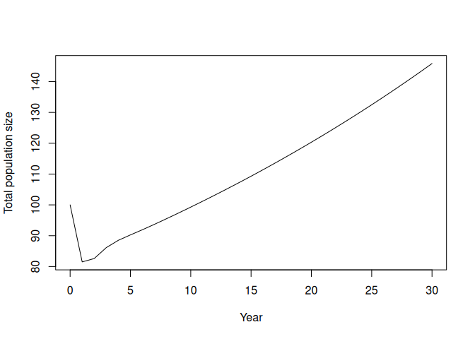

    # Plot stage-specific abundances
    matplot(
      0:years, nmat, type = "l", lty = 1,
      xlab = "Year", ylab = "Abundance"
    )
    legend("topleft", legend = colnames(nmat), lty = 1, bty = "n")

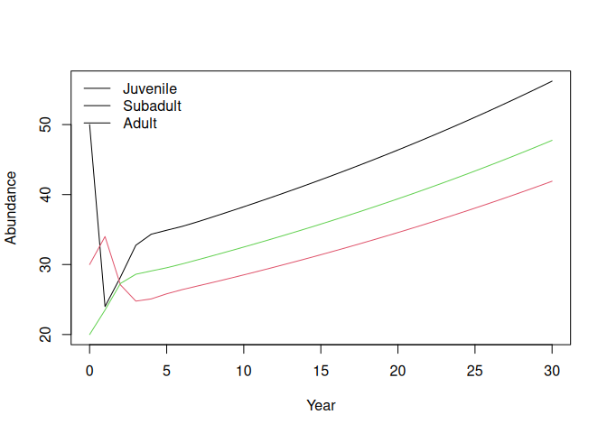

## 15.11 Long-term growth rate (\\\lambda\\)

For a constant matrix \\\mathbf{A}\\, the asymptotic growth rate is the
**dominant eigenvalue** \\\lambda\\.

    # Eigenvalues of the projection matrix
    eig <- eigen(A)

    # Dominant eigenvalue is asymptotic growth rate lambda
    lambda <- Re(eig$values[which.max(Re(eig$values))])
    lambda

    ## [1] 1.01942

- If \\\lambda &gt; 1\\: growth (on average) per time step  
- If \\\lambda = 1\\: stationary  
- If \\\lambda &lt; 1\\: decline

## 15.12 Simulation: adding stochasticity and management actions

Deterministic projection treats the model output as exact expectations.
In reality:

- births and deaths vary (demographic stochasticity),
- vital rates vary across years (environmental stochasticity),
- management can intervene (culling, supplementation, etc.).

Below is a transparent stochastic simulation that:

- simulates reproduction with Poisson variation,
- simulates survival/transitions with binomial variation,
- allows a simple **culling** intervention.

### 15.12.1 One simulated trajectory (no culling)

Here we write the simulation as a sequence of explicit steps.

1.  Create an output matrix (`sim1`) with one row per year and one
    column per stage.
2.  Fill row 1 with the initial stage abundances (`n0`).
3.  For each year, read the current stage counts (`J`, `S`, `A`).
4.  Draw the number of births and transitions using random
    distributions:
    - births from adults: Poisson
    - survival/transition events: Binomial
5.  Write the resulting stage counts into the next row.
6.  After the loop, plot total abundance through time.

<!-- -->

    # Step 1: create a matrix to store the trajectory
    sim1 <- matrix(0L, nrow = years + 1, ncol = 3)
    colnames(sim1) <- c("Juvenile", "Subadult", "Adult")

    # Step 2: set the initial population (year 0)
    sim1[1, ] <- as.integer(n0[c("Juvenile", "Subadult", "Adult")])

    # Step 3-5: update the population one year at a time
    for (t in 1:years) {
      # Current stage abundances at year t
      J <- sim1[t, "Juvenile"]
      S <- sim1[t, "Subadult"]
      A <- sim1[t, "Adult"]

      # Births: each adult contributes recruits stochastically
      newJ <- rpois(1, lambda = F_A * A)

      # Juvenile -> Subadult transition
      J_to_S <- rbinom(1, size = J, prob = G_J)

      # Subadult transitions: stay subadult or move to adult
      S_stay <- rbinom(1, size = S, prob = P_S)
      S_remaining <- S - S_stay
      p_grow_cond <- if ((1 - P_S) > 0) G_S / (1 - P_S) else 0
      S_to_A <- rbinom(1, size = S_remaining, prob = p_grow_cond)

      # Adult survival
      A_surv <- rbinom(1, size = A, prob = P_A)

      # Write next year's abundances
      sim1[t + 1, "Juvenile"] <- newJ
      sim1[t + 1, "Subadult"] <- J_to_S + S_stay
      sim1[t + 1, "Adult"] <- S_to_A + A_surv
    }

    # Step 6: plot the total population trajectory
    plot(0:years, rowSums(sim1), type = "l",
         xlab = "Year", ylab = "Total population size (simulated)")

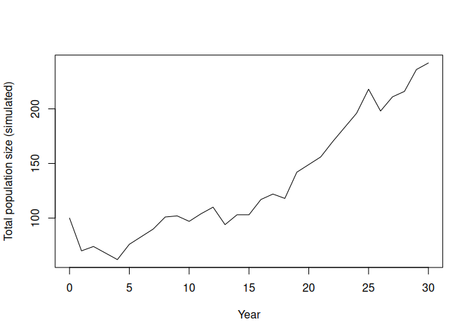

Just after running the simulation, we can calculate the realised
`lambda` for this no-culling trajectory.

    tot_no <- rowSums(sim1)
    realised_lambda_no <- if (length(tot_no) < 2 || tot_no[1] <= 0) {
      NA_real_
    } else if (any(tot_no <= 0)) {
      0
    } else {
      exp(mean(diff(log(tot_no))))
    }
    realised_lambda_no

    ## [1] 1.029897

### 15.12.2 Add a culling intervention

Example: remove 5 adults per year starting at year 10. This section uses
the same simulation rules as before, but adds a management step at the
start of each year.

What happens:

1.  Scenario A (no culling) was simulated in the previous section and
    stored as `sim1`.
2.  We set intervention controls (`cull_enabled`, `cull_stage`,
    `cull_start_year`, `cull_n`) for Scenario B.
3.  At each year `t`, we first read current stage abundances (`J`, `S`,
    `A`).
4.  If culling is active and `t` is at/after the start year, we remove
    individuals from the target stage.
5.  We then refresh `J`, `S`, `A` so births and survival are based on
    the post-cull population.
6.  After that, demographic updates are exactly the same as in Scenario
    A.
7.  Finally, we compare Scenario A and B in one figure and compute
    realised growth rates.

<!-- -->

    # Management settings for the intervention scenario
    cull_enabled <- TRUE
    cull_stage <- "Adult"
    cull_start_year <- 10
    cull_n <- 5

    # Storage for the culling trajectory
    sim_cull <- matrix(0L, nrow = years + 1, ncol = 3)
    colnames(sim_cull) <- c("Juvenile", "Subadult", "Adult")
    sim_cull[1, ] <- as.integer(n0[c("Juvenile", "Subadult", "Adult")])

    # Simulate year by year, applying culling before demographic updates
    for (t in 1:years) {
      # Current stage abundances at year t
      J <- sim_cull[t, "Juvenile"]
      S <- sim_cull[t, "Subadult"]
      A <- sim_cull[t, "Adult"]

      # Apply culling before births/survival if intervention is active
      if (cull_enabled && t >= cull_start_year) {
        # Never remove more individuals than are currently present
        remove_n <- min(sim_cull[t, cull_stage], as.integer(cull_n))
        sim_cull[t, cull_stage] <- sim_cull[t, cull_stage] - remove_n

        # Refresh stage counts after culling
        J <- sim_cull[t, "Juvenile"]
        S <- sim_cull[t, "Subadult"]
        A <- sim_cull[t, "Adult"]
      }

      # Demographic updates (same as the no-culling simulation)
      newJ <- rpois(1, lambda = F_A * A)
      J_to_S <- rbinom(1, size = J, prob = G_J)
      S_stay <- rbinom(1, size = S, prob = P_S)
      S_remaining <- S - S_stay
      p_grow_cond <- if ((1 - P_S) > 0) G_S / (1 - P_S) else 0
      S_to_A <- rbinom(1, size = S_remaining, prob = p_grow_cond)
      A_surv <- rbinom(1, size = A, prob = P_A)

      sim_cull[t + 1, "Juvenile"] <- newJ
      sim_cull[t + 1, "Subadult"] <- J_to_S + S_stay
      sim_cull[t + 1, "Adult"] <- S_to_A + A_surv
    }

    # Compare trajectories: solid = no culling, dashed = culling
    plot(0:years, rowSums(sim1), type = "l",
         xlab = "Year", ylab = "Total population size",
         ylim = range(c(rowSums(sim1), rowSums(sim_cull))))
    lines(0:years, rowSums(sim_cull), lty = 2)
    legend("topleft", legend = c("No culling", "Culling: 5 adults/year from year 10"),
           lty = c(1, 2), bty = "n")

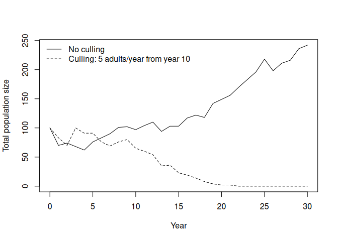

For this single-run summary, realised `lambda` is the geometric mean of
year-to-year total-population growth factors. This is a finite-horizon,
trajectory-specific estimate; in many ecology texts, the long-run
stochastic growth rate is denoted \\\lambda\_s\\ (or \\\log
\lambda\_s\\), which is related but not identical to a single-run
realised value.

Interpretation:

- `lambda > 1`: realised growth over the simulated period
- `0 < lambda < 1`: realised decline
- `lambda = 0`: extinction occurred at some point in the simulated
  period
- `lambda` should not be negative in this setting

<!-- -->

    # Realised lambda from each simulated trajectory
    tot_no <- rowSums(sim1)
    tot_cu <- rowSums(sim_cull)

    # Geometric-mean per-step growth rate over the full horizon.
    # If a trajectory hits zero, define realised lambda as 0 (extinction within horizon).
    realised_lambda_no <- if (length(tot_no) < 2 || tot_no[1] <= 0) {
      NA_real_
    } else if (any(tot_no <= 0)) {
      0
    } else {
      exp(mean(diff(log(tot_no))))
    }

    realised_lambda_cu <- if (length(tot_cu) < 2 || tot_cu[1] <= 0) {
      NA_real_
    } else if (any(tot_cu <= 0)) {
      0
    } else {
      exp(mean(diff(log(tot_cu))))
    }

    data.frame(
      scenario = c("No culling", "Culling"),
      realised_lambda = c(realised_lambda_no, realised_lambda_cu)
    )

    ##     scenario realised_lambda
    ## 1 No culling        1.029897
    ## 2    Culling        0.000000

### 15.12.3 Many replicates (uncertainty bands)

A single run is one possible realisation. We typically run many
replicates and summarise. In this script, we run two sets of replicates
(no culling vs culling), then compute median and 10-90% intervals for
each year. Note: different studies may use different interval widths
(for example, 95% intervals) depending on purpose and reporting
conventions. To keep the comparison clear, the code is structured as: 1.
Scenario A: run all replicates with no culling. 2. Scenario B: run all
replicates with culling. 3. Compare Scenario A and B in one graph.

    # Number of Monte Carlo replicates
    nreps <- 200

    # Store total abundance per year for each replicate
    totals_no <- matrix(NA_real_, nrow = years + 1, ncol = nreps)
    totals_cull <- matrix(NA_real_, nrow = years + 1, ncol = nreps)

    # Scenario A: run all replicates with no culling
    for (rep in 1:nreps) {
      out_no <- matrix(0L, nrow = years + 1, ncol = 3)
      colnames(out_no) <- c("Juvenile", "Subadult", "Adult")
      out_no[1, ] <- as.integer(n0[c("Juvenile", "Subadult", "Adult")])

      for (t in 1:years) {
        J <- out_no[t, "Juvenile"]
        S <- out_no[t, "Subadult"]
        A <- out_no[t, "Adult"]

        newJ <- rpois(1, lambda = F_A * A)
        J_to_S <- rbinom(1, size = J, prob = G_J)
        S_stay <- rbinom(1, size = S, prob = P_S)
        S_remaining <- S - S_stay
        p_grow_cond <- if ((1 - P_S) > 0) G_S / (1 - P_S) else 0
        S_to_A <- rbinom(1, size = S_remaining, prob = p_grow_cond)
        A_surv <- rbinom(1, size = A, prob = P_A)

        out_no[t + 1, "Juvenile"] <- newJ
        out_no[t + 1, "Subadult"] <- J_to_S + S_stay
        out_no[t + 1, "Adult"] <- S_to_A + A_surv
      }
      totals_no[, rep] <- rowSums(out_no)
    }

    # Scenario B: run all replicates with culling
    for (rep in 1:nreps) {
      out_cu <- matrix(0L, nrow = years + 1, ncol = 3)
      colnames(out_cu) <- c("Juvenile", "Subadult", "Adult")
      out_cu[1, ] <- as.integer(n0[c("Juvenile", "Subadult", "Adult")])

      for (t in 1:years) {
        J <- out_cu[t, "Juvenile"]
        S <- out_cu[t, "Subadult"]
        A <- out_cu[t, "Adult"]

        if (cull_enabled && t >= cull_start_year) {
          remove_n <- min(out_cu[t, cull_stage], as.integer(cull_n))
          out_cu[t, cull_stage] <- out_cu[t, cull_stage] - remove_n
          J <- out_cu[t, "Juvenile"]
          S <- out_cu[t, "Subadult"]
          A <- out_cu[t, "Adult"]
        }

        newJ <- rpois(1, lambda = F_A * A)
        J_to_S <- rbinom(1, size = J, prob = G_J)
        S_stay <- rbinom(1, size = S, prob = P_S)
        S_remaining <- S - S_stay
        p_grow_cond <- if ((1 - P_S) > 0) G_S / (1 - P_S) else 0
        S_to_A <- rbinom(1, size = S_remaining, prob = p_grow_cond)
        A_surv <- rbinom(1, size = A, prob = P_A)

        out_cu[t + 1, "Juvenile"] <- newJ
        out_cu[t + 1, "Subadult"] <- J_to_S + S_stay
        out_cu[t + 1, "Adult"] <- S_to_A + A_surv
      }
      totals_cull[, rep] <- rowSums(out_cu)
    }

    # Summarise each year across replicates (median and 10-90% interval)
    sum_no <- data.frame(
      year = 0:years,
      median = apply(totals_no, 1, median),
      lo = apply(totals_no, 1, quantile, probs = 0.1),
      hi = apply(totals_no, 1, quantile, probs = 0.9)
    )
    sum_cu <- data.frame(
      year = 0:years,
      median = apply(totals_cull, 1, median),
      lo = apply(totals_cull, 1, quantile, probs = 0.1),
      hi = apply(totals_cull, 1, quantile, probs = 0.9)
    )

    # Scenario A vs Scenario B: compare summaries in one figure
    plot(sum_no$year, sum_no$median, type = "n",
         xlab = "Year", ylab = "Total population size",
         ylim = range(c(sum_no$lo, sum_no$hi, sum_cu$lo, sum_cu$hi)))

    # Ribbon for no-culling uncertainty (10-90%)
    polygon(
      x = c(sum_no$year, rev(sum_no$year)),
      y = c(sum_no$lo, rev(sum_no$hi)),
      col = grDevices::adjustcolor("steelblue", alpha.f = 0.25),
      border = NA
    )

    # Ribbon for culling uncertainty (10-90%)
    polygon(
      x = c(sum_cu$year, rev(sum_cu$year)),
      y = c(sum_cu$lo, rev(sum_cu$hi)),
      col = grDevices::adjustcolor("firebrick", alpha.f = 0.25),
      border = NA
    )

    # Median trajectories on top of ribbons
    lines(sum_no$year, sum_no$median, lwd = 2, col = "steelblue4")
    lines(sum_cu$year, sum_cu$median, lwd = 2, lty = 2, col = "firebrick4")

    legend("topleft",
           legend = c("No culling (median)", "No culling (10-90%)",
                      "Culling (median)", "Culling (10-90%)"),
           lty = c(1, NA, 2, NA),
           lwd = c(2, NA, 2, NA),
           pch = c(NA, 15, NA, 15),
           col = c("steelblue4", grDevices::adjustcolor("steelblue", alpha.f = 0.5),
                   "firebrick4", grDevices::adjustcolor("firebrick", alpha.f = 0.5)),
           pt.cex = c(1, 1.5, 1, 1.5),
           bty = "n")

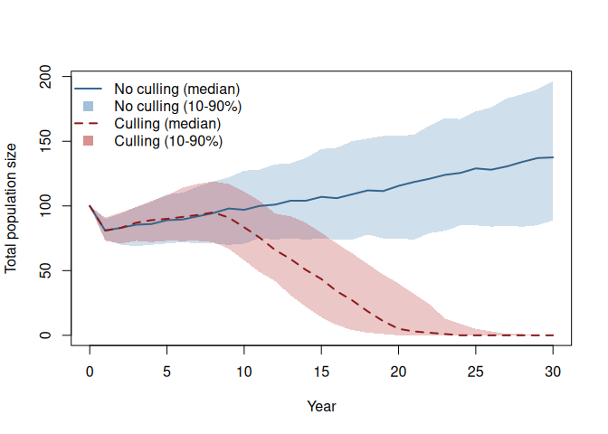

## 15.13 Student exercises (for a class handout)

### 15.13.1 Exercise: Projection interval sanity check

1.  In the tutorial, \\\Delta t = 1\\ year. Write one sentence
    explaining what that means.
2.  Suppose you wanted \\\Delta t = 1\\ month. What changes would you
    need to make to the interpretation of:
    - \\P\_A\\?
    - \\F\_A\\?
3.  Name one real reason you might prefer monthly time steps over yearly
    ones.

### 15.13.2 Exercise: Change one vital rate and re-run projections

1.  Reduce adult survival from \\P\_A = 0.80\\ to \\P\_A = 0.70\\.
    Recompute:
    - the deterministic projection plot,
    - \\\lambda\\.
2.  Does the population grow or decline now? How can you tell?

### 15.13.3 Exercise: Culling as management

1.  In the simulation, cull 5 adults per year from year 10. Increase
    this to 10 adults per year.
2.  Compare the median population trajectory and the uncertainty bands.
3.  To identify which stage is most impactful, run the same culling
    intensity for each stage separately (juveniles, subadults, adults),
    then compare results. Which stage has the largest effect, and why?

### 15.13.4 Exercise: Contraception treatment (reduced fecundity)

Design a second management treatment where fecundity is reduced instead
of removing individuals.

1.  Keep survival/transition rates unchanged, but reduce fecundity after
    year 10 with a 90% effective contraceptive treatment (for example,
    multiply `F_A` by 0.1 from year 10 onward).
2.  Implement this as a time-dependent fecundity value inside the yearly
    loop (for example, `F_A_t`), and use `F_A_t` in the births step.
3.  Run replicate simulations for:
    - baseline (no treatment),
    - culling treatment,
    - contraception treatment.
4.  Compare all three scenarios in one figure and discuss which
    treatment gives the largest reduction in population growth.

## 15.14 Notes and extensions

- If you include juvenile stasis (juveniles surviving but remaining
  juveniles), add a \\P\_J\\ term and include it in the matrix and
  simulation.
- The deterministic matrix model is most useful for *structure* and
  *long-term behaviour* (\\\lambda\\, stable stage structure,
  elasticities).
- Stochastic simulations are most useful for *short-term variability*
  and *scenario exploration* (management, uncertainty, risk).

<!--chapter:end:2_12_MPMIntroAndSimulation.Rmd-->

# Part 3: Population Genetics and Evolution

This part introduces the genetic mechanisms that shape evolutionary
change. You will connect allele frequencies to forces like selection,
drift, and heritability.

By the end of Part 3, you should be able to:

- Use Hardy-Weinberg logic to interpret allele and genotype frequencies.
- Simulate allele frequency change under different evolutionary forces.
- Estimate heritability and interpret its evolutionary implications.

<!--chapter:end:3_00_PartPopulationGeneticsAndEvolution.Rmd-->

# 16 Hardy-Weinberg equilibrium

## 16.1 Background

Hardy-Weinberg equilibrium is a fundamental concept in population
genetics for understanding the genetic dynamics of populations. Named
after British mathematician G.H. Hardy and German physician Wilhelm
Weinberg, this principle describes the stable genetic proportions in a
population under specific conditions of no evolution.

In an idealized population, where mating is random, genetic mutations
are absent, natural selection is not acting, and there is no gene flow
or genetic drift, the frequencies of alleles and genotypes remain
constant across generations.

The Hardy-Weinberg equilibrium provides a baseline against which real
populations can be compared, allowing researchers to detect factors that
may cause deviations from this equilibrium and, in turn, understand the
forces driving evolution and genetic changes within populations.

In this practical we will learn more about HWE and practice solving some
HWE-related problems.

The key formulae of the Hardy-Weinberg Equilibrium are:

Equation 1: *p* + *q* = 1

and

Equation 2: *p*<sup>2</sup> + 2*p**q* + *q*<sup>2</sup> = 1.

Let’s first consider where these equations come from. First, Equation 1.

In a diploid organism, each individual carries two alleles for a
particular gene. Let’s consider a gene with two alleles, A and a. In a
given population:

*p* is the frequency of the dominant allele (A) *q* is the frequency of
the recessive allele (a)

The sum of the frequencies of these two alleles in the population must
equal 1, as they are the only two possibilities for this gene, so
*p* + *q* = 1.

Equation 1 serves as the foundational stepping stone for Equation 2. In
Equation 1, we establish the sum of allele frequencies, *p* and *q*, in
the gene pool. This equation sets the stage for the more complex
Equation 2, where we translate these allele frequencies into genotype
frequencies for the population.

We can derive Equation 2 based on the gene pool and random mating. Let’s
consider a mating event between two random alleles. The possible
combinations of alleles are:

*p* × *p* = *p*<sup>2</sup> (AA) *q* × *q* = *q*<sup>2</sup> (aa)
*p* × *q* = *p**q* (Aa) *q* × *p* = *p**q* (aA)

Notice that we have two *p**q* terms (Aa and aA). The order of alleles
doesn’t matter, so they are summed together: 2*p**q*.

So, the total probability for all possible combinations is:

*p*<sup>2</sup> + 2*p**q* + *q*<sup>2</sup>.

This must equal 1 (100% probability), which gives us Equation 2:

*p*<sup>2</sup> + 2*p**q* + *q*<sup>2</sup> = 1.

In these formulae, *p* is the allele frequency of the dominant allele
and *q* is the frequency of the recessive allele. Thus, *p*<sup>2</sup>
is the frequency of the homozygous dominant genotype (e.g., AA),
*q*<sup>2</sup> is the frequency of the homozygous recessive genotype
(e.g., aa) and 2*p**q* is the frequency of the heterozygous genotype
(e.g., Aa). From these equations we can produce the following plot that
shows the possible genotype frequencies at HWE for any given pair of
allele frequencies. HWE can be reached for any genotype frequency (it is
a common misconception that ratios between the three genotypes should be
1:2:1, or that allele frequencies should tend towards being 50% *p* and
50% *q*).

Given a small amount of information it is possible to figure out what
the allele and genotype frequencies should be *if the population is at
HWE*.

If the population is NOT at HWE, then it must be that one of the
assumptions is violated.

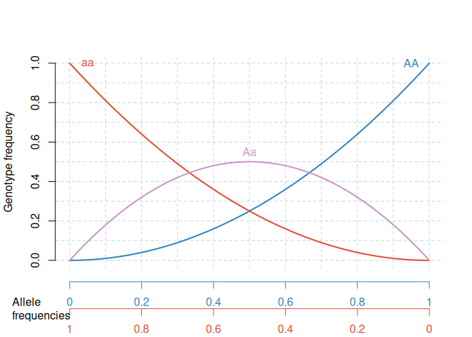
<p class="caption">
<span id="fig:hardyweinberg"></span>Figure 16.1: The Hardy-Weinberg
Equilibrium. The lines represent the genotype frequencies at HWE, given
particular allele frequencies.
</p>

## 16.2 Assumptions of Hardy-Weinberg Equilibrium

For a population to be in Hardy-Weinberg Equilibrium, certain
assumptions must be met:

- Random mating: There is no preference in mate selection based on
  genotype.
- No mutations: The gene pool is stable with no new alleles being added.
- Large population size: To negate the effects of genetic drift.
- No gene flow: No new individuals enter or leave the population.
- No natural selection: All genotypes in the population have an equal
  chance of reproductive success.

Any deviation from these assumptions could result in a population that
is not in Hardy-Weinberg Equilibrium.

Learning outcomes:

- Understanding the difference between alleles and genotypes.
- The ability to solve Hardy-Weinberg problems by understanding and
  applying the two key formulae of HW.
- Knowing the assumptions of HWE.
- Understanding what “being at Hardy-Weinberg Equilibrium” means in
  terms of evolutionary processes (which is related to the assumptions
  of HWE).

## 16.3 Worked example

### 16.3.1 Inputs

- Recessive genotype frequency: *q*<sup>2</sup> = 0.36

### 16.3.2 Steps

1.  Calculate $q = \sqrt{0.36} = 0.6$.
2.  Calculate *p* = 1 − *q* = 0.4.
3.  Calculate heterozygote frequency: 2*p**q*.

### 16.3.3 Output and interpretation

2*p**q* = 2(0.4)(0.6) = 0.48. So 48% of individuals are expected to be
heterozygous under HWE assumptions.

## 16.4 Your task

Tackle the following problems, using the HWE theory outlined above …

### 16.4.1 Problem \#1.

You have sampled a population in which you know that the percentage of
the homozygous recessive genotype (aa) is 36%. Using that 36%, calculate
the following:

- The frequency of the “aa” genotype.
- The frequency of the “a” allele.
- The frequency of the “A” allele.
- The frequencies of the genotypes “AA” and “Aa.”
- The frequencies of the two possible phenotypes if “A” is completely
  dominant over “a.”

### 16.4.2 Problem \#2.

Sickle-cell anaemia is an interesting genetic disease. Normal homozygous
individuals (SS) have normal blood cells that are easily infected with
the malarial parasite. Thus, many of these individuals become very ill
from the parasite and many die. Individuals homozygous for the
sickle-cell trait (ss) have red blood cells that readily collapse when
deoxygenated. Although malaria cannot grow in these red blood cells,
individuals often die because of the genetic defect. However,
individuals with the heterozygous condition (Ss) have some “sickling” of
red blood cells (where the cells become C-shaped), but generally not
enough to cause mortality. In addition, malaria cannot survive well
within these “partially defective” red blood cells. Thus, heterozygotes
tend to survive better than either of the homozygous conditions.

- If 9% of an African population is born with a severe form of
  sickle-cell anaemia (ss), what percentage of the population will be
  more resistant to malaria because they are heterozygous for the
  sickle-cell gene?

### 16.4.3 Problem \#3.

There are 100 students in a class. Ninety-six did well in the course
whereas four blew it totally and received a grade of F. In the highly
unlikely event that these traits are genetic rather than environmental,
if these traits involve dominant and recessive alleles, and if the four
(4%) represent the frequency of the homozygous recessive condition,
please calculate the following:

- The frequency of the recessive allele.
- The frequency of the dominant allele.
- The frequency of heterozygous individuals.

**Note**: This scenario is hypothetical and simplifies the complex
factors that contribute to academic performance for the sake of this
exercise. Academic performance is influenced by a myriad of factors, not
solely genetics!

### 16.4.4 Problem \#4.

Within a population of butterflies, the colour brown (B) is dominant
over the colour white (b). And, 40% of all butterflies are white. Given
this simple information calculate the following:

- The percentage of butterflies in the population that are heterozygous.
- The frequency of homozygous dominant individuals.

## 16.5 Takeaways

- Hardy-Weinberg equilibrium provides a baseline for detecting
  evolutionary forces.
- Allele frequencies (*p*, *q*) determine genotype frequencies
  (*p*<sup>2</sup>, 2*p**q*, *q*<sup>2</sup>).
- Deviations from HWE indicate that at least one assumption is violated.

<!--chapter:end:3_01_HardyWeinberg.Rmd-->

# 17 The Gene Pool Model

## 17.1 Background

A central goal in evolutionary biology is to understand variation –
including genetic variation – and how it changes through time. One
important idea is the “gene pool,” which contains all the different
versions of genes within a group of organisms. These genes/alleles
determine phenotype traits and other characteristics. To grasp how
populations evolve, we need to understand how allele frequencies change
in a population. Over time, genetic diversity changes as the relative
numbers of alleles changes. Some alleles may be lost from the population
while others may become “fixed” – where the allele is present in every
individual in the population.

The primary factor that influences genetic drift in the gene pool model
is population size. In small populations, “sampling error” means that,
just by chance, large changes often occur in the allele frequencies. In
large populations, dramatic changes are much less likely.

Two related concepts are critical in understanding genetic drift:
bottlenecks and founding effects. A genetic bottleneck occurs when a
population dramatically reduces in size due to events like environmental
catastrophes. During a bottleneck, allele frequency (and genetic
diversity) can change dramatically due to sampling effects during the
bottleneck. The founding effect is a similar scenario where a small
group (a sample from the population) establishes a new population. The
fact that the new population is a small sample of the ancestral
population means that the new population can have rather different
genetic composition to the ancestral population.

Learning outcomes:

- Greater understanding of evolution via genetic drift (neutral).
- Understanding of genetic bottlenecks and founder effect.
- Understanding the relationship between stochasticity and genetic
  variation.
- Use of R for exploring biological phenomenon.

## 17.2 Worked example

### 17.2.1 Inputs

- Initial allele frequency of `A`: `0.5`
- Scenario A population size: `20`
- Scenario B population size: `1000`

### 17.2.2 Steps

1.  Run repeated sampling for each population size.
2.  Track allele frequency of `A` across generations.
3.  Compare fluctuation magnitude between the two scenarios.

### 17.2.3 Output and interpretation

With population size 20, frequencies usually shift noticeably in a few
generations. With population size 1000, random fluctuations are much
smaller. This illustrates stronger drift in small populations.

## 17.3 Your task

In this practical, we’ll use the R programming language to simulate how
allele frequencies change in a population over generations. By changing
some factors, you’ll see how allele frequencies change in different
situations. This exercise will deepen your understanding of evolution
and give you practical skills to explore real genetic questions.

The exercise is divided into two parts:

1.  understanding the gene pool, and how the gene pool in the next
    generation is a *sample* of the ancestral gene pool.
2.  projecting the allele frequency of the gene pool through time to
    investigate the importance of population size
3.  modifying the code to understand genetic bottlenecks.

## 17.4 A simple model

We will first aim to get an understanding of what a gene pool is, using
a simple model. We will use R to make a gene pool, then look at how
allele frequency in the gene pool changes over a single generation.

### 17.4.1 The gene pool

To establish the gene pool we first set the initial population size. I
set this to be reasonably large, at 500 individuals.

    pop_size <- 500

There are two alleles (gene variants) per individual: one allele came
from the father, and one from the mother.

Therefore, the gene pool contains 2 x N alleles (in this case, 1000
alleles).

    pool_size <- pop_size * 2

I now set the initial allele frequency to be 0.5. You can use other
values, but 0.5 is best to start with.

    initial_frequency_A <- 0.5
    initial_frequency_a <- 1 - initial_frequency_A

We can now calculate the **number** of *A* and *a* alleles, by
multiplying the frequency by the pool size and rounding the result to
the closest whole number.

    number_A <- round(initial_frequency_A * pool_size)
    number_a <- round(initial_frequency_a * pool_size)

Following this, the gene pool can be filled like this. What we are
saying here is “repeat `A`, `number_A` times, then repeat `a` `number_a`
times”

    gene_pool <- c(rep("A", number_A), rep("a", number_a))

Output (counts in the initial gene pool):

    ## gene_pool
    ##   a   A 
    ## 500 500

We can express these numbers as allele frequencies (i.e. as proportions
of the total) by wrapping the `table` command with `prop.table` like
this:

    prop.table(table(gene_pool))

    ## gene_pool
    ##   a   A 
    ## 0.5 0.5

### 17.4.2 Projecting allele frequency over one time step.

Let’s assume the population size remains constant at N = 500.

During the next time step (i.e. 1 generation), the individuals in the
population mate with each other randomly. We can use the `sample`
function to simulate this.

This code is saying “**sample, from the gene pool, 1000 alleles**”. We
need to sample 2× the population size because each individual contains
two alleles.

    new_gene_pool <- sample(gene_pool, 2 * pop_size, replace = TRUE)

Let’s look at the allele frequency in the new gene pool. It should be
similar, but probably not exactly the same as the initial gene pool.

    prop.table(table(new_gene_pool))

    ## new_gene_pool
    ##     a     A 
    ## 0.491 0.509

There are a total of 500 individuals, but the numbers are (probably) not
exactly the same as in the initial gene pool. The reason the gene pool
is (probably) not identical, is that it is a random sample, not simply a
carbon copy.

**Try to vary the population size and do this several times at small and
large population sizes.** You should notice that the frequencies/numbers
are more similar when you repeat them for large population sizes than
for small population sizes.

## 17.5 Simulation of allele frequency through time

To simulate the passage of time, we need to do this sampling procedure
many times.

We can do this using a loop in R. Loops are used to repeatedly simulate
the gene pool sampling process across multiple generations. This allows
us to observe how allele frequencies change over time, mimicking the
natural progression of generations in a population.

In our loop, we will repeat this gene pool sampling process many times
(one time per generation). Each time we go through the loop, we sample
alleles from the *old* gene pool from time *n* to create a *new* gene
pool for time *n* + 1. And each time through the loop we calculate the
allele frequency for A so we can track how it changes through time.

Let’s set up a simulation that runs for 100 generations. You can
cut-paste this code, which is a complete gene-pool model.

    # Set number of generations
    n_gen <- 100
    pop_size <- 100

    # Set up an empty vector of length n_gen to contain results
    allele_freq_A <- rep(NA, n_gen)

    # Put in an initial value for frequency of A
    allele_freq_A[1] <- 0.5

    # Establish the initial gene pool and name it gene_pool_time_n
    # This part looks complicated, but I am just condensing the code 
    # from above into 1 line.
    gene_pool_time_n <- c(
      rep("A", round(2 * allele_freq_A[1] * pop_size)),
      rep("a", round(2 * (1 - allele_freq_A[1]) * pop_size))
    )

    for (i in 2:n_gen) {
      gene_pool_time_n_plus_1 <- sample(gene_pool_time_n,
        pop_size * 2,
        replace = TRUE
      )
      gene_pool_table <- table(factor(gene_pool_time_n_plus_1,
                                      levels = c("A", "a")))
      allele_freq_A[i] <- gene_pool_table["A"] / sum(gene_pool_table)

      # Replace the old gene pool with the new one.
      gene_pool_time_n <- gene_pool_time_n_plus_1
    }

Now we can plot this result (Figure
<a href="#fig:simulationplot">17.1</a>)

    plot(1:n_gen, allele_freq_A, type = "l", 
         xlab = "time", 
         ylim = c(0, 1))

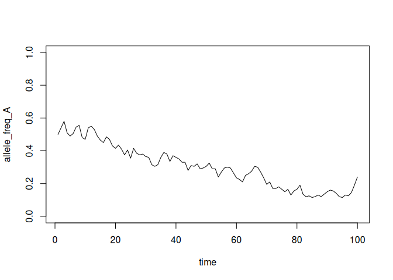
<p class="caption">
<span id="fig:simulationplot"></span>Figure 17.1: Simulation of allele
frequency through time
</p>

Use the code to investigate the following questions:

- How does population size affect the variation through time in allele
  frequencies? Why do you see these patterns?
- How does the probability of *fixation* change with population size?
- When the population size is large (say 1000), is it still possible for
  alleles to become fixed?
- Are rare alleles (defined with allele frequency) more or less likely
  to be lost than common ones? What implications does this have for new
  alleles (mutations)?

Tip: make a new script and paste the code loop along with the plot
command so that you can run both together easily.

## 17.6 Bottlenecks

Well done for making it this far. R programming is not for the faint
hearted.

Next up, I want you to take the code, and modify the code within the
loop to simulate a genetic bottleneck. A genetic bottleneck occurs when
the population goes through a period of small population size.

    if (i %in% 30:50) {
      pop_size <- 10
    } else {
      pop_size <- 1000
    }

This code means, “*…if the generation time is between `30` and `50`,
make the population size 10, otherwise make the population size 1000*”.
In other words, the population goes through a bottleneck period of 20
generations. You could modify this line of code to change the
characteristics of the bottleneck.

Figure <a href="#fig:bottlenecksimulationplot">17.2</a> shows an example
of what your plot of a genetic bottleneck simulation may look like. I
have added some lines to show where the bottleneck starts/ends.

    # Set number of generations
    n_gen <- 100

    # Set up an empty vector of length n_gen to contain results
    allele_freq_A <- rep(NA, n_gen)

    # Put in an initial value for frequency of A
    allele_freq_A[1] <- 0.5

    # Establish the initial gene pool and name it gene_pool_time_n
    # This part looks complicated, but I am just condensing the code from above into 1 line.
    gene_pool_time_n <- c(
      rep("A", round(2 * allele_freq_A[1] * pop_size)),
      rep("a", round(2 * (1 - allele_freq_A[1]) * pop_size))
    )

    for (i in 2:n_gen) {
      if (i %in% 30:50) {
      pop_size <- 15
    } else {
      pop_size <- 1000
    }
      gene_pool_time_n_plus_1 <- sample(gene_pool_time_n,
        pop_size * 2,
        replace = TRUE
      )
      gene_pool_table <- table(factor(gene_pool_time_n_plus_1,
                                      levels = c("A", "a")))
      allele_freq_A[i] <- gene_pool_table["A"] / sum(gene_pool_table)

      # Replace the old gene pool with the new one.
      gene_pool_time_n <- gene_pool_time_n_plus_1
    }
    plot(1:n_gen, allele_freq_A, type = "l", xlab = "time", ylim = c(0, 1))
    abline(v = 30,col= "red", lty = 3)
    abline(v = 50,col= "red", lty = 3)
    text(40,0.95,"bottleneck", col = "red")

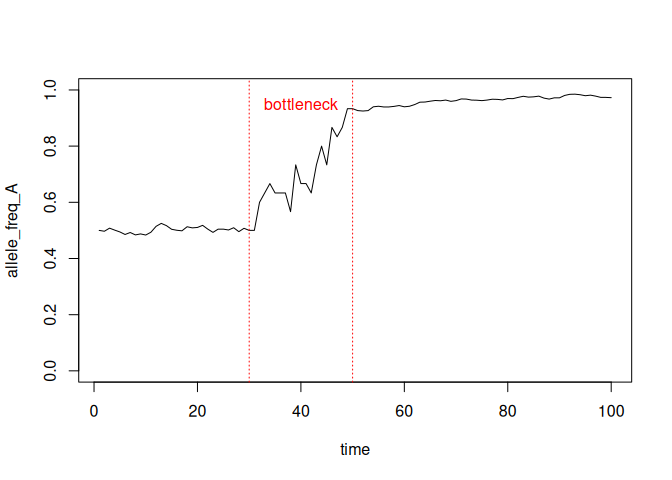
<p class="caption">
<span id="fig:bottlenecksimulationplot"></span>Figure 17.2: Simulation
of a genetic bottleneck
</p>

Now use your new bottleneck code to answer the following questions:

- How does a genetic bottle neck influence the genetic composition of
  the population?
- How might a genetic bottleneck impact the probability of genetic
  fixation?
- Does the severity of the bottleneck (i.e. length and population size)
  matter?

## 17.7 Conclusions

You should now have a good idea of what a gene pool model is, the
importance of population size, the concept of sampling from a population
and genetic bottlenecks.

Let’s finish with some more general questions:

- What are the limitations of this simulation. What other real-world
  factors and complexities are not considered in this simplified model?

<!----
No selection
Mating is random
There is no mutation
--->

- Why is genetic diversity important to a population, for example in a
  conservation context?

<!---
Genetic diversity allows populations to explore parameter space
--->

- Can you think of real-life scenarios where understanding gene pool
  dynamics would be valuable, such as in conservation biology or medical
  genetics?

## 17.8 Takeaways

- Genetic drift is stronger in small populations because sampling error
  is larger.

- Bottlenecks and founder effects can rapidly reshape allele
  frequencies.

- Even neutral processes can lead to fixation or loss over time.

- Can you think of a way to simulate the genetics of a population that
  is steadily shrinking through time?

<!--chapter:end:3_02_GenePool.Rmd-->

# 18 Neutral or Adaptive Evolution in Humans: What Drives Evolution of Our Traits?

## 18.1 Background

Understanding the role of natural selection and genetic drift in human
traits requires a look at several key aspects:

- Importance of Variation: Traits require variation to be responsive to
  either natural selection or genetic drift.
- Selection vs Drift: Traits under strong selection will tend to
  optimise, while those under weak or no selection may change via random
  genetic drift.
- Role of Environment: Environmental factors can significantly impact
  the strength of selection on various traits.

Traits that are under moderate or strong selection will tend to be
restricted to some optimal value, or change directionally – natural
selection leading to adaptive evolution. Traits that are under weak or
no selection will not be restricted so much so will tend to change via a
random process – random genetic drift leading to neutral evolution. Both
of these changes require the existence of variation in the trait to
begin with: if there is no, or very little, variation the trait will not
respond much even if there is strong selection.

Finally, the strength of selection will largely depend on the
environment. Traits may be important in some environments but not
others. There may also be traits that would be selected for in some
environments, but against in others. E.g., production of the skin
pigment, melanin, would be selected for in areas with high UV-radiation
since it protects against skin cancer, but selected against in cool
temperate zones with low UV radiation since it inhibits the ability to
make vitamin D (deficiency is a health risk).

The objective of this exercise is to develop an intuitive understanding
of the effect of selection and genetic drift on traits.


<p class="caption">
<span id="fig:huntergatherer"></span>Figure 18.1: How will selection
differ between these environments?
</p>

Learning outcomes:

- Interpret the Influence of Selection Pressure: By the end of this
  exercise, participants will be able to categorise traits based on the
  level of natural selection acting upon them and articulate reasons for
  their categorisation.
- Distinguish between Adaptive and Neutral Evolution: Participants will
  be equipped to differentiate traits evolving due to adaptive evolution
  from those likely evolving through genetic drift.
- Apply Terminology Accurately: Participants will utilise correct
  scientific terminology to articulate viewpoints about trait evolution
  in different populations.
- Evaluate Environmental Factors: Participants will demonstrate the
  ability to assess how different environments (hunter-gatherer-type
  societies vs modern industrialised countries) impact the strength of
  natural selection on various traits.
- Engage in Collaborative Argumentation: Participants will
  collaboratively argue and defend their categorisation of traits,
  providing evidence or logical reasoning for their views.
- Engage in Critical Thinking: Develop analytical skills in evaluating
  the role of selection and drift in trait evolution.

## 18.2 Key idea

Traits like resistance to infectious disease are likely to face strong
selection in environments where the disease is common, while traits with
little effect on survival or reproduction (e.g., subtle iris patterns)
are more likely to drift.

## 18.3 Your task (30 minutes)

You are given a list of traits for humans (below). In small groups:

1.  Write the traits on PostIt notes (5 minutes).
2.  Discuss and categorise these traits based on the strength of natural
    selection in hunter-gatherer societies (10 minutes).
3.  Repeat the exercise for modern industrialised societies like Denmark
    (15 minutes).

Order the traits from those likely influenced by **GENETIC DRIFT** to
those evolving through **ADAPTIVE EVOLUTION** via **NATURAL SELECTION**.

### 18.3.1 The traits

<div class="tabwid"><style>.cl-61b13588{}.cl-61aa9c78{font-family:'DejaVu Sans';font-size:14pt;font-weight:normal;font-style:normal;text-decoration:none;color:rgba(0, 0, 0, 1.00);background-color:transparent;}.cl-61ad1020{margin:0;text-align:left;border-bottom: 0 solid rgba(0, 0, 0, 1.00);border-top: 0 solid rgba(0, 0, 0, 1.00);border-left: 0 solid rgba(0, 0, 0, 1.00);border-right: 0 solid rgba(0, 0, 0, 1.00);padding-bottom:5pt;padding-top:5pt;padding-left:5pt;padding-right:5pt;line-height: 1;background-color:transparent;}.cl-61ad3c1c{width:6in;background-color:transparent;vertical-align: middle;border-bottom: 0 solid rgba(0, 0, 0, 1.00);border-top: 0 solid rgba(0, 0, 0, 1.00);border-left: 0 solid rgba(0, 0, 0, 1.00);border-right: 0 solid rgba(0, 0, 0, 1.00);margin-bottom:0;margin-top:0;margin-left:0;margin-right:0;}</style><table data-quarto-disable-processing='true' class='cl-61b13588'><tbody><tr style="overflow-wrap:break-word;"><td class="cl-61ad3c1c"><p class="cl-61ad1020"><span class="cl-61aa9c78">Metabolic efficiency: How effectively your body converts food into energy.</span></p></td><td class="cl-61ad3c1c"><p class="cl-61ad1020"><span class="cl-61aa9c78">Face symmetry: The balance and proportionality of facial features.</span></p></td></tr><tr style="overflow-wrap:break-word;"><td class="cl-61ad3c1c"><p class="cl-61ad1020"><span class="cl-61aa9c78">Amount of body hair: The density and length of hair covering your body.</span></p></td><td class="cl-61ad3c1c"><p class="cl-61ad1020"><span class="cl-61aa9c78">Running speed: How fast an individual can run.</span></p></td></tr><tr style="overflow-wrap:break-word;"><td class="cl-61ad3c1c"><p class="cl-61ad1020"><span class="cl-61aa9c78">Singing ability: Skill and aptitude for musical vocalization.</span></p></td><td class="cl-61ad3c1c"><p class="cl-61ad1020"><span class="cl-61aa9c78">Height: Physical stature, from base to top.</span></p></td></tr><tr style="overflow-wrap:break-word;"><td class="cl-61ad3c1c"><p class="cl-61ad1020"><span class="cl-61aa9c78">Intelligence: Cognitive abilities including problem solving and learning.</span></p></td><td class="cl-61ad3c1c"><p class="cl-61ad1020"><span class="cl-61aa9c78">Resistance to bubonic plague: Immunity or resilience against the bubonic plague.</span></p></td></tr><tr style="overflow-wrap:break-word;"><td class="cl-61ad3c1c"><p class="cl-61ad1020"><span class="cl-61aa9c78">Iris structure: The unique patterns in the iris of the eye.</span></p></td><td class="cl-61ad3c1c"><p class="cl-61ad1020"><span class="cl-61aa9c78">Sense of smell: The ability to detect and identify odours.</span></p></td></tr><tr style="overflow-wrap:break-word;"><td class="cl-61ad3c1c"><p class="cl-61ad1020"><span class="cl-61aa9c78">Sperm motility: The movement and swimming of sperm.</span></p></td><td class="cl-61ad3c1c"><p class="cl-61ad1020"><span class="cl-61aa9c78">Resistance to common cold: Immunity or resilience against the common cold.</span></p></td></tr><tr style="overflow-wrap:break-word;"><td class="cl-61ad3c1c"><p class="cl-61ad1020"><span class="cl-61aa9c78">Muscle strength: Physical power and force exerted by muscles.</span></p></td><td class="cl-61ad3c1c"><p class="cl-61ad1020"><span class="cl-61aa9c78">Eyesight acuity: Sharpness of vision.</span></p></td></tr></tbody></table></div>

## 18.4 Discussion (Timing: 15 minutes)

After the exercise, discuss as a class:

- Were there any traits that were categorised differently between the
  two types of societies? Why?
- Did the exercise challenge any preconceived notions you had about
  trait evolution?
- Can you think of any other traits that would be interesting to add to
  this exercise?

## 18.5 Takeaways

- Selection strength depends on environment and context, not just the
  trait itself.
- Many traits can evolve neutrally if they do not strongly affect
  fitness.
- Different environments can reverse which traits are adaptive.

<!--chapter:end:3_03_NeutralOrAdaptiveEvolution.Rmd-->

# 19 Heritability from a linear regression

## 19.1 Background

Heritability is a measure of how much of the variation in a particular
trait within a population can be attributed to genetic factors, as
opposed to environmental factors or random chance. It is expressed as a
ratio ranging from 0 to 1, and quantifies the degree to which offspring
resemble their parents for a trait. Understanding heritability is
crucial in many fields, including medicine, agriculture, and
conservation biology. For example, in population dynamics, heritability
can give us insights into how quickly a population could adapt to
changing environmental conditions.

In statistical terms, heritability is a ratio of variances,
specifically, the variance due to additive genetic factors divided by
the total phenotypic variance:

$h^2 = \frac{V\_A}{V\_P}$

A heritability value close to 1 suggests that genetic factors strongly
influence the trait, making it likely that offspring will inherit
similar trait values from their parents. On the other hand, a
heritability value close to 0 indicates that environmental factors or
random events play a larger role in determining the trait’s expression.

Across different traits and species heritability will vary. For example,
due to differences in **genetic architecture** where different species
may have different numbers of genes affecting the trait, or the same
genes may have different effects. In some places **environmental
variation** might be greater causing a bigger influence on the trait
than genetic factors, reducing heritability. Across populations and
traits there may also be variation in **developmental plasticity**
whereby a trait might be more plastic and thus less heritable.
Furthermore, past **selection pressure** could have altered the amount
of genetic variation in traits making them highly heritable in some
species, while still being more plastic in others.

Focusing on the impact of selection is particularly revealing. A trait
with a lot of genetic variance contributing to its expression may
initially have high heritability. However, the influence of strong
selection on heritability can be complex. Over time, strong selection
can reduce genetic variance as the population becomes more homogeneous
for the selected trait. Consequently, heritability can decrease due to
the reduction in total genetic variance. When the total genetic
variation approaches zero, calculating heritability can lead to
estimates that are statistically unstable. Because heritability is the
ratio of genetic variance to total variance, a near-zero denominator can
make this ratio extremely sensitive to minor variations in either the
numerator or the denominator. As a result, even tiny fluctuations in
measured variances could dramatically alter the estimate, reducing its
reliability and interpretability.

So, the relationship between the strength of selection and heritability
isn’t straightforward and can be influenced by various factors such as
environmental conditions, mutation rates, and genetic architecture.

Nevertheless, heritability can be useful, and it is possible to estimate
heritability by examining the relationship between parent and offspring
trait values using linear regression. The slope of the regression line
gives an estimate of heritability.

**Reference**

[Wray, N. & Visscher, P. (2008) Estimating trait heritability. Nature
Education
1(1):29](https://www.nature.com/scitable/topicpage/estimating-trait-heritability-46889/)

Learning Outcomes:

- Learn to import and manipulate data in R or Excel for the purpose of
  heritability estimation.
- Develop a conceptual understanding of heritability and its importance
  in trait evolution.
- Gain practical skills in performing linear regression analysis to
  estimate heritability.

## 19.2 Worked example

### 19.2.1 Inputs

- Regression slope of offspring on parent values: `0.4`

### 19.2.2 Steps

1.  Fit a linear regression model (`offspring ~ parent`).
2.  Extract the slope coefficient from the model.
3.  Interpret the slope as narrow-sense heritability (*h*<sup>2</sup>).

### 19.2.3 Output and interpretation

*h*<sup>2</sup> = 0.4, meaning about 40% of trait variance is
attributable to additive genetic effects in that population and
environment.

## 19.3 Your Task

### 19.3.1 Estimating heritability (15 minutes)

You are provided with two datasets containing parent and offspring trait
values for a given bird species (wing length).

[Data set
1](https://www.dropbox.com/scl/fi/8oe1can46pshxojw1p29m/heritability_pop1.csv?rlkey=ssg6ymzr85gkrzw9e1y63ghzu&dl=0)

[Data set
2](https://www.dropbox.com/scl/fi/yoy0x7kczvlr1eku5057m/heritability_pop2.csv?rlkey=30hta1di8v6w93ghbhq09dlbm&dl=0)

1.  Import the first data set into R (RStudio).
2.  Plot the data to make a graph of parent value on the x-axis and
    offspring value on the y-axis.
3.  Fit a linear regression model of the form `y ~ x`.
4.  Summarise the model and take note of the slope of the relationship
    between the parent and offspring trait values: this is the
    heritability.

Optional starter code in R:

    pop_1 <- read.csv("data/heritability_pop1.csv")
    plot(pop_1$Parent_value, pop_1$Offspring_value,
         xlab = "Parent value", ylab = "Offspring value")
    mod1 <- lm(Offspring_value ~ Parent_value, data = pop_1)
    summary(mod1)
    coef(mod1)[2]  # slope = heritability estimate
    abline(mod1, col = "red")

**Questions**

- What does the heritability tell us about the amount of variation
  explained by genetic factors?
- What other factors might explain the remaining variation?
- How would the heritability estimate change if you used a different
  trait (e.g., beak length instead of wing length)?
- What does the heritability tell us about how fast a trait might change
  due to selection?
- You can calculate *V*<sub>*P*</sub> from the phenotype values. Use
  this information to calculate *V*<sub>*A*</sub> based on the equation
  *V*<sub>*A*</sub> = *h*<sup>2</sup> × *V*<sub>*P*</sub>.

<!-- If the heritability is high, significant changes in the trait could occur in fewer generations through natural selection. The rate would also depend on other factors like generation time and strength of selection.
Low heritability of a critical trait like disease resistance would be concerning for conservation efforts. It suggests that natural selection would have limited scope to act upon the trait, making rapid adaptation unlikely.
-->

### 19.3.2 Comparative Analysis (10 minutes)

After you have completed the linear regression analysis for the first
dataset, analyse the second data set. This dataset features the same
trait, for the same species but from a different population with
potentially different environmental factors. The analysis steps are the
same:

1.  Import the second data set into R (RStudio) or Excel.
2.  Plot the data to make a graph of parent value on the x-axis and
    offspring value on the y-axis.
3.  Fit a linear regression model of the form `y ~ x`. In R you do this
    with the `lm` function, while in Excel you can add a trendline.
4.  Summarise the model and take note of the slope of the relationship
    between the parent and offspring trait values.

**Questions**

- What does the heritability tell us this time?
- Can you identify any environmental factors that might explain the
  difference?
- Can you think of any real-world applications where understanding
  heritability would be important?

### 19.3.3 Assumptions (10 mins)

These methods assume the following.

- Additive Genetic Effects: Assumes that the trait is influenced by
  additive effects of multiple genes and does not account for gene-gene
  or gene-environment interactions.
- No Shared Environment: Assumes that the shared environment between
  parent and offspring does not significantly contribute to the trait
  similarity. Otherwise, the heritability may be overestimated.
- Linearity: Assumes that the relationship between the parent and
  offspring trait values can be adequately captured by a linear model. A
  non-linear relationship would make the linear model inappropriate,
  skewing the heritability estimate.
- Measurement Accuracy: Assumes that trait values are measured without
  error. Measurement errors can introduce noise and affect the
  regression slope, thus affecting the heritability estimate.
- Random Mating: Assumes that mating occurs randomly with respect to the
  trait being measured. Non-random mating can skew the estimates.
- No Selection Bias: Assumes that the sample used in the estimation is
  representative of the population. If only a subset of the population
  is available or selected for study (e.g., only the largest
  individuals), estimates can be biased.
- Statistical Independence: Assumes that each parent-offspring pair is
  statistically independent from each other. This may not hold true in
  case of repeated measures or closely related individuals in the
  sample.
- No Genetic Drift or Migration: Assumes the genetic composition of the
  population is stable over the time period being considered.
  Introduction of new genetic variants or loss of existing variants can
  affect heritability.

**Question**

- How might some of these assumptions be violated?

## 19.4 Takeaways

- Heritability estimates depend on context and assumptions, not just
  data.
- The regression slope provides a simple estimate of additive genetic
  contribution.
- High heritability does not imply immutability or inevitability of a
  trait.

<!--chapter:end:3_04_Heritability.Rmd-->

# Part 4: Interactions Between Species and Community Structure

This part explores how species interactions shape population and
community dynamics, using competition and predator-prey models.

By the end of Part 4, you should be able to:

- Interpret competition and predator-prey dynamics from model outputs.
- Compare continuous- and discrete-time interaction models.
- Reason about stability and equilibrium in multi-species systems.

<!--chapter:end:4_00_PartInteractionsBetweenSpeciesAndCommunityStructure.Rmd-->

# 20 Lotka-Volterra competition

The Lotka-Volterra competition model is a foundational tool in ecology
for understanding interspecific competition, or competition between
different species for shared resources such as food, space, and nesting
sites. It examines how population sizes evolve in a shared environment
by considering factors like interaction strength and environmental
carrying capacities.

A key principle derived from this model is “competitive exclusion”,
which posits that two species with identical ecological roles can’t
coexist indefinitely. Eventually, one species will outcompete and
exclude the other from the ecosystem.

The model also explores the role of both inter- and intra-specific
competition. It identifies conditions for species coexistence,
influenced by parameters like competition coefficients and carrying
capacities. These insights are vital for understanding community
structure, species interactions, and ecological stability.

In a two-species system there are four possible outcomes:

1.  *Predictable Exclusion of Species 1 by Species 2:* Species 2
    outcompetes and excludes species 1 from the environment.
2.  *Predictable Exclusion of Species 2 by Species 1:* Species 1
    outcompetes and excludes species 2 from the environment.
3.  *Exclusion Dependent on Initial Densities:* Depending on the
    starting numbers of each species, either one could exclude the
    other.
4.  *Stable Coexistence:* Both species may reach a stable equilibrium
    where they coexist without one excluding the other.

The model suggests that stable coexistence is possible if each species
limits its own population growth more than it affects the other species.
Overlapping niches could lead to competitive exclusion, influenced by
their competition coefficients and carrying capacities.

Learning outcomes:

- Competence in constructing an Excel-based population model.
- Understanding how the Lotka-Volterra competition model works.
- Understanding the competition coefficients. These are called *α* and
  *β* in the Neal textbook, and *α*<sub>12</sub> and *α*<sub>21</sub> in
  the PDF here.

## 20.1 Key idea

If *α*<sub>12</sub> &gt; 1 and *α*<sub>21</sub> &lt; 1, species 2
strongly suppresses species 1 while species 1 weakly affects species 2,
so exclusion of species 1 is likely.

## 20.2 Your task

In this class (over TWO sessions) you will be working from a PDF
available
[here](https://www.dropbox.com/s/oukr39oq0rsn8il/9.%20Interspecific%20Competition%20and%20Competitive%20Exclusion.pdf?dl=1)
to make a model exploring this idea.

This PDF walks you through the creation of an Excel spreadsheet
exploring interspecific competition and competitive exclusion using the
Lotka-Volterra model.

- Create the Excel spreadsheet by following the instructions in the PDF
- Use the Lotka-Volterra model you have created to answer the questions
  at the end of the PDF.

### 20.2.1 The questions

1.  What parameter values will cause species 1 to exclude species 2 from
    the habitat? What do these values mean in ecological terms?
2.  What parameter values will reverse this outcome? What do these
    values mean in ecological terms?
3.  What parameter values will allow the two species to coexist
    indefinitely and stably? What do these values mean in ecological
    terms?
4.  Are there parameter values under which the outcome depends on
    initial population sizes or rates of population growth? What do
    these values mean in ecological terms?

## 20.3 Takeaways

- Competition outcomes depend on relative self-limitation
  vs. interspecific effects.
- The competition coefficients *α*<sub>12</sub> and *α*<sub>21</sub>
  encode how much one species suppresses the other.
- Coexistence occurs when each species limits itself more than it limits
  the other.

<!--chapter:end:4_01_LotkaVolterraCompetition.Rmd-->

# 21 Lotka-Volterra predator-prey dynamics

## 21.1 Background

The Lotka-Volterra predator-prey model (Lotka 1925; Volterra 1926) is a
fundamental concept in ecological dynamics, used to study the dynamics
between predator and prey populations. Rosenzweig and MacArthur (1963)
later extended this basic model to incorporate prey carrying capacity
and predator functional response. The model assumes that the predator’s
population growth is directly influenced by the availability of its
prey, while the prey’s population growth is affected by predation
pressure. As predator numbers increase, the prey population declines,
which, in turn, leads to a decrease in predator numbers due to reduced
food availability. This cyclical pattern continues as predator and prey
populations oscillate over time.

The Lotka-Volterra predator-prey model gives us a framework for
understanding the dynamics of species interactions.

In this class you will build and explore a Lotka-Volterra predator-prey
model in Excel to gain insight into the ecology of interacting predators
and prey.

Learning outcomes:

- Competence in constructing an Excel-based population model.
- Understanding how the Lotka-Volterra predator-prey model works, and
  how it is visualised.

## 21.2 Key idea

If predator efficiency increases (higher conversion of prey to predator
births), predator peaks rise and prey troughs deepen, often increasing
oscillation amplitude.

## 21.3 Your task

Follow the PDF worksheet
([here](https://www.dropbox.com/s/bhwoe161wp9p6hp/10.%20Predator-prey%20dynamics.pdf?dl=1)),
which guides you to build and explore a Lotka-Volterra predator-prey
model in Excel. The model has parameters for the prey and for the
predator, and you will explore how these parameters influence the
dynamics of the populations.

The worksheet is divided into three parts. We will mainly **focus on
Part 1** - the basic model - in the class.

After completing the Excel sheet, try to answer the following questions:

1.  Does a larger prey population growth rate (R) increase or decrease
    the stability of the predator-prey interaction?
2.  What happens if the predators starve more quickly? Less quickly?
3.  What happens if the predator is more efficient at converting prey
    into offspring? Less efficient?
4.  What happens if the predator is better at finding prey? Worse?
5.  Is the behaviour of the model sensitive to starting populations?
    Begin with populations near the point where the isoclines cross, and
    move slowly farther out.
6.  What is the ultimate outcome of the predator-prey interaction,
    regardless of parameter values? How does this compare to real
    predator and prey populations? What factors not included in the
    model may explain the differences between model predictions and
    reality?

## 21.4 Optional extras

Part 2 modifies the basic model to include a refuge, and part 3 modifies
the model to include carrying capacity. Feel free to continue to work on
these if there is time, and if you are interested.

## 21.5 R-version

An R version of this exercise is available
[here](continuous-time-lotka-volterra-predator-prey-model-in-r.html).

### 21.5.1 References

Lotka, A. J. 1925. *Elements of Physical Biology*. Williams & Wilkins.

Volterra, V. 1926. Variazioni e fluttuazioni del numero d’individui in
specie animali conviventi. *Memorie della Reale Accademia Nazionale dei
Lincei* 2: 31–113.

Rosenzweig, M. L. and R. H. MacArthur. 1963. Graphical representation
and stability conditions of predator-prey interactions. *American
Naturalist* 97: 209–223.

## 21.6 Takeaways

- Predator-prey feedbacks can generate oscillations without external
  forcing.
- Parameter changes alter stability and oscillation amplitude.
- Simple models highlight mechanisms but omit real-world constraints.

<!--chapter:end:4_02_LotkaVolterraPredatorPrey.Rmd-->

# 22 Continuous-time Lotka-Volterra Predator-Prey Model in R

## 22.1 Background

The Lotka-Volterra model describes the interaction between predators and
prey. This document demonstrates how to program the continuous-time
version of the model in R. Then, by varying the parameters you can
explore its features, and visualise the dynamics of predator and prey
populations over time.

Learning outcomes:

- Use of R to investigate an ecological model.
- Understanding how the Lotka-Volterra predator-prey model works, and
  how it is visualised.

## 22.2 What you should see

With default parameters, you should see:

- repeating oscillations in predator and prey abundances through time
- a closed orbit in the phase plane around the coexistence equilibrium
- straight-line isoclines (ZNGIs) whose intersection is the coexistence
  equilibrium

## 22.3 Your task

In R/RStudio, you will create an R script that programs the continuous
time version of the Lotka-Volterra model. You will then use this model
to investigate how the model works and how varying the parameters
affects the system.

### 22.3.1 Step 0: Create a new script

- Open RStudio and create a new script (File &gt; New File &gt; R
  Script).
- Save it with a useful name (File &gt; Save).
- Type or copy/paste the following code, step-by-step, into the Script.
- Run the code, or parts of it, selecting the parts you want to run and
  clicking “Run”.

### 22.3.2 Step 1: Load Necessary Libraries

We will use the `deSolve` package to solve the system of differential
equations numerically. Note that you may need to install the package
first using the command `install.packages("deSolve")`.

    library(deSolve)

### 22.3.3 Step 2: Define the Model

The system of equations is defined as follows:

- Victim (prey) population growth: $\frac{dV}{dt} = RV - aVC$
- Consumer (predator) population growth: $\frac{dC}{dt} = afVC - qC$

The function below implements these equations in R.

    predator_prey_model <- function(t, state, parameters) {
      with(as.list(c(state, parameters)), {
        dV <- R * V - a * V * C  # Victim (prey) growth equation
        dC <- a * f * V * C - q * C  # Consumer (predator) growth equation
        
        list(c(dV, dC))
      })
    }

### 22.3.4 Step 3: Set Parameters and Initial Conditions

We set the parameters and initial conditions for the model. I use the
same nomenclature as the PDF from the [Excel
exercise](https://jonesor.github.io/BB512_Book/lotka-volterra-predator-prey-dynamics.html).
The parameters are as follows: *R* is the victim population growth rate,
*a* is the attack rate of the predator, *f* is the conversion efficiency
of the predator and *q* is the predator starvation (death) rate. For
more detail about these, read the relevant section in the Neal textbook.

    parameters <- c(R = 0.8,  # Victim (prey) growth rate
                    a = 0.01, # Attack rate
                    f = 0.008, # Conversion efficiency
                    q = 0.1)  # Predator death rate

    initial_state <- c(V = 1000,  # Initial victim population
                       C = 20)   # Initial consumer population

### 22.3.5 Step 4: Simulate the Model

We simulate the model over a specified time period and store the
results.

    time <- seq(0, 100, by = 0.1)  # Time sequence
    output <- ode(y = initial_state, times = time, func = predator_prey_model, parms = parameters)
    output_df <- as.data.frame(output)

### 22.3.6 Step 5: Visualise the Dynamics

How does the size of the two populations change through time? You should
see that the **amplitude** and **period** change as the parameters
change.

- **Amplitude**: Half the difference between a population’s peak and
  trough. It shows how much the population fluctuates.
- **Period**: The time it takes for a population to complete one full
  cycle of oscillation. i.e. the peak-to-peak distance. It indicates the
  speed of the population cycles.

#### 22.3.6.1 Population Dynamics Over Time

The plot below shows the changes in consumer and victim populations over
time.

    # Plot victim population on the primary y-axis
    plot(output_df$time, output_df$V, type = "l", col = "blue", lwd = 2, 
         ylab = "Victim Population (V)", xlab = "Time", main = "Predator-Prey Dynamics")

    # Add consumer population on a secondary y-axis
    par(new = TRUE)
    plot(output_df$time, output_df$C, type = "l", col = "red", lwd = 2, 
         axes = FALSE, xlab = "", ylab = "")
    axis(side = 4, col = "red", col.axis = "red")
    mtext("Consumer Population (C)", side = 4, line = 3, col = "red")

    # Add legend
    legend("topright", legend = c("Victim (V)", "Consumer (C)"), 
           col = c("blue", "red"), lwd = 2)

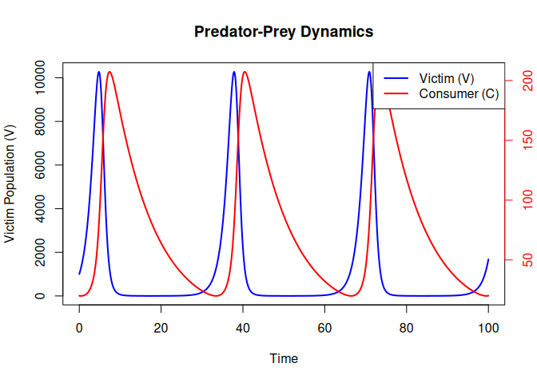

#### 22.3.6.2 Phase Plot with ZNGIs

The phase plot shows the relationship between victim and consumer
populations. Zero Net Growth Isoclines (ZNGIs) indicate where the growth
rate of each population is zero.

    plot(output_df$V, output_df$C, type = "l", col = "purple", lwd = 2, 
         xlab = "Victim (V)", ylab = "Consumer (C)", 
         main = "Predator-Prey Dynamics with ZNGIs")

    # Consumer ZNGI: dC/dt = 0 when V = q / (a * f) (a vertical line)
    abline(v = parameters["q"] / (parameters["a"] * parameters["f"]), col = "red",
           lwd = 2, lty = 2)
    # Victim ZNGI: dV/dt = 0 when C = R / a (a horizontal line)
    abline(h = parameters["R"] / parameters["a"], col = "blue", lwd = 2, lty = 2)

    # Add point for initial population sizes
    points(output_df$V[1], output_df$C[1], pch = 19, col = "black", cex = 1.5)

    # Add an arrow to the end of the line
    arrows(x0 = output_df$V[nrow(output_df) - 1], 
           y0 = output_df$C[nrow(output_df) - 1], 
           x1 = output_df$V[nrow(output_df)], 
           y1 = output_df$C[nrow(output_df)], 
           col = "purple", length = 0.1, lwd = 2)

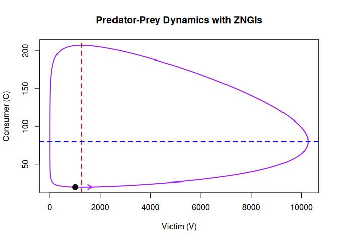

### 22.3.7 Questions

**1. Oscillatory Dynamics** - Run the simulation with the default
parameters. Describe the oscillatory behaviour of predator and prey
populations over time. How do the populations interact? - What happens
to the *amplitude* and *period* of the oscillations if you double the
initial prey population (*V*)? What about doubling the initial predator
population (*C*)?

**2. Neutral Stability** - Change the predator’s death rate (*q*) and
observe the long-term dynamics. Do the oscillations persist, amplify, or
diminish? Why?

**3. Equilibrium Points** - Identify the equilibrium point (coexistence)
for the default parameters. Verify it by calculating the equilibrium
populations using:
$$
  V^\* = \frac{q}{a \cdot f}, \quad C^\* = \frac{R}{a}.
  $$
Do the simulated populations approach these values? - How do the
equilibrium populations change when you increase the prey growth rate
(*R*) or predator attack rate (*a*)?

**4. Parameter Sensitivity** - Investigate the effect of each parameter
on the dynamics: - Alter *R* (prey growth rate). How does this affect
the predator population? - Alter *q* (predator death rate). What happens
to the predator-prey oscillations? - Alter *f* (conversion efficiency).
What happens to the predator-prey oscillations? - Alter *a* (attack
rate). What happens to the predator-prey oscillations?

**5. Phase Plane Analysis** - Plot the phase plane with the default
parameters. Add the Zero Net Growth Isoclines (ZNGIs) for predators and
prey. What do these isoclines represent? - Change the prey growth rate
(*R*), predator attack rate (*a*) and other parameters. How do the
positions of the isoclines change? What about the shape and size of the
orbits? What does this imply for the dynamics? - Change the initial
population sizes. Does the initial population size impact the dynamics?

**6. Extinction Scenarios** - Set a very high predator death rate (*q*)
or a very low attack rate (*a*). What happens to the predator
population? Is it possible to drive the predators extinct? What are the
implications for prey dynamics? - What conditions (parameter
combinations) are most likely to lead to extinction of both predators
and prey?

**7. Real-World Relevance** - Reflect on the assumptions of the model.
What real-world factors might disrupt the neutrally stable oscillations
predicted by the Lotka-Volterra model?

### 22.3.8 Conclusion

This document demonstrates how to implement and explore the
Lotka-Volterra predator-prey model in continuous time using R. By
varying parameters and initial conditions, you can investigate how
predator-prey dynamics are influenced by ecological factors. Notice
that, unlike the discrete time model, which has an implicit time lag of
1, the continuous-time model results in dynamically stable cycles rather
than cycles with increasing amplitude (and certain extinction). To fit a
discrete-time version of the model, take a look at the Excel exercise
([here](https://jonesor.github.io/BB512_Book/lotka-volterra-predator-prey-dynamics.html))
or the R exercise
[here](discrete-time-lotka-volterra-predator-prey-model-in-r.html).

The main findings of the continuous time model are as follows:

1.  **Oscillatory Dynamics**: Predator and prey populations exhibit
    cyclical oscillations. The prey population increases when predator
    numbers are low, while the predator population grows when prey is
    abundant.

2.  **Neutral Stability**: The oscillations are neutrally stable under
    idealized conditions; they persist indefinitely without damping or
    amplification unless external factors or parameter changes are
    introduced. Unless the parameters are set to truly extreme values,
    extinction is not possible.

3.  **Equilibrium Points**: There are two equilibria:

    - The trivial equilibrium, where both predator and prey populations
      are zero.
    - The coexistence equilibrium, where the predator and prey
      populations remain constant over time.

4.  **Parameter Dependence**: The amplitude and period of the
    oscillations depend on the parameters *R*, *a*, *f*, and *q*.

5.  **Phase Plane Behaviour**: Predator and prey populations follow
    closed orbits in the phase plane around the coexistence equilibrium,
    under the assumption that the system remains undisturbed.

## 22.4 Takeaways

- Continuous-time predator-prey models generate sustained cycles under
  ideal conditions.
- Equilibria and isoclines help explain why cycles form and how
  parameters shift them.
- Real ecosystems add damping, delays, and noise that change these
  dynamics.

<!--chapter:end:4_03_LotkaVolterraPredatorPrey_continuousTime.Rmd-->

# 23 Discrete-time Lotka-Volterra Predator-Prey Model in R

## 23.1 Learning outcomes

Learning outcomes:

- Implement and explore a discrete-time predator-prey model in R.
- Understand how time steps introduce delays and affect stability.
- Compare discrete-time dynamics to continuous-time dynamics.

## 23.2 Key idea

With *Δ**t* = 1, the phase plane typically shows expanding spirals,
reflecting instability introduced by discrete time steps.

## 23.3 Introduction

The Lotka-Volterra model describes the interaction between predators and
prey. This document demonstrates how to program the discrete-time
version of the model in R, explore its features, and visualise the
dynamics of predator and prey populations over time. The time step
(*Δ**t*) can be adjusted to explore the impact of a time delay in the
system. In ecological systems, time delays can represent biological
processes such as the time it takes for predators to respond to changes
in prey density, for prey populations to recover after predation. If
*Δ**t* is set to 1, this model is equivalent to a year-by-year model (as
we have fitted in Excel in class), where the impact of predators on prey
has a 1 year lag. i.e. the growth of predators, depends on the
availability of prey 1 year ago and the growth of prey depends on the
amount of predators 1 year ago.

## 23.4 Step 1: Define the Model

The discrete-time equations are as follows:

- Victim (prey) population growth:  
  *V*<sub>*t* + 1</sub> = *V*<sub>*t*</sub> + *Δ**t* ⋅ (*R* ⋅ *V*<sub>*t*</sub> − *a* ⋅ *C*<sub>*t*</sub> ⋅ *V*<sub>*t*</sub>)

- Consumer (predator) population growth:  
  *C*<sub>*t* + 1</sub> = *C*<sub>*t*</sub> + *Δ**t* ⋅ (*a* ⋅ *f* ⋅ *V*<sub>*t*</sub> ⋅ *C*<sub>*t*</sub> − *q* ⋅ *C*<sub>*t*</sub>)

Note that, when *Δ**t* = 1, the model is as follows:

- Victim (prey) population growth:  
  *V*<sub>*t* + 1</sub> = *V*<sub>*t*</sub> + *R* ⋅ *V*<sub>*t*</sub> − *a* ⋅ *C*<sub>*t*</sub> ⋅ *V*<sub>*t*</sub>

- Consumer (predator) population growth:  
  *C*<sub>*t* + 1</sub> = *C*<sub>*t*</sub> + *a* ⋅ *f* ⋅ *V*<sub>*t*</sub> ⋅ *C*<sub>*t*</sub> − *q* ⋅ *C*<sub>*t*</sub>

Compare these to Equations 1 and 2 in the Excel exercise PDF.

The function below implements these equations in R.

    discrete_predator_prey_model <- function(time_steps, dt, initial_state, parameters) {
      # Initialise vectors to store populations
      V <- numeric(time_steps + 1)
      C <- numeric(time_steps + 1)
      time <- seq(0, time_steps * dt, by = dt)
      
      # Set initial populations
      V[1] <- initial_state["V"]
      C[1] <- initial_state["C"]
      
      # Extract parameters
      R <- parameters["R"]
      a <- parameters["a"]
      f <- parameters["f"]
      q <- parameters["q"]
      
      # Loop through time steps to calculate populations
      for (t in 1:time_steps) {
        V[t + 1] <- V[t] + dt * (R * V[t] - a * V[t] * C[t])
        C[t + 1] <- C[t] + dt * (a * f * V[t] * C[t] - q * C[t])
      }
      
      # Combine results into a data frame
      data.frame(time = time, V = V, C = C)
    }

## 23.5 Step 2: Set Parameters and Initial Conditions

We set the parameters, initial conditions, and time step (*Δ**t*) for
the model.

    parameters <- c(R = 0.25,  # Victim (prey) growth rate
                    a = 0.01,  # Attack rate
                    f = 0.008, # Conversion efficiency
                    q = 0.1)   # Consumer (predator) death rate

    initial_state <- c(V = 1000,  # Initial victim population
                       C = 20)    # Initial consumer population

    time_steps <- 200             # Number of time steps
    dt <- 1                       # Time step (dt), 1 = a standard discrete model

## 23.6 Step 3: Simulate the Model

We simulate the model for the specified parameters and time steps.

    output_df <- discrete_predator_prey_model(time_steps = time_steps, dt = dt, 
                                              initial_state = initial_state, 
                                              parameters = parameters)

## 23.7 Step 4: Visualise the Dynamics

### 23.7.1 Population Dynamics Over Time

The plot below shows the changes in consumer and victim populations over
time.

    # Plot victim population on the primary y-axis
    plot(output_df$time, output_df$V, type = "l", col = "blue", lwd = 2, 
         ylab = "Victim Population (V)", xlab = "Time", main = "Discrete Predator-Prey Dynamics")

    # Add consumer population on a secondary y-axis
    par(new = TRUE)
    plot(output_df$time, output_df$C, type = "l", col = "red", lwd = 2, 
         axes = FALSE, xlab = "", ylab = "")
    axis(side = 4, col = "red", col.axis = "red")
    mtext("Consumer Population (C)", side = 4, line = 3, col = "red")

    # Add legend
    legend("topright", legend = c("Victim (V)", "Consumer (C)"), 
           col = c("blue", "red"), lwd = 2)

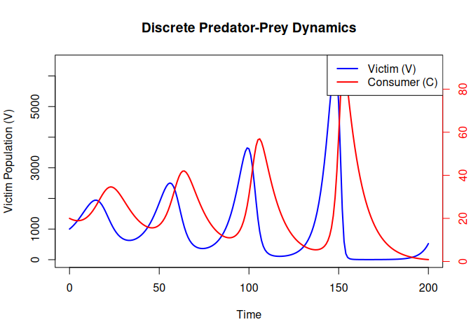

### 23.7.2 Phase Plot with ZNGIs

The phase plot shows the relationship between victim and consumer
populations.

    ### Phase Plot with ZNGIs, Initial Point, and Arrow
    plot(output_df$V, 
         output_df$C, 
         type = "l", 
         col = "purple", 
         lwd = 2, 
         xlab = "Victim (V)", ylab = "Consumer (C)", 
         main = "Discrete Predator-Prey Dynamics with ZNGIs")

    # Add Consumer ZNGI: dC/dt = 0 when V = q / (a * f) (a vertical line)
    abline(v = parameters["q"] / (parameters["a"] * parameters["f"]),
           col = "red", lwd = 2, lty = 2)

    # Add Victim ZNGI: dV/dt = 0 when C = R / a (a horizontal line)
    abline(h = parameters["R"] / parameters["a"], col = "blue", lwd = 2, lty = 2)

    # Add point for initial population sizes
    points(output_df$V[1], output_df$C[1], pch = 19, col = "black", cex = 1.5)

    # Add an arrow to the end of the line
    arrows(x0 = output_df$V[nrow(output_df) - 1], 
           y0 = output_df$C[nrow(output_df) - 1], 
           x1 = output_df$V[nrow(output_df)], 
           y1 = output_df$C[nrow(output_df)], 
           col = "purple", length = 0.1, lwd = 2)

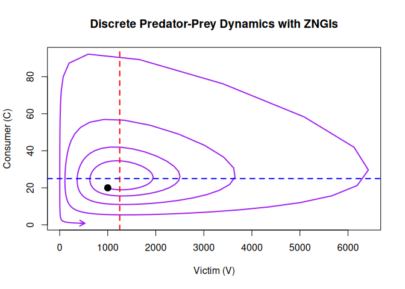

## 23.8 Conclusion

This document demonstrates how to implement and explore the
discrete-time Lotka-Volterra predator-prey model. By adjusting the time
step (*Δ**t*) and other parameters, you can investigate how
predator-prey dynamics are influenced by ecological factors. You will
see that a time lag imposed by the *t* parameter results in expanding
spirals in the phase plot and eventual extinction of predator and prey.
Contrast this with the perpetual oscillations you get with the
continuous time model.

## 23.9 Your task

- Decrease *Δ**t* to 0.1 and compare the phase plane behavior to
  *Δ**t* = 1.
- Increase *Δ**t* to 2 and observe whether extinction happens faster.

## 23.10 Takeaways

- Discrete time steps can destabilize otherwise stable predator-prey
  cycles.
- Smaller *Δ**t* values bring the discrete model closer to the
  continuous-time behavior.

<!--chapter:end:4_04_LotkaVolterraPredatorPrey_discreteTime.Rmd-->

# Part 5: Animal behaviour, altruism and sexual selection

This part uses game theory and behavioral models to explore how
selection shapes strategies like aggression, cooperation, and mating
behavior.

By the end of Part 5, you should be able to:

- Explain how payoffs influence behavioral strategies.
- Use game-theoretic reasoning to interpret conflicts and cooperation.
- Connect behavioral models to evolutionary outcomes.

<!--chapter:end:5_00_PartAnimalBehaviourAltruismAndSexualSelection.Rmd-->

# 24 Game theory: Hawks and doves

## 24.1 Background

Game theory is a mathematical discipline that examines decision-making
in competitive environments. It provides a framework to analyse
strategic interactions between rational actors and understand their
choices. One particularly fascinating concept in game theory is the Hawk
and Dove idea. Representing two distinct strategies, the Hawk embodies
aggression and assertiveness, always seeking to escalate conflicts and
dominate opponents. On the other hand, the Dove adopts a more peaceful
and conciliatory approach, aiming to avoid confrontations and achieve
cooperative outcomes.

By studying the Hawk and Dove strategies we can gain insights into
understanding the delicate balance between competition and cooperation,
shedding light on the dynamics of conflicts and the evolution of
cooperative behaviour in both the natural world and human societies.

The simple model unravels the intricacies of strategic decision-making,
with profound implications across various fields, from biology and
social sciences to economics and politics.

In this activity, you will play the hawk and dove game with a single
partner and then with multiple partners to observe the hypothetical
costs and benefits of antagonistic or cooperative behaviour,
respectively. The whole class enters results into one shared, live
spreadsheet as you play, so we can watch the class-wide patterns emerge
on screen in real time, round by round, instead of waiting until after
class to see what happened.

Learning outcomes:

- Understanding of the fundamental concepts of game theory and its
  application in analysing strategic interactions in competitive
  environments.
- Ability to apply game theory concepts to real-world contexts in
  biology, or politics.
- Appreciation of how simple models can be used to address complex
  biological or political decision making.
- Practice generating a testable prediction from a simple model *before*
  collecting data, then checking it against real, live class results.

## 24.2 Worked example

### 24.2.1 Inputs

- Benefit: *B* = 4
- Cost: *C* = 3

### 24.2.2 Steps

1.  Compute Hawk-Hawk payoff: (*B* − *C*)/2.
2.  Compute Hawk-Dove payoff to Hawk: *B* (and 0 to Dove).
3.  Compute Dove-Dove payoff: *B*/2 to each player.

### 24.2.3 Output and interpretation

Hawk-Hawk gives 0.5 each, Hawk-Dove gives `4` to Hawk and `0` to Dove,
and Dove-Dove gives `2` each.

## 24.3 Your task

Before the activity starts, review the cost-benefit payoff table below
to understand how to score the game.

## 24.4 The payoff table

The general payoff table looks like this (payoff to **Player 1**):

<table>
<thead>
<tr>
<th>Player 1  Player 2</th>
<th style="text-align: right;">Hawk</th>
<th style="text-align: right;">Dove</th>
</tr>
</thead>
<tbody>
<tr>
<td>Hawk</td>
<td style="text-align: right;"><span
class="math inline">(<em>B</em> − <em>C</em>)/2</span></td>
<td style="text-align: right;"><span
class="math inline"><em>B</em></span></td>
</tr>
<tr>
<td>Dove</td>
<td style="text-align: right;"><span class="math inline">0</span></td>
<td style="text-align: right;"><span
class="math inline"><em>B</em>/2</span></td>
</tr>
</tbody>
</table>

You can determine the benefit by looking at the left column and choosing
the row corresponding to the card you played. The box that corresponds
to your partner’s choice is in the top row. For this game, B equals four
(4), and C equals three (3). So depending on the cards played, player
one (i.e., you) would gain a score of two (2), four (4), zero (0), or
one-half (0.5). Like this:

<table>
<thead>
<tr>
<th>Player 1  Player 2</th>
<th style="text-align: right;">Hawk</th>
<th style="text-align: right;">Dove</th>
</tr>
</thead>
<tbody>
<tr>
<td>Hawk</td>
<td style="text-align: right;">0.5</td>
<td style="text-align: right;">4</td>
</tr>
<tr>
<td>Dove</td>
<td style="text-align: right;">0</td>
<td style="text-align: right;">2</td>
</tr>
</tbody>
</table>

### 24.4.1 What does theory predict?

Before you play, work through this with your partner.

Because B (4) is bigger than C (3), Hawk beats Dove *no matter what your
opponent plays*: against a Dove you get 4 (vs. 2 for playing Dove
yourself), and against a Hawk you still get 0.5 (vs. 0 for playing
Dove). So in a single, anonymous encounter, Hawk is the dominant
strategy — theory predicts everyone should end up playing Hawk.

But notice that mutual Hawk-Hawk (0.5 each) is *worse for both of you*
than mutual Dove-Dove (2 each). That means this game has the same
structure as the famous Prisoner’s Dilemma, with Hawk playing the role
of “Defect”.

- **Prediction for Game Two** (a new partner every round,
  i.e. effectively a series of one-off encounters): theory says Hawk
  should dominate and pay off best.
- **Prediction for Game One** (the *same* partner, 15 times in a row):
  think about what happens if you play Hawk against your partner. Might
  they retaliate next round? If you get stuck trading Hawk-Hawk for the
  rest of the game, is that better or worse than settling into mutual
  Dove-Dove? Write down what you think will happen to the *frequency of
  Hawk play* and to *total benefit* as the 15 rounds go on, before you
  start.

Keep your predictions — we’ll come back to them once the live results
are in.

### 24.4.2 Hypotheses

Building on the predictions above: the experimental hypothesis for this
exercise is that hawkish play will become *less* frequent, and less
profitable, between repeated partners (Game One), while hawkish play
will become *more* frequent, and more profitable, when interacting with
a variety of partners (Game Two). The null hypothesis is that there is
no systematic difference in strategy, or its payoff, between the
repeated-partner and changing-partner settings.

### 24.4.3 Instructor setup (before class)

*(Read this section if you are running the session — students can skip
ahead to “How today’s data collection works”.)*

To let the whole class see results build up live, set up one shared
spreadsheet before class instead of the old per-round Google Form:

1.  Duplicate the “Hawk-Dove Live Results” spreadsheet template (keep
    one copy per year — reuse and re-share it each time you teach the
    course). It needs two data tabs and one dashboard tab:
    - **Game1\_Data**: one row per pair, pre-filled with `Pair ID` = 1,
      2, 3, … (enough rows for `number of students / 2`). For each of
      the 15 rounds, two entry columns (`R1_P1`, `R1_P2`, `R2_P1`,
      `R2_P2`, … using `H`/`D`), plus a formula-computed benefit column
      per round and a `Total_P1_benefit` / `Total_P2_benefit` column, so
      students never have to do the arithmetic themselves. Keep `B` and
      `C` in two named cells that the benefit formulas refer to, so you
      can change the payoffs in future years without editing every
      formula.
    - **Game2\_Data**: one row per student, pre-filled with `Player ID`
      = 1, 2, 3, … up to the class size. For each of the 15 rounds, two
      entry columns (`R1_self`, `R1_opponent`, …), the same
      formula-computed per-round and total benefit columns.
    - **Live\_Dashboard**: charts wired to the data tabs — a line chart
      of “% Hawk played, by round” for each game, and a scatter chart of
      “mean hawkishness vs. total benefit” per pair/player for each game
      (these are the same two charts reproduced from archived data in
      the [Results of the hawk-dove
      games](#results-of-the-hawk-dove-games) chapter after class).
2.  Set sharing so students can edit without individually logging in
    (e.g. “anyone with the link can edit”), and share the link at the
    start of class (projected, or via itsLearning).
3.  Assign Pair IDs (Game 1) and Player IDs (Game 2) before class —
    e.g. by seat number or an attendance list — rather than letting
    students choose their own names or team labels. This is what lets
    everyone’s data line up automatically and avoids the messy
    name-matching problems free-text team names caused in past years.
4.  Project the **Live\_Dashboard** tab throughout the activity.
5.  After class, keep the spreadsheet (or an exported copy) as this
    year’s archived dataset for the Results chapter.

### 24.4.4 How today’s data collection works

Instead of filling in a new form after every round, the whole class
shares **one live spreadsheet**, projected on the screen as you play:

- You’ll be given a **Pair ID** (Game 1) or a **Player ID** (Game 2) —
  use it to find your row. Don’t invent your own label; the ID is what
  lets the spreadsheet combine everyone’s results automatically.
- You only ever type into your own row.
- Enter cards as single letters: `H` for Hawk, `D` for Dove. The
  spreadsheet calculates the benefit for you from the payoff table, so
  there’s no arithmetic to do mid-game.
- Watch the projected screen: two live charts update automatically as
  the class enters data, so you can see the round-by-round pattern
  emerge as you play (see “Watching the results live” below).

### 24.4.5 GAME ONE: repeated partner

1.  Find your assigned partner and note your shared **Pair ID**.
2.  Collect a set of two game cards (Hawk and Dove) — one each.
3.  Agree who is recorded as “Player 1” and who is “Player 2” for your
    pair (it doesn’t affect scoring).
4.  Conceal your cards. When the instructor gives the signal
    (“reveal!”), simultaneously show either card to your partner.
5.  Agree on which card each of you showed, then enter both (`H`/`D`)
    into your pair’s row for that round — one phone or laptop per pair
    is enough.
6.  Repeat for 15 rounds, waiting for the instructor’s signal each time.
    Try to strategise how to get the best benefit from every round, but
    don’t communicate your strategy with your partner beyond the cards
    themselves.
7.  At the end, check your row: the spreadsheet shows your total benefit
    across all 15 rounds. Whoever has the higher total in your pair is
    the “winner”, or the fittest, for Game One.

**No wifi?** Jot your results on paper first (round, your card,
partner’s card) and enter them all at once at the end — the live chart
will simply catch up when you do.

### 24.4.6 GAME TWO: changing partners every round

To swap partners quickly with a large class, use a **rotating circle**:
half the class forms an inner circle facing outward, the other half
forms an outer circle facing inward, so everyone starts facing one
partner.

1.  Find your assigned **Player ID** and starting position in the
    circle.
2.  Play a round exactly as in Game One: conceal your card, reveal on
    the instructor’s signal, agree on both cards played.
3.  Enter your own card and your opponent’s card (`H`/`D`) into your row
    for that round.
4.  When the instructor calls “rotate”, everyone in the **outer circle**
    shifts one position to their left. You now face a new partner for
    the next round.
5.  Repeat for 15 rounds. Because you rotate through the circle, you’ll
    play against 15 different people without any time lost searching for
    a free partner.

### 24.4.7 Watching the results live

As you play, two charts update automatically on the projected screen:

- **% playing Hawk, by round** — lets you see whether hawkish play
  increases, decreases, or stays flat as the rounds go by.
- **Total benefit vs. mean hawkishness**, one point per pair/player —
  lets you see, once the game finishes, whether being more hawkish or
  more dovish paid off better.

We’ll pause after each game to look at these together before moving on
to the next part.

## 24.5 Summarise and discuss results

Before looking at the final numbers, revisit the predictions you wrote
down earlier.

- Did the % Hawk trend in Game One and Game Two match what you
  predicted?
- Did the total-benefit-vs-hawkishness pattern support the one-shot
  theory prediction (Hawk pays off best), or the repeated-game
  reciprocity argument (Dove pays off best when you keep meeting the
  same partner)?
- Which game, if either, better matches what you’d expect from a species
  whose individuals encounter each other only once versus a species that
  lives in small, stable social groups?
- Discuss as a class what would likely happen if you increased or
  decreased the relative value of the benefit (B) compared with the
  cost (C) — would that change which strategy dominates in a one-off
  encounter?

The full analysis of the actual class data — including how the live
charts you just watched connect to the underlying theory — is worked
through in detail in the [Results of the hawk-dove
games](#results-of-the-hawk-dove-games) chapter.

## 24.6 Acknowledgement

This exercise is taken from
<https://www.jove.com/science-education/10611/group-behaviour>

## 24.7 Takeaways

- With B &gt; C, a single anonymous encounter is won by playing Hawk —
  but repeated encounters with the same partner change the incentives,
  because mutual Hawk-Hawk is worse for both players than mutual
  Dove-Dove.
- Collecting and displaying data live, as a class, makes it possible to
  test a theoretical prediction in real time rather than waiting until
  after the session.
- Game outcomes depend on the structure of the interaction (one-off
  vs. repeated), not just on the payoffs themselves.

### 24.7.1 Optional: running a live dashboard in R

If you’re comfortable with R, you can reproduce the same two live charts
yourself from the shared spreadsheet using the `googlesheets4` package,
instead of (or alongside) the spreadsheet’s own charts. This is optional
— the built-in spreadsheet charts are enough to run the session — but it
lets you generate the exact `ggplot2` figures used in the Results
chapter, live, during class.

    library(googlesheets4)
    library(dplyr)
    library(ggplot2)

    # A publicly-editable sheet can be read without signing in:
    gs4_deauth()

    sheet_url <- "PASTE_THIS_YEAR'S_LIVE_SHEET_URL_HERE"

    # Re-run this chunk (or wrap it in a Shiny app / while-loop with Sys.sleep())
    # every 10-15 seconds during class to refresh the live view.
    game1 <- read_sheet(sheet_url, sheet = "Game1_Data")

    hawkishness_by_round <- game1 %>%
      select(starts_with("R")) %>%
      # ... reshape to one row per (round, player) and summarise mean % Hawk ...
      summarise(across(everything(), ~ mean(. == "H", na.rm = TRUE)))

    # See the Results chapter for the full analysis pipeline these numbers feed into.

<!--chapter:end:5_01_HawkDoveCardGame.Rmd-->

# Part 6: Solutions/answers

This part provides model answers and worked solutions. Use it to check
your reasoning after attempting the tasks.

By the end of Part 6, you should be able to:

- Compare your work to model solutions.
- Diagnose mistakes in reasoning or calculation.
- Reflect on alternative interpretations when results differ.

<!--chapter:end:6_00_PartSolutionsAnswers.Rmd-->

# 25 Solutions and “take-home” messages

In this section you will find the solutions and/or main take home
messages of the practical exercises used in this course.

## 25.1 How to use this section

Use these solutions to check your reasoning after you attempt the tasks.
If your answer differs, focus on the logic rather than the final number.

## 25.2 Solutions: The blind watchmaker

- *What happens if selection is turned OFF?*

If there is no selection, then there is no adaptation. Selection is
required to retain the changes and pass to the next generation. With no
selection the result is purely random.

- *Does the number of generations affect whether the target phrase is
  reached?*

Yes, if the phrase is complex, it may take many generations to reach.
Increasing the number of generations will improve the chance that the
target is reached.

- *Does the speed of reaching the target phrase depend on the length of
  the phrase?*

Yes. Shorter target phrases are achieved quicker than longer ones.

- *How does this simulation differ from real natural selection?*

Two ways. Firstly, natural selection does not have a specific long-term
goal (i.e. target). It is simply that the better survivors are more
represented in the next generation. Secondly, in natural selection each
intermediate step needs to be advantageous compared to the previous
step, which is not necessarily the case here.

## 25.3 Solutions: Bug hunt camouflage

- *What happens to the average colour of the bug population with time as
  you hunt?*

The colour evolves to become more similar to the background colour
because you (the hunter) find it harder to find these better-camouflaged
individuals.

- *What happens to your hunting efficiency?*

Your hunting efficiency tends to decrease with time because the bugs are
evolving to be harder to see. They are evolving camouflaged colours.

- *Would you say that the bug population becomes worse or better adapted
  to their environment?*

The population becomes better-adapted to their environment with time.

- *Can you explain how this happens?*

You (the hunter) kill the most obvious bugs first (i.e. those with
contrasting colours to the background). These are the individuals that
are not well-adapted to the environment. The survivors have offspring
that are similar to them, while the ones you kill leave no offspring. So
as time goes on, the population becomes dominated by individuals that
are well-camouflaged.

- *After simulating in one environment (e.g. poppy field) for a few
  minutes, pause then switch to another environment. Are the bugs now
  well- or poorly-adapted to their environment?*

Changing the environment means that the individuals are now
poorly-adapted to their environment. This is because the individuals now
find themselves in an environment that they did not evolve in. Their
evolved camouflage does not work so well in a new environment.

- *Do the genotypes of individuals change (e.g. with individual age)?*

No, individuals’ genotypes are fixed. The change in the population
occurs because of selection of individuals to reproduce. Better-adapted
individuals are more likely to reproduce.

- *Increasing the “max-mutation-step” makes bug offspring less like
  their parents. How do you think this will influence the speed of
  adaptation of the bugs?*

Increasing the amount of variation in offspring will tend to speed up
adaptation. However, there are limits: too much variation can cause
maladaptation of offspring. For example, if a parent is well-adapted
(perfectly camouflaged), too much variation in offspring could lead to
some offspring being poorly-camouflaged and therefore vulnerable to
predation.

## 25.4 Solutions: Geometric growth

You can find the completed Excel file
[here](https://www.dropbox.com/s/sfxu1lbrxyqt462/GeometricGrowth%20-%20complete.xlsx?dl=1).

Take home messages:

- The rate of exponential/geometric growth depends on the population
  growth rate.
- Lambda (*λ*) values  &lt; 1 lead to a exponential *decrease*, while
  values  &gt; 1 lead to exponential growth. A *λ* of 1 indicates no
  change.
- Exponential growth is unlimited. This is unrealistic because very soon
  competition (what Darwin called “The struggle for existence”) will
  soon take effect as the population runs out of space or resources.
  Nevertheless, the model is useful and realistic for some limited
  situations (e.g. early population growth for new invaders)
- Growth trajectories can be plotted on the *natural scale* or on a *log
  scale*. Exponential growth (or decline) plotted on a log scale is a
  straight line. This could be useful to infer biological processes (or
  the lack of them). For example, exponential growth in population size
  indicates that there are no forces currently limiting the population
  (e.g. predators/competition/management actions).
- The slope of the population growth on the natural log scale can tell
  you what *λ* is. The “opposite” of *ln* is *exp*, so you can ask Excel
  to \`=EXP(slope).

## 25.5 Solutions: Estimating Population Growth Rate

You can find the completed Excel file
[here](https://www.dropbox.com/scl/fi/sxvtkuwxs0mn9ohgwh0ot/EstimatingGrowth_completed.xlsx?rlkey=lzefpmqt3ishxze4weoy9nz65&dl=1).

1.  What does the log-transformed plot of population size over time tell
    you about the population’s growth trend? Does the population grow
    exponentially?

- The log-transformed plot should show a straight line if the population
  is growing exponentially, because the natural logarithm of an
  exponentially growing population will linearise the exponential curve.
  The slope of this line represents the natural log of the population
  growth rate *l**o**g*(*λ*). If the line has a positive slope, it
  indicates the population is growing; if it’s flat, the population is
  stable; and if it’s negative, the population is shrinking.
- In this exercise, assuming *λ* &gt; 1, the population is indeed
  growing exponentially, which will be reflected by a positively sloped
  line in the log-transformed plot.

1.  What is the estimated population growth rate (*λ*) based on your
    regression analysis?

- From the linear regression performed on the log-transformed data, the
  slope of the line corresponds to *l**o**g*(*λ*). To find *λ*,
  exponentiate the slope: *λ* = *e*<sup>slope</sup>.
- For example, if the slope of the regression line is 0.086, then
  *λ* = *e*<sup>0.086</sup> ≈ 1.09. This means the population grows by
  approximately 9% per year, matching the initial assumption of
  *λ* = 1.09.

1.  What assumptions does this model make? Discuss any potential
    real-world factors that might affect the accuracy of your estimate
    for *λ*.

- The model assumes a constant growth rate over time. It does not
  account for environmental changes, resource limitations, or carrying
  capacity (which would lead to logistic rather than exponential
  growth).

- The model also assumes no immigration, emigration, or catastrophic
  events that might disrupt the population trend.

- **Environmental variability**: In reality, populations experience
  fluctuations due to weather, food availability, disease, and other
  stochastic factors, which can cause growth rates to change over time.

- **Density dependence**: As populations grow larger, they may face
  resource limitations or increased competition, leading to a slowdown
  in growth, which would not be captured by a simple geometric model.

- **Measurement errors**: In practice, the measurement of population
  sizes may not be precise, as discussed earlier with the introduction
  of noise. These errors can lead to inaccuracies in estimating *λ*.

## 25.6 Solutions: Stochastic population growth

You can find the completed Excel file
[here](https://www.dropbox.com/s/baao06vi0c0quns/StochasticPopulationGrowth-complete.xlsx?dl=1).

Take home messages:

- Population growth rates are unlikely to be constant through time.
- Environmental stochasticity will cause changes through time in vital
  rates (birth/death) which will influence *λ* (and *r*<sub>*m*</sub>).
- We can model environmental stochasticity using a distribution of
  population growth rates instead of a single deterministic value.
- We then can randomly draw growth rate values from this distribution
  for each time-step in a population projection.
- The “spread” or uncertainty in the population size at a future time
  point depends on (i) the spread (variance) of the distribution
  and (ii) the amount of time elapsed.
- We can repeatedly simulate a population projection (e.g. in R, or more
  laboriously in Excel) to get a feel for the likely fate of a
  population. E.g. “what percent of the projections show extinction
  within 50 years?”.
- We can use this relatively simple and “unrealistic” model to
  nevertheless get an intuition about general trends in population
  dynamics and extinction risk.
- Extinction probability increases as (i) initial population size
  decreases; (ii) variance increases; (iii) growth rates decrease; (iv)
  the time frame increases.

## 25.7 Solutions: Basic logistic population growth

You were asked to use the Excel sheet to answer some questions about
logistic growth by examining the graphs.

**First – take a look at Graph 1**.

- *What is the maximum population size?*
- *How does this compare to carrying capacity (K)?*
- *What do you predict to happen if you increase K to 300?*
- *Try doing that. Were you correct?*

You should notice that when the population growth rate
(*r*<sub>*m*</sub>) is around 1 or lower, the maximum population size is
the same as the carrying capacity (*K*). As you change *K*, this maximum
population size will change accordingly.

If *r*<sub>*m*</sub> is markedly greater than 1, then the population
size can exceed the carrying capacity. This is because the population
grows so fast that it “*overshoots*” carrying capacity and then
fluctuates around K.

- *At what time do you reach the maximum population size?*
- *If you halved growth rate (r\_m) to 0.4, what do you think will
  happen to this time?*
- *Try doing that. Were you correct?*

You should notice that the time taken to reach the maximum population
size is related to the growth rate (*r*<sub>*m*</sub>). As you increase
*r*<sub>*m*</sub>, the time taken to hit the maximum population size
decreases. If you halve the growth rate, the time taken to reach maximum
population size is doubled.

- *What do you think will happen if you increase growth rate to 1.8?*
- *Try that… were you correct?*
- *What do you notice about the population size through time?*
- *How does the maximum population size compare with the carrying
  capacity?*
- *How would you describe the dynamics of this population?*

You should notice that the population overshoots carrying capacity
(*K*), then oscillates around *K* with damped oscillations that
gradually move towards *K*. Therefore if a population has even a
moderate population growth rate, and if it has density-dependence, then
it can fluctuate in numbers without any extrinsic factor (like weather)
acting.

- *What happens if you increase the growth rate even more, to 2 or 2.1?*
- *And even more to 2.8, 2.9 or 3?*
- *How would you describe these dynamics?*
- *Is there a limit to how high *r*<sub>*m*</sub> can be? (hint:
  populations go extinct if N &lt; 0).*

You should notice that as you increase *r*<sub>*m*</sub> the nature of
the oscillations changes. In fact, this is predictable: If
*r*<sub>*m*</sub> &lt; 1.0, then population will approach *K* smoothly.

If 1.0 &lt; *r*<sub>*m*</sub> &lt; 2.0, then oscillations of decreasing
amplitude around K.

If 2.0 &lt; *r*<sub>*m*</sub> &lt; 2.57, then stable, cyclic
oscillations around K . They can be 1 or 2+ point stable limit cycles.

If *r*<sub>*m*</sub> &gt; 2.57, then population will fluctuate
chaotically.

If *r*<sub>*m*</sub> is too high, the population will fluctuate and
crash to extinction.

*Compare the population trajectory in Graph 1 for populations with
*r*<sub>*m*</sub>= 2.8 and 2.81. Then compare the trajectories where you
fix *r*<sub>*m*</sub> at 2.8 but vary initial population size by a small
amount (e.g. 1). Imagine you were a population manager – would these
populations be easy or hard to predict? What kinds of species have high
population growth rates like these?*

When *r*<sub>*m*</sub> is high ( &gt; 2.57) the population dynamics
become extremely hard (impossible) to predict because they are chaotic.
This means that even a very small change in *r*<sub>*m*</sub> (which
could simply be measurement error) will mean that predicted population
size next year is suddenly very different. This would cause big problems
to a population manager.

Many pest species and diseases have very high population growth rates.
For example, locusts, or measles. This is one reason why it is hard to
predict when the next pest/disease outbreak will happen

**Now let’s turn to Graph 2**

*In graph 2, notice that the per capita growth rate always declines
linearly with population size (*N*). Where does it cross the x-axis
line? Modify the carrying capacity (*K*) – what do you notice?*

The line describing per capita growth rate crosses the x-axis
(population size) at *K*. i.e. if *K* = 100, the line crosses at 100. If
you change *K*, the intercept on the axis also changes accordingly. The
line intercepts the x-axis at this point no matter what the population
growth rate is. It intercepts the y-axis at *r*<sub>*m*</sub>.

*How would the same plots look for regular exponential growth?*

The equivalent plot (for Graph 2) for exponential growth would be a
horizontal line - because population growth rate does NOT depend on
population size.

## 25.8 Solutions: Deeper into logistic growth

### 25.8.1 Relationship between Logistic and Exponential growth equations

The logistic growth equation simplifies to become the exponential growth
equation if you set *K* to be infinite (∞). The simplification goes like
this:

1.  $\frac{d N}{d t}=r N\left(1-\frac{N}{K}\right)$
2.  $\frac{d N}{d t}=r N\left(1-\frac{N}{\infty}\right)$
3.  $\frac{d N}{d t}=r N\left(1-0\right)$
4.  $\frac{d N}{d t}=r N \times 1$
5.  $\frac{d N}{d t}=r N$

This simplification also works with the discrete version of the
equation,
$N\_{t+1}=N\_{t}+r\_{d} N\_{t}\left(1-\frac{N\_{t}}{K}\right)$.

### 25.8.2 Type of dynamics depends on *r*<sub>*m*</sub>.

As you increase *r*<sub>*m*</sub>, the dynamics of the population
changes. At low *r*<sub>*m*</sub> population size (*N*) simply converges
on the carrying capacity, *K*. As *r*<sub>*m*</sub> you will see damped
oscillations whereby *N* overshoots *K* and then oscillates and
converges to *K*. Then you will see cycles where the population size
oscillates *around* *K*. The cycles can be simple two-point cycles
(where *N* bounces between two points), or more complex with *N*
bouncing between four-points (or more). In fact, the critical values of
*r*<sub>*m*</sub> that define the type of dynamics are fixed: if we know
*r*<sub>*m*</sub> we can predict the type of dynamics.

The behaviour of the population dynamics depends only on
*r*<sub>*m*</sub>, not on *K* or starting population size
(*N*<sub>0</sub>) (as long as *N*<sub>0</sub> &gt; *K*).

### 25.8.3 You can obtain parameters from graphs

You should notice that having some information about what the parameters
are will allow you to sketch the dynamics. Conversely, if you have a
graph showing aspects of the population dynamics, you could figure out
what the parameters of the logistic equation are.

For Exponential growth, population size is unlimited and will grow
exponentially if *r* is  &gt; 0 (or *λ* &gt; 1). Logistic growth will
show some kind of limit (damped oscillation, or whatever), as the
population size is attracted to *K* in some way.

In logistic growth, the per capita growth rate declines as population
size increases, and reaches 0 when *N* = *K*. In exponential growth, the
per capita growth rate remains constant and unaffected by *N*. Therefore
the graphs of growth rate vs. N will be very different: Logistic = a
negative slope, exponential = a horizontal line.

### 25.8.4 Time lag

Time lagged density dependence results in oscillations. Therefore if we
see oscillations in dynamics it could be due to a particular
*r*<sub>*m*</sub> value or lagged density dependence.

### 25.8.5 Chaotic dynamics

Chaotic dynamics are deterministic in the sense that if you have the
same initial conditions you will get the same results (dynamics).
However, small changes in any parameters (*N*<sub>0</sub>, *K*, or
*r*<sub>*m*</sub>) will lead to very different dynamics - so in that
sense, because of measurement error, the population dynamics would be
very hard to predict in practice.

## 25.9 Solutions: Life tables and survivorship types

The take home messages for this exercise are that life tables are a rich
source of information on the life history of a population or species.
From a simple accounting of ages at death and fertility we can obtain
information about the “shape” of the survivorship trajectory: do most
deaths happen early or late? Is mortality risk constant with age? We can
also calculate measures including **generation time**, *R*<sub>0</sub>
and population growth rate. You should know what these measures mean.

You should understand the relationship between mortality risk and
survivorship curve. In other words, you should be able to describe, or
do a rough sketch of mortality risk with age, if you have a survivorship
curve (or vice versa).

The completed Excel spreadsheet is
[here](https://www.dropbox.com/s/j8uv2wf7nz0ygmp/Life%20tables%20exercise%20-%20complete.xlsx?dl=1).

## 25.10 Solutions: Matrix population modelling

The main take home messages for this class are that you should: (1)
understand, and be able to draw or interpret life cycle diagram; (2) be
able to (roughly) parameterise a model shown in the life cycle diagram;
(3) be able to write out a matrix model (the square of numbers) for a
given life cycle diagram (and *vice versa*). (4) understand how
population projection works, and to therefore interpret a figure or
description showing a population projection. (5) understand what an
elasticity matrix tells us (it tells us the relative importance of the
transitions for population growth) (6) understand the concept of doing
an LTRE to investigate management options.

## 25.11 Solutions: How many eggs should a bird lay?

You can find a completed Excel spreadsheet
[here](https://www.dropbox.com/s/tcpxmdfvm35jzgr/How%20many%20eggs%20-%20answers.xlsx?dl=1).

The take-home message is that the trade-off between number of eggs and
juvenile survival leads to an optimum number of eggs required to
maximise reproductive success (i.e. number of surviving chicks).

You can move this optimum if the trade-off is changed. For example, if
you increase survival of the chicks from larger clutches, then the
optimum number of eggs will increase.

This fact reminds us that the environment (e.g. predation risk and
resource abundance) will be an important factor in determining the
evolution of life history parameters (like average number of babies).

## 25.12 Solutions: Trade-offs and the force of selection

*Simulate this by adding 1 to fertility (mx) in year 1 (the benefit) but
reducing survival to 0 (all die) at age 25 (the cost). What is the
fitness of this strategy?*

Fitness (R0) would be 50.76 (compared to 49.81).

*By setting survival to 0 at other ages, determine how many years of
life could be lost before this cost is no longer worth bearing. Is this
surprising?*

You could “kill” the species at 18, losing 8 years of life, before the
new strategy of a small increase in fertility at the expense of years of
life at the end of life becomes unfavourable. In other words, a cost of
losing 8 yrs of life is worth bearing if the benefit is an extra baby in
year 1.

*Now reset everything (mx =10; survival = 0.8). Recall what fitness was
when you added 1 to mx at age 1 (R0=50.811). If, instead of adding to mx
at age 1 you were to increase mx at age 25, how much would you need to
increase it to reach this figure?*

At age 25 you would need to increase Fertility from 10 to 222 to reach
the same level of improvement in fitness as increasing Fertility from 10
to 11 at age 1.

*What about at age 20?* 10 to 80 *Age 15?* 10 to 33 *Age 10?* 10 to 18
*Age 5?* 10 to 13

*What do you notice?*

You should notice that changes made at younger ages have a bigger effect
than those at older ages. I have plotted this to the right. The plot
shows the amount of increase in fertility that would be required to
raise fitness (R0) from 49.81 to &gt;50.81 at ages 1 through to 25
(i.e. the figures you estimated above). You can see that you only need
to change fertility a little bit at young ages, but you would need to
make BIG changes at older ages.

*Reset everything again (mx =10; survival = 0.8). Set mx from age 15
onwards to be 0. Now alter survival rate after this point (at ages
15-25). What happens to fitness?*

You should notice that any changes you make to survival AFTER
reproduction has been completed will have no effect on fitness. In other
words evolution “doesn’t care about you” after you have finished with
reproduction.

## 25.13 Solutions: Hardy-Weinberg equilibrium

Answers to the Hardy-Weinberg questions.

Remember the basic formulas:
*p*<sup>2</sup> + 2*p**q* + *q*<sup>2</sup> = 1 and *p* + *q* = 1

*p* = frequency of the dominant allele in the population

*q* = frequency of the recessive allele in the population

*p*<sup>2</sup> = percentage of homozygous dominant individuals

*q*<sup>2</sup> = percentage of homozygous recessive individuals

2*p**q* = percentage of heterozygous individuals

### 25.13.1 Problem 1

The frequency of the *aa* genotype: 36%, as given in the problem itself.

The frequency of the *a* allele: The frequency of aa is 36%, which means
that *q*<sup>2</sup> = 0.36, by definition. If *q*<sup>2</sup> = 0.36,
then *q* = 0.6. Since *q* equals the frequency of the “a” allele, the
frequency is 60%.

The frequency of the *A* allele: Since *q* = 0.6, and *p* + *q* = 1,
then *p* = 0.4; the frequency of *A* is equal to *p* (see the basic H-W
equations), so the answer is 40%.

The frequencies of the genotypes *AA* and *Aa*: The frequency of *AA* is
equal to *p*<sup>2</sup>, and the frequency of *Aa* is equal to 2*p**q*.
So, using the information above, the frequency of *AA* is 16%
(i.e. *p*<sup>2</sup> = 0.4*x*0.4 = 0.16 and Aa is 48%
(2*p**q* = 2 × 0.4 × 0.6 = 0.48).

The frequencies of the two possible phenotypes if *A* is completely
dominant over *a*: Because *A* is totally dominate over *a*, the
dominant phenotype will show if either the homozygous *AA* or
heterozygous *Aa* genotypes occur. The recessive phenotype is controlled
by the homozygous *aa* genotype. Therefore, the frequency of the
dominant phenotype equals the sum of the frequencies of *AA* and *Aa*,
and the recessive phenotype is simply the frequency of *aa*. Therefore,
the dominant frequency is 64% and, in the first part of this question
above, you have already shown that the recessive frequency is 36%.

### 25.13.2 Problem 2

9% = 0.09 = ss = *q*<sup>2</sup>. To find *q*, simply take the square
root of 0.09 to get 0.3. Since *p* = 1 − 0.3, then *p* must equal 0.7.
2*p**q* = 2 × 0.7 × 0.3 = 0.42, so 42% of the population are
heterozygotes (carriers).

### 25.13.3 Problem 3

The frequency of the recessive allele. Since we believe that the
homozygous recessive for this gene (*q*<sup>2</sup>) represents 4%
(i.e. = 0.04), the square root (*q*) is therefore 0.2 (20%).

The frequency of the dominant allele. Since *q* = 0.2, and
*p* + *q* = 1, then *p* = 0.8 (80%).

The frequency of heterozygous individuals. The frequency of heterozygous
individuals is equal to 2*p**q*. In this case, 2*p**q* = 0.32, which
means that the frequency of individuals heterozygous for this gene is
equal to 32% (i.e. 2 × 0.8 × 0.2) = 0.32.

### 25.13.4 Problem 4

The first thing you’ll need to do is obtain *p* and *q*. So, since white
is recessive (i.e. *bb*), and 40% of the butterflies are white, then
*bb* = *q*<sup>2</sup> = 0.4. To determine *q*, which is the frequency
of the recessive allele in the population, take the square root of
*q*<sup>2</sup> which is 0.632. So, *q* = 0.63. Since *p* + *q* = 1,
then *p* must be 1 − 0.63 = 0.37.

Now then, to answer our questions. First, what is the percentage of
butterflies in the population that are heterozygous? Well, that would be
2*p**q* so the answer is 2 × 0.37 × 0.63 = 0.47. Second, what is the
frequency of homozygous dominant individuals? That would be
*p*<sup>2</sup> or 0.37<sup>2</sup> = 0.14.

## 25.14 Solutions: Gene pool model

### 25.14.1 Discussion questions

1.  **How does population size affect the variation through time in
    allele frequencies? Why do you see these patterns?**
    - Population size plays a crucial role in determining the variation
      in allele frequencies over time. In small populations, random
      genetic drift has a more pronounced effect, leading to larger
      fluctuations in allele frequencies. This is because in smaller
      populations, the random sampling of alleles during reproduction
      can result in significant changes in allele frequencies. In
      contrast, in larger populations, these random fluctuations are
      dampened due to the “averaging” effect of having more individuals.
      Hence, allele frequencies in larger populations tend to be more
      stable over time.
2.  **How does the probability of *fixation* change with population
    size?**
    - The probability of fixation of a new mutation is equal to its
      initial frequency. For a new mutation appearing in a population,
      its initial frequency is 1/2N, where N is the population size.
      Thus, in smaller populations, a new allele has a slightly higher
      chance of becoming fixed compared to in larger populations.
      However, it’s essential to note that while the probability of
      fixation is higher in smaller populations, the overall genetic
      drift effect is also more pronounced, which means alleles might be
      lost or fixed more rapidly.
3.  **When the population size is large (say 1000), is it still possible
    for alleles to become fixed?**
    - Yes, it is still possible for alleles to become fixed in a large
      population, but it typically takes a longer time compared to
      smaller populations. The larger the population, the more
      generations it usually takes for an allele to become fixed purely
      by chance (genetic drift). However, other factors like selection
      can expedite this process.
4.  **Are rare alleles (defined with allele frequency) more or less
    likely to be lost than common ones? What implications does this have
    for new alleles (mutations)?**
    - Rare alleles are more likely to be lost from a population than
      common ones due to genetic drift. This is especially true in small
      populations where random events can have a more pronounced impact
      on allele frequencies. For new alleles (which start as rare
      alleles when they first appear), this means they have a higher
      likelihood of being lost from the population before they can
      increase in frequency. However, if a new mutation provides a
      selective advantage, it can increase in frequency and become
      common, reducing its chance of being lost.

### 25.14.2 Bottlenecks

Of course, let’s dive into the answers for the discussion questions
related to genetic bottlenecks:

1.  **How does a genetic bottleneck influence the genetic composition of
    the population?**
    - **Answer:** A genetic bottleneck results in a sudden and drastic
      reduction in the size of a population. This means that only a
      subset of the genetic variation present before the bottleneck
      remains in the population that survives. As a consequence, the
      genetic composition of the population post-bottleneck is often
      less diverse. Certain alleles may be lost entirely, while others
      might become more prevalent or even fixed. This change in allele
      frequencies due to the bottleneck can lead to reduced genetic
      diversity and can make the population more vulnerable to diseases,
      environmental changes, and other threats because of the lack of
      genetic variability.
2.  **How might a genetic bottleneck impact the probability of genetic
    fixation?**
    - **Answer:** A genetic bottleneck can significantly increase the
      probability of genetic fixation, especially if the bottleneck is
      severe and the population size is drastically reduced. When the
      population size is small, random genetic drift has a more
      pronounced effect, leading to rapid changes in allele frequencies.
      In such scenarios, certain alleles might quickly become fixed in
      the population purely by chance, even if they don’t confer any
      selective advantage. Conversely, beneficial alleles could also be
      lost entirely, a phenomenon known as “drift override.”
3.  **Does the severity of the bottleneck (i.e. length and population
    size) matter?**
    - **Answer:** Yes, the severity of the bottleneck, both in terms of
      its duration (length) and the remaining population size, plays a
      crucial role in determining its genetic consequences. A more
      extended bottleneck or one that drastically reduces the population
      size can lead to a more significant loss of genetic diversity. The
      longer a population remains small, the more time there is for
      genetic drift to affect allele frequencies, leading to the
      potential loss or fixation of alleles. Similarly, the smaller the
      surviving population, the greater the influence of random sampling
      effects on genetic composition. Thus, both the duration and the
      intensity of the bottleneck are critical factors in determining
      its genetic impact.

### 25.14.3 Broader questions

1.  **What are the limitations of this simulation? What other real-world
    factors and complexities are not considered in this simplified
    model?**
    - **Answer:** The simulation is a simplified representation of
      real-world gene pool dynamics. Some of the limitations include:
      - **Selection Pressure:** The model does not account for natural
        selection, where certain alleles may confer a survival or
        reproductive advantage.
      - **Migration:** In the real world, populations are not always
        isolated. Gene flow between populations due to migration can
        significantly influence allele frequencies.
      - **Mutations:** Over time, new alleles can arise in a population
        due to mutations, introducing additional genetic variability.
      - **Non-Random Mating:** The model assumes random mating, but in
        nature, there might be preferences or restrictions that
        influence mating choices.
      - **Environmental Factors:** In real-world scenarios, changing
        environments can influence which alleles are beneficial or
        detrimental.
2.  **Why is genetic diversity important to a population, for example in
    a conservation context?**
    - **Answer:** Genetic diversity is crucial for the adaptability and
      survival of a population. In a conservation context:
      - **Resilience to Diseases:** A genetically diverse population is
        less likely to be wiped out by a single disease, as some
        individuals might have resistance.
      - **Adaptation to Changing Environments:** Diverse genes mean a
        higher chance that some individuals in the population have
        traits beneficial for surviving in changing conditions.
      - **Reduced Inbreeding:** High genetic diversity reduces the
        chances of inbreeding, which can lead to the expression of
        deleterious recessive alleles and overall reduced fitness of the
        population.
      - **Long-Term Survival:** Over many generations, genetic diversity
        ensures that populations can evolve and adapt to long-term
        changes in their environment.
3.  **Can you think of real-life scenarios where understanding gene pool
    dynamics would be valuable, such as in conservation biology or
    medical genetics?**
    - **Answer:** Absolutely!
      - **Conservation Biology:** When trying to revive endangered
        species, understanding gene pool dynamics can help
        conservationists make informed decisions about breeding programs
        to maintain or increase genetic diversity.
      - **Medical Genetics:** Understanding the gene pool is crucial
        when studying the prevalence of genetic disorders within
        specific populations or tracing the origin and spread of certain
        genetic traits.
      - **Agriculture:** Crop breeders often need to understand gene
        pool dynamics to develop strains that are resistant to diseases,
        pests, or changing climate conditions.
      - **Pharmacogenomics:** In medicine, understanding how different
        populations metabolise or react to drugs based on their genetic
        makeup can be invaluable.
4.  **Can you think of a way to simulate the genetics of a population
    that is steadily shrinking through time?**
    - **Answer:** To simulate a steadily shrinking population, one could
      adjust the model to reduce the population size in each subsequent
      generation. This could be achieved by setting a percentage
      reduction or a fixed number by which the population decreases in
      each time step. During each iteration of the simulation, the model
      would then sample from an increasingly smaller gene pool,
      reflecting the reduction in population size. Over time, this would
      likely lead to more pronounced effects of genetic drift, with
      alleles potentially being lost or becoming fixed at a faster rate.

## 25.15 Solutions: Neutral or adaptive evolution in humans

The take home message here is that whether traits are adaptive or
neutral depends on the environment.

Consider genes that confer antibiotic resistance on bacteria. In the
absence of antibiotics, these genes are not important and are not
selected for. They still evolve (if they vary among individuals and are
inherited), but this evolution is neutral with no selection. On the
other hand, when antibiotics are introduced to the system, those same
genes are strongly selected for and evolution of the genes for
antibiotic resistance is now strongly adaptive. Context matters.

The same is the case for traits in humans. Assuming that the traits vary
among individuals and are inherited, their neutrality or adaptiveness
depends on their effect on fitness. If the traits have strong effects on
fitness then they will be under strong selection but if they have weak
or no effects on fitness they will evolve via neutral evolution.

Example traits that evolve via neutral evolution include fingerprint
structure and iris structure. The detailed structures are not important
to fitness, but are still genetically determined, and inherited.

Traits like muscle strength, running speed may have been important for
fitness when they helped our ancestors obtain food. In those
environments, they would have been under selection and therefore evolve
via adaptive evolution. In more modern times, these selection pressures
are weaker.

## 25.16 Solutions: Heritability

You can read in data like this:

Though you can also use the “Wizard” in RStudio.

Plot the data as follows.

    ## 
    ## Call:
    ## lm(formula = Offspring_value ~ Parent_value, data = pop_1)
    ## 
    ## Residuals:
    ##      Min       1Q   Median       3Q      Max 
    ## -16.9417  -3.8648  -0.2452   4.5332   9.3121 
    ## 
    ## Coefficients:
    ##              Estimate Std. Error t value Pr(>|t|)    
    ## (Intercept)   11.2533    10.9533   1.027    0.312    
    ## Parent_value   0.5678     0.1114   5.097 1.63e-05 ***
    ## ---
    ## Signif. codes:  0 '***' 0.001 '**' 0.01 '*' 0.05 '.' 0.1 ' ' 1
    ## 
    ## Residual standard error: 5.506 on 31 degrees of freedom
    ## Multiple R-squared:  0.4559, Adjusted R-squared:  0.4384 
    ## F-statistic: 25.98 on 1 and 31 DF,  p-value: 1.628e-05

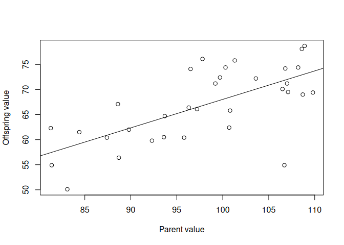

The heritability is the slope of the relationship, so is 0.568 in this
case. This is fairly high heritability.

*What does the heritability tell us about the amount of variation
explained by genetic factors?*

A heritability of 0.568 for wing length indicates that 56.8% of the
observed variation in this trait within the population can be attributed
to genetic factors. In other words, a significant portion of the
variation in wing length is genetically determined.

*What other factors might explain the remaining variation?*

There are many other factors at play. The remaining 43.2% of variation
could be due to environmental factors such as diet, climate, or social
interactions. It might also include measurement error or other
stochastic events.

*How would the heritability estimate change if you used a different
trait (e.g., beak length instead of wing length)?*

Heritability is trait-specific. The heritability estimate for beak
length could be higher, lower, or the same as that for wing length,
depending on the genetic and environmental variances contributing to
this particular trait.

*What does the heritability tell us about how fast a trait might change
due to selection?*

A higher heritability (like 0.568) suggests that the trait would respond
more quickly to selection because a large proportion of the variation is
genetic. Traits with lower heritability would be slower to respond to
selection as they have a larger environmental component.

The graph for the second population looks like this:

Plot the data as follows.

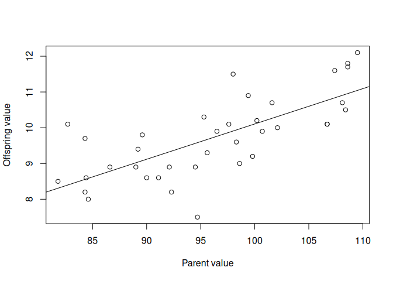

    ## 
    ## Call:
    ## lm(formula = Offspring_value ~ Parent_value, data = pop_2)
    ## 
    ## Residuals:
    ##     Min      1Q  Median      3Q     Max 
    ## -2.0829 -0.5187 -0.1199  0.6578  1.7023 
    ## 
    ## Coefficients:
    ##              Estimate Std. Error t value Pr(>|t|)    
    ## (Intercept)   0.22970    1.53505   0.150    0.882    
    ## Parent_value  0.09877    0.01590   6.212 4.07e-07 ***
    ## ---
    ## Signif. codes:  0 '***' 0.001 '**' 0.01 '*' 0.05 '.' 0.1 ' ' 1
    ## 
    ## Residual standard error: 0.8022 on 35 degrees of freedom
    ## Multiple R-squared:  0.5244, Adjusted R-squared:  0.5108 
    ## F-statistic: 38.59 on 1 and 35 DF,  p-value: 4.066e-07

For this population, the heritability (slope of the relationship) is
0.099 in this case. This is fairly low heritability.

*What does the heritability tell us this time?*

A heritability of 0.099 in the second population indicates that only
9.9% of the variation in wing length is attributable to genetic factors.
This is substantially lower compared to the first population, suggesting
that environmental factors have a greater influence on the trait in this
particular population.

*Can you identify any environmental factors that might explain the
difference?*

Various environmental factors could explain the lower heritability in
the second population. These might include (but are not limited to):
Nutrition: Inadequate nutrition can lead to stunted growth or
development, which could introduce a significant environmental variable
into wing length. Poor nutrition might limit the expression of genes
related to wing growth, thereby reducing the observed heritability as
the environment (nutrition) plays a more substantial role.

Predation Pressure: In a population under higher predation pressure,
there could be strong selection for specific wing lengths that allow for
more agile flight. However, if this selection pressure varies frequently
(e.g., due to fluctuations in predator populations), it could introduce
more environmental variance in wing length. The heritability would then
appear lower because of this inconsistency in selection pressure.
Climate: Variable climates, especially those that are more extreme,
could influence the development of wing length. Cold climates may lead
to smaller wings due to the need for a more rounded body shape to
conserve heat (Bergmann’s rule). In contrast, hot and arid climates may
lead to longer wings for more efficient soaring. If the second
population is exposed to a more variable or extreme climate, this could
contribute to lower heritability. Social Structure: Different mating
systems could impact heritability. For instance, if the second
population has a polygamous system where a few males sire most of the
offspring, genetic variance could be skewed and less representative,
thus affecting heritability calculations. e.

*Can you think of any real-world applications where understanding
heritability would be important?*

- Agriculture: Plant and animal breeding programs often rely on
  heritability estimates to improve desirable traits like yield, disease
  resistance, or growth rate.
- Medicine: In personalized medicine, understanding the heritability of
  certain conditions or responses to treatments can lead to more
  effective, tailored interventions.
- Conservation Biology: For endangered species, understanding the
  heritability of traits related to survival and reproduction can guide
  conservation efforts.
- Public Health: Understanding the heritability of traits like BMI or
  cholesterol levels can inform public health policies and preventative
  measures.
- Psychology and Education: Knowing the heritability of cognitive traits
  or educational attainment can help in developing targeted educational
  programs.

*Violation of assumptions*

- Additive Genetic Effects: Epistasis or gene-gene interactions could
  violate this assumption, affecting the predicted heritability.
- No Shared Environment: If parent and offspring share significant
  environmental influences, like diet or habitat, this assumption is
  compromised.
- Linearity: Non-linear relationships between parent and offspring
  traits would violate this assumption.
- Measurement Accuracy: Instrumental errors or observer bias could
  invalidate this assumption.
- Random Mating: If there is assortative mating based on the trait of
  interest, this assumption is violated.
- No Selection Bias: If the sample is not representative of the
  population, perhaps due to selective pressures, this assumption is
  compromised.
- Statistical Independence: If data from sibling or repeated measures
  are included, this assumption is broken.
- No Genetic Drift or Migration: A sudden influx of new individuals or
  loss of existing ones due to various factors can violate this
  assumption.

## 25.17 Solutions: Lotka-Volterra competition

You can find a completed Excel spreadsheet
[here](https://www.dropbox.com/s/q1qoqxhnm82uugw/9.%20LV%20Competition.xlsx?dl=1).

The answers to the questions are
[here](https://www.dropbox.com/s/oz2c10bmyf8t7s6/9.%20Answers%20to%20questions.pdf?dl=1).

To add to this document, you can see the conditions for coexistence in
the Neal textbook (p. 278). Note that in this textbook, *α*<sub>12</sub>
is written as *α* and *α*<sub>21</sub> is written as *β*

Let’s break down the implications of the conditions
$\alpha\_{12} &lt; \frac{K\_1}{K\_2}$ and
$\alpha\_{21} &lt; \frac{K\_2}{K\_1}$ for stable coexistence in a more
intuitive way:

1.  **Carrying Capacities *K*<sub>1</sub> and *K*<sub>2</sub>**: Think
    of the carrying capacity as the maximum number of guests each
    species can have at their own “party” (their environment) before it
    becomes too crowded.

2.  **Competition Coefficients (*α*<sub>12</sub> and
    *α*<sub>21</sub>)**: The competition coefficients are like how much
    each uninvited guest from the other species “eats” if they crash the
    party. If they eat too much (high *α*), they could ruin the party by
    leaving not enough food for the intended guests.

3.  **Condition $\alpha\_{12} &lt; \frac{K\_1}{K\_2}$**: This means that
    the uninvited guests from species 2 don’t eat too much at species
    1’s party. Even if they eat some food, there’s still enough for all
    of species 1’s intended guests — so species 1 can still have a
    successful party.

4.  **Condition $\alpha\_{21} &lt; \frac{K\_2}{K\_1}$**: Similarly, this
    means that the uninvited guests from species 1 are polite enough not
    to eat too much at species 2’s party, leaving enough for species 2’s
    intended guests.

When both conditions are met, it’s like both species can have their
parties without ruining each other’s. They both manage to have enough
resources (food) to sustain a good number of guests (population) without
the other species taking so much that it causes a problem.

In ecological terms, these conditions mean that while there is some
competition for resources between the two species, it’s not so severe
that one species would prevent the other from surviving. They can both
maintain healthy populations without outcompeting each other to the
point of extinction. Each species manages to “live and let live,” with
neither being too greedy for the shared environment to handle.

## 25.18 Solutions: Lotka-Volterra predator-prey dynamics

You can find a completed Excel spreadsheet
[here](https://www.dropbox.com/s/wet7brtgxywdqi5/10.%20Pred-PreyDynamics.xlsx?dl=1).

The answers to the questions are
[here](https://www.dropbox.com/s/mt43nvqu7cjif69/10.%20Answers%20to%20Pred-Prey%20exercise.pdf?dl=1).

## 25.19 Solutions: The legend of Ambalappuzha

You can find the completed Excel file
[here](https://www.dropbox.com/s/ybe5qhmfltuhoyv/RiceOnAChessboard_completed.xlsx?dl=1).

Take home messages:

- Exponential/geometric growth is extremely powerful and can very
  quickly lead to very large numbers.

## 25.20 Solutions: From population biology to fitness

The matrix model with a trade off (increased juvenile survival, but
reduced old adult survival) looks like this.

    A3 <- matrix(c(0.00, 4.00, 2.00,
                   0.11, 0.80, 0.00,
                   0.00, 0.10, 0.20),
                byrow = TRUE, nrow = 3)

    eigs(A3)$lambda

We can compare the *λ* value from this model to the original one to ask
ourselves whether the large cost is worth paying for the small benefit.
It turns out that it is. You can then ask how MUCH cost would be worth
bearing, by repeating the exercise and slowly reducing old-adult
survival until you reach the original *λ* value.

You should find that the cost can be huge, and still worth bearing. In
fact, you could reduce old adult survival to 0 and it is still worth
doing! You can even reduce old-age adult reproduction without much
effect on fitness.

HOWEVER, changes to prime age adults are much more important. You can
only reduce survival to about 0.76 (from 0.8) before the cost is not
worth bearing (population growth rate falls below that of the first
baseline model).

Thus, old-age costs are “worth it” while prime age costs are much more
important. This finding is central to the evolution of senescence and
life span, which we will cover later in the course.

Cobweb diagrams and bifurcation plots offer another way of visualising
dynamics of populations (see the article about Chaos, by Mathiopoulos).

<!--chapter:end:6_01_Solutions.Rmd-->

# 26 Results of the hawk-dove games

This section summarizes class outcomes for Game 1 (same partner) and
Game 2 (changing partners). Use it to compare with your own observations
and results.

I have crunched the numbers for 2026 and will summarise the results of
the hawk-dove game.

In the game, you were asked to compete with the same person 15 times in
a row.

The average hawkishness overall is 0.566, but there is some variation
among individuals.

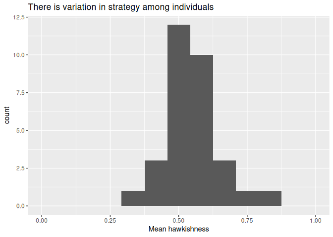

We can now ask whether the level of hawkishness changed during the game
on average across all the participants.

We can see from this graph that as the game proceeds round-by-round,
there is no significant change in the level of hawkishness (p=0.642).

In other cases, it has been found that the average level of hawkishness
tends to decline with the amount of time playing together, as opponents
build trust and begin to see the value in cooperation.

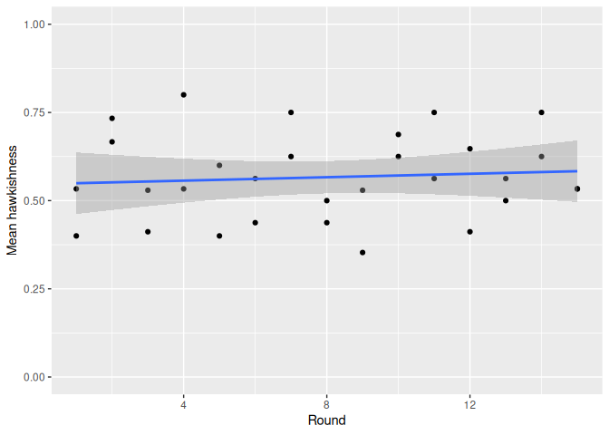 Next, we
can ask whether the total benefit received (fitness) is associated with
the degree of hawkishness. This, in evolutionary terms, is a way of
asking what the Evolutionarily Stable Strategy (ESS) is: is it best to
be a hawk, a dove, or something in between?

With the payoffs used in this game (B = 4, C = 3), a *single, anonymous*
encounter has a simple answer. Because B &gt; C, Hawk beats Dove
regardless of what your opponent plays (Hawk-vs-Dove gives 4 &gt; 2 for
Dove-vs-Dove, and Hawk-vs-Hawk gives 0.5 &gt; 0 for Dove-vs-Hawk), so
the one-shot ESS here is pure Hawk, not an intermediate mix. (The
familiar “stable mix of hawks and doves” result only arises when the
cost of fighting, C, exceeds the value of the resource, B — the opposite
of the situation here. With B &gt; C, the payoff ranking Hawk-vs-Dove
&gt; Dove-vs-Dove &gt; Hawk-vs-Hawk &gt; Dove-vs-Hawk is in fact the
same structure as the classic Prisoner’s Dilemma, with Hawk playing the
role of “Defect”.)

But Game 1 was not a single anonymous encounter — you played the *same*
partner 15 times in a row. That changes the incentives: playing Hawk
risks provoking Hawk-Hawk retaliation for the rest of the 15 rounds,
which pays only 0.5 each round, far worse than the 2 each you would get
by settling into mutual Dove-Dove play. This is the classic argument for
reciprocity in repeated games (Axelrod & Hamilton’s “evolution of
cooperation”): when you meet the same partner repeatedly, cooperation
can pay off even though defection (Hawk) would win a single, one-off
encounter.

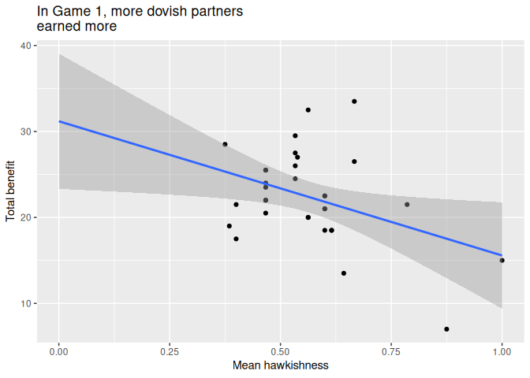

That is indeed closer to what we see: hawkishness and total benefit are
*negatively* related here — the more hawkish you were with your (fixed)
partner, the less you earned overall, rather than there being an
intermediate optimum. That is consistent with the
reciprocity/retaliation argument above, not with the simple one-shot ESS
calculation.

### 26.0.1 Game 2 - different opponents

We didn’t do this one in class this year, so here is what we found last
year.

The students were asked to compete against a new opponent every round.
The idea was that this would make it much harder to learn your opponents
strategy and may be harder to come to an agreement that reduces
aggression.

Firstly I have calculated the average hawkishness as 0.681, which is not
so different from the previous game.

Again, we can ask whether hawkishness changed during the game.

In this case, it DOES look like hawkishness declines more during the
game. However, this trend is not significantly different from horizontal
(p = 0.184).

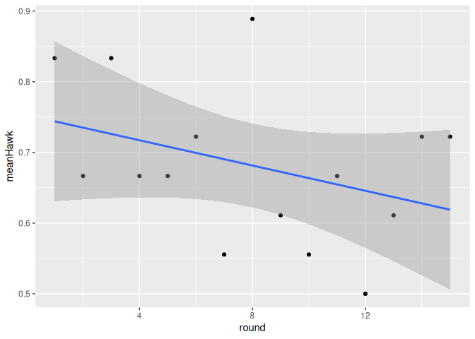

Finally we can look at what the best strategy is in Game 2.

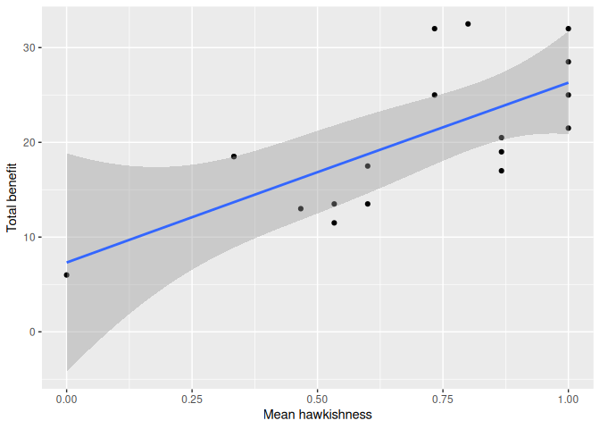

It looks like the best strategy has changed a lot! Now the best strategy
is to be a hawk.

This matches the one-shot theoretical prediction from earlier much
better than Game 1 did. In Game 2 you faced a new partner every round,
so there was no opportunity to build reciprocity, and no way to be
“punished” for playing Hawk against the same individual again. With no
repeated interaction — no “shadow of the future” — the game reduces to
the simple one-shot logic, and since B &gt; C, Hawk pays off best.

In this setting we might expect natural selection to drive towards the
evolution of more aggressive individuals.

Put together, the two games illustrate a general result from game
theory: repeated interaction with the same partner can favour
cooperation even in a game where defection (Hawk) wins any single
encounter, while anonymous, one-off interactions favour the individually
dominant strategy. This is one reason why reputation, memory, and
repeated encounters matter so much for the evolution of cooperation,
both in nature and in human societies.

Think about what this means in terms of human cooperation and conflict
avoidance.

Can you see the value of understanding your opponent/competitor?

<!--chapter:end:6_02_HawkDoveResults.Rmd-->

# Part 7: Appendix - extras

<!--chapter:end:7_00_PartAppendixExtras.Rmd-->

# 27 Exponential growth in detail

One of the foundational concepts in population dynamics is the
exponential growth model. This model is a simplified representation of
how populations grow when resources are not limiting. While it’s rare
for populations to experience uninhibited growth for extended periods,
understanding this basic model is crucial for understanding more complex
dynamics that include factors like resource limitations, predation, and
disease.

In this chapter, we will explore the mathematical framework that
describes exponential growth in both discrete and continuous time
settings. We will introduce key parameters such as the per-capita birth
rate, death rate, and intrinsic rate of increase. We will also
demonstrate how to apply these models using R programming, offering a
practical dimension to these theoretical concepts.

Learning outcomes:

- Understand the fundamental equations that underpin exponential growth
  in populations.
- Differentiate between discrete and continuous time models.
- Interpret the role and significance of various parameters in
  exponential growth models.
- Use R programming to analyse exponential growth scenarios with real
  data.

### 27.0.1 Nomenclature

<table>
<colgroup>
<col style="width: 25%" />
<col style="width: 28%" />
<col style="width: 45%" />
</colgroup>
<thead>
<tr>
<th>Symbol</th>
<th>Meaning</th>
<th>Alternatives</th>
</tr>
</thead>
<tbody>
<tr>
<td><span class="math inline"><em>R</em></span></td>
<td>Per capita rate of increase, per capita population growth rate</td>
<td><span class="math inline"><em>R</em><sub><em>m</em></sub></span>
(Neal), <span class="math inline"><em>r</em></span> (Gotelli), <span
class="math inline"><em>r</em><sub><em>c</em></sub></span> is used as
the <span class="math inline"><em>R</em></span> <em>estimated</em> from
a life table in Neal</td>
</tr>
<tr>
<td><span class="math inline"><em>r</em></span></td>
<td>Intrinsic rate of increase</td>
<td><span
class="math inline"><em>r</em><sub><em>m</em></sub></span></td>
</tr>
<tr>
<td><span class="math inline"><em>λ</em></span></td>
<td>Population growth rate, population multiplication rate</td>
<td></td>
</tr>
<tr>
<td><span class="math inline"><em>R</em><sub>0</sub></span></td>
<td>Net reproductive rate: the expected number of offspring per
individual, per generation (<span
class="math inline">∑<em>l</em><sub><em>x</em></sub><em>m</em><sub><em>x</em></sub></span>)</td>
<td>Net Reproductive Rate</td>
</tr>
</tbody>
</table>

## 27.1 Discrete time model

We’ll first look at *discrete* population growth, which is the
population growth that is considered to grow over distinct time steps
(e.g., 1 year intervals). This is also called **Geometric Population
Growth**.

A population at time *t* has size *N*: *N*<sub>*t*</sub>.

After one time interval, there will be some births (*B*), and some
deaths (*D*). Births will have the effect of increasing the population
size at time *t* + 1 while deaths will decrease population size. The
population at the next time step (*N*<sub>*t* + 1</sub>) is thus:

**eqn. 1.** *N*<sub>*t* + 1</sub> = *N*<sub>*t*</sub> + *B* − *D*

We can think about the birth/death processes on a per-individual basis,
and use per-capita birth rate (*b*) and per-capita death rate (*d*). We
can think of *b* as the average number of offspring produced by an
individual during the time interval starting at *N*<sub>*t*</sub> and
ending at *N*<sub>*t* + 1</sub>. Similarly, *d* is the probability that
an individual alive at *N*<sub>*t*</sub> will die at some point during
the interval.

The **total** number of births within a time interval depends on the
number of individuals there are at the start of the interval
(*N*<sub>*t*</sub>), and the total number of births in the population
during the time interval is *b**N*<sub>*t*</sub>. Similarly, the total
number of deaths is *d**N*<sub>*t*</sub>. Thus:

**eqn. 2.**
*N*<sub>*t* + 1</sub> = *N*<sub>*t*</sub> + *b**N*<sub>*t*</sub> − *d**N*<sub>*t*</sub>.

This equation can be simplified to:

**eqn. 3.**
*N*<sub>*t* + 1</sub> = *N*<sub>*t*</sub> + (*b* − *d*)*N*<sub>*t*</sub>.

Furthermore, because the expression (*b* − *d*) is important, we can
give it its own symbol, *R*. *R* is called the *per capita rate of
increase* or the *intrinsic rate of increase*. (Note that the
nomenclature varies depending on the book/paper! In other places this is
called *r*<sub>*d*</sub>, or *R*<sub>*m*</sub>).

So we now have:

**eqn. 4.**
*N*<sub>*t* + 1</sub> = *N*<sub>*t*</sub> + *R**N*<sub>*t*</sub>.

Or, if we are only interested in the **change** in population size:

**eqn. 5.** $\frac{\Delta N}{\Delta t} = RN\_t$.

Equation 4 can be simplified again, by factoring out the
*N*<sub>*t*</sub> on the right hand side:

**eqn. 6.** *N*<sub>*t* + 1</sub> = (*R* + 1)*N*<sub>*t*</sub>.

The quantity (*R* + 1) is given its own symbol: *λ*, the **population
multiplication rate** (also known as the “finite rate of increase”).

**eqn. 7.** *N*<sub>*t* + 1</sub> = *λ**N*<sub>*t*</sub>.

By rearranging this equation (eqn. 7) we can see that *λ* is simply the
ratio of population size at time *t* + 1 and *t*:

**eqn. 8.** *λ* = *N*<sub>*t* + 1</sub>/*N*<sub>*t*</sub>.

It follows, therefore, that when the population is neither growing nor
declining (when *N*<sub>*t* + 1</sub> = *N*<sub>*t*</sub>), *λ* = 1 (and
when *R* = 0).

### 27.1.1 Calculating N for any future time point

Assuming the population growth rate remains constant, we can calculate
the population at any time in the future.

As a starting point, consider equation 7:
*N*<sub>*t* + 1</sub> = *λ**N*<sub>*t*</sub>.

If we want to calculate *N*<sub>*t* + 2</sub>, we would need to plug in
*N*<sub>*t* + 1</sub> instead of *N*<sub>*t*</sub>:
*N*<sub>*t* + 2</sub> = *λ**N*<sub>*t* + 1</sub>,

and, since we know that *N*<sub>*t* + 1</sub> = *λ**N*<sub>*t*</sub>,:
*N*<sub>*t* + 2</sub> = *λ**λ**N*<sub>*t*</sub>.

Similarly, if we wanted to calculate *N*<sub>*t* + 2</sub>, we’d end up
with: *N*<sub>*t* + 3</sub> = *λ**λ**λ**N*<sub>*t*</sub>.

This can be simplified by raising *λ* to a suitable power, and using the
starting population at time = 0, *N*<sub>0</sub>:

**eqn. 9.** *N*<sub>*t*</sub> = *λ*<sup>*t*</sup>*N*<sub>0</sub>.

This should be familiar to those of you that did (or remember!) the
concept of geometric series which was covered in MM554 Mathematics for
Biology.

### 27.1.2 Applying the model

If we plot exponential growth on a log scale we can see that it is
straight line. For example, in the plot below I show the sequence for a
population with a starting population of 1 and a *λ* (population
multiplication rate) of 1.2 (i.e., the population increases by 20% each
year). In (A) the time series is plotted on the natural scale while in
(B) it is plotted on the log scale.

    # Load required libraries
    require(tidyverse)

    # Set initial population and lambda
    startPop <- 1
    lambda <- 1.2

    # Create a data frame with time and corresponding population
    df1 <- data.frame(time = 0:20) %>% 
      mutate(N = lambda^time * startPop)

    # Plotting the data
    par(mfrow=c(1,2))

    # Plot on natural scale
    plot(df1$time, df1$N, type = "b", xlab = "time", ylab = "N")
    title("A")

    # Plot on log scale
    plot(df1$time, log(df1$N), type = "b", xlab = "time", ylab = "log(N)")
    title("B")

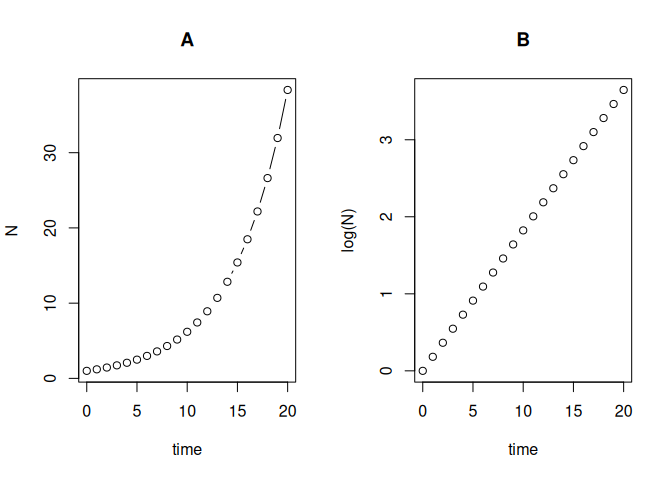

In fact, we can linearise the relationship by log transforming both
sides of equation 9:

ln *N*<sub>*t*</sub> = ln (*λ*<sup>*t*</sup>*N*<sub>0</sub>),

which can be re-written as:

ln *N*<sub>*t*</sub> = ln (*λ*)*t* + ln (*N*<sub>0</sub>).

This looks familiar. Indeed, the equation of a straight line
(*y* = *a**x* + *b*) maps onto this. In this equation, the slope *a* is
equivalent to ln (*λ*) and the intercept (*b*) is equivalent to
ln (*N*<sub>0</sub>).

This is very convenient because now we can use simple regression methods
to estimate ln (*λ*) (the slope) of the relationship, and therefore the
value of *λ* (or *R*, which is *λ* − 1).

## 27.2 Real-World Application: Breeding Pairs of Merlin (Falco columbarius)

To bring these mathematical concepts to life, let’s consider an example
from the Neal textbook that focuses on the population of breeding pairs
of Merlin, a species of small falcon. The data spans from 1970 to 1982
and shows the following population sizes (breeding pairs):
`1,1,2,4,2,3,5,6,7,10,12,14,16`

This is not much data, so we can simply put it into R manually, and plot
it, like this:

    df1 <- data.frame(year = 1970:1982, 
                      N = c(1,1,2,4,2,3,5,6,7,10,12,14,16))
    plot(df1$year,df1$N, type = "b")

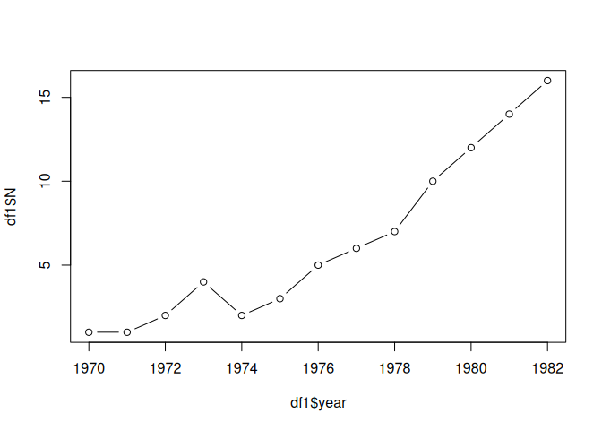

### 27.2.1 Observations and Context

It is clear from the graph that the number of breeding pairs is
increasing over the years, albeit with some fluctuations. These
fluctuations could be due to various factors such as changes in food
availability, predation, or human activity. However, the general trend
suggests growth.

### 27.2.2 Applying the Exponential Growth Model

To analyse this data, we’ll use the exponential growth model. We’ll plot
the data on a log scale and fit a regression model:

    df1$logN <- log(df1$N)
    plot(df1$year,df1$logN)

    mod1 <- lm(logN~year,data = df1)
    abline(mod1)

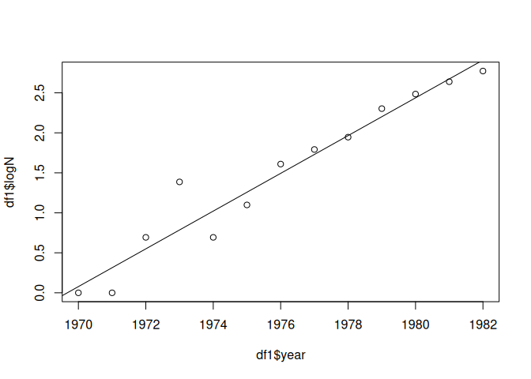

Model summary output:

    ## 
    ## Call:
    ## lm(formula = logN ~ year, data = df1)
    ## 
    ## Residuals:
    ##      Min       1Q   Median       3Q      Max 
    ## -0.32858 -0.13684 -0.01967  0.10104  0.60054 
    ## 
    ## Coefficients:
    ##               Estimate Std. Error t value Pr(>|t|)    
    ## (Intercept) -464.77072   36.12270  -12.87 5.66e-08 ***
    ## year           0.23596    0.01828   12.91 5.48e-08 ***
    ## ---
    ## Signif. codes:  0 '***' 0.001 '**' 0.01 '*' 0.05 '.' 0.1 ' ' 1
    ## 
    ## Residual standard error: 0.2466 on 11 degrees of freedom
    ## Multiple R-squared:  0.9381, Adjusted R-squared:  0.9324 
    ## F-statistic: 166.6 on 1 and 11 DF,  p-value: 5.478e-08

Interpretation

The summary of the model indicates that the slope of the relationship
between year and logN is 0.2359637. This slope is ln (*λ*), so the
population multiplication rate (*λ*) is *e*<sup>slope</sup> = 1.266, the
intrinsic rate of increase (*r*) is the slope itself = 0.236, and the
per capita rate of increase (*R* = *λ* − 1) is 0.266.

This suggests that the number of breeding pairs is indeed growing
exponentially over the time period studied, with a specific rate of
increase. Understanding this rate is crucial for conservation efforts,
because it provides insights into the population’s resilience, its
demands on the ecosystem, and how it might respond to future changes in
environmental conditions or conservation policies.

## 27.3 Continuous time model

In contrast to the discrete time model, the continuous time model allows
us to understand population growth without the constraint of clear time
intervals. This is particularly useful for studying populations that
don’t have breeding seasons or for those that experience continuous
births and deaths (e.g. bacteria, humans).

The starting point for the continuous time model is the intrinsic rate
of increase, *r*. This is defined as: *r* = *l**n*(*λ*) which is the
same as saying *r* = *l**n*(*N*<sub>*t* + 1</sub>/*N*<sub>*t*</sub>)

We say that *r* = *l**n*(*λ*) “r is the natural log of lambda”.

Here, *λ* is the population multiplication rate, as discussed in the
discrete time model section. The natural logarithm of *λ* gives us *r*,
which can be interpreted as the rate of population growth per unit time
when resources are unlimited.

To back-transform from a natural log, we use the exponential. Therefore,
*λ* = *e*<sup>*r*</sup>: “lambda is the exponential of r”.

This allows us to relate *λ* and *r* directly. From the discrete model
(above), we know that *λ* = 1 + *R*, so:

1 + *R* = *e*<sup>*r*</sup>

*R* = *e*<sup>*r*</sup> − 1

### 27.3.1 Zero population growth

When the population is steady with zero growth, *r* = 0 and *λ* = 1.
It’s important to note that the relationship *λ* = *r* + 1 only holds
true when the population is not growing or shrinking. This is a special
case and should not be generalised. Do not make the common mistake to
think that *λ* is simply *r* + 1!

<!--chapter:end:7_01_LambdaAndR.Rmd-->

# 28 The legend of Ambalappuzha

Exponential growth is a powerful concept. To help us grasp it better
let’s use an ancient Indian chess legend as an example.

**Learning outcomes**

- Use of Excel formulae for mathematical modelling.
- Understanding the multiplicative process of exponential/geometric
  growth.


According to legend, Lord Krishna once appeared in the form of a wise
man in the court of the king and challenged him to a game of chess. The
king was a chess enthusiast and naturally accepted the invitation.

The king asked the wise man to choose a prize in case he won. The old
man told the king that he had few material needs and that all he wished
was a few grains of rice.

He added that the amount of rice itself should be determined using the
chessboard in the following manner: one grain of rice would be placed in
the first square, two grains in the second square, four in the third
square, and so on. Every square would have double the number of grains
of its predecessor.

Upon hearing this, the king was unhappy, since the man requested only a
few grains of rice instead of any of the other riches of the kingdom,
which the king would have been happy to donate (he was a generous guy).
He requested the old man to add other items to his prize, but the man
declined.

So the game of chess started and, needless to say, the king lost the
game so it was soon time to pay the old man his prize. As he started
adding grains of rice to the chessboard, the king soon realised the true
nature of the wise man’s demand. The royal granary soon ran out of rice
and the king realised that even if he provided all the rice in his
kingdom and even the whole of India, he would never be able to fulfil
the promised reward. He was distraught that he could not fulfil his
promise!

Seeing the king upset, the wise man appeared to the king in his true
form, that of Lord Krishna. He told the king that he did not have to pay
the debt immediately but could pay him over time. The king would serve
rice in the temple freely to the pilgrims every day until the debt was
paid off. And that is why the Ambalappuzha Temple in India still serves
rice pudding (palpayasam) to pilgrims – the debt is still being paid
off.

Use the Excel sheet
[RiceOnAChessboard.xlsx](https://www.dropbox.com/s/nf81t0hzz34vyzk/RiceOnAChessboard.xlsx?dl=1)
to calculate the quantity of rice that the king owed.

A grain of rice weighs 25mg, what weight of rice did the king owe in
total, in kg?

## 28.1 Animals/plants, not grains of rice

Imagine that instead of rice, we were talking about population
growth—e.g. bacteria or rabbits—reproducing every time-step.

### 28.1.1 Quick exercise (optional)

We have ~100 breeding pairs of great tits (musvit) in woodland around
SDU. Each female lays ~6 eggs per year with an assumed 50:50 sex ratio.

- **If survival were 100%**, how many females would there be after 5
  years?
- **Now relax that assumption:** allow realistic survival and
  recruitment. How do your answers change?

### 28.1.2 Discussion prompts

- **Is the simple doubling model realistic?**
  - Why / why not?
- **Key processes to consider:**
  - Survival &lt; 100%; age/stage-specific survival and fecundity
  - Density dependence (resources, territories, disease, predation)
  - Carrying capacity and feedbacks on reproduction/survival
- **Variation over time and space:**
  - Stochasticity (good/bad years), seasonality, environmental drivers
  - Dispersal, immigration/emigration
- **Model structure:**
  - Age/stage structure (e.g. juvenile vs adult), sex ratio, mating
    system
  - Time-step choice (daily/weekly/annual) and what processes occur
    within a step

## 28.2 Optional: Try these calculations in R

You can do this kind of calculation easily in *R*. Try this.

    myData <- data.frame(Squares = 1:64,nRice = NA)
    myData$nRice[1] <- 1 

    for (i in 2:64){
      myData$nRice[i] <- myData$nRice[i-1]*2
    }

Now we can look at the top and bottom of the 64 row data frame like
this:

    head(myData)

    ##   Squares nRice
    ## 1       1     1
    ## 2       2     2
    ## 3       3     4
    ## 4       4     8
    ## 5       5    16
    ## 6       6    32

    tail(myData)

    ##    Squares        nRice
    ## 59      59 2.882304e+17
    ## 60      60 5.764608e+17
    ## 61      61 1.152922e+18
    ## 62      62 2.305843e+18
    ## 63      63 4.611686e+18
    ## 64      64 9.223372e+18

Output preview:

    ##   Squares nRice
    ## 1       1     1
    ## 2       2     2
    ## 3       3     4
    ## 4       4     8
    ## 5       5    16
    ## 6       6    32

    ##    Squares        nRice
    ## 59      59 2.882304e+17
    ## 60      60 5.764608e+17
    ## 61      61 1.152922e+18
    ## 62      62 2.305843e+18
    ## 63      63 4.611686e+18
    ## 64      64 9.223372e+18

And we can sum up the total number of grains of rice on the 64 squares
of the board like this:

    sum(myData$nRice)

    ## [1] 1.844674e+19

Output:

    ## [1] 1.844674e+19

To put that *HUGE* number in context, if a grain of rice weighs 25mg
(0.000025kg), then we’d have 461,168,601,842,739 kg. That’s 461
Gigatonnes, or roughly 8-900 times the yearly global rice production!

<!--chapter:end:7_02_Ambalappuzha.Rmd-->

# 29 From population biology to fitness

The purpose of this practical is to draw clear links between the first
part of the course (population biology) and the second part of the
course (evolution).

Learning outcomes:

- Understanding the relationship between population growth and the
  concept of fitness.
- Understanding the concept of an evolutionary trade-off.

We will focus on the concept of **fitness**.

Fitness is a slippery concept, but it is widely accepted that it is
closely related to population growth rate. In this class you will
explore this concept using some mathematical modelling.

This practical uses RStudio (R). It is similar to the previous exercise
on matrix population models, but ask for help if you get stuck!

## 29.1 An *in silico* experiment

As you learned in the classes on age- and stage-structured population
dynamics, differences in survival and reproduction can be modelled using
matrix population models (MPMs). These models can be simple or complex,
and can be thought of as mathematical descriptions of the life history
of the species (or population) in a particular environment.

Earlier in the course you will have played with construction and
analyses of these models by creating MPMs for species with different
life histories such as high juvenile survival, or low juvenile survival
etc.

We will first need to load the `popdemo` package like this. Note that if
you have not installed this package you should first install it with the
command `install.packages("popdemo")`.

Let’s set up our baseline model. This model describes a population of
some mammal species which we have divided into 3 stages: juvenile, adult
and senescent (old).

You can “read” the matrix by looking at the columns and rows: a value in
the column **3** and row **1** tells you the “transition” **from** stage
3 **to** stage 1. In this case, it is saying that an individual in the
adult age class produces an average of 4 babies, and one from the
senescent age class produces 2 babies. Juveniles have a probability of
0.1 (10% chance) to survive to adulthood (and they reach maturity in 1
year, so there is no “stasis” where they can remain being juveniles).
Adults can survive in 2 ways, they can survive and remain as adults
(probability = 0.8) or they can survive and transition to being in the
senescent age class (probability = 0.1). Therefore, the total survival
probability is 0.9. Senescent adults survive less well (probability =
0.4).

We can project a population like this:

Take a look at `pr`, the projected population. This gives you the total
population size, and below that the population sizes in each stage.

    ## 1 deterministic population projection over 8 time intervals.
    ## 
    ## [1] 18.00000 32.70000 31.18000 37.51200 42.93080 50.15272 58.36605 68.04116
    ## [9] 79.29730

You can access the population sizes of the different stages using
`vec(pr)`.

    ##             S1       S2       S3
    ##  [1,] 10.00000  5.00000 3.000000
    ##  [2,] 26.00000  5.00000 1.700000
    ##  [3,] 23.40000  6.60000 1.180000
    ##  [4,] 28.76000  7.62000 1.132000
    ##  [5,] 32.74400  8.97200 1.214800
    ##  [6,] 38.31760 10.45200 1.383120
    ##  [7,] 44.57424 12.19336 1.598448
    ##  [8,] 51.97034 14.21211 1.858715
    ##  [9,] 60.56588 16.56672 2.164697

Let’s plot this… Check out how, after a “transient” period, there is
exponential growth in all stages of the population. The population is
growing steadily with a fixed population growth rate (*λ*).

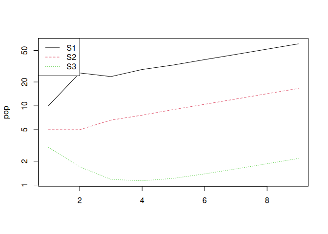

You can see that the population is increasing and we can calculate the
precise population growth rate (*λ*) like this:

    ## [1] 1.165587

Thus, the population is growing at 16.56% per year.

So where does evolution come in?

## 29.2 The link to fitness

In this population consider that suddenly a mutation arises in an
individual parent that causes it to give more care to their offspring.
For example, maybe they provide milk with a higher fat content, or build
a safer nest. Whatever the mechanism, let’s assume that it results in a
small increase in juvenile survival.

We can simulate this by increasing the juvenile survival in the matrix
model from 0.10 to 0.11.

What effect does that have on population growth rate?

    ## [1] 1.192317

The small increase in juvenile survival has resulted in a small increase
in population growth rate, from 16.56% to 19.23% per year.

If you consider that the original population now consists of two
genotypes – “ordinary” and “caring” – what do you think will happen to
the percentage of the two genotypes through time?

You can be sure that the proportion of the caring genotype will grow
faster than the ordinary genotype. It is the FITTER genotype.

## 29.3 Introducing a trade-off

It is common that apparently beneficial behaviours or innovations come
at a cost. In evolutionary biology these are called **trade-offs**.

Let’s explore such a trade-off now and see how it might affect fitness.

We’ll stick with the same example above, but we’ll introduce a new
genotype that has a trade-off between juvenile survival and old-adult
survival.

The benefit is clear: a change in adult behaviour or physiology
increases juvenile survival a little bit. But such changes often come
with a cost: The new genotype allocates extra resources to babies but
this exhausts the adults causing older adults to have very small
survival probability.

Is this new genotype viable? In other words, is the fitness of the
genotype greater than that of the original genotype? If so, the new
genotype will come to dominate the population.

Modify the matrix to reduce old adult survival to, say 0.05 (5%
survival) and re-calculate the population growth rate.

Is this “trade-off genotype” fitter than the original one? i.e. is the
small benefit worth the large cost?

Try doing the same thing for the prime-age adults. How much can you
reduce survival before the cost is not worth bearing?

<!---

```
## [1] 1.188827
```

```
## [1] 1.165587
```
-->
<!--chapter:end:7_03_FromPopulationToEvolution.Rmd-->

# 30 From plain English to a matrix model

## 30.1 Background

This activity is designed for quick in-class practice translating a
verbal life-history description into a matrix population model. It
connects directly to the workflow in `2_07_matrixModels.Rmd`.

Learning outcomes:

- Convert a verbal life-history description into a matrix population
  model.
- Build and interpret a simple projection from initial stage abundances.

## 30.2 Worked example

### 30.2.1 Inputs

Suppose juveniles do not reproduce, adults produce 2 offspring per year,
juvenile survival is 0.4, and adult survival is 0.7. A simple stage
matrix would be:

### 30.2.2 Steps

1.  Put fecundity terms in the top row.
2.  Put survival/transition terms in the subdiagonal/diagonal entries.
3.  Assemble the matrix in row = stage at *t* + 1, column = stage at *t*
    form.

### 30.2.3 Output and interpretation

$$
A =
\begin{bmatrix}
0 & 2 \\
0.4 & 0.7
\end{bmatrix}
$$

The key idea is to map each biological statement to a matrix entry:
fecundity goes in the top row, survival and stage transitions go on the
sub-diagonal or main diagonal.

## 30.3 Your task

Use the red-tailed hawk life history description in
`supplemental/Exercise_Plain_English_To_Matrix_Model_2018.txt`.

1.  Draw a 3-stage life cycle diagram (hatchling, juvenile, adult).
2.  Translate the verbal description into a 3x3 projection matrix. State
    any assumptions you make about the juvenile stasis and transition
    rates.
3.  Use the initial population sizes given (1000 hatchlings, 150
    juveniles, 5 adults) and project the population for 20 time steps.
4.  Calculate the dominant eigenvalue and interpret whether the
    population grows or declines.
5.  Compare your approach with the workflow in `2_07_matrixModels.Rmd`.

## 30.4 Takeaways

- Verbal life-history descriptions can be translated directly into
  matrix entries with clear assumptions.
- Simple projections reveal whether the implied population is growing or
  declining.

<!--chapter:end:7_04_Matrix_From_English.Rmd-->

# 31 Continuous traits from discrete genes

## 31.1 Background

This activity uses a fast classroom simulation to show how many small
genetic effects can generate a continuous, approximately normal trait
distribution. It connects to the heritability workflow in
`3_04_Heritability.Rmd`.

Learning outcomes:

- Explain how additive genetic effects create continuous trait
  variation.
- Compare a classroom simulation with a simple R simulation.

## 31.2 Worked example

### 31.2.1 Inputs

- Baseline trait value: `35`
- Number of genes: `25`
- Each gene contributes `1` unit when ON

### 31.2.2 Steps

1.  Compute expected number of ON genes under 50:50 ON/OFF:
    `25 * 0.5 = 12.5`.
2.  Add expected genetic contribution to baseline.

### 31.2.3 Output and interpretation

Expected trait value is `35 + 12.5 = 47.5`. Individual values vary
around this because each gene is ON or OFF stochastically.

## 31.3 Your task

Use the intuition exercise in
`supplemental/Quantitative_Genetics/Continuous_Traits_From_Discrete_Genes.docx`
and the spreadsheet in
`supplemental/Quantitative_Genetics/Continuous_Traits_From_Discrete_Genes.xlsx`.

1.  In class, treat each student as a gene that can be ON (1) or OFF
    (0). Choose a baseline trait value of 35, and add 1 for each ON
    gene. Record the trait value for at least 30 individuals.
2.  Plot a quick histogram of the observed trait values. Describe the
    shape.
3.  Now simulate the same process in R for 100 individuals and 25 genes.
    Compare your histogram to the classroom version.
4.  Relate the outcome to the concept of additive genetic variance in
    `3_04_Heritability.Rmd`.

<!-- -->

    set.seed(123)
    baseline <- 35
    n_genes <- 25
    n_individuals <- 100

    gene_on <- rbinom(n_individuals, size = n_genes, prob = 0.5)
    trait_value <- baseline + gene_on

    hist(trait_value, breaks = 12, col = "gray80", main = "Trait values", xlab = "Trait")

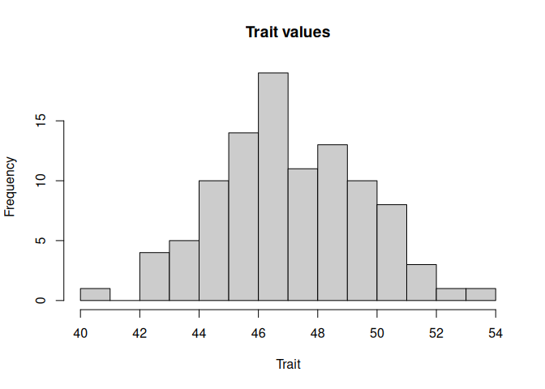

## 31.4 Takeaways

- Many small additive effects naturally yield a continuous distribution.
- Random genetic variation produces a spread of trait values even with
  identical environments.

<!--chapter:end:7_05_Discrete_Genes.Rmd-->

# 32 Building a phylogenetic tree

## 32.1 Background

This activity builds intuition for phylogenetic trees by using discrete
morphological characters. It aligns with the macroevolution exercise
guide in
`supplemental/Macroevolution_Building_A_Tree/FylTree_ENG_2015.pdf`.

Learning outcomes:

- Build a simple character table for a set of organisms.
- Compute pairwise differences and translate them into a tree.
- Relate morphology-based trees to the idea of evolutionary relatedness.

## 32.2 Key idea

With six organisms and seven characters, you can compute a pairwise
difference table, then group the closest relatives first. The internal
nodes represent the most recent common ancestors inferred from shared
characters.

## 32.3 Your task

Use `supplemental/Macroevolution_Building_A_Tree/FylTree_ENG_2015.pdf`
as a guide for the classroom activity.

1.  Pick six organisms (use the cards if you have them, or invent six
    organisms with clear traits).
2.  Identify seven discrete characters that differ among the organisms
    (presence/absence, color class, tail length category, etc.).
3.  Fill in a character table and then compute a pairwise difference
    table.
4.  Draw a phylogenetic tree by grouping the closest relatives first,
    then adding deeper splits.
5.  Optional: compare your hand-drawn tree with an R clustering result.

<!-- -->

    # Replace this with your own character table
    characters <- data.frame(
      row.names = c("A", "B", "C", "D", "E", "F"),
      trait1 = c(1, 1, 0, 0, 0, 1),
      trait2 = c(0, 1, 1, 0, 0, 1),
      trait3 = c(1, 1, 1, 0, 0, 0)
    )

    dist_mat <- dist(characters, method = "manhattan")
    tree <- hclust(dist_mat, method = "average")
    plot(tree, main = "Tree from morphological characters")

## 32.4 Takeaways

- Morphological characters can be converted into a simple distance
  matrix.
- The closest pairs in the distance matrix define the earliest groupings
  in a tree.

<!--chapter:end:7_06_Phylogeny.Rmd-->

[1] The behaviour where `r_m` values above 3 cause the population to
become very negative, is a mathematical artefact caused by numerical
instability in the discrete-time logistic growth model. When the growth
rate is too high, the population can overshoot its carrying capacity,
and the formula’s negative feedback term can drive the population to
unrealistic, negative values. This issue arises because the model
doesn’t impose biological constraints, such as preventing population
sizes from falling below zero. In real biological systems, such negative
values would not occur.

[2] This may require some thought!
